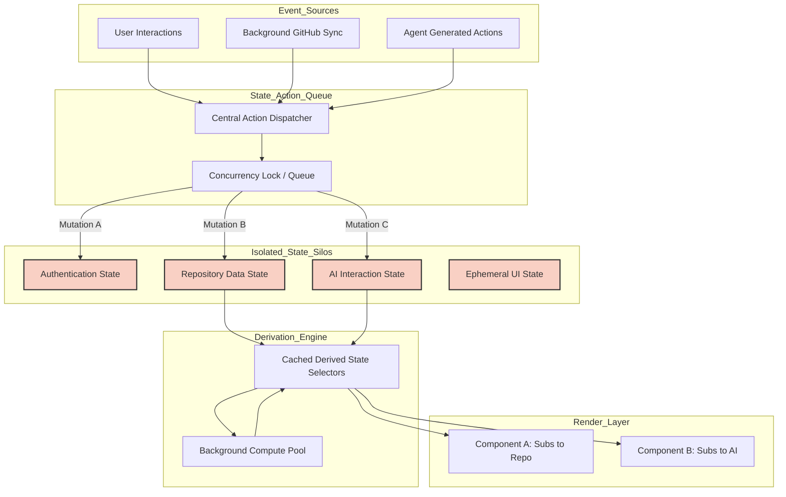

# Document 21: Crash-Proofing State Management and Context Architecture

## Abstract

State management is the central nervous system of any complex client-side application. In Project Ember, this system must coordinate continuous streams of data from the GitHub API, handle asynchronous outputs from generative AI agents, and manage rapid user interactions, all while maintaining absolute structural integrity. A localized failure in state management rapidly metastasizes into a catastrophic application crash, typified by infinite render loops, stale data deadlocks, or memory exhaustion. This document delineates the architecture required to crash-proof Project Ember's state ecosystem. By implementing strict atomic state updates, decentralized context boundaries, immutable data structures, and rigorous mutation safeguards, the application guarantees that its core operational memory remains incorruptible, predictable, and highly performant.

## 1. The Perils of Monolithic State

The most common architectural flaw in modern frontend applications is the centralization of disparate state into a singular, monolithic store. While conceptually simple, a monolithic state structure creates massive blast radii. If an update to a deeply nested, non-critical value (such as UI theme preference) fails or causes an exception, the entire monolithic store can become corrupted, crashing the entire application.

Project Ember must utterly reject monolithic state architectures. Instead, it must adopt a heavily decentralized, domain-specific state topology. Authentication state, repository metadata, AI interaction histories, and ephemeral UI states must exist in strictly isolated, independent silos. This isolation guarantees that a catastrophic failure in the AI state management (e.g., an unparseable hallucinated payload) remains confined solely to the AI interaction components. The core application—repository management, code viewing, and navigation—remains fully operational because its distinct state silos are untouched by the anomaly.

## 2. Immutability as a Physical Law

Crash-proof state management requires that the data residing in the state store is mathematically immutable. Direct mutation of state objects (e.g., `state.user.repositories.push(newRepo)`) is the primary cause of unpredictable race conditions, silent data corruption, and "stale closure" bugs where components render based on outdated memory references.

In Project Ember, immutability must be enforced as a physical law. Every state transition must generate an entirely new structural reference. To achieve this efficiently without overwhelming the browser's garbage collector, the architecture must utilize advanced structural sharing techniques or libraries that enforce strict, deep immutability without the performance penalty of deep cloning. When an AI agent successfully generates a new file, the repository state is not mutated; a completely new repository state object is synthesized, incorporating the new file, and instantly replacing the old state reference. This guarantees absolute deterministic rendering across the entire component tree.

## 3. Decentralized Context Architecture and Render Optimization

React's Context API is powerful but highly volatile; a state update within a Provider forces a re-render of every component consuming that Context, regardless of whether the specific value they need has changed. In a complex system like Project Ember, this rapidly degrades into infinite render loops or total main-thread gridlock, freezing the application.

To crash-proof the context architecture, Project Ember must implement ultra-granular context slicing. A single "Repository Context" is insufficient. It must be fractured into `RepositoryMetadataContext`, `RepositoryFileTreeContext`, and `RepositoryActiveActionContext`. Furthermore, these contexts must be wrapped in sophisticated selector paradigms or utilizing atomic state management libraries. Components must subscribe only to the precise slice of state they require. By surgically limiting the scope of re-renders, the system prevents cascading UI updates that overwhelm the browser, ensuring silky-smooth performance even when processing massive data influxes from the GitHub API.

## 4. The Danger of Derived State

Derived state—data calculated on the fly from primary state values—is a frequent vector for performance crashes and logical errors. If derived state is calculated within the render function of a component, a heavy calculation (like sorting a list of 10,000 commits) will freeze the main thread on every single render cycle.

Project Ember must strictly control derived state through aggressive memoization and compute-offloading. Complex derivations must be lifted out of the component lifecycle entirely. They must be calculated at the state-store level, immediately following a primary state mutation, and the result must be cached. Components then simply consume the pre-calculated, cached result. For exceptionally heavy derivations (e.g., fuzzy searching across an entire repository's file structure), the state management architecture must employ Web Workers, offloading the calculation to a background thread to guarantee that the primary UI thread remains unblocked and responsive at all times.

## 5. State Mutation and Isolation Topology

## 6. Snapshotting and Transactional Rollbacks

As discussed in the fault tolerance documentation, operations that span multiple asynchronous boundaries (e.g., creating a branch, committing a file, and pushing to GitHub) represent significant risk. If the operation fails halfway, the local state is corrupted.

Crash-proofing the state requires a transactional, snapshot-based rollback mechanism built directly into the state dispatcher. When a complex sequence initiates, the dispatcher silently clones the relevant state silos. As the sequence progresses, mutations are applied only to the cloned, transient state. If a failure occurs (e.g., the GitHub push is rejected due to a conflict), the dispatcher instantly discards the transient state and issues a forceful re-render command using the original, uncorrupted snapshot. This transactional integrity ensures that the application's memory is never polluted by the detritus of failed asynchronous operations.

## 7. Preventing Infinite Re-Render Loops

Infinite render loops are the most destructive, difficult-to-debug crashes in modern frontend architecture. They occur when a component renders, which triggers a side effect, which mutates the state, which forces a re-render, repeating infinitely until the browser tab crashes with a `Maximum update depth exceeded` error.

To immunize Project Ember against this, the state management architecture must enforce strict unidirectionality. State mutations must never be initiated directly from within a render body or synchronously from a `useEffect` hook without highly specific dependency safeguards. All state mutations must be localized within explicit, user-initiated event handlers or highly controlled, debounced background synchronization loops. Furthermore, automated linting tools must be aggressively configured to detect missing dependency arrays or circular dependencies in effect hooks, neutralizing these traps during the compilation phase.

## 8. Managing Massive Datasets

Project Ember's integration with GitHub means it must frequently handle massive datasets: repositories with thousands of files, issues with hundreds of comments, or dense git commit histories. Ingesting this data directly into the active state store will instantly crash the application via memory exhaustion or severe main-thread locking.

The state architecture must employ pagination and virtualization as foundational principles, not mere optimizations. When fetching a file tree, the state store must only retain the currently visible nodes and their immediate children in active memory. The rest must remain on disk (IndexedDB) or be requested lazily. When rendering these large datasets, the presentation layer must utilize virtualized lists, ensuring that only the DOM elements currently visible in the viewport are rendered and tracked by the state. This strict memory dieting guarantees that Project Ember remains fluid and responsive regardless of the scale of the repository being analyzed.

## 9. Conclusion

Crash-proofing state management in Project Ember demands a paradigm shift from loose, monolithic data structures to rigorous, decentralized, and heavily guarded state silos. By enforcing absolute immutability, establishing granular context boundaries, utilizing transactional snapshot rollbacks, and strictly controlling derived computations and massive datasets, the application's core memory becomes an impregnable fortress. This architecture guarantees that rendering remains deterministic, performance remains pristine, and the application remains entirely immune to the cascading failures that plague traditional frontend engineering.
