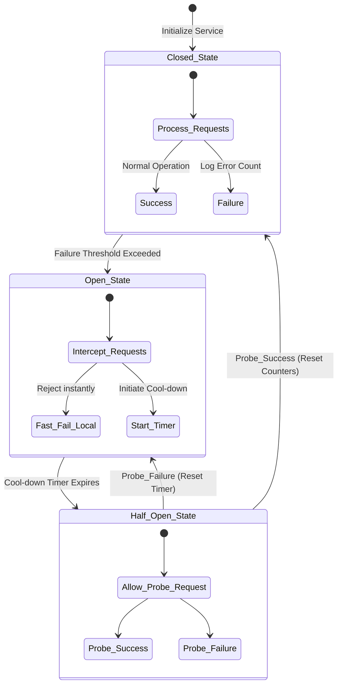

# Document 22: Graceful Degradation and Circuit Breakers in API Integration

## Abstract

In a hyper-connected application like Project Ember, external API integrations are the lifeblood of functionality, but they are also the most volatile points of failure. The GitHub API can experience global outages, and Generative AI endpoints are subject to severe latency spikes, rate limiting, and aggressive content filtering. A resilient system does not merely retry failed requests; it actively protects itself from being dragged down by failing dependencies. This document details the implementation of Graceful Degradation and the Circuit Breaker pattern within Project Ember. By dynamically monitoring the health of external services, severing connections to failing endpoints, and seamlessly downgrading the user interface to maintain core functionality, Project Ember ensures continuous operational capability even during catastrophic external ecosystem failures.

## 1. The Vulnerability of Continuous Polling

A naive approach to system architecture assumes that if an API call fails, the correct response is to retry it indefinitely. In reality, continuous polling of a degraded service exacerbates the problem, leading to cascading failures. If the GitHub API is returning 500-level errors, repeatedly hammering it with retry requests will not only fail, but it will consume all available network sockets in the browser, freeze the main execution thread, and rapidly drain device battery.

Project Ember must recognize that external services are hostile and unreliable. The application must protect its internal resources (memory, CPU, network queues) from being exhausted by futile attempts to communicate with dead endpoints. This requires a shift from blind persistence to intelligent, dynamic load shedding.

## 2. The Circuit Breaker Pattern

The Circuit Breaker pattern, borrowed from electrical engineering, is the definitive solution to catastrophic dependency failure. It is a state machine implemented within Project Ember's network gateway that monitors the success/failure ratio of outbound requests to specific services (e.g., GitHub, Gemini).

The Circuit Breaker operates in three distinct states:
1.  **Closed:** The normal state. Requests flow freely. If a request fails, a failure counter is incremented.
2.  **Open:** If the failure counter exceeds a critical threshold within a specific timeframe (e.g., 5 consecutive 5xx errors), the circuit "trips" and opens. In this state, *all* outbound requests to that specific service are immediately intercepted and rejected locally by the gateway without ever hitting the network. This provides immediate relief to the application and prevents resource exhaustion.
3.  **Half-Open:** After a predefined "cool-down" period, the circuit transitions to a half-open state. It allows a single, limited test request to pass through. If this test request succeeds, the service is deemed healthy, and the circuit closes. If it fails, the circuit immediately snaps back to the Open state, resetting the cool-down timer.

## 3. Tripping Mechanisms for AI Rate Limits

Generative AI integrations present a unique challenge. Unlike standard API outages, AI services frequently return `429 Too Many Requests` or quota exceeded errors due to token limits or global capacity constraints. These are not system errors; they are strict operational boundaries.

The Circuit Breaker mechanism must be highly attuned to these specific HTTP status codes. If a `429` is detected from the Gemini endpoint, the circuit must trip immediately—a single rate limit response is sufficient to open the circuit. Furthermore, the circuit must parse the `Retry-After` header provided by the API to dynamically set its cool-down period, ensuring that the system remains in the Open state for exactly as long as the remote server demands, preventing wasteful and punitive secondary rejections.

## 4. Graceful Degradation of the User Interface

When a circuit trips and a service becomes unavailable, the application must not display generic error modals or unhandled promise rejections. It must execute a coordinated, graceful degradation of the user interface.

Graceful degradation is the art of maintaining the highest possible level of functionality given the current constraints. If the AI integration circuit is Open, the "Ask AI" buttons must not simply vanish; they must gracefully transition to a disabled state, accompanied by a subtle tooltip explaining that the AI service is temporarily cooling down. 

If the GitHub API circuit is Open, the application must instantly transition into an "Offline/Read-Only" mode. Editing tools are disabled, but the user can still navigate their locally cached repositories, view previously loaded files, and read cached issues. The application remains stable, informative, and partially useful, preventing user panic and maintaining trust.

## 5. Circuit Breaker State Machine Architecture

## 6. Throttling, Debouncing, and Request Deduplication

Beyond complete outages, API services often suffer from extreme latency. If a user rapidly clicks a "Sync Repository" button ten times, sending ten concurrent, heavy requests to a latent API will cause a massive logjam, potentially crashing the browser tab.

Project Ember must employ aggressive request throttling, debouncing, and deduplication at the network layer. 
*   **Debouncing:** For high-frequency actions (like typing in a search bar to query repositories), requests must be debounced, meaning the network call is only fired after the user has stopped typing for a specific duration.
*   **Throttling:** For actions that can be triggered repeatedly but should only execute periodically, throttling enforces a maximum execution rate (e.g., only one sync request allowed every 5 seconds).
*   **Deduplication:** If multiple components simultaneously request the exact same piece of data (e.g., the user's profile information), the network gateway must deduplicate these requests, sending only a single outbound call to the API and distributing the resulting payload to all requesting components. This drastically reduces network overhead and minimizes the risk of triggering rate limits.

## 7. Predictive Degradation and Telemetry

The most advanced form of fault tolerance is predictive degradation. By continuously analyzing the latency and success rates of API calls, Project Ember can anticipate an impending outage or rate limit enforcement before it fully materializes.

If the application detects that the response time from the AI endpoint has increased from 500ms to 5000ms over the last ten requests, the Circuit Breaker logic can proactively enter a "Degraded Warning" state. In this state, the application might intentionally throttle user access to AI features, prioritizing critical automated tasks, or surface a warning to the user that generation times are currently severe. By degrading gracefully before a hard failure occurs, the system maintains a smoother, more predictable user experience.

## 8. State Reconciliation During Degradation

When the application is operating in a degraded state (e.g., the GitHub circuit is Open), the user may still attempt to perform offline actions, appending mutations to the local offline queue. 

The complexity arises when the circuit eventually closes, and the application must rapidly reconcile its locally modified state with the remote server. The system must not blindly dump a massive queue of requests onto the newly recovered API, as this could immediately trigger another rate limit and trip the circuit again. The reconciliation process must be metered, slowly draining the offline queue using exponential backoff principles, ensuring that the recovery process is as careful and resilient as the degradation process.

## 9. Conclusion

Graceful degradation and Circuit Breakers are the definitive defense mechanisms against the chaos of the external digital ecosystem. By actively monitoring dependency health, ruthlessly severing connections to failing endpoints, and intelligently downgrading the user interface, Project Ember transforms critical external failures into minor, manageable inconveniences. This architectural paranoia ensures that the application's core rendering engine and local data stores are never compromised by the instability of third-party APIs, securing a mythic level of operational reliability.
