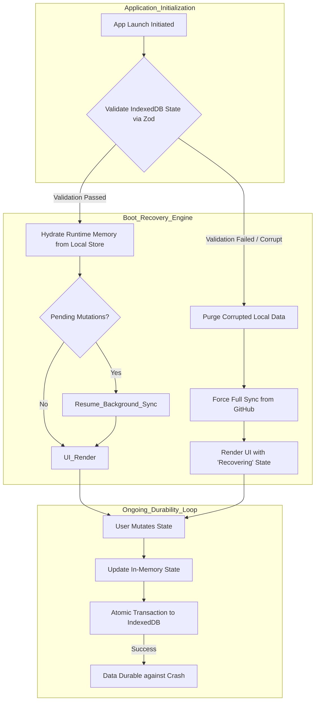

# Document 23: Automated Recovery Procedures and Local-First Durability

## Abstract

While prior documents have detailed strategies for preventing crashes, isolating faults, and healing state anomalies in real-time, there remains the statistical inevitability of a total system failure. A browser crash, an OS-level termination, or a physically abrupt loss of power can halt Project Ember instantaneously, bypassing all graceful degradation protocols. In these catastrophic scenarios, the true measure of resilience is not how the application fails, but how it recovers. This document defines the automated recovery procedures required to ensure absolute local-first durability. By architecting a robust, transactional persistence layer utilizing IndexedDB, implementing sophisticated state migration protocols, and engineering autonomous boot-time recovery sequences, Project Ember guarantees zero data loss and instantaneous restoration of user context, regardless of the severity of the preceding termination.

## 1. The Imperative of Absolute Durability

In a traditional cloud-based application, state is transient on the client; if the browser crashes, the user simply reloads, and the server provides the latest state. Project Ember's local-first architecture fundamentally inverts this relationship. The browser is the primary staging ground for critical data—uncommitted code changes, unsynchronized gists, and complex, multi-step AI interactions. 

If this local state is held purely in volatile memory (RAM), a sudden crash results in catastrophic, irrecoverable data loss. Absolute durability dictates that every significant mutation of the user's intent must be synchronously or near-synchronously committed to a non-volatile, persistent storage medium before the application acknowledges the action as complete. The application must operate under the paranoid assumption that it will be violently terminated in the next millisecond.

## 2. IndexedDB and Transactional State Persistence

The primary engine for local-first durability in modern browsers is IndexedDB. While `localStorage` is acceptable for trivial configuration flags (e.g., theme preferences), its synchronous, blocking nature and severe size limitations make it entirely unsuitable for persisting massive repository structures or complex AI interaction histories.

Project Ember must utilize IndexedDB as its foundational persistence layer, wrapped in a transactional, promise-based interface. When the application state mutates—for instance, when a user edits a file—the state management layer must dispatch a background transaction to IndexedDB. This write operation must be atomic; it either completely succeeds, safely persisting the new state, or completely fails, leaving the previous known-good state intact. This guarantees that a crash midway through a disk write will never result in a corrupted local database.

## 3. The Autonomous Boot-Time Recovery Sequence

When Project Ember initializes—whether during a normal startup or immediately following a crash—it must execute a rigorous, autonomous recovery sequence before rendering the primary user interface. 

The recovery engine first accesses the persistent IndexedDB store and verifies the structural integrity of the saved state utilizing the Zod schema validation layer discussed in Document 20. If the state passes validation, it is immediately hydrated into the application's runtime memory. The engine then checks the offline mutation queue. If there are pending, unsynchronized actions (e.g., a commit that was initiated but interrupted by a crash), the engine automatically resumes the synchronization process in the background.

This process must be entirely transparent to the user. The application boots, and the user is instantly returned to the exact context—the specific file they were editing, the exact state of the AI conversation—as if the crash never occurred.

## 4. Hard Recovery vs. Soft Recovery

The recovery sequence must differentiate between a 'Soft Recovery' (resuming from a clean, validated state snapshot) and a 'Hard Recovery' (encountering corrupted local data).

If the boot-time schema validation fails—perhaps due to an interrupted IndexedDB transaction that somehow bypassed atomic safeguards, or a browser bug—the system must initiate a Hard Recovery. In a Hard Recovery, the application cannot trust its local state. It must instantly purge the corrupted local silos and execute a massive, forced synchronization with the GitHub remote servers to reconstruct the baseline state. While this results in the loss of unsynchronized local changes, it is the only way to guarantee that the application can boot successfully and remain structurally sound, preventing a permanent "white screen of death" scenario.

## 5. Automated Recovery Flow Architecture

## 6. Automated Data Migrations and Schema Upgrades

As Project Ember evolves, the structure of its data will inevitably change. A critical vulnerability in local-first applications is the scenario where a user updates the application client, but their IndexedDB still holds data formatted according to an older schema. Without intervention, the new application code will attempt to parse the old data, fail validation, and potentially trigger an unnecessary Hard Recovery, erasing their local work.

To prevent this, the recovery engine must include a sophisticated migration orchestrator. Every persistent data structure must be tagged with a strict version number. During the boot sequence, if the engine detects that the local data version is older than the application's required version, it must intercept the hydration process. The orchestrator then passes the outdated data through a sequential chain of migration functions, transforming it step-by-step until it matches the modern schema. Only then is it hydrated into memory. This ensures that the application remains backwards compatible with its own local storage, protecting user data across major architectural upgrades.

## 7. Conflict Resolution Mechanisms Post-Recovery

A unique edge case arises when a Soft Recovery hydrates offline mutations, but the remote repository on GitHub has diverged significantly during the time the application was offline or crashed. When the background sync resumes, it will encounter conflicts (e.g., trying to push a commit to a branch that has moved forward).

The recovery engine must not blindly force pushes or silently fail. It must utilize intelligent conflict detection. If a conflict occurs during the post-recovery sync, the engine pauses the sync queue, isolates the conflicting files, and surfaces a dedicated Conflict Resolution Interface to the user. This interface must clearly delineate the local recovered state against the remote state, allowing the user to manually merge changes, utilize the AI agent for intelligent conflict resolution, or safely discard the local mutations. This guarantees that automated recovery never results in unintentional remote data corruption.

## 8. Ephemeral State Purging

Not all state should be durable. Ephemeral UI state—such as the exact scroll position of a massive file, the open/closed status of a minor dropdown menu, or the intermediate typing state of a search bar—should intentionally bypass the heavy IndexedDB persistence layer. 

Attempting to serialize and persist highly volatile UI state introduces massive performance overhead and provides negligible recovery value. The recovery engine must strictly differentiate between 'Domain State' (repositories, code, AI history) which demands absolute durability, and 'View State' which is intentionally allowed to evaporate upon a crash. This strategic purging ensures that the persistence layer remains lightweight and highly performant, prioritizing the survival of critical data over trivial UI conveniences.

## 9. Conclusion

Absolute local-first durability transforms a catastrophic system crash from a devastating data-loss event into a momentary blip in the user's workflow. By architecting a relentless, transactional persistence layer, engineering autonomous boot-time validation and hydration sequences, and mastering the complexities of schema migrations and post-recovery conflict resolution, Project Ember achieves a state of digital immortality. The application may be terminated violently, but its data, its context, and its structural integrity remain invulnerable, ready to be instantly resurrected the moment the application reboots.
