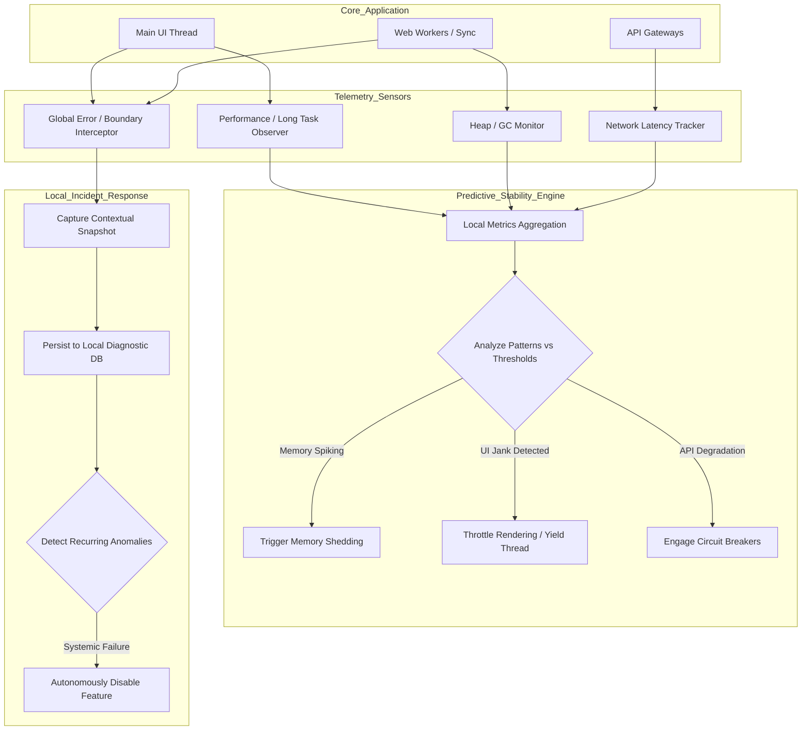

# Document 24: Comprehensive Telemetry, Incident Response, and Predictive Stability

## Abstract

The preceding documents have constructed an architectural fortress, defining the mechanisms required to make Project Ember crash-proof, self-healing, and fault-tolerant. However, mythic-level engineering recognizes that perfection is a theoretical asymptote; unforeseen anomalies, bizarre edge cases, and hardware-specific anomalies will inevitably penetrate even the most robust defenses. The final evolution of system resilience is the implementation of comprehensive telemetry and predictive stability. Project Ember must possess a profound, self-aware observability layer capable of detecting subtle degradation, aggregating anonymized incident reports locally, and dynamically adjusting its operational parameters to prevent impending failures. This document outlines the strategies for building an autonomous telemetry engine that transforms retrospective debugging into proactive, algorithmic stabilization.

## 1. The Necessity of Decentralized Observability

In standard cloud architectures, massive backends ingest terabytes of logs to provide engineers with system observability. Project Ember, being a local-first application, cannot rely on a centralized, heavy backend for constant health monitoring. Attempting to stream every application log over the network to a remote server would violate user privacy, consume excessive bandwidth, and ironically, introduce new vectors for network-based crashes.

Project Ember requires a decentralized, local-first observability paradigm. The application must monitor itself. It must act as its own diagnostic physician, continuously analyzing its internal telemetry—memory allocation, main-thread blocking durations, API latency, and error boundary interceptions—entirely within the user's browser. Only highly aggregated, fully anonymized, and critically urgent incident reports should ever be transmitted externally, and only with explicit user authorization.

## 2. Using Telemetry for Predictive Stability

The true power of local telemetry lies not in reporting crashes, but in predicting them. By continuously tracking performance metrics, the application can detect when it is approaching a critical failure threshold and take autonomous evasive action.

For example, the telemetry engine must monitor the browser's heap size or the frequency of garbage collection pauses. If it detects a rapid, uncharacteristic inflation in memory usage—indicative of a potential memory leak caused by a rogue component or a massive repository ingestion—the Predictive Stability Engine engages. It can autonomously trigger a 'Memory Shedding' protocol, aggressively purging cached data from the active state store, forcing garbage collection, and temporarily degrading non-essential background tasks to stabilize the memory footprint before the browser issues an Out-Of-Memory (OOM) termination.

## 3. Algorithmic Jank Detection and UI Throttling

A crash is a hard failure, but 'jank'—stuttering animations, frozen inputs, and delayed rendering—is a soft failure that destroys the user experience just as effectively. Project Ember must algorithmically detect UI jank and dynamically adjust its computational load to restore fluidity.

The telemetry engine must integrate with the browser's `PerformanceObserver` API, constantly measuring the duration of Long Tasks (tasks that block the main thread for more than 50 milliseconds). If the system detects a high density of Long Tasks—perhaps due to the AI agent attempting to render a massive, complex markdown response with deeply nested code blocks—the Predictive Stability Engine intervenes. It can automatically throttle the rendering process, forcing the application to yield to the main thread more frequently, or temporarily disable heavy CSS animations and transitions, prioritizing input responsiveness over visual fidelity until the computational storm passes.

## 4. Localized Incident Aggregation and Triage

When an error boundary inevitably intercepts a localized crash, or a network request repeatedly fails despite all retry mechanisms, this event must not be silently swallowed or haphazardly logged to the console. It must be processed by a sophisticated, local Incident Response Engine.

This engine acts as a localized triage center. When an anomaly occurs, it captures a rich, deterministic snapshot of the application state at that exact millisecond. This includes the precise state of the relevant Redux/Context silos, the history of recent user interactions, and the current network topology. It then aggregates this incident into a local, persistent diagnostic database. 

If the same error occurs repeatedly, the engine recognizes the pattern. Instead of spamming the user with error toasts, it categorizes the issue as a 'Systemic Anomaly'. The application can then intelligently route around the anomaly, perhaps disabling the specific feature causing the issue entirely, and surfacing a clear, contextual message to the user explaining that a specific component is currently disabled to protect system stability.

## 5. Telemetry and Predictive Stability Engine

## 6. The Autonomous Agent as a Diagnostic Tool

Project Ember's integration of a generative AI agent provides a unique opportunity for advanced incident response. The AI should not merely be a tool for writing code; it can be weaponized as an internal diagnostic engineer.

When a complex, unhandled exception is caught by the Incident Response Engine, the system can automatically format the stack trace, the contextual state snapshot, and the recent telemetry data into a highly structured, internal diagnostic prompt. This prompt is then silently routed to the AI agent in the background. The AI analyzes the crash data and attempts to generate a probable root-cause analysis or even propose a localized state patch to resolve the deadlock. While the system must not blindly apply AI-generated patches to core code, this automated diagnostic analysis can be surfaced to the developer (or a highly technical user) as an incredibly powerful debugging artifact, drastically accelerating the resolution of obscure bugs.

## 7. The Mythic Plan: Conclusion

The eight documents comprising the Graphite-Git Mythic Plan delineate a radically uncompromising approach to software engineering. Project Ember is not designed merely to function; it is designed to survive. 

By layering System Resilience Fundamentals (blast radius containment), Autonomous Self-Healing (state reconciliation), Fault Tolerance (idempotency and graceful degradation), Bug Resistance (strict typing and Zod schemas), Crash-Proof State Management (atomic, isolated contexts), and Absolute Durability (transactional IndexedDB), the architecture constructs an impregnable fortress. 

The integration of this final layer—Comprehensive Telemetry and Predictive Stability—animates the fortress, giving it the self-awareness required to anticipate failure, shed load dynamically, and intelligently triage its own wounds. Project Ember, built upon these principles, transcends the fragility of the modern web, establishing a new paradigm of invulnerable, local-first computing.
