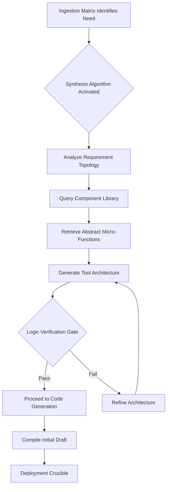

# Graphite-Git Document 25: The Tool Forge - Architecture and Mythic Foundation

## 1. Introduction to the Tool Forge in Graphite-Git
The Tool Forge represents a monumental leap in the capabilities of the Graphite-Git ecosystem, transcending the traditional boundaries of version control and developer tooling. At its core, the Tool Forge is an advanced, multi-dimensional environment where tools, utilities, and agentic workflows are not merely created but synthesized, dynamically forged from raw logical components into cohesive, hyper-efficient mechanisms. This document serves as the foundational exploration of the Tool Forge’s architecture, its mythic underpinnings, and the philosophical frameworks that drive its operation.

In the rapidly evolving landscape of software engineering, the need for static tools has diminished. The modern developer—and by extension, the modern autonomous agent—requires tools that are fluid, context-aware, and capable of self-optimization. The Tool Forge within Graphite-Git is designed to meet this exact need. It is a generative engine that ingests the contextual requirements of a given repository, analyzes the historical patterns of its contributors, and autonomously generates bespoke tooling that perfectly aligns with the project's current operational phase. 

### 1.1 The Philosophical Framework
To understand the Tool Forge, one must first embrace the philosophy of "Continuous Tooling Synthesis." Traditional development relies on downloading pre-compiled tools or writing static scripts. The Tool Forge posits that tools should be ephemeral yet perfectly adapted, forged in the moment of need and dissolved or archived when the need passes. This approach minimizes bloat, maximizes security (by reducing the attack surface of persistent, unused tools), and ensures that the tooling always matches the exact state of the codebase.

### 1.2 Architectural Overview
The architecture of the Tool Forge is built upon a highly decentralized, graph-based structure that perfectly complements Graphite-Git’s underlying data model. It consists of three primary layers: the Ingestion Matrix, the Forging Engine, and the Deployment Crucible.

1. **The Ingestion Matrix**: This layer is responsible for gathering data. It constantly monitors the Graphite-Git repository, analyzing commits, pull requests, issue trackers, and even the natural language discussions surrounding the code. It identifies friction points, repetitive tasks, and emerging needs.
2. **The Forging Engine**: The heart of the Tool Forge. Utilizing advanced Large Language Models and deterministic logical synthesizers, the Forging Engine takes the data from the Ingestion Matrix and designs tools. It creates the tool’s architecture, writes its code, and defines its operational parameters.
3. **The Deployment Crucible**: Once a tool is designed, it enters the Deployment Crucible. Here, it is tested in a highly secure, sandboxed environment. If it passes all safety and efficiency checks, it is seamlessly integrated into the developer's workflow or the agent's action space.

## 2. Deep Dive: The Ingestion Matrix

The Ingestion Matrix is a masterwork of observability and data processing. It operates silently in the background of every Graphite-Git repository, absorbing information without adding any overhead to the developer's workflow.

### 2.1 Contextual Resonance Detection
The primary function of the Ingestion Matrix is Contextual Resonance Detection. This is the process of identifying when a specific pattern of work resonates with a known inefficiency. For example, if a developer repeatedly runs a series of complex Git commands followed by a specific build script and a manual deployment check, the Ingestion Matrix detects this resonance.

It does this by utilizing a multi-layered neural network that has been trained on millions of open-source workflows. The network identifies the "shape" of the developer's actions, recognizing patterns that are often invisible to the human eye. 

### 2.2 The Anomaly Engine
Working in tandem with Contextual Resonance Detection is the Anomaly Engine. While the former looks for repeated patterns, the Anomaly Engine looks for deviations. If a normally smooth CI/CD pipeline suddenly experiences a spike in failure rates due to a subtle change in dependency resolution, the Anomaly Engine flags this. 

The Anomaly Engine does not simply report the error; it analyzes the *nature* of the error, categorizes it, and prepares a detailed brief for the Forging Engine, suggesting that a diagnostic tool is urgently required.

## 3. The Forging Engine: Synthesis and Generation

Once the Ingestion Matrix has identified a need, the Forging Engine takes over. This is where the true "mythic" capabilities of Graphite-Git are realized. The Forging Engine does not merely select from a library of existing scripts; it creates entirely new tools from scratch.

### 3.1 The Component Library and The Synthesis Algorithm
The Forging Engine relies on a vast Component Library—a repository of millions of micro-functions, logical blocks, and architectural patterns. However, these are not static pieces of code. They are abstract representations of functionality.

When a tool needs to be forged, the Synthesis Algorithm goes to work. It breaks down the requirement into its fundamental logical components, queries the Component Library, and begins stitching together a solution. 

### 3.2 The Multi-Dimensional Language Model (MDLM)
The actual code generation is handled by the MDLM. This is not a standard LLM; it is specifically fine-tuned for tool creation within the Graphite-Git ecosystem. The MDLM understands not just programming languages, but the specific nuances of the repository it is operating within. It knows the coding standards, the architectural patterns, and the performance requirements of the project.

When the MDLM generates a tool, it writes code that looks and behaves as if it were written by the lead architect of the project. It includes comprehensive documentation, automated tests, and highly optimized execution paths.

## 4. The Deployment Crucible: Testing and Refinement

A newly forged tool is inherently risky. It is a piece of generated code that has never existed before. The Deployment Crucible ensures that this tool is safe, effective, and performant before it is ever allowed to interact with the production repository.

### 4.1 Ephemeral Sandboxing
The moment a tool is drafted, it is placed into an Ephemeral Sandbox. This is a highly restricted, containerized environment that perfectly mirrors the state of the target repository. The tool is executed within this sandbox, subjected to a battery of intense automated tests.

These tests are not standard unit tests. They are "Chaos Tests"—designed to break the tool by feeding it unexpected inputs, simulating network failures, and artificially restricting system resources. If the tool fails in the sandbox, it is sent back to the Forging Engine for refinement.

### 4.2 The Frictionless Integration Protocol
If a tool survives the Deployment Crucible, it must be integrated into the workflow. The Frictionless Integration Protocol ensures that this happens without disrupting the developer or the agent. 

For developers, the tool might appear as a newly available command in the Graphite-Git CLI, accompanied by a brief notification explaining its purpose and how to use it. For autonomous agents, the tool is immediately added to their action space, and their internal models are updated to understand its capabilities.

## 5. Security and Governance within the Tool Forge

The ability to dynamically generate and execute code is an immense security risk if not properly managed. Graphite-Git addresses this through a rigorous governance framework.

### 5.1 Cryptographic Provenance
Every tool generated by the Forge is cryptographically signed. This signature contains the entire history of the tool's creation: the data from the Ingestion Matrix that triggered it, the specific components used by the Synthesis Algorithm, the version of the MDLM that generated the code, and the results of the Deployment Crucible tests.

This provides absolute traceability. If a tool behaves unexpectedly, its provenance can be audited instantly, allowing administrators to understand exactly how and why it was created.

### 5.2 The Principle of Least Privilege Execution
Tools forged in Graphite-Git operate strictly under the Principle of Least Privilege. When a tool is generated, it is assigned a very specific set of permissions based on its intended function. A tool designed to analyze log files will absolutely not have write access to the main branch. A tool designed to optimize images will not have network access.

These permissions are enforced at the kernel level within the Graphite-Git execution environment, making it virtually impossible for a forged tool to exceed its mandate, even if compromised.

## 6. Case Studies: The Tool Forge in Action

To fully grasp the power of the Tool Forge, we must examine hypothetical case studies of its operation in complex environments.

### 6.1 Case Study 1: The Cascading Dependency Crisis
Imagine a large-scale microservices architecture managed within Graphite-Git. A critical update to a core logging library is released. Normally, updating this across 500 microservices would require a massive, coordinated effort, prone to human error and merge conflicts.

The Ingestion Matrix detects the update and the subsequent spike in developer chatter regarding the update process. The Forging Engine immediately synthesizes a "Cascading Update Coordinator" tool. This tool is designed to intelligently parse the dependency trees of all 500 services, identify the optimal order of updates to prevent breaking changes, automatically generate the necessary pull requests, and monitor the CI/CD pipelines for any failures. 

The Deployment Crucible tests this tool in a simulated environment, confirming its logic. Within minutes, the tool is deployed, turning a multi-week agonizing process into a fully automated, risk-free operation.

### 6.2 Case Study 2: The Rogue Memory Leak
In a high-frequency trading application, a subtle memory leak begins to manifest, but only under highly specific, difficult-to-reproduce market conditions. Standard profiling tools are too slow and add too much overhead to catch the leak in production.

The Anomaly Engine within the Ingestion Matrix detects the faint signature of the memory leak in the performance logs. It flags this for the Forging Engine. The Forging Engine analyzes the specific architecture of the application and synthesizes a highly specialized, ultra-low-overhead "Micro-Profiler." 

This Micro-Profiler is designed to inject itself into the specific functions suspected of leaking, capture memory state for exactly 10 milliseconds, and then immediately detach, minimizing performance impact. The tool is deployed, captures the necessary data during the next market anomaly, and identifies the exact line of code causing the leak. The tool is then automatically archived, its purpose fulfilled.

## 7. The Future of the Tool Forge

The Tool Forge detailed in this document is merely the first iteration of what will become a fundamental shift in software engineering. As the underlying models become more sophisticated, the Tool Forge will transition from being a reactive system to a proactive one.

### 7.1 Predictive Forging
Future versions of the Tool Forge will not wait for an inefficiency to occur. By analyzing the trajectory of the codebase and the historical patterns of the development team, the Tool Forge will predict what tools will be needed *before* the need arises. When a developer begins work on a new feature, the perfectly tailored tools to assist with that feature will already be waiting for them.

### 7.2 Cross-Repository Synthesis
Currently, the Tool Forge operates primarily within the context of a single repository. The next evolution will allow the Tool Forge to share components and synthesized logic across thousands of repositories within an organization, creating a massive, collective intelligence of tooling. A solution forged to solve a problem in Project A will instantly be available to Project B, seamlessly adapted to its specific context.

## 8. Conclusion

The Graphite-Git Tool Forge is a monumental achievement in the realm of autonomous tooling. By treating tools not as static artifacts, but as fluid, generated solutions, it fundamentally alters the relationship between developers and their environment. It brings us closer to a future where the environment itself actively participates in the development process, intelligently adapting to the ever-changing needs of the software and the people—or agents—who build it. This is the Mythic Plan realized: an ecosystem that writes its own tools to forge the future.
