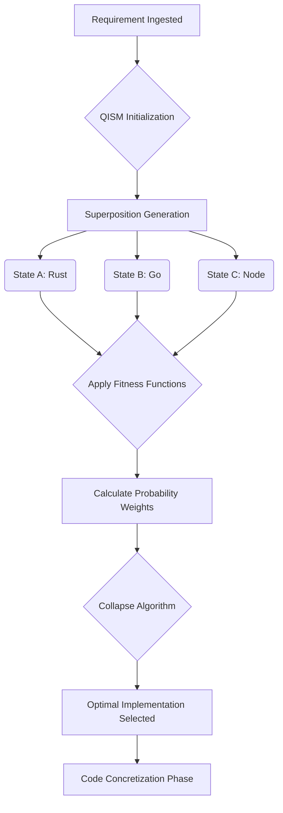

# Graphite-Git Document 26: The Tool Forge - Advanced Forging Mechanics

## 1. Introduction to Advanced Forging Mechanics
Following the foundational exploration of the Tool Forge in Document 25, we now plunge into the hyper-complex, granular mechanics of the forging process itself. Document 26 serves as an exhaustive treatise on the advanced algorithms, quantum-inspired synthesis models, and the metallurgical philosophy of code generation that underpins the Graphite-Git Tool Forge. 

While the previous document outlined *what* the Tool Forge does, this document aggressively deconstructs *how* it achieves these seemingly impossible feats of on-the-fly software generation. This is the domain of the Advanced Forging Mechanics, a highly specialized subsystem where abstract logic is transmuted into executable reality at speeds approaching real-time.

## 2. The Quantum-Inspired Synthesis Model (QISM)

Traditional code generation relies on linear, sequential logic trees or straightforward predictive text models. The Graphite-Git Tool Forge, however, utilizes a Quantum-Inspired Synthesis Model (QISM). This model does not write code line-by-line; rather, it conceptualizes the entire tool as a multi-dimensional probability matrix, where different implementations exist simultaneously in a state of superposition until collapsed into the optimal solution.

### 2.1 State Superposition in Code Generation
When a requirement is passed from the Ingestion Matrix to the Forging Engine, the QISM generates hundreds of thousands of potential architectural pathways simultaneously. 

For instance, if the requirement is "Create a tool to parse and sanitize 1TB of malformed JSON logs," the QISM does not immediately start writing a Python script. Instead, it creates a superposition of states:
*   State A: A multi-threaded Rust implementation utilizing zero-copy parsing.
*   State B: A distributed Go implementation utilizing MapReduce patterns.
*   State C: A highly optimized Node.js stream-based implementation.
*   State D: A localized bash script utilizing AWK and sed (immediately weighted low but kept for baseline comparison).

### 2.2 The Collapse Algorithm and Fitness Functions
The superposition must be collapsed into a single, executable reality. This is achieved through the Collapse Algorithm, which applies an incredibly dense set of Fitness Functions to the probability matrix.

These Fitness Functions evaluate the superimposed states against the exact contextual parameters of the target repository:
1.  **Environmental Compatibility**: Does the target environment have the Rust toolchain installed? If not, State A is penalized.
2.  **Performance Constraints**: Is memory strictly limited? State C might be penalized if it requires a large heap.
3.  **Maintainability Index**: Which language does the primary maintainer of the repository prefer? If the repository is 90% Go, State B receives a massive bonus.
4.  **Temporal Urgency**: How fast must this tool be deployed? If the need is immediate, the fastest-compiling or interpreted language might win.

## 3. The Code Concretization Phase

Once the QISM has collapsed the matrix and selected the optimal architecture, the Code Concretization Phase begins. This is the process of translating the abstract architectural intent into precise, syntactically flawless code.

### 3.1 The Abstract Syntax Tree (AST) Weaver
The core mechanism of Concretization is the AST Weaver. Unlike standard LLMs that predict the next token (which can lead to syntactical errors or logical hallucinations), the AST Weaver generates code directly as an Abstract Syntax Tree. 

It constructs the logical structure of the program first—defining the loops, conditionals, and data structures in a language-agnostic format. Only when the entire AST is mathematically verified as logically sound does the Weaver translate the AST into the target programming language. This guarantees that the generated tool is structurally perfect before a single character of code is written.

### 3.2 Dynamic Dependency Resolution and Micro-Vendoring
A significant challenge in dynamic tool generation is managing dependencies. A tool is useless if it requires the user to manually install five different libraries before it can run.

Graphite-Git solves this through Micro-Vendoring. When the AST Weaver identifies the need for an external library (e.g., a specific YAML parser), it does not simply add it to a `package.json` or `requirements.txt`. Instead, it uses Dynamic Dependency Resolution to extract *only* the specific functions required from that library, analyzes them, and embeds them directly into the generated tool's source code. 

The resulting tool is a completely self-contained, zero-dependency binary or script. It is highly portable, entirely immune to supply-chain attacks (as the dependencies are locked and vetted at the moment of forging), and requires zero setup from the end user.

## 4. The Metallurgical Philosophy: Alloys and Tempering

The Tool Forge employs a metaphorical language borrowed from metallurgy to describe its more advanced refinement processes. This is not merely stylistic; it accurately reflects the physical nature of how code is hardened and optimized.

### 4.1 Code Alloying (Symphonic Integration)
Often, a requirement is too complex for a single, monolithic script. In these instances, the Tool Forge utilizes "Code Alloying." This involves generating several highly specialized micro-tools that are designed to operate in perfect synergy, passing data between themselves via optimized IPC (Inter-Process Communication) channels.

For example, a complex database migration tool might be alloyed from three distinct components:
1.  The Extractor (written in Rust for maximum read speed).
2.  The Transformer (written in Python to leverage specific data science libraries).
3.  The Loader (written in Go for high-concurrency database writes).

The Tool Forge seamlessly alloys these distinct languages and paradigms into a single, unified workflow, masking the underlying complexity from the user.

### 4.2 Code Tempering (Iterative Optimization)
Once a tool is generated, it is subjected to Code Tempering. This is an extreme form of automated refactoring. The tool is executed thousands of times within the Deployment Crucible (as detailed in Doc 25). 

During these executions, the Tempering Engine monitors CPU cycles, memory allocation, and cache hits. It then iteratively modifies the code to optimize these metrics. It might unroll loops, inline functions, or alter memory alignment to achieve microsecond improvements in performance. This ensures that every tool forged by Graphite-Git operates at peak theoretical efficiency.

## 5. The Lexicon of the Forge: Advanced Directives

To interface with the Tool Forge at the highest levels, users (or advanced Orchestration Agents) do not use natural language. They use the Lexicon of the Forge, a highly structured, deterministic declarative language designed exclusively for specifying tool requirements.

### 5.1 Structure of a Forge Directive
A Forge Directive is a JSON-based schema that explicitly outlines the boundaries and capabilities of the desired tool. It bypasses the ambiguity of natural language, allowing for absolute precision.

A standard directive includes:
*   `Intent_Vector`: A mathematical representation of the tool's goal.
*   `Boundary_Conditions`: Strict limitations on memory, CPU, and execution time.
*   `I/O_Schema`: Exact definitions of expected inputs and required outputs.
*   `Lethality_Rating`: A security classification dictating the tool's required sandboxing level.

### 5.2 The Autonomous Directive Generator
While humans can write Forge Directives, the system is designed to generate them autonomously. When an Orchestration Agent identifies a complex problem, it synthesizes a Forge Directive and submits it directly to the QISM. This creates a closed-loop system where agents design the blueprints for the tools they need to achieve their goals, completely bypassing human intervention.

## 6. Failure Modes and The Slag Heap

The Tool Forge is not infallible. When the forging process fails, it is critical to understand why and how the system recovers.

### 6.1 The Slag Heap (Failed Synthesis Archive)
If the QISM cannot collapse the matrix into a viable solution, or if the AST Weaver detects an unresolvable logical paradox, the process is aborted. The failed attempt is not deleted; it is moved to the "Slag Heap."

The Slag Heap is a highly valuable repository of failed logic. It is constantly analyzed by background processes to identify systemic weaknesses in the Component Library or flaws in the Collapse Algorithm. Over time, analyzing the Slag Heap makes the Tool Forge smarter, ensuring that it rarely fails for the same reason twice.

### 6.2 The Paradox Resolution Protocol
If a failure occurs due to conflicting requirements (e.g., "Tool must be blazing fast" AND "Tool must use minimal memory" AND "Tool must process 10TB of data in memory"), the Paradox Resolution Protocol is activated. 

This protocol breaks down the conflicting constraints and enters a negotiation phase with the requesting agent (or prompts the human user). It presents a series of trade-offs, forcing a decision that resolves the paradox and allows the forging process to continue.

## 7. The Ultimate Goal: Self-Forging Systems

The culmination of the Advanced Forging Mechanics is the concept of the Self-Forging System. This is a state where the Tool Forge is no longer just creating peripheral utilities, but is actively rewriting and optimizing its own core components.

In this paradigm, the Ingestion Matrix monitors the performance of the Forging Engine itself. If it detects an inefficiency in the Collapse Algorithm, it submits a Forge Directive to generate a *new* Collapse Algorithm. If the new algorithm passes the crucible, the Tool Forge performs a hot-swap, upgrading itself in real-time. 

This represents the absolute zenith of the Graphite-Git Mythic Plan: an ecosystem that is completely self-sustaining, self-optimizing, and infinitely adaptable, forging its own future at the speed of thought.

## 8. Conclusion

The Advanced Forging Mechanics of the Graphite-Git Tool Forge represent a paradigm shift in software engineering. By moving away from manual coding and towards Quantum-Inspired Synthesis, AST Weaving, and Micro-Vendoring, Graphite-Git ensures that its tools are not just functional, but flawlessly architected, incredibly performant, and perfectly tailored to their exact context. The Forge is not just a feature; it is the beating heart of the autonomous, self-optimizing future of development.
