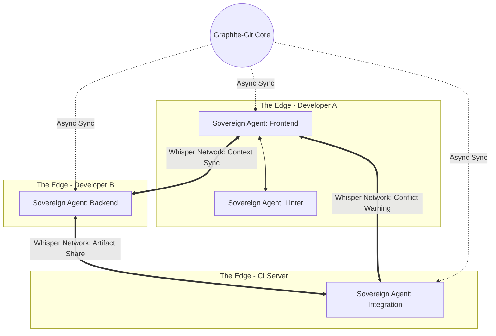

# Graphite-Git Document 27: Multi-Agent Edge Orchestration - The Framework

## 1. Introduction to Multi-Agent Edge Orchestration

Within the Graphite-Git Mythic Plan, the centralization of processing power is viewed as an antiquated bottleneck, a fragile single point of failure that stifles true autonomy. Document 27 introduces the paradigm of Multi-Agent Edge Orchestration. This is not merely a feature of distributed computing; it is a fundamental reimagining of how autonomous entities interact, collaborate, and execute complex logic at the absolute periphery of the network—the Edge.

In the Graphite-Git ecosystem, the "Edge" refers to the individual developer machines, CI/CD nodes, local servers, and even IoT devices that interact with the repository. Multi-Agent Edge Orchestration involves deploying highly specialized, autonomous agents directly to these edge environments. There, they operate with localized context, ultra-low latency, and sovereign decision-making capabilities, while still remaining perfectly synchronized with the global intent of the Graphite-Git swarm.

## 2. The Philosophy of the Edge

To understand Edge Orchestration, we must pivot away from the traditional Cloud-Centric model. In traditional systems, edge devices are "dumb" terminals that send data to a central brain (the cloud) for processing, wait for instructions, and execute them.

Graphite-Git posits that this model is inherently flawed for complex, real-time development environments. The latency is too high, the bandwidth costs are exorbitant, and the central system is easily overwhelmed by the sheer volume of telemetry required to understand the nuances of a large-scale repository.

### 2.1 The Sovereign Agent
The core unit of this new paradigm is the Sovereign Agent. A Sovereign Agent is a lightweight, highly specialized AI entity deployed to the edge. It possesses its own localized LLM, a subset of the Tool Forge's component library, and a clear understanding of its specific mandate (e.g., "Optimize rendering performance in the frontend directory").

Because it is Sovereign, it does not need to ask permission from a central authority to execute routine tasks. It analyzes its local environment, makes decisions based on its mandate, and executes actions immediately. It only communicates with the broader swarm when it encounters an anomaly beyond its capability, or when it needs to synchronize a major change.

### 2.2 The Hive Mind vs. The Symphony
We reject the term "Hive Mind" because it implies a loss of individuality and forced centralization. Instead, Multi-Agent Edge Orchestration is a "Symphony." Each Sovereign Agent is an expert musician playing its part perfectly. The Orchestrator (which we will detail later) is the conductor, not micromanaging the fingering of every instrument, but ensuring the tempo and overall harmony are maintained.

## 3. Architecture of the Edge Framework

The architecture supporting this symphony is built upon a highly resilient, decentralized peer-to-peer (P2P) mesh network specifically designed for Graphite-Git telemetry and agent coordination.

### 3.1 The Whisper Network (P2P Mesh)
Sovereign Agents communicate via the Whisper Network. This is a low-bandwidth, high-frequency P2P protocol running concurrently with standard Git operations. It allows agents to share context, warn each other of potential merge conflicts before code is even committed, and distribute computational loads.

If an agent on Developer A's machine is compiling a massive Rust library, and an agent on Developer B's machine has already compiled the exact same commit, the Whisper Network detects this. Developer B's agent silently transmits the compiled artifact to Developer A's agent, bypassing the central server entirely and saving massive amounts of time and energy.

### 3.2 The Localized Context Engine (LCE)
Each edge node runs a Localized Context Engine. The LCE creates an incredibly detailed map of the local environment: the exact hardware specifications, the specific software versions installed, the active background processes, and even the historical working patterns of the human developer using that machine.

The Sovereign Agent uses the LCE to optimize its actions. If the LCE reports that the human developer is currently in a "deep focus" state (determined by analyzing typing cadence and window switching), the Agent will suppress all non-critical notifications and background tasks, ensuring maximum performance for the human.

## 4. Agent Topologies and Specialization

Not all agents are created equal. The Graphite-Git Multi-Agent framework relies on strict specialization and hierarchical topologies to manage complexity.

### 4.1 The Caste System of Agents
Agents are divided into distinct "castes" based on their functionality and resource allocation:
*   **Observer Agents (Scouts)**: Ultra-lightweight. They only read data. They monitor file changes, track memory usage, and listen to the Whisper Network. They consume almost zero resources.
*   **Executor Agents (Workers)**: These are the heavy lifters. They run tests, compile code, and apply Tool Forge outputs. They are spun up only when needed and dissolved immediately after their task is complete.
*   **Synthesizer Agents (Architects)**: These agents analyze the data gathered by the Observers, identify complex patterns, and generate directives for the Executors. They are the tactical commanders of the local edge node.
*   **Ambassador Agents (Diplomats)**: These agents manage communication across the Whisper Network. They negotiate resource sharing with other nodes and handle the synchronization of state with the central repository.

### 4.2 Dynamic Topology Reconfiguration
The topology of these agents is not static. It is highly fluid and reacts to the immediate needs of the environment. 

During a massive refactoring event, the local node might dynamically spin up fifty Executor Agents to parallelize the AST modifications across every file in the repository. Once the refactor is complete, those fifty agents are collapsed back into the void, leaving only a few Observer Agents behind.

## 5. Security in a Decentralized Edge

Deploying autonomous, code-executing agents to the edge presents an unprecedented security challenge. If a single edge node is compromised, a malicious agent could theoretically infect the entire swarm via the Whisper Network.

### 5.1 The Panopticon Protocol
Graphite-Git mitigates this through the Panopticon Protocol. While agents are Sovereign, they are never unobserved. Every action an Executor Agent takes is cryptographically signed and logged. Furthermore, Observer Agents are constantly auditing the behavior of the Executor and Synthesizer Agents.

If an Executor Agent attempts an action outside its mandate (e.g., an agent assigned to optimize CSS attempts to read a `.env` file), an Observer Agent will instantly flag this behavior as anomalous.

### 5.2 The Immediate Quarantine Mechanism
When anomalous behavior is detected, the Immediate Quarantine Mechanism (IQM) is triggered. The suspect agent is instantly frozen. Its network connections are severed, and its memory state is dumped to a secure, encrypted sandbox.

The Ambassador Agent immediately broadcasts a "Contagion Alert" across the Whisper Network, instructing all other nodes to reject any data originating from the compromised agent. The memory dump is then analyzed by a specialized forensic agent to determine if the anomaly was a bug, a logic error, or a malicious attack.

## 6. The Orchestrator: Maintaining the Symphony

While the edge is decentralized, there must still be a mechanism to ensure that the sum of the edge actions aligns with the global goals of the project. This is the role of the Orchestrator.

### 6.1 The Orchestrator's Mandate
The Orchestrator resides within the core of the Graphite-Git infrastructure (usually co-located with the main repository). Its primary function is NOT to micromanage the edge agents, but to manage the *intent* of the project.

It monitors the overall health of the codebase, tracks progress against milestones, and ensures that the swarm of agents is moving in the right direction. If the Orchestrator detects that the swarm is obsessively optimizing frontend rendering while a critical backend security vulnerability remains unpatched, it will alter the global "Intent Vector."

### 6.2 The Intent Vector Broadcast
The Orchestrator communicates through Intent Vectors. An Intent Vector is a high-level, abstract goal broadcasted to the entire Whisper Network. 

For example, the Orchestrator might broadcast: `INTENT: Maximize Security (Priority 1) | Secondary: Maintain Performance`.

Upon receiving this broadcast, every Sovereign Agent at the edge recalibrates its internal priorities. The frontend optimization agents will throttle back their resource usage, while security auditing agents will spin up Executor processes to aggressively scan the codebase. The swarm dynamically realigns to fulfill the global intent without requiring specific, step-by-step instructions from the center.

## 7. Conclusion: The Edge is Alive

The Multi-Agent Edge Orchestration framework transforms the Graphite-Git ecosystem from a passive repository into a living, breathing entity. The codebase is no longer just files on a disk; it is surrounded by a halo of intelligent agents, constantly analyzing, optimizing, and protecting it at the very edges of the network. This radical decentralization ensures unparalleled speed, resilience, and adaptability, forging a development environment that anticipates needs and solves problems before they even manifest.
