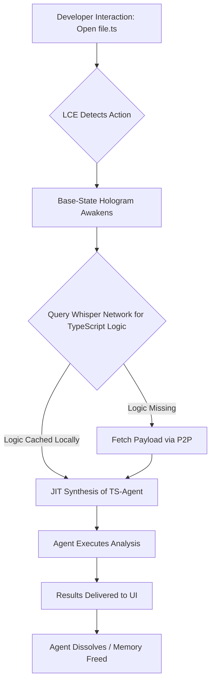

# Graphite-Git Document 28: Multi-Agent Edge Orchestration - Deployment and Synchronization

## 1. Introduction to Deployment and Synchronization at the Edge

Building upon the theoretical framework established in Document 27, this document delves into the visceral mechanics of Multi-Agent Edge Orchestration. How do these Sovereign Agents physically reach the edge? How do they maintain cohesion when operating in highly volatile, frequently disconnected environments? How is the state of a massively decentralized swarm synchronized without collapsing the network under the weight of its own telemetry?

Document 28 demystifies the Deployment and Synchronization protocols of Graphite-Git. It outlines the radical departure from traditional containerization and the introduction of "Fluid State Mechanics"—the paradigm that allows the agent swarm to flow seamlessly across hardware boundaries.

## 2. The Holographic Deployment Model

Traditional agent deployment relies on heavy containerization (e.g., Docker). While excellent for static applications, containers are too slow to spin up, too bloated, and too rigid for the ephemeral, hyper-fast nature of Graphite-Git's Sovereign Agents.

Instead, Graphite-Git utilizes a Holographic Deployment Model. 

### 2.1 Base-State Cloning
When a developer clones a Graphite-Git repository, they do not just receive the source code. Embedded within the `.git` directory structure is a highly compressed "Base-State Hologram." This hologram contains the foundational logic required to bootstrap the local agent swarm. It is not an active process; it is a dormant seed.

The moment the developer interacts with the repository (even just running a `git status` equivalent), the Base-State Hologram is activated. It immediately interfaces with the Localized Context Engine (LCE) to understand its host environment.

### 2.2 Just-In-Time (JIT) Agent Synthesis
Because edge resources are precious, agents are never deployed preemptively. Instead, they are synthesized Just-In-Time. 

If the LCE detects that the developer has opened a highly complex React component, the Base-State Hologram requests the specific "React Optimization" logic from the Whisper Network. The necessary logic is transmitted as a micro-payload, and the specific Executor Agent is synthesized in memory, analyzes the file, provides its insights, and then immediately dissolves back into the Base-State.

This means a developer's machine might host 10,000 distinct agent deployments throughout a workday, but only ever have 3 agents active in memory at any given millisecond.

## 3. Synchronization: Fluid State Mechanics

The most significant challenge in a decentralized system is maintaining a consistent state. If Agent A on Node 1 refactors a function, Agent B on Node 2 must be aware of this change immediately, even before the code is formally committed to the central repository.

Graphite-Git achieves this through Fluid State Mechanics, relying on a localized, high-speed Directed Acyclic Graph (DAG) called the Ephemeral Ledger.

### 3.1 The Ephemeral Ledger
Every edge node maintains its own Ephemeral Ledger. This is a lightweight, purely in-memory data structure that records every action, intent, and observation made by the local agent swarm. 

When a Sovereign Agent modifies the Abstract Syntax Tree (AST) of a file, that modification is recorded as a transaction on the Ephemeral Ledger.

### 3.2 The Gossip Protocol and Vector Clocks
To synchronize these ledgers across the Whisper Network, Graphite-Git utilizes an advanced Gossip Protocol combined with Vector Clocks. 

Edge nodes constantly "gossip" with their nearest neighbors, exchanging the latest state of their Ephemeral Ledgers. Vector Clocks ensure that the chronological order of events is perfectly maintained across the distributed system, preventing race conditions where Agent A and Agent B attempt to optimize the exact same block of code simultaneously.

If a collision occurs (two agents attempt to modify the same AST node concurrently), the Whisper Network utilizes a deterministic resolution algorithm to instantly decide which modification takes precedence, discarding the other.

## 4. Dealing with Volatility and Disconnection

Edge environments are inherently volatile. Laptops go to sleep, network connections drop, and CI servers are terminated abruptly. The Multi-Agent framework must be highly resilient to "Network Partitions."

### 4.1 Autonomous Disconnected Operation (ADO)
When an edge node loses connection to the Whisper Network, it enters Autonomous Disconnected Operation (ADO) mode. The local Sovereign Agents do not stop working; they simply constrain their actions to their localized context.

While in ADO mode, the agents continue to record their actions to the local Ephemeral Ledger. However, they are restricted from taking high-risk actions (such as initiating a massive, cross-file refactor) that could cause unresolvable conflicts when the connection is restored.

### 4.2 The Reconciliation Protocol
When the network connection is restored, the Reconciliation Protocol is initiated. The edge node broadcasts its isolated Ephemeral Ledger to the Whisper Network. The network rapidly compares the isolated ledger against the global consensus state.

Because the system operates on AST modifications rather than raw text diffs, reconciliation is incredibly fast and highly accurate. If conflicts exist, the network attempts automatic resolution based on the global Intent Vector. If the conflict is too complex, it is flagged for human intervention (or escalated to a highly specialized "Diplomat Agent").

## 5. Telemetry and The Panopticon Data Lake

While the agents are decentralized, the Orchestrator (as discussed in Doc 27) requires a macroscopic view of the swarm's health and activity. However, sending raw telemetry from thousands of edge nodes to a central server would cripple the network.

### 5.1 Semantic Telemetry Compression
Graphite-Git solves this through Semantic Telemetry Compression. Edge nodes do not send raw logs. Instead, they use a specialized Synthesizer Agent to analyze their local telemetry and extract only the semantic meaning.

Instead of sending "Agent X used 40MB of RAM at 10:01, 42MB at 10:02...", the edge node sends a single, highly compressed vector: "Agent X operating within expected parameters; Optimization task complete."

### 5.2 The Panopticon Data Lake
These compressed semantic vectors are aggregated into the Panopticon Data Lake at the core of the Graphite-Git infrastructure. The Orchestrator analyzes this Data Lake not to micromanage individual agents, but to detect systemic issues.

If the Data Lake reveals a subtle, system-wide increase in the time required to synthesize Executor Agents, the Orchestrator can deduce that a recent update to the Whisper Network protocol is causing localized bottlenecks, and issue a corrective Intent Vector to roll back the protocol across the swarm.

## 6. Advanced Synchronization Scenarios

To fully appreciate the robustness of Fluid State Mechanics, consider these extreme scenarios.

### 6.1 Scenario A: The Massive Refactor Storm
A senior architect initiates a massive, organization-wide refactor changing a core data model. This affects 400 different repositories. 

The Orchestrator broadcasts this Intent Vector. Immediately, thousands of edge nodes across the Whisper Network synthesize Refactoring Agents. These agents divide the work, utilizing the P2P mesh to assign specific directories to specific nodes based on available computational power. The Ephemeral Ledgers furiously gossip state changes, ensuring no two nodes attempt to refactor the same file. The entire process, which would normally take weeks of coordinated pull requests, is completed in minutes through massive, synchronized parallel execution at the edge.

### 6.2 Scenario B: The Zero-Day Mitigation
A critical zero-day vulnerability is discovered in a widely used dependency. The Orchestrator receives the threat intelligence. It instantly broadcasts a "Lethal Intent Vector." 

Every edge node worldwide immediately synthesizes a specialized Security Agent. These agents scan their local repositories. If the vulnerability is found, the agent autonomously generates a patch using the Tool Forge, applies it to the AST, runs the local test suite, and commits the change. The Ephemeral Ledgers synchronize this massive wave of micro-commits back to the core. The entire global infrastructure is patched and secured before human engineers even finish reading the security bulletin.

## 7. Conclusion: The Synchronized Swarm

Deployment and Synchronization within the Graphite-Git Multi-Agent framework are fundamentally alien to traditional DevOps paradigms. By abandoning static containers in favor of Holographic Deployment and replacing central databases with Fluid State Mechanics and Gossip Protocols, Graphite-Git achieves true, resilient decentralization. The swarm flows across the edge, adapting, surviving network partitions, and maintaining perfect synchronization. It is a system designed not just to scale, but to evolve.
