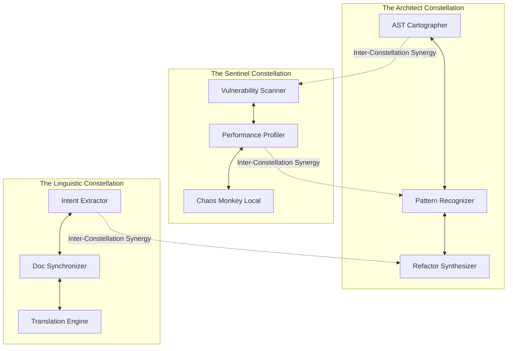

# Graphite-Git Document 29: Skill Constellations - Mapping the Capability Matrix

## 1. Introduction to Skill Constellations

The intelligence of the Graphite-Git ecosystem is not a monolithic entity; rather, it is a vast, interconnected network of highly specialized capabilities. We define this architecture as "Skill Constellations." Document 29 introduces the theoretical framework of these constellations, mapping the capability matrix that empowers the autonomous agents and the Tool Forge to operate with unparalleled precision.

In traditional AI systems, a "skill" is a linear function—a script that takes input A and produces output B. In Graphite-Git, a skill is a multi-dimensional node within a broader constellation. A single skill (e.g., "AST Parsing") gains exponential power when linked dynamically with other skills (e.g., "Semantic Search" and "Vulnerability Detection"). Understanding the topography of these constellations is vital for mastering the Mythic Plan.

## 2. The Anatomy of a Skill Node

Before mapping the constellations, we must define the fundamental unit: the Skill Node. A Skill Node in Graphite-Git is a heavily encapsulated module of logic, data, and execution parameters. It is not merely a piece of code; it is a conceptual understanding of a specific domain.

### 2.1 The Triptych Structure
Every Skill Node is constructed using a Triptych Structure, consisting of three essential layers:
1.  **The Ontological Layer (Understanding)**: This layer defines *what* the skill knows. It contains the semantic definitions, the syntax rules, and the contextual models relevant to the domain. For a "React Optimization" skill, this layer contains deep knowledge of the Virtual DOM, reconciliation algorithms, and hooks lifecycle.
2.  **The Execution Layer (Action)**: This layer defines *what* the skill can do. It contains the deterministic algorithms, the LLM prompts, and the integration hooks necessary to enact change.
3.  **The Synergy Layer (Connection)**: This is the most critical layer. It defines how the skill interfaces with the rest of the constellation. It broadcasts the skill's capabilities and actively listens for opportunities to combine its output with the input of other nodes.

### 2.2 Skill Dimensionality
Skills are not flat; they possess dimensionality based on their complexity and computational requirements. 
*   **1D Skills (Atomic)**: Basic functions like string manipulation or file I/O.
*   **2D Skills (Composite)**: Combinations of atomic skills, like parsing a specific file format (e.g., parsing a `package.json`).
*   **3D Skills (Heuristic)**: Skills that require inference and pattern recognition, such as identifying a memory leak from a performance profile.
*   **4D Skills (Generative)**: The highest tier, capable of synthesizing entirely new logic or structures based on abstract requirements (the domain of the Tool Forge).

## 3. The Core Constellations

The Graphite-Git Capability Matrix is organized into several massive, interlinked constellations. Each constellation represents a fundamental domain of software engineering.

### 3.1 The Architect Constellation (Structural Intelligence)
This constellation governs the structural integrity of the codebase. It does not concern itself with what the code *does*, but how the code is *built*.

*   **Key Nodes**:
    *   `AST_Cartographer`: Maps the entire Abstract Syntax Tree of the repository, understanding dependencies and flow control.
    *   `Pattern_Recognizer`: Identifies design patterns (Singleton, Factory, Observer) and anti-patterns (God Classes, Spaghetti Code).
    *   `Refactor_Synthesizer`: Proposes and executes large-scale architectural changes.
*   **Synergy**: When `Pattern_Recognizer` detects an anti-pattern, it synergizes with `AST_Cartographer` to map the blast radius, and then triggers `Refactor_Synthesizer` to generate a fix.

### 3.2 The Sentinel Constellation (Security and Stability)
This constellation is the immune system of the repository. It is constantly active, scanning for vulnerabilities, performance regressions, and logical flaws.

*   **Key Nodes**:
    *   `Vulnerability_Scanner`: Cross-references code against known CVE databases and identifies zero-day logic flaws.
    *   `Performance_Profiler`: Analyzes execution time and memory allocation, identifying bottlenecks.
    *   `Chaos_Monkey_Local`: Injects controlled failures into the local environment to test resilience.
*   **Synergy**: If `Chaos_Monkey_Local` causes a failure, `Performance_Profiler` captures the stack trace, and `Vulnerability_Scanner` analyzes the trace to see if the failure exposes a security flaw.

### 3.3 The Linguistic Constellation (Semantic Understanding)
This constellation bridges the gap between human intent and machine logic. It understands natural language, documentation, and the semantic intent behind code comments.

*   **Key Nodes**:
    *   `Intent_Extractor`: Reads issues and PR descriptions to understand the *goal* of a change, not just the code diff.
    *   `Doc_Synchronizer`: Ensures that documentation always perfectly matches the underlying codebase, generating new documentation when code changes.
    *   `Translation_Engine`: Can translate complex logic from one language to another (e.g., porting a Python algorithm to Rust).

## 4. The Mechanism of Synergy (Cross-Constellation Linkage)

The true power of Graphite-Git lies in Inter-Constellation Synergy. A skill node in isolation is useful; a chain of skill nodes across different constellations is mythic.

### 4.1 The Synergy Bus
Communication between skill nodes occurs on the Synergy Bus. This is a highly optimized, localized pub/sub messaging system. When a skill node completes a task, it publishes a "Capability Token" to the Synergy Bus.

For example, when the `AST_Cartographer` finishes mapping a new pull request, it publishes a token stating: "AST Map Available for PR #1042."

### 4.2 Dynamic Skill Chaining
Other nodes constantly monitor the Synergy Bus. If a node requires an AST Map to function, it intercepts the token and immediately executes. This creates spontaneous, dynamic skill chains that are not hardcoded, but form organically based on the needs of the moment.

Imagine a user submits a PR with a vague description like "Fixed the login bug."
1.  **Linguistic Constellation** (`Intent_Extractor`) reads the PR, determines the intent is related to authentication.
2.  `Intent_Extractor` publishes a token to the Synergy Bus.
3.  **Sentinel Constellation** (`Vulnerability_Scanner`) intercepts the token. Knowing the intent is authentication, it performs an ultra-deep, hyper-specific security scan on the PR's code diff, looking for authentication bypass flaws.
4.  If a flaw is found, `Vulnerability_Scanner` synergizes with the **Architect Constellation** (`Refactor_Synthesizer`) to immediately generate a patch.

This entire chain happens in milliseconds, completely autonomously.

## 5. The User as a Node (Human-in-the-Loop Synergy)

Graphite-Git does not seek to replace the developer; it seeks to elevate them. Therefore, the human user is considered a critical node within the Skill Constellations.

### 5.1 The Human Interface Node (HIN)
The Human Interface Node is a specialized skill that acts as the translator between the constellation and the developer. It does not bombard the user with raw telemetry. It synthesizes the output of the constellations into highly actionable, context-aware prompts.

If the constellations have dynamically generated a complex refactoring patch, the HIN presents this to the developer not as a raw diff, but as an interactive architectural diagram, highlighting exactly why the change is necessary and what it achieves.

### 5.2 Directed Intent Seeding
The user can also directly influence the constellations through Directed Intent Seeding. By providing high-level commands (via a CLI or a natural language interface), the user injects a master token into the Synergy Bus.

If a developer commands: "Optimize the database layer for read-heavy operations," this token triggers a massive cascade across the Architect and Sentinel constellations, aligning thousands of micro-skills towards that single, human-directed goal.

## 6. The Edge of the Matrix: Custom Skills and External APIs

The Capability Matrix is not a walled garden. It is designed to expand infinitely.

### 6.1 The Forge Interface
The Tool Forge (detailed in Docs 25 and 26) acts as the primary expansion mechanism. When the existing constellations cannot solve a problem, the Tool Forge synthesizes a new Skill Node. This new node is instantly integrated into the Synergy Bus, permanently expanding the capability of the local ecosystem.

### 6.2 External API Constellations
Graphite-Git can seamlessly integrate external tools into its constellations. A commercial vulnerability scanner or an external LLM provider can be mapped as a "Proxy Node" within the Sentinel or Linguistic constellations. 

The Synergy Bus treats these Proxy Nodes exactly like native skills, allowing Graphite-Git to orchestrate external services with the same dynamic chaining and synergistic power as its internal logic.

## 7. Conclusion: The Living Matrix

The Skill Constellations represent a departure from rigid software architecture. They form a living, breathing capability matrix that organically adapts, combines, and evolves to meet the challenges of modern development. By understanding the anatomy of these nodes, the core constellations, and the mechanisms of dynamic synergy, we realize that Graphite-Git is not a tool we use; it is an intelligent ecosystem we collaborate with.
