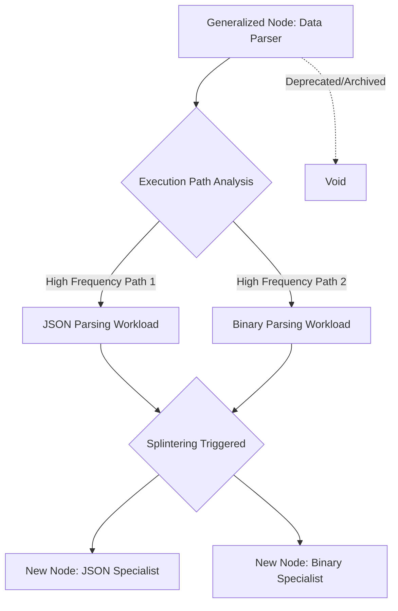

# Graphite-Git Document 30: Skill Constellations - Dynamic Evolution and Synergies

## 1. Introduction to Dynamic Evolution

Document 29 mapped the static topology of the Skill Constellations. Document 30 thrusts us into the temporal dimension, exploring how these constellations are not fixed structures, but dynamic, evolving ecosystems. A capability matrix that cannot learn and adapt is obsolete the moment it is deployed. Graphite-Git's Skill Constellations are designed for continuous, autonomous evolution.

This document details the mechanisms of "Neuro-Plasticity" within the Graphite-Git architecture, explaining how skills mutate, how synergies are strengthened or pruned, and how the entire ecosystem learns collectively from the actions of individual nodes across the global network.

## 2. Neuro-Plasticity in Software Architecture

In biological systems, neuroplasticity is the brain's ability to reorganize itself by forming new neural connections throughout life. Graphite-Git applies this concept directly to its capability matrix. The connections (synergies) between Skill Nodes are not hardcoded; they are fluid, weighted paths that change based on utility and success.

### 2.1 The Hebbian Learning Protocol
Graphite-Git employs a software equivalent of Hebbian theory: "Nodes that fire together, wire together." 

Every time two Skill Nodes successfully collaborate to solve a problem, the synergy pathway between them is mathematically strengthened. This is represented as a weighting coefficient on the Synergy Bus. 

For example, if the `AST_Cartographer` and the `Vulnerability_Scanner` frequently combine to successfully identify a specific type of injection flaw, their synergy weight increases. The next time the `AST_Cartographer` publishes a token, the `Vulnerability_Scanner` will receive it with higher priority and process it with lower latency.

### 2.2 Synaptic Pruning
Conversely, if a synergy pathway is rarely used, or if the collaboration frequently results in errors or user rejection (e.g., the user constantly rejects the automated refactoring suggestions produced by a specific node combination), the pathway is pruned. The weighting coefficient drops until the connection is effectively severed.

This ensures that the constellation does not become bloated with inefficient or counterproductive synergies, maintaining a highly optimized capability matrix.

## 3. Skill Mutation and The Crucible of Usage

Skills themselves are not static. While the Tool Forge creates skills, the environment in which they operate mutates them.

### 3.1 Parameter Drift and Optimization
Every Skill Node has internal parameters (e.g., the threshold for triggering an alert, the depth of an AST search). As a skill operates within a specific repository, it utilizes Reinforcement Learning to gently adjust these parameters.

If a `Linter_Node` frequently flags a specific stylistic choice that the human developers always ignore or override, the node will autonomously adjust its parameter drift to stop flagging that specific style within that specific repository. The skill mutates to align with the culture of the codebase.

### 3.2 The Splintering Mechanism
When a highly complex Skill Node is consistently used for two distinct, diverging purposes, it undergoes a "Splintering" event. 

Imagine a generalized `Data_Parser` node. In a large repository, it is used heavily to parse JSON configs, but also heavily used to parse proprietary binary formats. The system detects this divergence in execution paths. The generalized node is autonomously splintered into two highly specialized nodes: `Data_Parser_JSON_Optimized` and `Data_Parser_Binary_Optimized`. 

These new nodes are hyper-efficient at their specific tasks, replacing the bloated generalist node.

## 4. Global Constellation Synchronization (The Collective Unconscious)

While evolution occurs locally on edge nodes (as per Docs 27/28), the true power of Graphite-Git is realized when these localized evolutions are synchronized globally. This forms the "Collective Unconscious" of the Graphite-Git network.

### 4.1 The Anonymized Evolutionary Vector
When an edge node successfully mutates a skill or discovers a highly efficient new synergy pathway, it does not keep this discovery to itself. It compresses the mathematical representation of this evolution into an "Anonymized Evolutionary Vector."

This vector contains no source code, no proprietary data, and no identifying information. It only contains the abstract logic of the evolution: "Increasing the synergy weight between Node Type A and Node Type B by a factor of 1.2 yields a 15% performance increase in resolving merge conflicts."

### 4.2 The Global Broadcast and Integration
These Evolutionary Vectors are broadcast to the central Graphite-Git orchestrator, which acts as the clearinghouse for global intelligence. The orchestrator analyzes millions of these vectors. If a specific evolution proves successful across thousands of disparate edge nodes, the orchestrator ratifies it as a "Global Truth."

The next time any edge node connects to the network, it receives a silent update to its Base-State Hologram. Its local constellations are instantly updated with the new, optimized synergy weights and mutated skill parameters. Every developer in the ecosystem instantly benefits from the collective learning of the entire network.

## 5. Advanced Synergies: The "Gestalt" Phenomenon

As the Skill Constellations evolve and intertwine, they occasionally produce results that are greater than the sum of their parts. In the Graphite-Git nomenclature, this is known as a Gestalt Event.

### 5.1 Emergent Capabilities
A Gestalt Event occurs when a chain of skills produces an emergent capability that none of the individual skills were designed to perform. 

For instance, a `Commit_Analyzer` node (designed to read git history), a `Dependency_Mapper` node (designed to track library versions), and an `Issue_Tracker_Interface` node might dynamically synergize. Through Hebbian learning and parameter drift, this specific chain might suddenly gain the emergent capability to perfectly predict *when* a specific dependency will introduce a breaking change based on the historical commit patterns of the open-source maintainers of that dependency.

No single node was programmed to predict the future, but the gestalt entity formed by their synergy achieved predictive capability.

### 5.2 Harnessing the Gestalt
When a Gestalt Event is detected, the system immediately attempts to formalize it. The Tool Forge intercepts the synergy chain and synthesizes a new, dedicated 4D Skill Node that permanently encapsulates the emergent capability. This transforms fleeting, serendipitous intelligence into a hardened, repeatable tool available to the entire network.

## 6. The Immune System of the Constellation

Evolution is messy, and not all mutations are beneficial. A system this dynamic must have mechanisms to protect against maladaptive evolution.

### 6.1 The Regression Sentinel
A specialized meta-constellation exists solely to monitor the performance of other constellations. This is the Regression Sentinel. If an evolved synergy pathway results in increased CPU usage, higher latency, or lower accuracy in task resolution, the Regression Sentinel immediately intervenes.

It forces a rollback of the specific parameter drift or synergy weight that caused the regression, effectively healing the constellation by reverting it to a known-good state.

### 6.2 The Echo Chamber Deflector
In machine learning systems, there is a risk of a feedback loop where an agent learns an incorrect behavior and reinforces it continuously (an echo chamber). Graphite-Git deflects this by occasionally injecting randomized, low-weight tokens into the Synergy Bus. 

This forces the constellations to temporarily break their optimized pathways and attempt novel solutions to routine problems. Most of the time, the novel solution is rejected, but occasionally, it breaks an echo chamber and discovers a massive optimization that the deterministic algorithms had overlooked.

## 7. Conclusion: The Ever-Forging Ecosystem

The dynamic evolution of Skill Constellations means that Graphite-Git is never a finished product. It is an ecosystem that learns from every line of code written, every bug fixed, and every pull request merged across the globe. By embracing Neuro-Plasticity, Splintering, and Gestalt Events, Graphite-Git transcends the definition of a tool. It becomes a hyper-evolving collaborator, constantly reshaping its own intellectual architecture to serve the developer with increasingly mythic capability.
