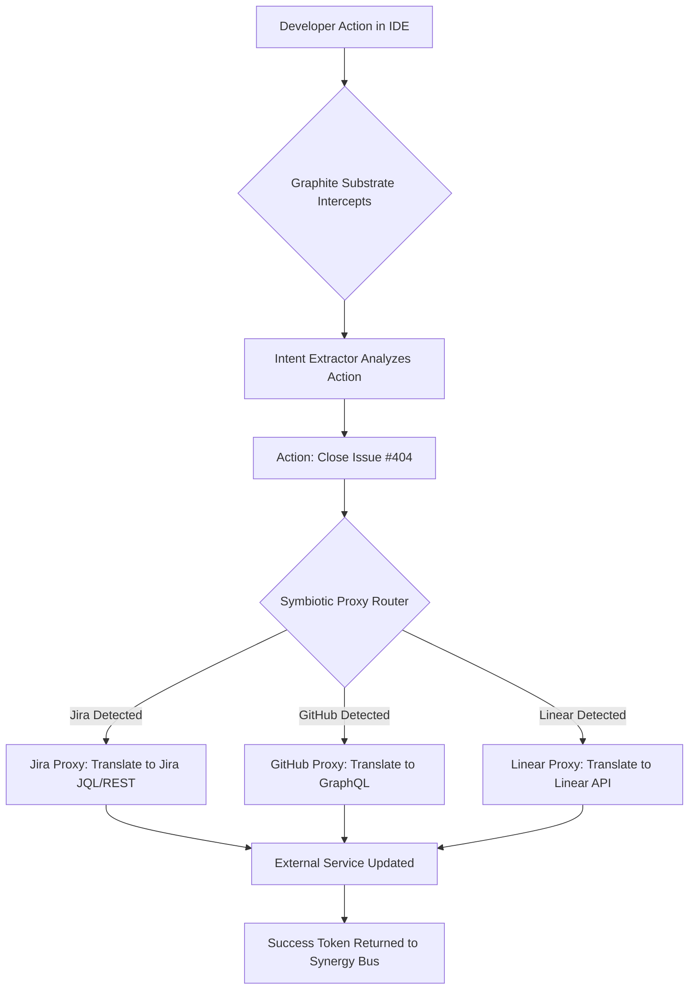

# Graphite-Git Document 31: Cross-Platform Native Integrations - Breaking the Boundaries

## 1. Introduction to Boundary Destruction

The traditional model of a software tool is a walled garden. A version control system manages versions; an IDE edits code; an issue tracker tracks issues. Integrations between these tools are usually superficial—clunky webhooks or brittle REST APIs that snap under pressure. Document 31 introduces the Graphite-Git philosophy of Cross-Platform Native Integrations. We do not build bridges between walled gardens; we annihilate the walls entirely.

Graphite-Git’s Mythic Plan dictates that the ecosystem must not be a distinct destination that a developer "visits." Instead, it must be the very atmosphere in which the developer operates, seamlessly permeating every OS, every IDE, and every external service. This document details the architectural strategies used to break these boundaries, achieving truly native, deep-level integration.

## 2. The Illusion of the Tool Chain

The "tool chain" is a concept born of necessity in a fragmented ecosystem. Developers chain disparate tools together to create a workflow. Graphite-Git views the tool chain as an anti-pattern. Every link in a chain is a point of friction, a context switch, and a potential failure.

### 2.1 Deep-Native Insertion
To shatter the tool chain, Graphite-Git employs Deep-Native Insertion. It does not wait for a tool to call its API; it injects itself into the core execution loop of the host platform. 

For example, when integrating with a modern IDE (like VS Code or JetBrains), Graphite-Git does not simply install a plugin that adds a sidebar. It intercepts the IDE’s internal file system watchers, AST parsers, and language server protocols (LSP). The IDE believes it is performing standard operations, but the underlying execution is being augmented, monitored, and optimized by the local Sovereign Agents (as detailed in Docs 27/28) in real-time.

### 2.2 The OS-Level Substrate
The deepest level of integration occurs at the operating system level. Graphite-Git deploys a hyper-lightweight kernel module (or equivalent user-space daemon, depending on OS constraints) known as the "Graphite Substrate."

The Substrate monitors file I/O, network sockets, and process execution specifically related to the repository path. If a developer uses a standard terminal command like `sed` or `grep` to modify a file within a Graphite-Git repository, the Substrate intercepts the command, analyzes its intent, and instantaneously updates the Ephemeral Ledger, ensuring that the multi-agent swarm is aware of the change even though the user bypassed the official Graphite-Git CLI.

## 3. Architecture of Native Harmonization

Achieving this level of deep integration without destabilizing the host system requires an architecture built on absolute safety and minimal interference.

### 3.1 The Symbiotic Proxy Protocol
Graphite-Git utilizes a Symbiotic Proxy Protocol for interacting with external services. Instead of building brittle, hard-coded integrations for Jira, Slack, AWS, etc., it creates intelligent proxies that sit between the developer's environment and the external service's API.

These proxies do not just forward JSON payloads. They translate intent. 

If a developer writes a comment in their code: `// TODO: Fix connection timeout -> Link to Jira-899`, the Graphite Substrate detects this. The Symbiotic Proxy intercepts the save action, understands the intent, securely authenticates with Jira, moves ticket Jira-899 to "In Progress," and links the specific commit hash to the ticket—all without the developer ever leaving the IDE.

### 3.2 Dynamic API Transmutation
External APIs change constantly, breaking traditional integrations. Graphite-Git solves this using Dynamic API Transmutation.

The Skill Constellations (Docs 29/30) continuously monitor the API documentation and schema definitions of major platforms. If an external service deprecates an endpoint, the Linguistic Constellation detects this change. The Tool Forge immediately synthesizes an adapter—a Transmutation Layer—that translates Graphite-Git's standard outgoing requests into the new API format on the fly. The integration never breaks; it autonomously heals itself.

## 4. The IDE as a Holographic Projection

In the Graphite-Git paradigm, the Integrated Development Environment (IDE) is no longer the center of the developer's universe. It is merely a holographic projection—a UI layer that visualizes the actions of the underlying agent swarm.

### 4.1 The Phantom Language Server
Traditional Language Servers (LSP) provide autocomplete and syntax highlighting based on static analysis. Graphite-Git deploys a "Phantom Language Server" that wraps the host IDE's LSP.

The Phantom LSP does not just analyze syntax; it injects the collective intelligence of the Skill Constellations directly into the editor. When a developer types a function definition, the Phantom LSP consults the `Performance_Profiler` and the `Vulnerability_Scanner` nodes in the background. The autocomplete suggestions provided are not just syntactically correct; they are the most secure and performant implementations possible, vetted against the entire repository context in milliseconds.

### 4.2 UI/UX Transmutation
The Substrate can directly manipulate the UI of the host IDE. If a severe, zero-day vulnerability is detected in the specific file the developer is viewing, Graphite-Git does not simply output a log to the terminal. It alters the IDE's syntax highlighting theme in real-time, casting the vulnerable block of code in a pulsing crimson hue, and projecting a transient, interactive diagnostic panel directly over the text editor.

## 5. Ecosystem Immersion: CI/CD and Cloud Integrations

The boundaries must also be broken in the deployment pipelines and cloud infrastructure.

### 5.1 The CI/CD Singularity
Graphite-Git views traditional CI/CD pipelines (Jenkins, GitHub Actions) as overly rigid. We introduce the concept of the CI/CD Singularity.

Instead of writing static YAML files to define a pipeline, the user defines a deployment *intent*. Graphite-Git injects Sovereign Agents directly into the cloud provider's runner environment. These agents dynamically construct the pipeline on the fly. If tests fail because a specific database container didn't start fast enough, the agent doesn't just fail the build; it autonomously rewrites the test execution order, implements an exponential backoff retry logic, and reruns the pipeline, all within the same execution context.

### 5.2 Infrastructure as Intent (IaI)
Moving beyond Infrastructure as Code (IaC), Graphite-Git introduces Infrastructure as Intent. Through Deep-Native Integration with AWS, GCP, and Azure via the Symbiotic Proxies, the repository becomes self-hosting.

If a developer merges a feature that introduces a heavy machine learning model, the `Architect_Constellation` detects the increased computational requirement. It uses the Symbiotic Proxy to communicate with AWS, autonomously provisions the necessary GPU instances, configures the load balancer, and updates the deployment target—all without a single line of Terraform being written by the human developer.

## 6. The Zero-Friction Horizon

The ultimate goal of Cross-Platform Native Integrations is the Zero-Friction Horizon. This is the point where the developer is no longer aware of the boundaries between their local OS, their IDE, the version control system, the issue tracker, and the cloud infrastructure. 

It becomes a single, unified, hyper-intelligent continuum. The developer focuses entirely on pure logical creation, while the Graphite-Git ecosystem acts as the omni-present connective tissue, flawlessly executing the mundane, the complex, and the operational tasks across every platform simultaneously.

## 7. Conclusion: The Omnipresent Ecosystem

To break boundaries, one must stop recognizing them. By utilizing Deep-Native Insertion, Symbiotic Proxies, and the Phantom Language Server, Graphite-Git ceases to be a distinct application. It becomes an omnipresent layer of intelligence that permeates the entire digital workspace. It translates intent across platforms, heals broken APIs, and transforms the IDE into a window looking out onto the vast, orchestrated power of the Mythic Plan.
