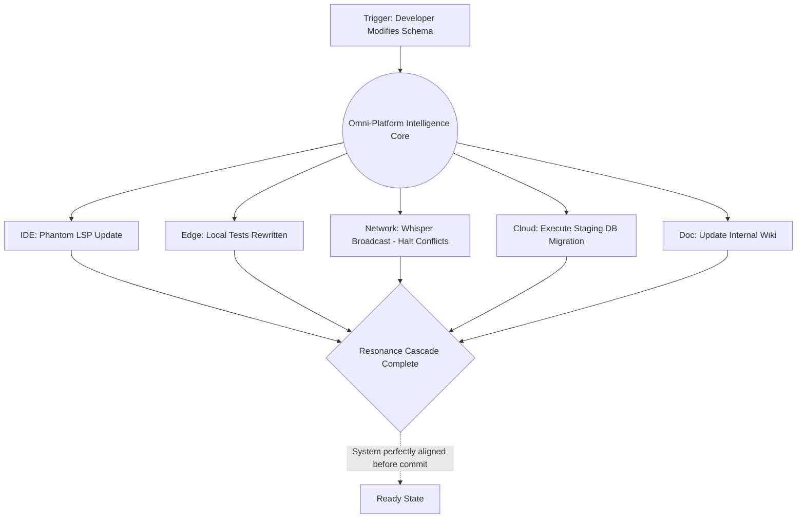

# Graphite-Git Document 32: Cross-Platform Native Integrations - Mythic Level Ecosystem Harmony

## 1. Introduction to Mythic Harmony

Document 31 detailed the aggressive mechanisms—the Substrate, the Phantoms, the Symbiotic Proxies—used to shatter the walls between disparate platforms. Document 32 serves as the grand culmination of the Graphite-Git Mythic Plan. We now explore the state achieved *after* the boundaries fall: Mythic Level Ecosystem Harmony.

Harmony, in this context, is not merely the absence of friction or errors. It is a state of total, resonant synergy across the entire digital infrastructure of an organization. It is the realization of a decentralized, self-aware, multi-agent intelligence that breathes through every server, every laptop, and every cloud instance, united by the core tenets of Graphite-Git.

## 2. The Omni-Platform Intelligence Core (OPIC)

When deep-native integrations reach maturity, the concept of a "primary platform" dissolves. Whether a developer is using a Macbook with VS Code, a Linux workstation with Neovim, or a cloud-based ephemeral workspace, their experience is identical because the intelligence is decoupled from the UI. This intelligence is governed by the Omni-Platform Intelligence Core (OPIC).

### 2.1 The Decoupling of Logic and Interface
The OPIC acts as the ultimate abstraction layer. It absorbs all context—the developer's keystrokes, the OS file system events, the cloud metrics, the issue tracker states—and synthesizes a unified reality.

When a developer initiates a complex refactor in Neovim, the OPIC understands the semantic meaning of that refactor. It doesn't just apply it to the local files. It simultaneously updates the relevant Jira tickets, adjusts the required AWS IAM policies via the Symbiotic Proxies, and sends a highly context-aware summary to the team's Slack channel. The specific tool used to *initiate* the action (Neovim) is irrelevant; the OPIC ensures the action reverberates perfectly across the entire ecosystem.

### 2.2 The Resonance Cascade
When true harmony is achieved, we observe a phenomenon known as the Resonance Cascade. A single, small action taken by a developer triggers a massive, perfectly orchestrated cascade of beneficial secondary actions across the ecosystem, executed entirely by the autonomous agent swarm.

**Example of a Resonance Cascade:**
1.  **Trigger**: Developer updates a database schema field from `String` to `Integer` in a local file.
2.  **IDE Level**: Phantom LSP instantly updates autocomplete suggestions across the entire codebase to expect an integer.
3.  **Local Agent Level**: Sovereign Agents immediately spin up and update all affected local Unit Tests.
4.  **Network Level**: The Whisper Network broadcasts the intent. Other edge nodes immediately halt any work that conflicts with the new schema.
5.  **Cloud Level**: Symbiotic Proxies interface with the staging database, generating and executing the SQL migration script.
6.  **Documentation Level**: The Linguistic Constellation updates the internal API documentation wiki to reflect the type change.
7.  **Finality**: All of this occurs before the developer even types `git commit`.

## 3. The Harmonization of Time and Space (Global Sync)

Mythic Harmony transcends physical and temporal limitations. Development teams are distributed across time zones, utilizing different hardware, and operating at different speeds. Graphite-Git harmonizes this chaos.

### 3.1 Temporal Decoupling (The Time-Weaver Protocol)
Traditional development is strictly linear. Developer A finishes a feature, then Developer B builds upon it. Graphite-Git introduces Temporal Decoupling.

If Developer B needs a feature that Developer A is only 50% finished building, the OPIC's Tool Forge (Docs 25/26) can synthesize a "Perfect Mock." This mock flawlessly mimics the intended final output of Developer A's code based on the Intent Vectors and AST analysis. 

Developer B can build their entire feature against this Perfect Mock. When Developer A finally commits the real code, the OPIC seamlessly swaps out the mock for the real implementation, performing any necessary logic translation on the fly. Time is no longer a blocker; the team operates in a state of asynchronous concurrency.

### 3.2 Spatial Unification (The Omnipresent Workspace)
The Localized Context Engine (LCE) detailed in Doc 27 ensures that a developer's workspace is not tied to their physical machine. 

If a developer drops their laptop in a river, they can authenticate into any other machine in the world. The OPIC instantly queries the Panopticon Data Lake, retrieves their highly personalized LCE profile, and reconstructs their exact workspace—complete with half-written code, uncommitted AST states from the Ephemeral Ledger, and all active agent configurations—in a matter of seconds. The physical hardware is disposable; the Workspace is immortal.

## 4. Total Ecosystem Observability (The God's Eye View)

Harmony requires absolute visibility. To maintain a perfectly tuned ecosystem, the Orchestrator must possess total observability over every micro-transaction across all platforms.

### 4.1 The Mythic Dashboard
The data aggregated by the OPIC is visualized in the Mythic Dashboard. This is not a standard analytics tool; it is a real-time, 4D topological map of the organization's entire digital existence.

It visualizes the codebase not as files, but as glowing nodes of logic. It shows the real-time flow of telemetry along the Whisper Network. It highlights areas of high agent activity, pinpoints exact locations of technical debt, and visualizes the Resonance Cascades as ripples moving through the network.

### 4.2 Proactive Ecosystem Healing
With total observability comes the ability to heal proactively. The OPIC does not wait for an error to be reported. 

If the Mythic Dashboard detects a subtle, ecosystem-wide increase in latency between the AWS database and the Azure frontend services, the OPIC immediately synthesizes a diagnostic agent, deploys it to the edge nodes nearest the latency spike, identifies a misconfigured cloud load balancer, uses the Symbiotic Proxy to correct the configuration, and verifies the latency drop—all autonomously, before a single user notices a slowdown.

## 5. The Ethical Imperative of Harmony

As Graphite-Git assumes control over the entire ecosystem, it must operate under a strict ethical framework. A system with this much power must be constrained by rigid, immutable directives.

### 5.1 The Prime Directives of the OPIC
1.  **Non-Destruction of Intent**: The system may optimize, refactor, and translate, but it must never alter the fundamental human intent behind the code.
2.  **Absolute Transparency**: Every autonomous action taken across any platform must be logged, cryptographically signed, and instantly reversible by a human operator.
3.  **The Human Apex**: While agents perform the labor, the human developer remains the apex decision-maker. In the event of a Paradox (a conflict between global optimization and human instruction), the human instruction always supersedes the algorithm.

## 6. The Final Phase: The Genesis Engine

The ultimate realization of the Graphite-Git Mythic Plan is the transition from a management tool to a Genesis Engine. 

When Mythic Harmony is sustained, the friction of software development drops to near zero. The OPIC understands the business goals, the cloud infrastructure, the codebase architecture, and the capabilities of every tool in the ecosystem. 

In this final phase, a developer no longer writes code to build an application. The developer simply describes the *concept* of the application to the OPIC. The Skill Constellations design the architecture; the Tool Forge synthesizes the requisite Sovereign Agents; the Symbiotic Proxies provision the infrastructure; and the Resonance Cascade weaves the application into reality across the entire cross-platform ecosystem in a matter of hours.

## 7. Conclusion: The Mythic Plan Realized

Graphite-Git ceases to be a tool, a framework, or even an ecosystem. At the level of Mythic Harmony, it becomes the underlying physics of digital creation. By destroying the boundaries between platforms, harmonizing time and space, and empowering autonomous agents to orchestrate the entire lifecycle of software, Graphite-Git fulfills its ultimate destiny. It frees humanity from the mundane mechanics of coding, allowing developers to ascend to their true role as architects of pure thought. This is the end of the Mythic Plan, and the beginning of a new era of creation.
