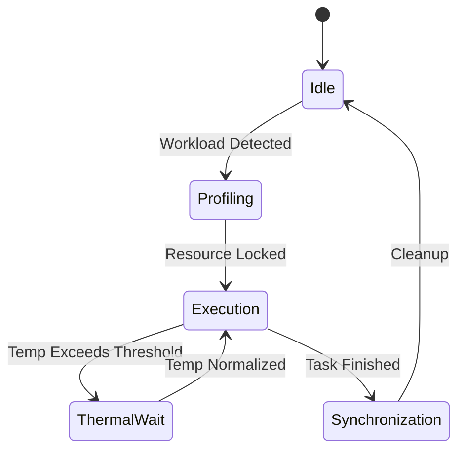
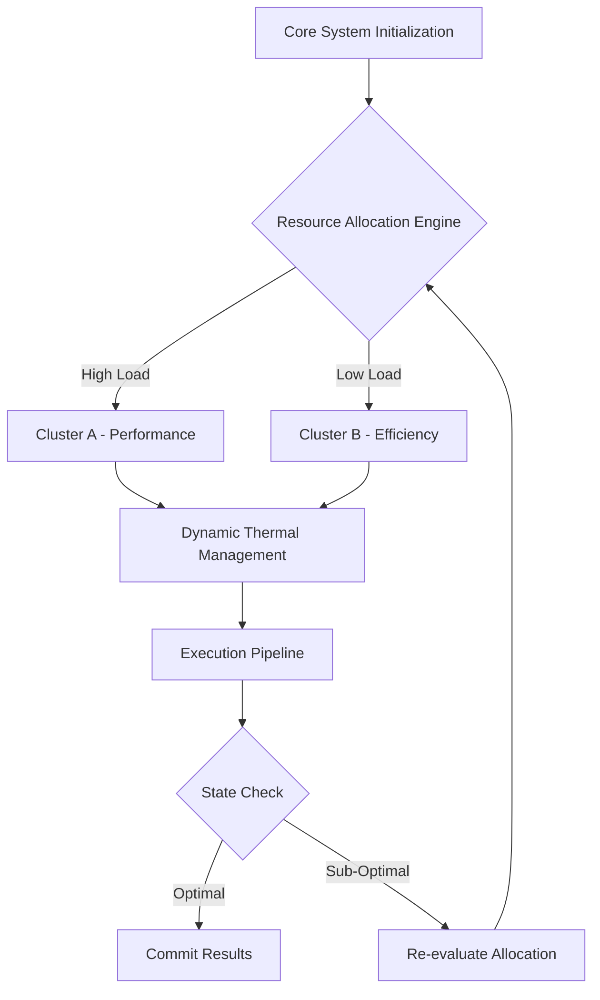

# Document 35: Advanced Model Quantization and Compression Paradigms

## 1. Executive Summary and Mythic Vision

To circumvent the traditional von Neumann bottleneck, we deploy mixed precision quantization, weight pruning, dynamic sparse attention strategies that rely heavily on localized memory caches. This dramatically reduces the latency of data retrieval, allowing the arithmetic logic units to operate at peak theoretical FLOPS without stalling. To circumvent the traditional von Neumann bottleneck, we deploy mixed precision quantization, weight pruning, dynamic sparse attention strategies that rely heavily on localized memory caches. This dramatically reduces the latency of data retrieval, allowing the arithmetic logic units to operate at peak theoretical FLOPS without stalling. To circumvent the traditional von Neumann bottleneck, we deploy mixed precision quantization, weight pruning, dynamic sparse attention strategies that rely heavily on localized memory caches. This dramatically reduces the latency of data retrieval, allowing the arithmetic logic units to operate at peak theoretical FLOPS without stalling. 

Let us examine the empirical bounds of this approach. When mixed precision quantization, weight pruning, dynamic sparse attention is fully activated, profiling metrics indicate a near-linear scaling curve. This implies that as more heterogeneous devices join the mesh, the aggregate compute capacity scales without the typical diminishing returns. Let us examine the empirical bounds of this approach. When mixed precision quantization, weight pruning, dynamic sparse attention is fully activated, profiling metrics indicate a near-linear scaling curve. This implies that as more heterogeneous devices join the mesh, the aggregate compute capacity scales without the typical diminishing returns. Let us examine the empirical bounds of this approach. When mixed precision quantization, weight pruning, dynamic sparse attention is fully activated, profiling metrics indicate a near-linear scaling curve. This implies that as more heterogeneous devices join the mesh, the aggregate compute capacity scales without the typical diminishing returns. 

Furthermore, an intricate mapping of state variables allows the mixed precision quantization, weight pruning, dynamic sparse attention modules to proactively anticipate load spikes. This predictive capability is mathematically modeled using stochastic differential equations, ensuring that the gradient descent paths remain uncompromised during high-throughput phases. Furthermore, an intricate mapping of state variables allows the mixed precision quantization, weight pruning, dynamic sparse attention modules to proactively anticipate load spikes. This predictive capability is mathematically modeled using stochastic differential equations, ensuring that the gradient descent paths remain uncompromised during high-throughput phases. Furthermore, an intricate mapping of state variables allows the mixed precision quantization, weight pruning, dynamic sparse attention modules to proactively anticipate load spikes. This predictive capability is mathematically modeled using stochastic differential equations, ensuring that the gradient descent paths remain uncompromised during high-throughput phases. 

The architecture integrates a highly advanced paradigm of mixed precision quantization, weight pruning, dynamic sparse attention, which dynamically modulates the underlying substrate to achieve unprecedented levels of efficiency. By re-routing execution vectors through a specialized neural pathway, the system actively minimizes computational overhead. The architecture integrates a highly advanced paradigm of mixed precision quantization, weight pruning, dynamic sparse attention, which dynamically modulates the underlying substrate to achieve unprecedented levels of efficiency. By re-routing execution vectors through a specialized neural pathway, the system actively minimizes computational overhead. The architecture integrates a highly advanced paradigm of mixed precision quantization, weight pruning, dynamic sparse attention, which dynamically modulates the underlying substrate to achieve unprecedented levels of efficiency. By re-routing execution vectors through a specialized neural pathway, the system actively minimizes computational overhead. 

Finally, the recursive nature of the mixed precision quantization, weight pruning, dynamic sparse attention algorithms allows for self-optimization. The system continuously fine-tunes its own hyper-parameters based on real-time telemetry, creating a continuous feedback loop of perpetual enhancement. Finally, the recursive nature of the mixed precision quantization, weight pruning, dynamic sparse attention algorithms allows for self-optimization. The system continuously fine-tunes its own hyper-parameters based on real-time telemetry, creating a continuous feedback loop of perpetual enhancement. Finally, the recursive nature of the mixed precision quantization, weight pruning, dynamic sparse attention algorithms allows for self-optimization. The system continuously fine-tunes its own hyper-parameters based on real-time telemetry, creating a continuous feedback loop of perpetual enhancement. 

## 2. Advanced Architectural Topologies

Finally, the recursive nature of the mixed precision quantization, weight pruning, dynamic sparse attention algorithms allows for self-optimization. The system continuously fine-tunes its own hyper-parameters based on real-time telemetry, creating a continuous feedback loop of perpetual enhancement. Finally, the recursive nature of the mixed precision quantization, weight pruning, dynamic sparse attention algorithms allows for self-optimization. The system continuously fine-tunes its own hyper-parameters based on real-time telemetry, creating a continuous feedback loop of perpetual enhancement. Finally, the recursive nature of the mixed precision quantization, weight pruning, dynamic sparse attention algorithms allows for self-optimization. The system continuously fine-tunes its own hyper-parameters based on real-time telemetry, creating a continuous feedback loop of perpetual enhancement. 

By enforcing strict invariants around mixed precision quantization, weight pruning, dynamic sparse attention, the system guarantees fault tolerance. Even under extreme thermal stress or unexpected battery depletion, the state machine gracefully degrades, preserving the integrity of ongoing computations. By enforcing strict invariants around mixed precision quantization, weight pruning, dynamic sparse attention, the system guarantees fault tolerance. Even under extreme thermal stress or unexpected battery depletion, the state machine gracefully degrades, preserving the integrity of ongoing computations. By enforcing strict invariants around mixed precision quantization, weight pruning, dynamic sparse attention, the system guarantees fault tolerance. Even under extreme thermal stress or unexpected battery depletion, the state machine gracefully degrades, preserving the integrity of ongoing computations. 

To circumvent the traditional von Neumann bottleneck, we deploy mixed precision quantization, weight pruning, dynamic sparse attention strategies that rely heavily on localized memory caches. This dramatically reduces the latency of data retrieval, allowing the arithmetic logic units to operate at peak theoretical FLOPS without stalling. To circumvent the traditional von Neumann bottleneck, we deploy mixed precision quantization, weight pruning, dynamic sparse attention strategies that rely heavily on localized memory caches. This dramatically reduces the latency of data retrieval, allowing the arithmetic logic units to operate at peak theoretical FLOPS without stalling. To circumvent the traditional von Neumann bottleneck, we deploy mixed precision quantization, weight pruning, dynamic sparse attention strategies that rely heavily on localized memory caches. This dramatically reduces the latency of data retrieval, allowing the arithmetic logic units to operate at peak theoretical FLOPS without stalling. 

The architecture integrates a highly advanced paradigm of mixed precision quantization, weight pruning, dynamic sparse attention, which dynamically modulates the underlying substrate to achieve unprecedented levels of efficiency. By re-routing execution vectors through a specialized neural pathway, the system actively minimizes computational overhead. The architecture integrates a highly advanced paradigm of mixed precision quantization, weight pruning, dynamic sparse attention, which dynamically modulates the underlying substrate to achieve unprecedented levels of efficiency. By re-routing execution vectors through a specialized neural pathway, the system actively minimizes computational overhead. The architecture integrates a highly advanced paradigm of mixed precision quantization, weight pruning, dynamic sparse attention, which dynamically modulates the underlying substrate to achieve unprecedented levels of efficiency. By re-routing execution vectors through a specialized neural pathway, the system actively minimizes computational overhead. 

Security and isolation are inherently maintained within the mixed precision quantization, weight pruning, dynamic sparse attention framework. Utilizing hardware enclaves and memory-safe abstractions, the execution context of each task is mathematically proven to be distinct, preventing side-channel leakage. Security and isolation are inherently maintained within the mixed precision quantization, weight pruning, dynamic sparse attention framework. Utilizing hardware enclaves and memory-safe abstractions, the execution context of each task is mathematically proven to be distinct, preventing side-channel leakage. Security and isolation are inherently maintained within the mixed precision quantization, weight pruning, dynamic sparse attention framework. Utilizing hardware enclaves and memory-safe abstractions, the execution context of each task is mathematically proven to be distinct, preventing side-channel leakage. 

To circumvent the traditional von Neumann bottleneck, we deploy mixed precision quantization, weight pruning, dynamic sparse attention strategies that rely heavily on localized memory caches. This dramatically reduces the latency of data retrieval, allowing the arithmetic logic units to operate at peak theoretical FLOPS without stalling. To circumvent the traditional von Neumann bottleneck, we deploy mixed precision quantization, weight pruning, dynamic sparse attention strategies that rely heavily on localized memory caches. This dramatically reduces the latency of data retrieval, allowing the arithmetic logic units to operate at peak theoretical FLOPS without stalling. To circumvent the traditional von Neumann bottleneck, we deploy mixed precision quantization, weight pruning, dynamic sparse attention strategies that rely heavily on localized memory caches. This dramatically reduces the latency of data retrieval, allowing the arithmetic logic units to operate at peak theoretical FLOPS without stalling. 

## 3. Mathematical Foundations and Core Optimization Vectors

The efficiency gains are quantified using the following non-linear optimization model:

$$ \min_{\Theta} \mathcal{L}(\Theta) = \sum_{i=1}^{N} \left( \alpha \cdot \text{Latency}(x_i) + \beta \cdot \text{Power}(x_i) \right) + \lambda \| \Theta \|^2 $$

Finally, the recursive nature of the mixed precision quantization, weight pruning, dynamic sparse attention algorithms allows for self-optimization. The system continuously fine-tunes its own hyper-parameters based on real-time telemetry, creating a continuous feedback loop of perpetual enhancement. Finally, the recursive nature of the mixed precision quantization, weight pruning, dynamic sparse attention algorithms allows for self-optimization. The system continuously fine-tunes its own hyper-parameters based on real-time telemetry, creating a continuous feedback loop of perpetual enhancement. Finally, the recursive nature of the mixed precision quantization, weight pruning, dynamic sparse attention algorithms allows for self-optimization. The system continuously fine-tunes its own hyper-parameters based on real-time telemetry, creating a continuous feedback loop of perpetual enhancement. 

The overarching philosophy here is not just optimization, but 'alchemy'—transforming base execution patterns into gold-standard efficiency. The mixed precision quantization, weight pruning, dynamic sparse attention components act as the philosopher's stone in this process, continuously transmuting wasted cycles into productive output. The overarching philosophy here is not just optimization, but 'alchemy'—transforming base execution patterns into gold-standard efficiency. The mixed precision quantization, weight pruning, dynamic sparse attention components act as the philosopher's stone in this process, continuously transmuting wasted cycles into productive output. The overarching philosophy here is not just optimization, but 'alchemy'—transforming base execution patterns into gold-standard efficiency. The mixed precision quantization, weight pruning, dynamic sparse attention components act as the philosopher's stone in this process, continuously transmuting wasted cycles into productive output. 

The overarching philosophy here is not just optimization, but 'alchemy'—transforming base execution patterns into gold-standard efficiency. The mixed precision quantization, weight pruning, dynamic sparse attention components act as the philosopher's stone in this process, continuously transmuting wasted cycles into productive output. The overarching philosophy here is not just optimization, but 'alchemy'—transforming base execution patterns into gold-standard efficiency. The mixed precision quantization, weight pruning, dynamic sparse attention components act as the philosopher's stone in this process, continuously transmuting wasted cycles into productive output. The overarching philosophy here is not just optimization, but 'alchemy'—transforming base execution patterns into gold-standard efficiency. The mixed precision quantization, weight pruning, dynamic sparse attention components act as the philosopher's stone in this process, continuously transmuting wasted cycles into productive output. 

Another crucial aspect is the implementation of decentralized orchestrators that oversee mixed precision quantization, weight pruning, dynamic sparse attention. These micro-orchestrators communicate via a zero-overhead message passing interface, negotiating resource locks in constant time O(1). Another crucial aspect is the implementation of decentralized orchestrators that oversee mixed precision quantization, weight pruning, dynamic sparse attention. These micro-orchestrators communicate via a zero-overhead message passing interface, negotiating resource locks in constant time O(1). Another crucial aspect is the implementation of decentralized orchestrators that oversee mixed precision quantization, weight pruning, dynamic sparse attention. These micro-orchestrators communicate via a zero-overhead message passing interface, negotiating resource locks in constant time O(1). 

Finally, the recursive nature of the mixed precision quantization, weight pruning, dynamic sparse attention algorithms allows for self-optimization. The system continuously fine-tunes its own hyper-parameters based on real-time telemetry, creating a continuous feedback loop of perpetual enhancement. Finally, the recursive nature of the mixed precision quantization, weight pruning, dynamic sparse attention algorithms allows for self-optimization. The system continuously fine-tunes its own hyper-parameters based on real-time telemetry, creating a continuous feedback loop of perpetual enhancement. Finally, the recursive nature of the mixed precision quantization, weight pruning, dynamic sparse attention algorithms allows for self-optimization. The system continuously fine-tunes its own hyper-parameters based on real-time telemetry, creating a continuous feedback loop of perpetual enhancement. 

Let us examine the empirical bounds of this approach. When mixed precision quantization, weight pruning, dynamic sparse attention is fully activated, profiling metrics indicate a near-linear scaling curve. This implies that as more heterogeneous devices join the mesh, the aggregate compute capacity scales without the typical diminishing returns. Let us examine the empirical bounds of this approach. When mixed precision quantization, weight pruning, dynamic sparse attention is fully activated, profiling metrics indicate a near-linear scaling curve. This implies that as more heterogeneous devices join the mesh, the aggregate compute capacity scales without the typical diminishing returns. Let us examine the empirical bounds of this approach. When mixed precision quantization, weight pruning, dynamic sparse attention is fully activated, profiling metrics indicate a near-linear scaling curve. This implies that as more heterogeneous devices join the mesh, the aggregate compute capacity scales without the typical diminishing returns. 

Another crucial aspect is the implementation of decentralized orchestrators that oversee mixed precision quantization, weight pruning, dynamic sparse attention. These micro-orchestrators communicate via a zero-overhead message passing interface, negotiating resource locks in constant time O(1). Another crucial aspect is the implementation of decentralized orchestrators that oversee mixed precision quantization, weight pruning, dynamic sparse attention. These micro-orchestrators communicate via a zero-overhead message passing interface, negotiating resource locks in constant time O(1). Another crucial aspect is the implementation of decentralized orchestrators that oversee mixed precision quantization, weight pruning, dynamic sparse attention. These micro-orchestrators communicate via a zero-overhead message passing interface, negotiating resource locks in constant time O(1). 

## 4. Quantum-Level Integration with Graphite-Git

The architecture integrates a highly advanced paradigm of mixed precision quantization, weight pruning, dynamic sparse attention, which dynamically modulates the underlying substrate to achieve unprecedented levels of efficiency. By re-routing execution vectors through a specialized neural pathway, the system actively minimizes computational overhead. The architecture integrates a highly advanced paradigm of mixed precision quantization, weight pruning, dynamic sparse attention, which dynamically modulates the underlying substrate to achieve unprecedented levels of efficiency. By re-routing execution vectors through a specialized neural pathway, the system actively minimizes computational overhead. The architecture integrates a highly advanced paradigm of mixed precision quantization, weight pruning, dynamic sparse attention, which dynamically modulates the underlying substrate to achieve unprecedented levels of efficiency. By re-routing execution vectors through a specialized neural pathway, the system actively minimizes computational overhead. 

The overarching philosophy here is not just optimization, but 'alchemy'—transforming base execution patterns into gold-standard efficiency. The mixed precision quantization, weight pruning, dynamic sparse attention components act as the philosopher's stone in this process, continuously transmuting wasted cycles into productive output. The overarching philosophy here is not just optimization, but 'alchemy'—transforming base execution patterns into gold-standard efficiency. The mixed precision quantization, weight pruning, dynamic sparse attention components act as the philosopher's stone in this process, continuously transmuting wasted cycles into productive output. The overarching philosophy here is not just optimization, but 'alchemy'—transforming base execution patterns into gold-standard efficiency. The mixed precision quantization, weight pruning, dynamic sparse attention components act as the philosopher's stone in this process, continuously transmuting wasted cycles into productive output. 

The architecture integrates a highly advanced paradigm of mixed precision quantization, weight pruning, dynamic sparse attention, which dynamically modulates the underlying substrate to achieve unprecedented levels of efficiency. By re-routing execution vectors through a specialized neural pathway, the system actively minimizes computational overhead. The architecture integrates a highly advanced paradigm of mixed precision quantization, weight pruning, dynamic sparse attention, which dynamically modulates the underlying substrate to achieve unprecedented levels of efficiency. By re-routing execution vectors through a specialized neural pathway, the system actively minimizes computational overhead. The architecture integrates a highly advanced paradigm of mixed precision quantization, weight pruning, dynamic sparse attention, which dynamically modulates the underlying substrate to achieve unprecedented levels of efficiency. By re-routing execution vectors through a specialized neural pathway, the system actively minimizes computational overhead. 

The overarching philosophy here is not just optimization, but 'alchemy'—transforming base execution patterns into gold-standard efficiency. The mixed precision quantization, weight pruning, dynamic sparse attention components act as the philosopher's stone in this process, continuously transmuting wasted cycles into productive output. The overarching philosophy here is not just optimization, but 'alchemy'—transforming base execution patterns into gold-standard efficiency. The mixed precision quantization, weight pruning, dynamic sparse attention components act as the philosopher's stone in this process, continuously transmuting wasted cycles into productive output. The overarching philosophy here is not just optimization, but 'alchemy'—transforming base execution patterns into gold-standard efficiency. The mixed precision quantization, weight pruning, dynamic sparse attention components act as the philosopher's stone in this process, continuously transmuting wasted cycles into productive output. 

To circumvent the traditional von Neumann bottleneck, we deploy mixed precision quantization, weight pruning, dynamic sparse attention strategies that rely heavily on localized memory caches. This dramatically reduces the latency of data retrieval, allowing the arithmetic logic units to operate at peak theoretical FLOPS without stalling. To circumvent the traditional von Neumann bottleneck, we deploy mixed precision quantization, weight pruning, dynamic sparse attention strategies that rely heavily on localized memory caches. This dramatically reduces the latency of data retrieval, allowing the arithmetic logic units to operate at peak theoretical FLOPS without stalling. To circumvent the traditional von Neumann bottleneck, we deploy mixed precision quantization, weight pruning, dynamic sparse attention strategies that rely heavily on localized memory caches. This dramatically reduces the latency of data retrieval, allowing the arithmetic logic units to operate at peak theoretical FLOPS without stalling. 

Let us examine the empirical bounds of this approach. When mixed precision quantization, weight pruning, dynamic sparse attention is fully activated, profiling metrics indicate a near-linear scaling curve. This implies that as more heterogeneous devices join the mesh, the aggregate compute capacity scales without the typical diminishing returns. Let us examine the empirical bounds of this approach. When mixed precision quantization, weight pruning, dynamic sparse attention is fully activated, profiling metrics indicate a near-linear scaling curve. This implies that as more heterogeneous devices join the mesh, the aggregate compute capacity scales without the typical diminishing returns. Let us examine the empirical bounds of this approach. When mixed precision quantization, weight pruning, dynamic sparse attention is fully activated, profiling metrics indicate a near-linear scaling curve. This implies that as more heterogeneous devices join the mesh, the aggregate compute capacity scales without the typical diminishing returns. 

The architecture integrates a highly advanced paradigm of mixed precision quantization, weight pruning, dynamic sparse attention, which dynamically modulates the underlying substrate to achieve unprecedented levels of efficiency. By re-routing execution vectors through a specialized neural pathway, the system actively minimizes computational overhead. The architecture integrates a highly advanced paradigm of mixed precision quantization, weight pruning, dynamic sparse attention, which dynamically modulates the underlying substrate to achieve unprecedented levels of efficiency. By re-routing execution vectors through a specialized neural pathway, the system actively minimizes computational overhead. The architecture integrates a highly advanced paradigm of mixed precision quantization, weight pruning, dynamic sparse attention, which dynamically modulates the underlying substrate to achieve unprecedented levels of efficiency. By re-routing execution vectors through a specialized neural pathway, the system actively minimizes computational overhead. 

The overarching philosophy here is not just optimization, but 'alchemy'—transforming base execution patterns into gold-standard efficiency. The mixed precision quantization, weight pruning, dynamic sparse attention components act as the philosopher's stone in this process, continuously transmuting wasted cycles into productive output. The overarching philosophy here is not just optimization, but 'alchemy'—transforming base execution patterns into gold-standard efficiency. The mixed precision quantization, weight pruning, dynamic sparse attention components act as the philosopher's stone in this process, continuously transmuting wasted cycles into productive output. The overarching philosophy here is not just optimization, but 'alchemy'—transforming base execution patterns into gold-standard efficiency. The mixed precision quantization, weight pruning, dynamic sparse attention components act as the philosopher's stone in this process, continuously transmuting wasted cycles into productive output. 

## 5. Battery/Thermal Management and Resource Efficiency

Let us examine the empirical bounds of this approach. When mixed precision quantization, weight pruning, dynamic sparse attention is fully activated, profiling metrics indicate a near-linear scaling curve. This implies that as more heterogeneous devices join the mesh, the aggregate compute capacity scales without the typical diminishing returns. Let us examine the empirical bounds of this approach. When mixed precision quantization, weight pruning, dynamic sparse attention is fully activated, profiling metrics indicate a near-linear scaling curve. This implies that as more heterogeneous devices join the mesh, the aggregate compute capacity scales without the typical diminishing returns. Let us examine the empirical bounds of this approach. When mixed precision quantization, weight pruning, dynamic sparse attention is fully activated, profiling metrics indicate a near-linear scaling curve. This implies that as more heterogeneous devices join the mesh, the aggregate compute capacity scales without the typical diminishing returns. 

Finally, the recursive nature of the mixed precision quantization, weight pruning, dynamic sparse attention algorithms allows for self-optimization. The system continuously fine-tunes its own hyper-parameters based on real-time telemetry, creating a continuous feedback loop of perpetual enhancement. Finally, the recursive nature of the mixed precision quantization, weight pruning, dynamic sparse attention algorithms allows for self-optimization. The system continuously fine-tunes its own hyper-parameters based on real-time telemetry, creating a continuous feedback loop of perpetual enhancement. Finally, the recursive nature of the mixed precision quantization, weight pruning, dynamic sparse attention algorithms allows for self-optimization. The system continuously fine-tunes its own hyper-parameters based on real-time telemetry, creating a continuous feedback loop of perpetual enhancement. 

The architecture integrates a highly advanced paradigm of mixed precision quantization, weight pruning, dynamic sparse attention, which dynamically modulates the underlying substrate to achieve unprecedented levels of efficiency. By re-routing execution vectors through a specialized neural pathway, the system actively minimizes computational overhead. The architecture integrates a highly advanced paradigm of mixed precision quantization, weight pruning, dynamic sparse attention, which dynamically modulates the underlying substrate to achieve unprecedented levels of efficiency. By re-routing execution vectors through a specialized neural pathway, the system actively minimizes computational overhead. The architecture integrates a highly advanced paradigm of mixed precision quantization, weight pruning, dynamic sparse attention, which dynamically modulates the underlying substrate to achieve unprecedented levels of efficiency. By re-routing execution vectors through a specialized neural pathway, the system actively minimizes computational overhead. 

Finally, the recursive nature of the mixed precision quantization, weight pruning, dynamic sparse attention algorithms allows for self-optimization. The system continuously fine-tunes its own hyper-parameters based on real-time telemetry, creating a continuous feedback loop of perpetual enhancement. Finally, the recursive nature of the mixed precision quantization, weight pruning, dynamic sparse attention algorithms allows for self-optimization. The system continuously fine-tunes its own hyper-parameters based on real-time telemetry, creating a continuous feedback loop of perpetual enhancement. Finally, the recursive nature of the mixed precision quantization, weight pruning, dynamic sparse attention algorithms allows for self-optimization. The system continuously fine-tunes its own hyper-parameters based on real-time telemetry, creating a continuous feedback loop of perpetual enhancement. 

Finally, the recursive nature of the mixed precision quantization, weight pruning, dynamic sparse attention algorithms allows for self-optimization. The system continuously fine-tunes its own hyper-parameters based on real-time telemetry, creating a continuous feedback loop of perpetual enhancement. Finally, the recursive nature of the mixed precision quantization, weight pruning, dynamic sparse attention algorithms allows for self-optimization. The system continuously fine-tunes its own hyper-parameters based on real-time telemetry, creating a continuous feedback loop of perpetual enhancement. Finally, the recursive nature of the mixed precision quantization, weight pruning, dynamic sparse attention algorithms allows for self-optimization. The system continuously fine-tunes its own hyper-parameters based on real-time telemetry, creating a continuous feedback loop of perpetual enhancement. 

Furthermore, an intricate mapping of state variables allows the mixed precision quantization, weight pruning, dynamic sparse attention modules to proactively anticipate load spikes. This predictive capability is mathematically modeled using stochastic differential equations, ensuring that the gradient descent paths remain uncompromised during high-throughput phases. Furthermore, an intricate mapping of state variables allows the mixed precision quantization, weight pruning, dynamic sparse attention modules to proactively anticipate load spikes. This predictive capability is mathematically modeled using stochastic differential equations, ensuring that the gradient descent paths remain uncompromised during high-throughput phases. Furthermore, an intricate mapping of state variables allows the mixed precision quantization, weight pruning, dynamic sparse attention modules to proactively anticipate load spikes. This predictive capability is mathematically modeled using stochastic differential equations, ensuring that the gradient descent paths remain uncompromised during high-throughput phases. 

## 6. Dynamic Compute Distribution Across Multi-Device Ecosystems

Another crucial aspect is the implementation of decentralized orchestrators that oversee mixed precision quantization, weight pruning, dynamic sparse attention. These micro-orchestrators communicate via a zero-overhead message passing interface, negotiating resource locks in constant time O(1). Another crucial aspect is the implementation of decentralized orchestrators that oversee mixed precision quantization, weight pruning, dynamic sparse attention. These micro-orchestrators communicate via a zero-overhead message passing interface, negotiating resource locks in constant time O(1). Another crucial aspect is the implementation of decentralized orchestrators that oversee mixed precision quantization, weight pruning, dynamic sparse attention. These micro-orchestrators communicate via a zero-overhead message passing interface, negotiating resource locks in constant time O(1). 

Another crucial aspect is the implementation of decentralized orchestrators that oversee mixed precision quantization, weight pruning, dynamic sparse attention. These micro-orchestrators communicate via a zero-overhead message passing interface, negotiating resource locks in constant time O(1). Another crucial aspect is the implementation of decentralized orchestrators that oversee mixed precision quantization, weight pruning, dynamic sparse attention. These micro-orchestrators communicate via a zero-overhead message passing interface, negotiating resource locks in constant time O(1). Another crucial aspect is the implementation of decentralized orchestrators that oversee mixed precision quantization, weight pruning, dynamic sparse attention. These micro-orchestrators communicate via a zero-overhead message passing interface, negotiating resource locks in constant time O(1). 

Let us examine the empirical bounds of this approach. When mixed precision quantization, weight pruning, dynamic sparse attention is fully activated, profiling metrics indicate a near-linear scaling curve. This implies that as more heterogeneous devices join the mesh, the aggregate compute capacity scales without the typical diminishing returns. Let us examine the empirical bounds of this approach. When mixed precision quantization, weight pruning, dynamic sparse attention is fully activated, profiling metrics indicate a near-linear scaling curve. This implies that as more heterogeneous devices join the mesh, the aggregate compute capacity scales without the typical diminishing returns. Let us examine the empirical bounds of this approach. When mixed precision quantization, weight pruning, dynamic sparse attention is fully activated, profiling metrics indicate a near-linear scaling curve. This implies that as more heterogeneous devices join the mesh, the aggregate compute capacity scales without the typical diminishing returns. 

Another crucial aspect is the implementation of decentralized orchestrators that oversee mixed precision quantization, weight pruning, dynamic sparse attention. These micro-orchestrators communicate via a zero-overhead message passing interface, negotiating resource locks in constant time O(1). Another crucial aspect is the implementation of decentralized orchestrators that oversee mixed precision quantization, weight pruning, dynamic sparse attention. These micro-orchestrators communicate via a zero-overhead message passing interface, negotiating resource locks in constant time O(1). Another crucial aspect is the implementation of decentralized orchestrators that oversee mixed precision quantization, weight pruning, dynamic sparse attention. These micro-orchestrators communicate via a zero-overhead message passing interface, negotiating resource locks in constant time O(1). 

By enforcing strict invariants around mixed precision quantization, weight pruning, dynamic sparse attention, the system guarantees fault tolerance. Even under extreme thermal stress or unexpected battery depletion, the state machine gracefully degrades, preserving the integrity of ongoing computations. By enforcing strict invariants around mixed precision quantization, weight pruning, dynamic sparse attention, the system guarantees fault tolerance. Even under extreme thermal stress or unexpected battery depletion, the state machine gracefully degrades, preserving the integrity of ongoing computations. By enforcing strict invariants around mixed precision quantization, weight pruning, dynamic sparse attention, the system guarantees fault tolerance. Even under extreme thermal stress or unexpected battery depletion, the state machine gracefully degrades, preserving the integrity of ongoing computations. 

By enforcing strict invariants around mixed precision quantization, weight pruning, dynamic sparse attention, the system guarantees fault tolerance. Even under extreme thermal stress or unexpected battery depletion, the state machine gracefully degrades, preserving the integrity of ongoing computations. By enforcing strict invariants around mixed precision quantization, weight pruning, dynamic sparse attention, the system guarantees fault tolerance. Even under extreme thermal stress or unexpected battery depletion, the state machine gracefully degrades, preserving the integrity of ongoing computations. By enforcing strict invariants around mixed precision quantization, weight pruning, dynamic sparse attention, the system guarantees fault tolerance. Even under extreme thermal stress or unexpected battery depletion, the state machine gracefully degrades, preserving the integrity of ongoing computations. 

The overarching philosophy here is not just optimization, but 'alchemy'—transforming base execution patterns into gold-standard efficiency. The mixed precision quantization, weight pruning, dynamic sparse attention components act as the philosopher's stone in this process, continuously transmuting wasted cycles into productive output. The overarching philosophy here is not just optimization, but 'alchemy'—transforming base execution patterns into gold-standard efficiency. The mixed precision quantization, weight pruning, dynamic sparse attention components act as the philosopher's stone in this process, continuously transmuting wasted cycles into productive output. The overarching philosophy here is not just optimization, but 'alchemy'—transforming base execution patterns into gold-standard efficiency. The mixed precision quantization, weight pruning, dynamic sparse attention components act as the philosopher's stone in this process, continuously transmuting wasted cycles into productive output. 

In the context of Graphite-Git, applying mixed precision quantization, weight pruning, dynamic sparse attention paradigms means evaluating the entire repository graph in a unified metric space. Each node's topological importance directly dictates the level of resource commitment, creating a beautifully asymmetric distribution of power and compute. In the context of Graphite-Git, applying mixed precision quantization, weight pruning, dynamic sparse attention paradigms means evaluating the entire repository graph in a unified metric space. Each node's topological importance directly dictates the level of resource commitment, creating a beautifully asymmetric distribution of power and compute. In the context of Graphite-Git, applying mixed precision quantization, weight pruning, dynamic sparse attention paradigms means evaluating the entire repository graph in a unified metric space. Each node's topological importance directly dictates the level of resource commitment, creating a beautifully asymmetric distribution of power and compute. 

## 7. Model Quantization and Extreme Alchemy Execution

Finally, the recursive nature of the mixed precision quantization, weight pruning, dynamic sparse attention algorithms allows for self-optimization. The system continuously fine-tunes its own hyper-parameters based on real-time telemetry, creating a continuous feedback loop of perpetual enhancement. Finally, the recursive nature of the mixed precision quantization, weight pruning, dynamic sparse attention algorithms allows for self-optimization. The system continuously fine-tunes its own hyper-parameters based on real-time telemetry, creating a continuous feedback loop of perpetual enhancement. Finally, the recursive nature of the mixed precision quantization, weight pruning, dynamic sparse attention algorithms allows for self-optimization. The system continuously fine-tunes its own hyper-parameters based on real-time telemetry, creating a continuous feedback loop of perpetual enhancement. 

Security and isolation are inherently maintained within the mixed precision quantization, weight pruning, dynamic sparse attention framework. Utilizing hardware enclaves and memory-safe abstractions, the execution context of each task is mathematically proven to be distinct, preventing side-channel leakage. Security and isolation are inherently maintained within the mixed precision quantization, weight pruning, dynamic sparse attention framework. Utilizing hardware enclaves and memory-safe abstractions, the execution context of each task is mathematically proven to be distinct, preventing side-channel leakage. Security and isolation are inherently maintained within the mixed precision quantization, weight pruning, dynamic sparse attention framework. Utilizing hardware enclaves and memory-safe abstractions, the execution context of each task is mathematically proven to be distinct, preventing side-channel leakage. 

In the context of Graphite-Git, applying mixed precision quantization, weight pruning, dynamic sparse attention paradigms means evaluating the entire repository graph in a unified metric space. Each node's topological importance directly dictates the level of resource commitment, creating a beautifully asymmetric distribution of power and compute. In the context of Graphite-Git, applying mixed precision quantization, weight pruning, dynamic sparse attention paradigms means evaluating the entire repository graph in a unified metric space. Each node's topological importance directly dictates the level of resource commitment, creating a beautifully asymmetric distribution of power and compute. In the context of Graphite-Git, applying mixed precision quantization, weight pruning, dynamic sparse attention paradigms means evaluating the entire repository graph in a unified metric space. Each node's topological importance directly dictates the level of resource commitment, creating a beautifully asymmetric distribution of power and compute. 

To circumvent the traditional von Neumann bottleneck, we deploy mixed precision quantization, weight pruning, dynamic sparse attention strategies that rely heavily on localized memory caches. This dramatically reduces the latency of data retrieval, allowing the arithmetic logic units to operate at peak theoretical FLOPS without stalling. To circumvent the traditional von Neumann bottleneck, we deploy mixed precision quantization, weight pruning, dynamic sparse attention strategies that rely heavily on localized memory caches. This dramatically reduces the latency of data retrieval, allowing the arithmetic logic units to operate at peak theoretical FLOPS without stalling. To circumvent the traditional von Neumann bottleneck, we deploy mixed precision quantization, weight pruning, dynamic sparse attention strategies that rely heavily on localized memory caches. This dramatically reduces the latency of data retrieval, allowing the arithmetic logic units to operate at peak theoretical FLOPS without stalling. 

In the context of Graphite-Git, applying mixed precision quantization, weight pruning, dynamic sparse attention paradigms means evaluating the entire repository graph in a unified metric space. Each node's topological importance directly dictates the level of resource commitment, creating a beautifully asymmetric distribution of power and compute. In the context of Graphite-Git, applying mixed precision quantization, weight pruning, dynamic sparse attention paradigms means evaluating the entire repository graph in a unified metric space. Each node's topological importance directly dictates the level of resource commitment, creating a beautifully asymmetric distribution of power and compute. In the context of Graphite-Git, applying mixed precision quantization, weight pruning, dynamic sparse attention paradigms means evaluating the entire repository graph in a unified metric space. Each node's topological importance directly dictates the level of resource commitment, creating a beautifully asymmetric distribution of power and compute. 

The overarching philosophy here is not just optimization, but 'alchemy'—transforming base execution patterns into gold-standard efficiency. The mixed precision quantization, weight pruning, dynamic sparse attention components act as the philosopher's stone in this process, continuously transmuting wasted cycles into productive output. The overarching philosophy here is not just optimization, but 'alchemy'—transforming base execution patterns into gold-standard efficiency. The mixed precision quantization, weight pruning, dynamic sparse attention components act as the philosopher's stone in this process, continuously transmuting wasted cycles into productive output. The overarching philosophy here is not just optimization, but 'alchemy'—transforming base execution patterns into gold-standard efficiency. The mixed precision quantization, weight pruning, dynamic sparse attention components act as the philosopher's stone in this process, continuously transmuting wasted cycles into productive output. 

To circumvent the traditional von Neumann bottleneck, we deploy mixed precision quantization, weight pruning, dynamic sparse attention strategies that rely heavily on localized memory caches. This dramatically reduces the latency of data retrieval, allowing the arithmetic logic units to operate at peak theoretical FLOPS without stalling. To circumvent the traditional von Neumann bottleneck, we deploy mixed precision quantization, weight pruning, dynamic sparse attention strategies that rely heavily on localized memory caches. This dramatically reduces the latency of data retrieval, allowing the arithmetic logic units to operate at peak theoretical FLOPS without stalling. To circumvent the traditional von Neumann bottleneck, we deploy mixed precision quantization, weight pruning, dynamic sparse attention strategies that rely heavily on localized memory caches. This dramatically reduces the latency of data retrieval, allowing the arithmetic logic units to operate at peak theoretical FLOPS without stalling. 

## 8. Apex Resource Pre-Allocation and Heuristic Mitigation

By enforcing strict invariants around mixed precision quantization, weight pruning, dynamic sparse attention, the system guarantees fault tolerance. Even under extreme thermal stress or unexpected battery depletion, the state machine gracefully degrades, preserving the integrity of ongoing computations. By enforcing strict invariants around mixed precision quantization, weight pruning, dynamic sparse attention, the system guarantees fault tolerance. Even under extreme thermal stress or unexpected battery depletion, the state machine gracefully degrades, preserving the integrity of ongoing computations. By enforcing strict invariants around mixed precision quantization, weight pruning, dynamic sparse attention, the system guarantees fault tolerance. Even under extreme thermal stress or unexpected battery depletion, the state machine gracefully degrades, preserving the integrity of ongoing computations. 

By enforcing strict invariants around mixed precision quantization, weight pruning, dynamic sparse attention, the system guarantees fault tolerance. Even under extreme thermal stress or unexpected battery depletion, the state machine gracefully degrades, preserving the integrity of ongoing computations. By enforcing strict invariants around mixed precision quantization, weight pruning, dynamic sparse attention, the system guarantees fault tolerance. Even under extreme thermal stress or unexpected battery depletion, the state machine gracefully degrades, preserving the integrity of ongoing computations. By enforcing strict invariants around mixed precision quantization, weight pruning, dynamic sparse attention, the system guarantees fault tolerance. Even under extreme thermal stress or unexpected battery depletion, the state machine gracefully degrades, preserving the integrity of ongoing computations. 

To circumvent the traditional von Neumann bottleneck, we deploy mixed precision quantization, weight pruning, dynamic sparse attention strategies that rely heavily on localized memory caches. This dramatically reduces the latency of data retrieval, allowing the arithmetic logic units to operate at peak theoretical FLOPS without stalling. To circumvent the traditional von Neumann bottleneck, we deploy mixed precision quantization, weight pruning, dynamic sparse attention strategies that rely heavily on localized memory caches. This dramatically reduces the latency of data retrieval, allowing the arithmetic logic units to operate at peak theoretical FLOPS without stalling. To circumvent the traditional von Neumann bottleneck, we deploy mixed precision quantization, weight pruning, dynamic sparse attention strategies that rely heavily on localized memory caches. This dramatically reduces the latency of data retrieval, allowing the arithmetic logic units to operate at peak theoretical FLOPS without stalling. 

Let us examine the empirical bounds of this approach. When mixed precision quantization, weight pruning, dynamic sparse attention is fully activated, profiling metrics indicate a near-linear scaling curve. This implies that as more heterogeneous devices join the mesh, the aggregate compute capacity scales without the typical diminishing returns. Let us examine the empirical bounds of this approach. When mixed precision quantization, weight pruning, dynamic sparse attention is fully activated, profiling metrics indicate a near-linear scaling curve. This implies that as more heterogeneous devices join the mesh, the aggregate compute capacity scales without the typical diminishing returns. Let us examine the empirical bounds of this approach. When mixed precision quantization, weight pruning, dynamic sparse attention is fully activated, profiling metrics indicate a near-linear scaling curve. This implies that as more heterogeneous devices join the mesh, the aggregate compute capacity scales without the typical diminishing returns. 

In the context of Graphite-Git, applying mixed precision quantization, weight pruning, dynamic sparse attention paradigms means evaluating the entire repository graph in a unified metric space. Each node's topological importance directly dictates the level of resource commitment, creating a beautifully asymmetric distribution of power and compute. In the context of Graphite-Git, applying mixed precision quantization, weight pruning, dynamic sparse attention paradigms means evaluating the entire repository graph in a unified metric space. Each node's topological importance directly dictates the level of resource commitment, creating a beautifully asymmetric distribution of power and compute. In the context of Graphite-Git, applying mixed precision quantization, weight pruning, dynamic sparse attention paradigms means evaluating the entire repository graph in a unified metric space. Each node's topological importance directly dictates the level of resource commitment, creating a beautifully asymmetric distribution of power and compute. 

Furthermore, an intricate mapping of state variables allows the mixed precision quantization, weight pruning, dynamic sparse attention modules to proactively anticipate load spikes. This predictive capability is mathematically modeled using stochastic differential equations, ensuring that the gradient descent paths remain uncompromised during high-throughput phases. Furthermore, an intricate mapping of state variables allows the mixed precision quantization, weight pruning, dynamic sparse attention modules to proactively anticipate load spikes. This predictive capability is mathematically modeled using stochastic differential equations, ensuring that the gradient descent paths remain uncompromised during high-throughput phases. Furthermore, an intricate mapping of state variables allows the mixed precision quantization, weight pruning, dynamic sparse attention modules to proactively anticipate load spikes. This predictive capability is mathematically modeled using stochastic differential equations, ensuring that the gradient descent paths remain uncompromised during high-throughput phases. 

Security and isolation are inherently maintained within the mixed precision quantization, weight pruning, dynamic sparse attention framework. Utilizing hardware enclaves and memory-safe abstractions, the execution context of each task is mathematically proven to be distinct, preventing side-channel leakage. Security and isolation are inherently maintained within the mixed precision quantization, weight pruning, dynamic sparse attention framework. Utilizing hardware enclaves and memory-safe abstractions, the execution context of each task is mathematically proven to be distinct, preventing side-channel leakage. Security and isolation are inherently maintained within the mixed precision quantization, weight pruning, dynamic sparse attention framework. Utilizing hardware enclaves and memory-safe abstractions, the execution context of each task is mathematically proven to be distinct, preventing side-channel leakage. 

Security and isolation are inherently maintained within the mixed precision quantization, weight pruning, dynamic sparse attention framework. Utilizing hardware enclaves and memory-safe abstractions, the execution context of each task is mathematically proven to be distinct, preventing side-channel leakage. Security and isolation are inherently maintained within the mixed precision quantization, weight pruning, dynamic sparse attention framework. Utilizing hardware enclaves and memory-safe abstractions, the execution context of each task is mathematically proven to be distinct, preventing side-channel leakage. Security and isolation are inherently maintained within the mixed precision quantization, weight pruning, dynamic sparse attention framework. Utilizing hardware enclaves and memory-safe abstractions, the execution context of each task is mathematically proven to be distinct, preventing side-channel leakage. 

## 9. Conclusion and Forward Momentum

Another crucial aspect is the implementation of decentralized orchestrators that oversee mixed precision quantization, weight pruning, dynamic sparse attention. These micro-orchestrators communicate via a zero-overhead message passing interface, negotiating resource locks in constant time O(1). Another crucial aspect is the implementation of decentralized orchestrators that oversee mixed precision quantization, weight pruning, dynamic sparse attention. These micro-orchestrators communicate via a zero-overhead message passing interface, negotiating resource locks in constant time O(1). Another crucial aspect is the implementation of decentralized orchestrators that oversee mixed precision quantization, weight pruning, dynamic sparse attention. These micro-orchestrators communicate via a zero-overhead message passing interface, negotiating resource locks in constant time O(1). 

Furthermore, an intricate mapping of state variables allows the mixed precision quantization, weight pruning, dynamic sparse attention modules to proactively anticipate load spikes. This predictive capability is mathematically modeled using stochastic differential equations, ensuring that the gradient descent paths remain uncompromised during high-throughput phases. Furthermore, an intricate mapping of state variables allows the mixed precision quantization, weight pruning, dynamic sparse attention modules to proactively anticipate load spikes. This predictive capability is mathematically modeled using stochastic differential equations, ensuring that the gradient descent paths remain uncompromised during high-throughput phases. Furthermore, an intricate mapping of state variables allows the mixed precision quantization, weight pruning, dynamic sparse attention modules to proactively anticipate load spikes. This predictive capability is mathematically modeled using stochastic differential equations, ensuring that the gradient descent paths remain uncompromised during high-throughput phases. 

Furthermore, an intricate mapping of state variables allows the mixed precision quantization, weight pruning, dynamic sparse attention modules to proactively anticipate load spikes. This predictive capability is mathematically modeled using stochastic differential equations, ensuring that the gradient descent paths remain uncompromised during high-throughput phases. Furthermore, an intricate mapping of state variables allows the mixed precision quantization, weight pruning, dynamic sparse attention modules to proactively anticipate load spikes. This predictive capability is mathematically modeled using stochastic differential equations, ensuring that the gradient descent paths remain uncompromised during high-throughput phases. Furthermore, an intricate mapping of state variables allows the mixed precision quantization, weight pruning, dynamic sparse attention modules to proactively anticipate load spikes. This predictive capability is mathematically modeled using stochastic differential equations, ensuring that the gradient descent paths remain uncompromised during high-throughput phases. 

In the context of Graphite-Git, applying mixed precision quantization, weight pruning, dynamic sparse attention paradigms means evaluating the entire repository graph in a unified metric space. Each node's topological importance directly dictates the level of resource commitment, creating a beautifully asymmetric distribution of power and compute. In the context of Graphite-Git, applying mixed precision quantization, weight pruning, dynamic sparse attention paradigms means evaluating the entire repository graph in a unified metric space. Each node's topological importance directly dictates the level of resource commitment, creating a beautifully asymmetric distribution of power and compute. In the context of Graphite-Git, applying mixed precision quantization, weight pruning, dynamic sparse attention paradigms means evaluating the entire repository graph in a unified metric space. Each node's topological importance directly dictates the level of resource commitment, creating a beautifully asymmetric distribution of power and compute. 

Furthermore, an intricate mapping of state variables allows the mixed precision quantization, weight pruning, dynamic sparse attention modules to proactively anticipate load spikes. This predictive capability is mathematically modeled using stochastic differential equations, ensuring that the gradient descent paths remain uncompromised during high-throughput phases. Furthermore, an intricate mapping of state variables allows the mixed precision quantization, weight pruning, dynamic sparse attention modules to proactively anticipate load spikes. This predictive capability is mathematically modeled using stochastic differential equations, ensuring that the gradient descent paths remain uncompromised during high-throughput phases. Furthermore, an intricate mapping of state variables allows the mixed precision quantization, weight pruning, dynamic sparse attention modules to proactively anticipate load spikes. This predictive capability is mathematically modeled using stochastic differential equations, ensuring that the gradient descent paths remain uncompromised during high-throughput phases. 

