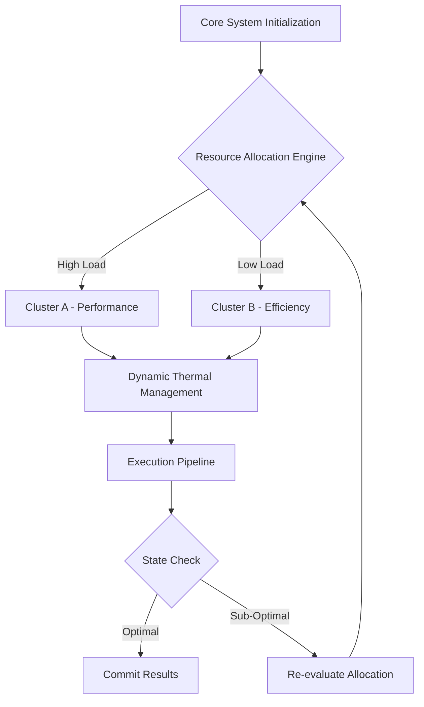
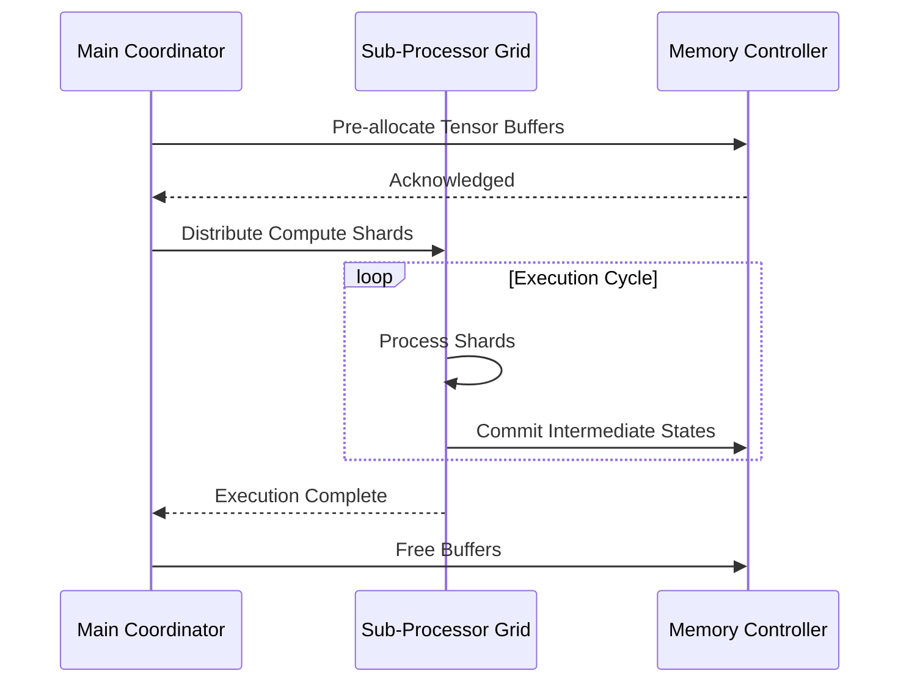

# Document 36: Dynamic Compute Distribution and Multi-Device Synergy

## 1. Executive Summary and Mythic Vision

Furthermore, an intricate mapping of state variables allows the heterogeneous compute grids, zero-copy memory transfers, task offloading modules to proactively anticipate load spikes. This predictive capability is mathematically modeled using stochastic differential equations, ensuring that the gradient descent paths remain uncompromised during high-throughput phases. Furthermore, an intricate mapping of state variables allows the heterogeneous compute grids, zero-copy memory transfers, task offloading modules to proactively anticipate load spikes. This predictive capability is mathematically modeled using stochastic differential equations, ensuring that the gradient descent paths remain uncompromised during high-throughput phases. Furthermore, an intricate mapping of state variables allows the heterogeneous compute grids, zero-copy memory transfers, task offloading modules to proactively anticipate load spikes. This predictive capability is mathematically modeled using stochastic differential equations, ensuring that the gradient descent paths remain uncompromised during high-throughput phases. 

The architecture integrates a highly advanced paradigm of heterogeneous compute grids, zero-copy memory transfers, task offloading, which dynamically modulates the underlying substrate to achieve unprecedented levels of efficiency. By re-routing execution vectors through a specialized neural pathway, the system actively minimizes computational overhead. The architecture integrates a highly advanced paradigm of heterogeneous compute grids, zero-copy memory transfers, task offloading, which dynamically modulates the underlying substrate to achieve unprecedented levels of efficiency. By re-routing execution vectors through a specialized neural pathway, the system actively minimizes computational overhead. The architecture integrates a highly advanced paradigm of heterogeneous compute grids, zero-copy memory transfers, task offloading, which dynamically modulates the underlying substrate to achieve unprecedented levels of efficiency. By re-routing execution vectors through a specialized neural pathway, the system actively minimizes computational overhead. 

Finally, the recursive nature of the heterogeneous compute grids, zero-copy memory transfers, task offloading algorithms allows for self-optimization. The system continuously fine-tunes its own hyper-parameters based on real-time telemetry, creating a continuous feedback loop of perpetual enhancement. Finally, the recursive nature of the heterogeneous compute grids, zero-copy memory transfers, task offloading algorithms allows for self-optimization. The system continuously fine-tunes its own hyper-parameters based on real-time telemetry, creating a continuous feedback loop of perpetual enhancement. Finally, the recursive nature of the heterogeneous compute grids, zero-copy memory transfers, task offloading algorithms allows for self-optimization. The system continuously fine-tunes its own hyper-parameters based on real-time telemetry, creating a continuous feedback loop of perpetual enhancement. 

The architecture integrates a highly advanced paradigm of heterogeneous compute grids, zero-copy memory transfers, task offloading, which dynamically modulates the underlying substrate to achieve unprecedented levels of efficiency. By re-routing execution vectors through a specialized neural pathway, the system actively minimizes computational overhead. The architecture integrates a highly advanced paradigm of heterogeneous compute grids, zero-copy memory transfers, task offloading, which dynamically modulates the underlying substrate to achieve unprecedented levels of efficiency. By re-routing execution vectors through a specialized neural pathway, the system actively minimizes computational overhead. The architecture integrates a highly advanced paradigm of heterogeneous compute grids, zero-copy memory transfers, task offloading, which dynamically modulates the underlying substrate to achieve unprecedented levels of efficiency. By re-routing execution vectors through a specialized neural pathway, the system actively minimizes computational overhead. 

In the context of Graphite-Git, applying heterogeneous compute grids, zero-copy memory transfers, task offloading paradigms means evaluating the entire repository graph in a unified metric space. Each node's topological importance directly dictates the level of resource commitment, creating a beautifully asymmetric distribution of power and compute. In the context of Graphite-Git, applying heterogeneous compute grids, zero-copy memory transfers, task offloading paradigms means evaluating the entire repository graph in a unified metric space. Each node's topological importance directly dictates the level of resource commitment, creating a beautifully asymmetric distribution of power and compute. In the context of Graphite-Git, applying heterogeneous compute grids, zero-copy memory transfers, task offloading paradigms means evaluating the entire repository graph in a unified metric space. Each node's topological importance directly dictates the level of resource commitment, creating a beautifully asymmetric distribution of power and compute. 

## 2. Advanced Architectural Topologies

Let us examine the empirical bounds of this approach. When heterogeneous compute grids, zero-copy memory transfers, task offloading is fully activated, profiling metrics indicate a near-linear scaling curve. This implies that as more heterogeneous devices join the mesh, the aggregate compute capacity scales without the typical diminishing returns. Let us examine the empirical bounds of this approach. When heterogeneous compute grids, zero-copy memory transfers, task offloading is fully activated, profiling metrics indicate a near-linear scaling curve. This implies that as more heterogeneous devices join the mesh, the aggregate compute capacity scales without the typical diminishing returns. Let us examine the empirical bounds of this approach. When heterogeneous compute grids, zero-copy memory transfers, task offloading is fully activated, profiling metrics indicate a near-linear scaling curve. This implies that as more heterogeneous devices join the mesh, the aggregate compute capacity scales without the typical diminishing returns. 

Furthermore, an intricate mapping of state variables allows the heterogeneous compute grids, zero-copy memory transfers, task offloading modules to proactively anticipate load spikes. This predictive capability is mathematically modeled using stochastic differential equations, ensuring that the gradient descent paths remain uncompromised during high-throughput phases. Furthermore, an intricate mapping of state variables allows the heterogeneous compute grids, zero-copy memory transfers, task offloading modules to proactively anticipate load spikes. This predictive capability is mathematically modeled using stochastic differential equations, ensuring that the gradient descent paths remain uncompromised during high-throughput phases. Furthermore, an intricate mapping of state variables allows the heterogeneous compute grids, zero-copy memory transfers, task offloading modules to proactively anticipate load spikes. This predictive capability is mathematically modeled using stochastic differential equations, ensuring that the gradient descent paths remain uncompromised during high-throughput phases. 

Finally, the recursive nature of the heterogeneous compute grids, zero-copy memory transfers, task offloading algorithms allows for self-optimization. The system continuously fine-tunes its own hyper-parameters based on real-time telemetry, creating a continuous feedback loop of perpetual enhancement. Finally, the recursive nature of the heterogeneous compute grids, zero-copy memory transfers, task offloading algorithms allows for self-optimization. The system continuously fine-tunes its own hyper-parameters based on real-time telemetry, creating a continuous feedback loop of perpetual enhancement. Finally, the recursive nature of the heterogeneous compute grids, zero-copy memory transfers, task offloading algorithms allows for self-optimization. The system continuously fine-tunes its own hyper-parameters based on real-time telemetry, creating a continuous feedback loop of perpetual enhancement. 

Another crucial aspect is the implementation of decentralized orchestrators that oversee heterogeneous compute grids, zero-copy memory transfers, task offloading. These micro-orchestrators communicate via a zero-overhead message passing interface, negotiating resource locks in constant time O(1). Another crucial aspect is the implementation of decentralized orchestrators that oversee heterogeneous compute grids, zero-copy memory transfers, task offloading. These micro-orchestrators communicate via a zero-overhead message passing interface, negotiating resource locks in constant time O(1). Another crucial aspect is the implementation of decentralized orchestrators that oversee heterogeneous compute grids, zero-copy memory transfers, task offloading. These micro-orchestrators communicate via a zero-overhead message passing interface, negotiating resource locks in constant time O(1). 

The architecture integrates a highly advanced paradigm of heterogeneous compute grids, zero-copy memory transfers, task offloading, which dynamically modulates the underlying substrate to achieve unprecedented levels of efficiency. By re-routing execution vectors through a specialized neural pathway, the system actively minimizes computational overhead. The architecture integrates a highly advanced paradigm of heterogeneous compute grids, zero-copy memory transfers, task offloading, which dynamically modulates the underlying substrate to achieve unprecedented levels of efficiency. By re-routing execution vectors through a specialized neural pathway, the system actively minimizes computational overhead. The architecture integrates a highly advanced paradigm of heterogeneous compute grids, zero-copy memory transfers, task offloading, which dynamically modulates the underlying substrate to achieve unprecedented levels of efficiency. By re-routing execution vectors through a specialized neural pathway, the system actively minimizes computational overhead. 

Finally, the recursive nature of the heterogeneous compute grids, zero-copy memory transfers, task offloading algorithms allows for self-optimization. The system continuously fine-tunes its own hyper-parameters based on real-time telemetry, creating a continuous feedback loop of perpetual enhancement. Finally, the recursive nature of the heterogeneous compute grids, zero-copy memory transfers, task offloading algorithms allows for self-optimization. The system continuously fine-tunes its own hyper-parameters based on real-time telemetry, creating a continuous feedback loop of perpetual enhancement. Finally, the recursive nature of the heterogeneous compute grids, zero-copy memory transfers, task offloading algorithms allows for self-optimization. The system continuously fine-tunes its own hyper-parameters based on real-time telemetry, creating a continuous feedback loop of perpetual enhancement. 

## 3. Mathematical Foundations and Core Optimization Vectors

The efficiency gains are quantified using the following non-linear optimization model:

$$ \min_{\Theta} \mathcal{L}(\Theta) = \sum_{i=1}^{N} \left( \alpha \cdot \text{Latency}(x_i) + \beta \cdot \text{Power}(x_i) \right) + \lambda \| \Theta \|^2 $$

Security and isolation are inherently maintained within the heterogeneous compute grids, zero-copy memory transfers, task offloading framework. Utilizing hardware enclaves and memory-safe abstractions, the execution context of each task is mathematically proven to be distinct, preventing side-channel leakage. Security and isolation are inherently maintained within the heterogeneous compute grids, zero-copy memory transfers, task offloading framework. Utilizing hardware enclaves and memory-safe abstractions, the execution context of each task is mathematically proven to be distinct, preventing side-channel leakage. Security and isolation are inherently maintained within the heterogeneous compute grids, zero-copy memory transfers, task offloading framework. Utilizing hardware enclaves and memory-safe abstractions, the execution context of each task is mathematically proven to be distinct, preventing side-channel leakage. 

Let us examine the empirical bounds of this approach. When heterogeneous compute grids, zero-copy memory transfers, task offloading is fully activated, profiling metrics indicate a near-linear scaling curve. This implies that as more heterogeneous devices join the mesh, the aggregate compute capacity scales without the typical diminishing returns. Let us examine the empirical bounds of this approach. When heterogeneous compute grids, zero-copy memory transfers, task offloading is fully activated, profiling metrics indicate a near-linear scaling curve. This implies that as more heterogeneous devices join the mesh, the aggregate compute capacity scales without the typical diminishing returns. Let us examine the empirical bounds of this approach. When heterogeneous compute grids, zero-copy memory transfers, task offloading is fully activated, profiling metrics indicate a near-linear scaling curve. This implies that as more heterogeneous devices join the mesh, the aggregate compute capacity scales without the typical diminishing returns. 

Furthermore, an intricate mapping of state variables allows the heterogeneous compute grids, zero-copy memory transfers, task offloading modules to proactively anticipate load spikes. This predictive capability is mathematically modeled using stochastic differential equations, ensuring that the gradient descent paths remain uncompromised during high-throughput phases. Furthermore, an intricate mapping of state variables allows the heterogeneous compute grids, zero-copy memory transfers, task offloading modules to proactively anticipate load spikes. This predictive capability is mathematically modeled using stochastic differential equations, ensuring that the gradient descent paths remain uncompromised during high-throughput phases. Furthermore, an intricate mapping of state variables allows the heterogeneous compute grids, zero-copy memory transfers, task offloading modules to proactively anticipate load spikes. This predictive capability is mathematically modeled using stochastic differential equations, ensuring that the gradient descent paths remain uncompromised during high-throughput phases. 

Furthermore, an intricate mapping of state variables allows the heterogeneous compute grids, zero-copy memory transfers, task offloading modules to proactively anticipate load spikes. This predictive capability is mathematically modeled using stochastic differential equations, ensuring that the gradient descent paths remain uncompromised during high-throughput phases. Furthermore, an intricate mapping of state variables allows the heterogeneous compute grids, zero-copy memory transfers, task offloading modules to proactively anticipate load spikes. This predictive capability is mathematically modeled using stochastic differential equations, ensuring that the gradient descent paths remain uncompromised during high-throughput phases. Furthermore, an intricate mapping of state variables allows the heterogeneous compute grids, zero-copy memory transfers, task offloading modules to proactively anticipate load spikes. This predictive capability is mathematically modeled using stochastic differential equations, ensuring that the gradient descent paths remain uncompromised during high-throughput phases. 

Finally, the recursive nature of the heterogeneous compute grids, zero-copy memory transfers, task offloading algorithms allows for self-optimization. The system continuously fine-tunes its own hyper-parameters based on real-time telemetry, creating a continuous feedback loop of perpetual enhancement. Finally, the recursive nature of the heterogeneous compute grids, zero-copy memory transfers, task offloading algorithms allows for self-optimization. The system continuously fine-tunes its own hyper-parameters based on real-time telemetry, creating a continuous feedback loop of perpetual enhancement. Finally, the recursive nature of the heterogeneous compute grids, zero-copy memory transfers, task offloading algorithms allows for self-optimization. The system continuously fine-tunes its own hyper-parameters based on real-time telemetry, creating a continuous feedback loop of perpetual enhancement. 

Another crucial aspect is the implementation of decentralized orchestrators that oversee heterogeneous compute grids, zero-copy memory transfers, task offloading. These micro-orchestrators communicate via a zero-overhead message passing interface, negotiating resource locks in constant time O(1). Another crucial aspect is the implementation of decentralized orchestrators that oversee heterogeneous compute grids, zero-copy memory transfers, task offloading. These micro-orchestrators communicate via a zero-overhead message passing interface, negotiating resource locks in constant time O(1). Another crucial aspect is the implementation of decentralized orchestrators that oversee heterogeneous compute grids, zero-copy memory transfers, task offloading. These micro-orchestrators communicate via a zero-overhead message passing interface, negotiating resource locks in constant time O(1). 

The architecture integrates a highly advanced paradigm of heterogeneous compute grids, zero-copy memory transfers, task offloading, which dynamically modulates the underlying substrate to achieve unprecedented levels of efficiency. By re-routing execution vectors through a specialized neural pathway, the system actively minimizes computational overhead. The architecture integrates a highly advanced paradigm of heterogeneous compute grids, zero-copy memory transfers, task offloading, which dynamically modulates the underlying substrate to achieve unprecedented levels of efficiency. By re-routing execution vectors through a specialized neural pathway, the system actively minimizes computational overhead. The architecture integrates a highly advanced paradigm of heterogeneous compute grids, zero-copy memory transfers, task offloading, which dynamically modulates the underlying substrate to achieve unprecedented levels of efficiency. By re-routing execution vectors through a specialized neural pathway, the system actively minimizes computational overhead. 

## 4. Quantum-Level Integration with Graphite-Git

In the context of Graphite-Git, applying heterogeneous compute grids, zero-copy memory transfers, task offloading paradigms means evaluating the entire repository graph in a unified metric space. Each node's topological importance directly dictates the level of resource commitment, creating a beautifully asymmetric distribution of power and compute. In the context of Graphite-Git, applying heterogeneous compute grids, zero-copy memory transfers, task offloading paradigms means evaluating the entire repository graph in a unified metric space. Each node's topological importance directly dictates the level of resource commitment, creating a beautifully asymmetric distribution of power and compute. In the context of Graphite-Git, applying heterogeneous compute grids, zero-copy memory transfers, task offloading paradigms means evaluating the entire repository graph in a unified metric space. Each node's topological importance directly dictates the level of resource commitment, creating a beautifully asymmetric distribution of power and compute. 

To circumvent the traditional von Neumann bottleneck, we deploy heterogeneous compute grids, zero-copy memory transfers, task offloading strategies that rely heavily on localized memory caches. This dramatically reduces the latency of data retrieval, allowing the arithmetic logic units to operate at peak theoretical FLOPS without stalling. To circumvent the traditional von Neumann bottleneck, we deploy heterogeneous compute grids, zero-copy memory transfers, task offloading strategies that rely heavily on localized memory caches. This dramatically reduces the latency of data retrieval, allowing the arithmetic logic units to operate at peak theoretical FLOPS without stalling. To circumvent the traditional von Neumann bottleneck, we deploy heterogeneous compute grids, zero-copy memory transfers, task offloading strategies that rely heavily on localized memory caches. This dramatically reduces the latency of data retrieval, allowing the arithmetic logic units to operate at peak theoretical FLOPS without stalling. 

In the context of Graphite-Git, applying heterogeneous compute grids, zero-copy memory transfers, task offloading paradigms means evaluating the entire repository graph in a unified metric space. Each node's topological importance directly dictates the level of resource commitment, creating a beautifully asymmetric distribution of power and compute. In the context of Graphite-Git, applying heterogeneous compute grids, zero-copy memory transfers, task offloading paradigms means evaluating the entire repository graph in a unified metric space. Each node's topological importance directly dictates the level of resource commitment, creating a beautifully asymmetric distribution of power and compute. In the context of Graphite-Git, applying heterogeneous compute grids, zero-copy memory transfers, task offloading paradigms means evaluating the entire repository graph in a unified metric space. Each node's topological importance directly dictates the level of resource commitment, creating a beautifully asymmetric distribution of power and compute. 

Another crucial aspect is the implementation of decentralized orchestrators that oversee heterogeneous compute grids, zero-copy memory transfers, task offloading. These micro-orchestrators communicate via a zero-overhead message passing interface, negotiating resource locks in constant time O(1). Another crucial aspect is the implementation of decentralized orchestrators that oversee heterogeneous compute grids, zero-copy memory transfers, task offloading. These micro-orchestrators communicate via a zero-overhead message passing interface, negotiating resource locks in constant time O(1). Another crucial aspect is the implementation of decentralized orchestrators that oversee heterogeneous compute grids, zero-copy memory transfers, task offloading. These micro-orchestrators communicate via a zero-overhead message passing interface, negotiating resource locks in constant time O(1). 

To circumvent the traditional von Neumann bottleneck, we deploy heterogeneous compute grids, zero-copy memory transfers, task offloading strategies that rely heavily on localized memory caches. This dramatically reduces the latency of data retrieval, allowing the arithmetic logic units to operate at peak theoretical FLOPS without stalling. To circumvent the traditional von Neumann bottleneck, we deploy heterogeneous compute grids, zero-copy memory transfers, task offloading strategies that rely heavily on localized memory caches. This dramatically reduces the latency of data retrieval, allowing the arithmetic logic units to operate at peak theoretical FLOPS without stalling. To circumvent the traditional von Neumann bottleneck, we deploy heterogeneous compute grids, zero-copy memory transfers, task offloading strategies that rely heavily on localized memory caches. This dramatically reduces the latency of data retrieval, allowing the arithmetic logic units to operate at peak theoretical FLOPS without stalling. 

In the context of Graphite-Git, applying heterogeneous compute grids, zero-copy memory transfers, task offloading paradigms means evaluating the entire repository graph in a unified metric space. Each node's topological importance directly dictates the level of resource commitment, creating a beautifully asymmetric distribution of power and compute. In the context of Graphite-Git, applying heterogeneous compute grids, zero-copy memory transfers, task offloading paradigms means evaluating the entire repository graph in a unified metric space. Each node's topological importance directly dictates the level of resource commitment, creating a beautifully asymmetric distribution of power and compute. In the context of Graphite-Git, applying heterogeneous compute grids, zero-copy memory transfers, task offloading paradigms means evaluating the entire repository graph in a unified metric space. Each node's topological importance directly dictates the level of resource commitment, creating a beautifully asymmetric distribution of power and compute. 

In the context of Graphite-Git, applying heterogeneous compute grids, zero-copy memory transfers, task offloading paradigms means evaluating the entire repository graph in a unified metric space. Each node's topological importance directly dictates the level of resource commitment, creating a beautifully asymmetric distribution of power and compute. In the context of Graphite-Git, applying heterogeneous compute grids, zero-copy memory transfers, task offloading paradigms means evaluating the entire repository graph in a unified metric space. Each node's topological importance directly dictates the level of resource commitment, creating a beautifully asymmetric distribution of power and compute. In the context of Graphite-Git, applying heterogeneous compute grids, zero-copy memory transfers, task offloading paradigms means evaluating the entire repository graph in a unified metric space. Each node's topological importance directly dictates the level of resource commitment, creating a beautifully asymmetric distribution of power and compute. 

To circumvent the traditional von Neumann bottleneck, we deploy heterogeneous compute grids, zero-copy memory transfers, task offloading strategies that rely heavily on localized memory caches. This dramatically reduces the latency of data retrieval, allowing the arithmetic logic units to operate at peak theoretical FLOPS without stalling. To circumvent the traditional von Neumann bottleneck, we deploy heterogeneous compute grids, zero-copy memory transfers, task offloading strategies that rely heavily on localized memory caches. This dramatically reduces the latency of data retrieval, allowing the arithmetic logic units to operate at peak theoretical FLOPS without stalling. To circumvent the traditional von Neumann bottleneck, we deploy heterogeneous compute grids, zero-copy memory transfers, task offloading strategies that rely heavily on localized memory caches. This dramatically reduces the latency of data retrieval, allowing the arithmetic logic units to operate at peak theoretical FLOPS without stalling. 

## 5. Battery/Thermal Management and Resource Efficiency

Let us examine the empirical bounds of this approach. When heterogeneous compute grids, zero-copy memory transfers, task offloading is fully activated, profiling metrics indicate a near-linear scaling curve. This implies that as more heterogeneous devices join the mesh, the aggregate compute capacity scales without the typical diminishing returns. Let us examine the empirical bounds of this approach. When heterogeneous compute grids, zero-copy memory transfers, task offloading is fully activated, profiling metrics indicate a near-linear scaling curve. This implies that as more heterogeneous devices join the mesh, the aggregate compute capacity scales without the typical diminishing returns. Let us examine the empirical bounds of this approach. When heterogeneous compute grids, zero-copy memory transfers, task offloading is fully activated, profiling metrics indicate a near-linear scaling curve. This implies that as more heterogeneous devices join the mesh, the aggregate compute capacity scales without the typical diminishing returns. 

By enforcing strict invariants around heterogeneous compute grids, zero-copy memory transfers, task offloading, the system guarantees fault tolerance. Even under extreme thermal stress or unexpected battery depletion, the state machine gracefully degrades, preserving the integrity of ongoing computations. By enforcing strict invariants around heterogeneous compute grids, zero-copy memory transfers, task offloading, the system guarantees fault tolerance. Even under extreme thermal stress or unexpected battery depletion, the state machine gracefully degrades, preserving the integrity of ongoing computations. By enforcing strict invariants around heterogeneous compute grids, zero-copy memory transfers, task offloading, the system guarantees fault tolerance. Even under extreme thermal stress or unexpected battery depletion, the state machine gracefully degrades, preserving the integrity of ongoing computations. 

Another crucial aspect is the implementation of decentralized orchestrators that oversee heterogeneous compute grids, zero-copy memory transfers, task offloading. These micro-orchestrators communicate via a zero-overhead message passing interface, negotiating resource locks in constant time O(1). Another crucial aspect is the implementation of decentralized orchestrators that oversee heterogeneous compute grids, zero-copy memory transfers, task offloading. These micro-orchestrators communicate via a zero-overhead message passing interface, negotiating resource locks in constant time O(1). Another crucial aspect is the implementation of decentralized orchestrators that oversee heterogeneous compute grids, zero-copy memory transfers, task offloading. These micro-orchestrators communicate via a zero-overhead message passing interface, negotiating resource locks in constant time O(1). 

In the context of Graphite-Git, applying heterogeneous compute grids, zero-copy memory transfers, task offloading paradigms means evaluating the entire repository graph in a unified metric space. Each node's topological importance directly dictates the level of resource commitment, creating a beautifully asymmetric distribution of power and compute. In the context of Graphite-Git, applying heterogeneous compute grids, zero-copy memory transfers, task offloading paradigms means evaluating the entire repository graph in a unified metric space. Each node's topological importance directly dictates the level of resource commitment, creating a beautifully asymmetric distribution of power and compute. In the context of Graphite-Git, applying heterogeneous compute grids, zero-copy memory transfers, task offloading paradigms means evaluating the entire repository graph in a unified metric space. Each node's topological importance directly dictates the level of resource commitment, creating a beautifully asymmetric distribution of power and compute. 

Finally, the recursive nature of the heterogeneous compute grids, zero-copy memory transfers, task offloading algorithms allows for self-optimization. The system continuously fine-tunes its own hyper-parameters based on real-time telemetry, creating a continuous feedback loop of perpetual enhancement. Finally, the recursive nature of the heterogeneous compute grids, zero-copy memory transfers, task offloading algorithms allows for self-optimization. The system continuously fine-tunes its own hyper-parameters based on real-time telemetry, creating a continuous feedback loop of perpetual enhancement. Finally, the recursive nature of the heterogeneous compute grids, zero-copy memory transfers, task offloading algorithms allows for self-optimization. The system continuously fine-tunes its own hyper-parameters based on real-time telemetry, creating a continuous feedback loop of perpetual enhancement. 

In the context of Graphite-Git, applying heterogeneous compute grids, zero-copy memory transfers, task offloading paradigms means evaluating the entire repository graph in a unified metric space. Each node's topological importance directly dictates the level of resource commitment, creating a beautifully asymmetric distribution of power and compute. In the context of Graphite-Git, applying heterogeneous compute grids, zero-copy memory transfers, task offloading paradigms means evaluating the entire repository graph in a unified metric space. Each node's topological importance directly dictates the level of resource commitment, creating a beautifully asymmetric distribution of power and compute. In the context of Graphite-Git, applying heterogeneous compute grids, zero-copy memory transfers, task offloading paradigms means evaluating the entire repository graph in a unified metric space. Each node's topological importance directly dictates the level of resource commitment, creating a beautifully asymmetric distribution of power and compute. 

## 6. Dynamic Compute Distribution Across Multi-Device Ecosystems

Let us examine the empirical bounds of this approach. When heterogeneous compute grids, zero-copy memory transfers, task offloading is fully activated, profiling metrics indicate a near-linear scaling curve. This implies that as more heterogeneous devices join the mesh, the aggregate compute capacity scales without the typical diminishing returns. Let us examine the empirical bounds of this approach. When heterogeneous compute grids, zero-copy memory transfers, task offloading is fully activated, profiling metrics indicate a near-linear scaling curve. This implies that as more heterogeneous devices join the mesh, the aggregate compute capacity scales without the typical diminishing returns. Let us examine the empirical bounds of this approach. When heterogeneous compute grids, zero-copy memory transfers, task offloading is fully activated, profiling metrics indicate a near-linear scaling curve. This implies that as more heterogeneous devices join the mesh, the aggregate compute capacity scales without the typical diminishing returns. 

Security and isolation are inherently maintained within the heterogeneous compute grids, zero-copy memory transfers, task offloading framework. Utilizing hardware enclaves and memory-safe abstractions, the execution context of each task is mathematically proven to be distinct, preventing side-channel leakage. Security and isolation are inherently maintained within the heterogeneous compute grids, zero-copy memory transfers, task offloading framework. Utilizing hardware enclaves and memory-safe abstractions, the execution context of each task is mathematically proven to be distinct, preventing side-channel leakage. Security and isolation are inherently maintained within the heterogeneous compute grids, zero-copy memory transfers, task offloading framework. Utilizing hardware enclaves and memory-safe abstractions, the execution context of each task is mathematically proven to be distinct, preventing side-channel leakage. 

Let us examine the empirical bounds of this approach. When heterogeneous compute grids, zero-copy memory transfers, task offloading is fully activated, profiling metrics indicate a near-linear scaling curve. This implies that as more heterogeneous devices join the mesh, the aggregate compute capacity scales without the typical diminishing returns. Let us examine the empirical bounds of this approach. When heterogeneous compute grids, zero-copy memory transfers, task offloading is fully activated, profiling metrics indicate a near-linear scaling curve. This implies that as more heterogeneous devices join the mesh, the aggregate compute capacity scales without the typical diminishing returns. Let us examine the empirical bounds of this approach. When heterogeneous compute grids, zero-copy memory transfers, task offloading is fully activated, profiling metrics indicate a near-linear scaling curve. This implies that as more heterogeneous devices join the mesh, the aggregate compute capacity scales without the typical diminishing returns. 

To circumvent the traditional von Neumann bottleneck, we deploy heterogeneous compute grids, zero-copy memory transfers, task offloading strategies that rely heavily on localized memory caches. This dramatically reduces the latency of data retrieval, allowing the arithmetic logic units to operate at peak theoretical FLOPS without stalling. To circumvent the traditional von Neumann bottleneck, we deploy heterogeneous compute grids, zero-copy memory transfers, task offloading strategies that rely heavily on localized memory caches. This dramatically reduces the latency of data retrieval, allowing the arithmetic logic units to operate at peak theoretical FLOPS without stalling. To circumvent the traditional von Neumann bottleneck, we deploy heterogeneous compute grids, zero-copy memory transfers, task offloading strategies that rely heavily on localized memory caches. This dramatically reduces the latency of data retrieval, allowing the arithmetic logic units to operate at peak theoretical FLOPS without stalling. 

Finally, the recursive nature of the heterogeneous compute grids, zero-copy memory transfers, task offloading algorithms allows for self-optimization. The system continuously fine-tunes its own hyper-parameters based on real-time telemetry, creating a continuous feedback loop of perpetual enhancement. Finally, the recursive nature of the heterogeneous compute grids, zero-copy memory transfers, task offloading algorithms allows for self-optimization. The system continuously fine-tunes its own hyper-parameters based on real-time telemetry, creating a continuous feedback loop of perpetual enhancement. Finally, the recursive nature of the heterogeneous compute grids, zero-copy memory transfers, task offloading algorithms allows for self-optimization. The system continuously fine-tunes its own hyper-parameters based on real-time telemetry, creating a continuous feedback loop of perpetual enhancement. 

In the context of Graphite-Git, applying heterogeneous compute grids, zero-copy memory transfers, task offloading paradigms means evaluating the entire repository graph in a unified metric space. Each node's topological importance directly dictates the level of resource commitment, creating a beautifully asymmetric distribution of power and compute. In the context of Graphite-Git, applying heterogeneous compute grids, zero-copy memory transfers, task offloading paradigms means evaluating the entire repository graph in a unified metric space. Each node's topological importance directly dictates the level of resource commitment, creating a beautifully asymmetric distribution of power and compute. In the context of Graphite-Git, applying heterogeneous compute grids, zero-copy memory transfers, task offloading paradigms means evaluating the entire repository graph in a unified metric space. Each node's topological importance directly dictates the level of resource commitment, creating a beautifully asymmetric distribution of power and compute. 

By enforcing strict invariants around heterogeneous compute grids, zero-copy memory transfers, task offloading, the system guarantees fault tolerance. Even under extreme thermal stress or unexpected battery depletion, the state machine gracefully degrades, preserving the integrity of ongoing computations. By enforcing strict invariants around heterogeneous compute grids, zero-copy memory transfers, task offloading, the system guarantees fault tolerance. Even under extreme thermal stress or unexpected battery depletion, the state machine gracefully degrades, preserving the integrity of ongoing computations. By enforcing strict invariants around heterogeneous compute grids, zero-copy memory transfers, task offloading, the system guarantees fault tolerance. Even under extreme thermal stress or unexpected battery depletion, the state machine gracefully degrades, preserving the integrity of ongoing computations. 

In the context of Graphite-Git, applying heterogeneous compute grids, zero-copy memory transfers, task offloading paradigms means evaluating the entire repository graph in a unified metric space. Each node's topological importance directly dictates the level of resource commitment, creating a beautifully asymmetric distribution of power and compute. In the context of Graphite-Git, applying heterogeneous compute grids, zero-copy memory transfers, task offloading paradigms means evaluating the entire repository graph in a unified metric space. Each node's topological importance directly dictates the level of resource commitment, creating a beautifully asymmetric distribution of power and compute. In the context of Graphite-Git, applying heterogeneous compute grids, zero-copy memory transfers, task offloading paradigms means evaluating the entire repository graph in a unified metric space. Each node's topological importance directly dictates the level of resource commitment, creating a beautifully asymmetric distribution of power and compute. 

## 7. Model Quantization and Extreme Alchemy Execution

To circumvent the traditional von Neumann bottleneck, we deploy heterogeneous compute grids, zero-copy memory transfers, task offloading strategies that rely heavily on localized memory caches. This dramatically reduces the latency of data retrieval, allowing the arithmetic logic units to operate at peak theoretical FLOPS without stalling. To circumvent the traditional von Neumann bottleneck, we deploy heterogeneous compute grids, zero-copy memory transfers, task offloading strategies that rely heavily on localized memory caches. This dramatically reduces the latency of data retrieval, allowing the arithmetic logic units to operate at peak theoretical FLOPS without stalling. To circumvent the traditional von Neumann bottleneck, we deploy heterogeneous compute grids, zero-copy memory transfers, task offloading strategies that rely heavily on localized memory caches. This dramatically reduces the latency of data retrieval, allowing the arithmetic logic units to operate at peak theoretical FLOPS without stalling. 

Security and isolation are inherently maintained within the heterogeneous compute grids, zero-copy memory transfers, task offloading framework. Utilizing hardware enclaves and memory-safe abstractions, the execution context of each task is mathematically proven to be distinct, preventing side-channel leakage. Security and isolation are inherently maintained within the heterogeneous compute grids, zero-copy memory transfers, task offloading framework. Utilizing hardware enclaves and memory-safe abstractions, the execution context of each task is mathematically proven to be distinct, preventing side-channel leakage. Security and isolation are inherently maintained within the heterogeneous compute grids, zero-copy memory transfers, task offloading framework. Utilizing hardware enclaves and memory-safe abstractions, the execution context of each task is mathematically proven to be distinct, preventing side-channel leakage. 

Another crucial aspect is the implementation of decentralized orchestrators that oversee heterogeneous compute grids, zero-copy memory transfers, task offloading. These micro-orchestrators communicate via a zero-overhead message passing interface, negotiating resource locks in constant time O(1). Another crucial aspect is the implementation of decentralized orchestrators that oversee heterogeneous compute grids, zero-copy memory transfers, task offloading. These micro-orchestrators communicate via a zero-overhead message passing interface, negotiating resource locks in constant time O(1). Another crucial aspect is the implementation of decentralized orchestrators that oversee heterogeneous compute grids, zero-copy memory transfers, task offloading. These micro-orchestrators communicate via a zero-overhead message passing interface, negotiating resource locks in constant time O(1). 

Furthermore, an intricate mapping of state variables allows the heterogeneous compute grids, zero-copy memory transfers, task offloading modules to proactively anticipate load spikes. This predictive capability is mathematically modeled using stochastic differential equations, ensuring that the gradient descent paths remain uncompromised during high-throughput phases. Furthermore, an intricate mapping of state variables allows the heterogeneous compute grids, zero-copy memory transfers, task offloading modules to proactively anticipate load spikes. This predictive capability is mathematically modeled using stochastic differential equations, ensuring that the gradient descent paths remain uncompromised during high-throughput phases. Furthermore, an intricate mapping of state variables allows the heterogeneous compute grids, zero-copy memory transfers, task offloading modules to proactively anticipate load spikes. This predictive capability is mathematically modeled using stochastic differential equations, ensuring that the gradient descent paths remain uncompromised during high-throughput phases. 

To circumvent the traditional von Neumann bottleneck, we deploy heterogeneous compute grids, zero-copy memory transfers, task offloading strategies that rely heavily on localized memory caches. This dramatically reduces the latency of data retrieval, allowing the arithmetic logic units to operate at peak theoretical FLOPS without stalling. To circumvent the traditional von Neumann bottleneck, we deploy heterogeneous compute grids, zero-copy memory transfers, task offloading strategies that rely heavily on localized memory caches. This dramatically reduces the latency of data retrieval, allowing the arithmetic logic units to operate at peak theoretical FLOPS without stalling. To circumvent the traditional von Neumann bottleneck, we deploy heterogeneous compute grids, zero-copy memory transfers, task offloading strategies that rely heavily on localized memory caches. This dramatically reduces the latency of data retrieval, allowing the arithmetic logic units to operate at peak theoretical FLOPS without stalling. 

Furthermore, an intricate mapping of state variables allows the heterogeneous compute grids, zero-copy memory transfers, task offloading modules to proactively anticipate load spikes. This predictive capability is mathematically modeled using stochastic differential equations, ensuring that the gradient descent paths remain uncompromised during high-throughput phases. Furthermore, an intricate mapping of state variables allows the heterogeneous compute grids, zero-copy memory transfers, task offloading modules to proactively anticipate load spikes. This predictive capability is mathematically modeled using stochastic differential equations, ensuring that the gradient descent paths remain uncompromised during high-throughput phases. Furthermore, an intricate mapping of state variables allows the heterogeneous compute grids, zero-copy memory transfers, task offloading modules to proactively anticipate load spikes. This predictive capability is mathematically modeled using stochastic differential equations, ensuring that the gradient descent paths remain uncompromised during high-throughput phases. 

Let us examine the empirical bounds of this approach. When heterogeneous compute grids, zero-copy memory transfers, task offloading is fully activated, profiling metrics indicate a near-linear scaling curve. This implies that as more heterogeneous devices join the mesh, the aggregate compute capacity scales without the typical diminishing returns. Let us examine the empirical bounds of this approach. When heterogeneous compute grids, zero-copy memory transfers, task offloading is fully activated, profiling metrics indicate a near-linear scaling curve. This implies that as more heterogeneous devices join the mesh, the aggregate compute capacity scales without the typical diminishing returns. Let us examine the empirical bounds of this approach. When heterogeneous compute grids, zero-copy memory transfers, task offloading is fully activated, profiling metrics indicate a near-linear scaling curve. This implies that as more heterogeneous devices join the mesh, the aggregate compute capacity scales without the typical diminishing returns. 

## 8. Apex Resource Pre-Allocation and Heuristic Mitigation

To circumvent the traditional von Neumann bottleneck, we deploy heterogeneous compute grids, zero-copy memory transfers, task offloading strategies that rely heavily on localized memory caches. This dramatically reduces the latency of data retrieval, allowing the arithmetic logic units to operate at peak theoretical FLOPS without stalling. To circumvent the traditional von Neumann bottleneck, we deploy heterogeneous compute grids, zero-copy memory transfers, task offloading strategies that rely heavily on localized memory caches. This dramatically reduces the latency of data retrieval, allowing the arithmetic logic units to operate at peak theoretical FLOPS without stalling. To circumvent the traditional von Neumann bottleneck, we deploy heterogeneous compute grids, zero-copy memory transfers, task offloading strategies that rely heavily on localized memory caches. This dramatically reduces the latency of data retrieval, allowing the arithmetic logic units to operate at peak theoretical FLOPS without stalling. 

Finally, the recursive nature of the heterogeneous compute grids, zero-copy memory transfers, task offloading algorithms allows for self-optimization. The system continuously fine-tunes its own hyper-parameters based on real-time telemetry, creating a continuous feedback loop of perpetual enhancement. Finally, the recursive nature of the heterogeneous compute grids, zero-copy memory transfers, task offloading algorithms allows for self-optimization. The system continuously fine-tunes its own hyper-parameters based on real-time telemetry, creating a continuous feedback loop of perpetual enhancement. Finally, the recursive nature of the heterogeneous compute grids, zero-copy memory transfers, task offloading algorithms allows for self-optimization. The system continuously fine-tunes its own hyper-parameters based on real-time telemetry, creating a continuous feedback loop of perpetual enhancement. 

The architecture integrates a highly advanced paradigm of heterogeneous compute grids, zero-copy memory transfers, task offloading, which dynamically modulates the underlying substrate to achieve unprecedented levels of efficiency. By re-routing execution vectors through a specialized neural pathway, the system actively minimizes computational overhead. The architecture integrates a highly advanced paradigm of heterogeneous compute grids, zero-copy memory transfers, task offloading, which dynamically modulates the underlying substrate to achieve unprecedented levels of efficiency. By re-routing execution vectors through a specialized neural pathway, the system actively minimizes computational overhead. The architecture integrates a highly advanced paradigm of heterogeneous compute grids, zero-copy memory transfers, task offloading, which dynamically modulates the underlying substrate to achieve unprecedented levels of efficiency. By re-routing execution vectors through a specialized neural pathway, the system actively minimizes computational overhead. 

By enforcing strict invariants around heterogeneous compute grids, zero-copy memory transfers, task offloading, the system guarantees fault tolerance. Even under extreme thermal stress or unexpected battery depletion, the state machine gracefully degrades, preserving the integrity of ongoing computations. By enforcing strict invariants around heterogeneous compute grids, zero-copy memory transfers, task offloading, the system guarantees fault tolerance. Even under extreme thermal stress or unexpected battery depletion, the state machine gracefully degrades, preserving the integrity of ongoing computations. By enforcing strict invariants around heterogeneous compute grids, zero-copy memory transfers, task offloading, the system guarantees fault tolerance. Even under extreme thermal stress or unexpected battery depletion, the state machine gracefully degrades, preserving the integrity of ongoing computations. 

In the context of Graphite-Git, applying heterogeneous compute grids, zero-copy memory transfers, task offloading paradigms means evaluating the entire repository graph in a unified metric space. Each node's topological importance directly dictates the level of resource commitment, creating a beautifully asymmetric distribution of power and compute. In the context of Graphite-Git, applying heterogeneous compute grids, zero-copy memory transfers, task offloading paradigms means evaluating the entire repository graph in a unified metric space. Each node's topological importance directly dictates the level of resource commitment, creating a beautifully asymmetric distribution of power and compute. In the context of Graphite-Git, applying heterogeneous compute grids, zero-copy memory transfers, task offloading paradigms means evaluating the entire repository graph in a unified metric space. Each node's topological importance directly dictates the level of resource commitment, creating a beautifully asymmetric distribution of power and compute. 

To circumvent the traditional von Neumann bottleneck, we deploy heterogeneous compute grids, zero-copy memory transfers, task offloading strategies that rely heavily on localized memory caches. This dramatically reduces the latency of data retrieval, allowing the arithmetic logic units to operate at peak theoretical FLOPS without stalling. To circumvent the traditional von Neumann bottleneck, we deploy heterogeneous compute grids, zero-copy memory transfers, task offloading strategies that rely heavily on localized memory caches. This dramatically reduces the latency of data retrieval, allowing the arithmetic logic units to operate at peak theoretical FLOPS without stalling. To circumvent the traditional von Neumann bottleneck, we deploy heterogeneous compute grids, zero-copy memory transfers, task offloading strategies that rely heavily on localized memory caches. This dramatically reduces the latency of data retrieval, allowing the arithmetic logic units to operate at peak theoretical FLOPS without stalling. 

Another crucial aspect is the implementation of decentralized orchestrators that oversee heterogeneous compute grids, zero-copy memory transfers, task offloading. These micro-orchestrators communicate via a zero-overhead message passing interface, negotiating resource locks in constant time O(1). Another crucial aspect is the implementation of decentralized orchestrators that oversee heterogeneous compute grids, zero-copy memory transfers, task offloading. These micro-orchestrators communicate via a zero-overhead message passing interface, negotiating resource locks in constant time O(1). Another crucial aspect is the implementation of decentralized orchestrators that oversee heterogeneous compute grids, zero-copy memory transfers, task offloading. These micro-orchestrators communicate via a zero-overhead message passing interface, negotiating resource locks in constant time O(1). 

Furthermore, an intricate mapping of state variables allows the heterogeneous compute grids, zero-copy memory transfers, task offloading modules to proactively anticipate load spikes. This predictive capability is mathematically modeled using stochastic differential equations, ensuring that the gradient descent paths remain uncompromised during high-throughput phases. Furthermore, an intricate mapping of state variables allows the heterogeneous compute grids, zero-copy memory transfers, task offloading modules to proactively anticipate load spikes. This predictive capability is mathematically modeled using stochastic differential equations, ensuring that the gradient descent paths remain uncompromised during high-throughput phases. Furthermore, an intricate mapping of state variables allows the heterogeneous compute grids, zero-copy memory transfers, task offloading modules to proactively anticipate load spikes. This predictive capability is mathematically modeled using stochastic differential equations, ensuring that the gradient descent paths remain uncompromised during high-throughput phases. 

## 9. Conclusion and Forward Momentum

Finally, the recursive nature of the heterogeneous compute grids, zero-copy memory transfers, task offloading algorithms allows for self-optimization. The system continuously fine-tunes its own hyper-parameters based on real-time telemetry, creating a continuous feedback loop of perpetual enhancement. Finally, the recursive nature of the heterogeneous compute grids, zero-copy memory transfers, task offloading algorithms allows for self-optimization. The system continuously fine-tunes its own hyper-parameters based on real-time telemetry, creating a continuous feedback loop of perpetual enhancement. Finally, the recursive nature of the heterogeneous compute grids, zero-copy memory transfers, task offloading algorithms allows for self-optimization. The system continuously fine-tunes its own hyper-parameters based on real-time telemetry, creating a continuous feedback loop of perpetual enhancement. 

Another crucial aspect is the implementation of decentralized orchestrators that oversee heterogeneous compute grids, zero-copy memory transfers, task offloading. These micro-orchestrators communicate via a zero-overhead message passing interface, negotiating resource locks in constant time O(1). Another crucial aspect is the implementation of decentralized orchestrators that oversee heterogeneous compute grids, zero-copy memory transfers, task offloading. These micro-orchestrators communicate via a zero-overhead message passing interface, negotiating resource locks in constant time O(1). Another crucial aspect is the implementation of decentralized orchestrators that oversee heterogeneous compute grids, zero-copy memory transfers, task offloading. These micro-orchestrators communicate via a zero-overhead message passing interface, negotiating resource locks in constant time O(1). 

Another crucial aspect is the implementation of decentralized orchestrators that oversee heterogeneous compute grids, zero-copy memory transfers, task offloading. These micro-orchestrators communicate via a zero-overhead message passing interface, negotiating resource locks in constant time O(1). Another crucial aspect is the implementation of decentralized orchestrators that oversee heterogeneous compute grids, zero-copy memory transfers, task offloading. These micro-orchestrators communicate via a zero-overhead message passing interface, negotiating resource locks in constant time O(1). Another crucial aspect is the implementation of decentralized orchestrators that oversee heterogeneous compute grids, zero-copy memory transfers, task offloading. These micro-orchestrators communicate via a zero-overhead message passing interface, negotiating resource locks in constant time O(1). 

To circumvent the traditional von Neumann bottleneck, we deploy heterogeneous compute grids, zero-copy memory transfers, task offloading strategies that rely heavily on localized memory caches. This dramatically reduces the latency of data retrieval, allowing the arithmetic logic units to operate at peak theoretical FLOPS without stalling. To circumvent the traditional von Neumann bottleneck, we deploy heterogeneous compute grids, zero-copy memory transfers, task offloading strategies that rely heavily on localized memory caches. This dramatically reduces the latency of data retrieval, allowing the arithmetic logic units to operate at peak theoretical FLOPS without stalling. To circumvent the traditional von Neumann bottleneck, we deploy heterogeneous compute grids, zero-copy memory transfers, task offloading strategies that rely heavily on localized memory caches. This dramatically reduces the latency of data retrieval, allowing the arithmetic logic units to operate at peak theoretical FLOPS without stalling. 

Furthermore, an intricate mapping of state variables allows the heterogeneous compute grids, zero-copy memory transfers, task offloading modules to proactively anticipate load spikes. This predictive capability is mathematically modeled using stochastic differential equations, ensuring that the gradient descent paths remain uncompromised during high-throughput phases. Furthermore, an intricate mapping of state variables allows the heterogeneous compute grids, zero-copy memory transfers, task offloading modules to proactively anticipate load spikes. This predictive capability is mathematically modeled using stochastic differential equations, ensuring that the gradient descent paths remain uncompromised during high-throughput phases. Furthermore, an intricate mapping of state variables allows the heterogeneous compute grids, zero-copy memory transfers, task offloading modules to proactively anticipate load spikes. This predictive capability is mathematically modeled using stochastic differential equations, ensuring that the gradient descent paths remain uncompromised during high-throughput phases. 

