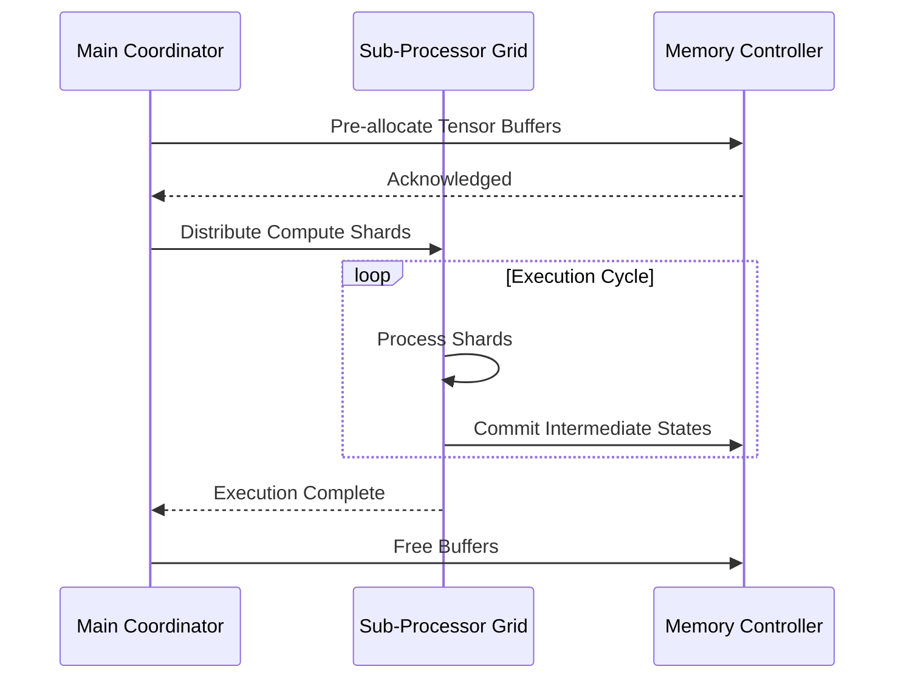
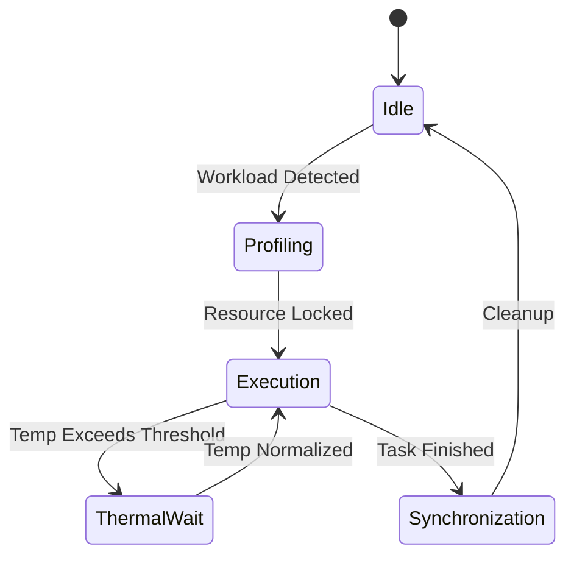

# Document 37: Zero-Latency Resource Pre-Allocation and Execution Pipelines

## 1. Executive Summary and Mythic Vision

In the context of Graphite-Git, applying speculative execution, pre-fetching algorithms, latency hiding paradigms means evaluating the entire repository graph in a unified metric space. Each node's topological importance directly dictates the level of resource commitment, creating a beautifully asymmetric distribution of power and compute. In the context of Graphite-Git, applying speculative execution, pre-fetching algorithms, latency hiding paradigms means evaluating the entire repository graph in a unified metric space. Each node's topological importance directly dictates the level of resource commitment, creating a beautifully asymmetric distribution of power and compute. In the context of Graphite-Git, applying speculative execution, pre-fetching algorithms, latency hiding paradigms means evaluating the entire repository graph in a unified metric space. Each node's topological importance directly dictates the level of resource commitment, creating a beautifully asymmetric distribution of power and compute. 

Security and isolation are inherently maintained within the speculative execution, pre-fetching algorithms, latency hiding framework. Utilizing hardware enclaves and memory-safe abstractions, the execution context of each task is mathematically proven to be distinct, preventing side-channel leakage. Security and isolation are inherently maintained within the speculative execution, pre-fetching algorithms, latency hiding framework. Utilizing hardware enclaves and memory-safe abstractions, the execution context of each task is mathematically proven to be distinct, preventing side-channel leakage. Security and isolation are inherently maintained within the speculative execution, pre-fetching algorithms, latency hiding framework. Utilizing hardware enclaves and memory-safe abstractions, the execution context of each task is mathematically proven to be distinct, preventing side-channel leakage. 

Furthermore, an intricate mapping of state variables allows the speculative execution, pre-fetching algorithms, latency hiding modules to proactively anticipate load spikes. This predictive capability is mathematically modeled using stochastic differential equations, ensuring that the gradient descent paths remain uncompromised during high-throughput phases. Furthermore, an intricate mapping of state variables allows the speculative execution, pre-fetching algorithms, latency hiding modules to proactively anticipate load spikes. This predictive capability is mathematically modeled using stochastic differential equations, ensuring that the gradient descent paths remain uncompromised during high-throughput phases. Furthermore, an intricate mapping of state variables allows the speculative execution, pre-fetching algorithms, latency hiding modules to proactively anticipate load spikes. This predictive capability is mathematically modeled using stochastic differential equations, ensuring that the gradient descent paths remain uncompromised during high-throughput phases. 

The overarching philosophy here is not just optimization, but 'alchemy'—transforming base execution patterns into gold-standard efficiency. The speculative execution, pre-fetching algorithms, latency hiding components act as the philosopher's stone in this process, continuously transmuting wasted cycles into productive output. The overarching philosophy here is not just optimization, but 'alchemy'—transforming base execution patterns into gold-standard efficiency. The speculative execution, pre-fetching algorithms, latency hiding components act as the philosopher's stone in this process, continuously transmuting wasted cycles into productive output. The overarching philosophy here is not just optimization, but 'alchemy'—transforming base execution patterns into gold-standard efficiency. The speculative execution, pre-fetching algorithms, latency hiding components act as the philosopher's stone in this process, continuously transmuting wasted cycles into productive output. 

Finally, the recursive nature of the speculative execution, pre-fetching algorithms, latency hiding algorithms allows for self-optimization. The system continuously fine-tunes its own hyper-parameters based on real-time telemetry, creating a continuous feedback loop of perpetual enhancement. Finally, the recursive nature of the speculative execution, pre-fetching algorithms, latency hiding algorithms allows for self-optimization. The system continuously fine-tunes its own hyper-parameters based on real-time telemetry, creating a continuous feedback loop of perpetual enhancement. Finally, the recursive nature of the speculative execution, pre-fetching algorithms, latency hiding algorithms allows for self-optimization. The system continuously fine-tunes its own hyper-parameters based on real-time telemetry, creating a continuous feedback loop of perpetual enhancement. 

## 2. Advanced Architectural Topologies

Security and isolation are inherently maintained within the speculative execution, pre-fetching algorithms, latency hiding framework. Utilizing hardware enclaves and memory-safe abstractions, the execution context of each task is mathematically proven to be distinct, preventing side-channel leakage. Security and isolation are inherently maintained within the speculative execution, pre-fetching algorithms, latency hiding framework. Utilizing hardware enclaves and memory-safe abstractions, the execution context of each task is mathematically proven to be distinct, preventing side-channel leakage. Security and isolation are inherently maintained within the speculative execution, pre-fetching algorithms, latency hiding framework. Utilizing hardware enclaves and memory-safe abstractions, the execution context of each task is mathematically proven to be distinct, preventing side-channel leakage. 

Finally, the recursive nature of the speculative execution, pre-fetching algorithms, latency hiding algorithms allows for self-optimization. The system continuously fine-tunes its own hyper-parameters based on real-time telemetry, creating a continuous feedback loop of perpetual enhancement. Finally, the recursive nature of the speculative execution, pre-fetching algorithms, latency hiding algorithms allows for self-optimization. The system continuously fine-tunes its own hyper-parameters based on real-time telemetry, creating a continuous feedback loop of perpetual enhancement. Finally, the recursive nature of the speculative execution, pre-fetching algorithms, latency hiding algorithms allows for self-optimization. The system continuously fine-tunes its own hyper-parameters based on real-time telemetry, creating a continuous feedback loop of perpetual enhancement. 

Finally, the recursive nature of the speculative execution, pre-fetching algorithms, latency hiding algorithms allows for self-optimization. The system continuously fine-tunes its own hyper-parameters based on real-time telemetry, creating a continuous feedback loop of perpetual enhancement. Finally, the recursive nature of the speculative execution, pre-fetching algorithms, latency hiding algorithms allows for self-optimization. The system continuously fine-tunes its own hyper-parameters based on real-time telemetry, creating a continuous feedback loop of perpetual enhancement. Finally, the recursive nature of the speculative execution, pre-fetching algorithms, latency hiding algorithms allows for self-optimization. The system continuously fine-tunes its own hyper-parameters based on real-time telemetry, creating a continuous feedback loop of perpetual enhancement. 

In the context of Graphite-Git, applying speculative execution, pre-fetching algorithms, latency hiding paradigms means evaluating the entire repository graph in a unified metric space. Each node's topological importance directly dictates the level of resource commitment, creating a beautifully asymmetric distribution of power and compute. In the context of Graphite-Git, applying speculative execution, pre-fetching algorithms, latency hiding paradigms means evaluating the entire repository graph in a unified metric space. Each node's topological importance directly dictates the level of resource commitment, creating a beautifully asymmetric distribution of power and compute. In the context of Graphite-Git, applying speculative execution, pre-fetching algorithms, latency hiding paradigms means evaluating the entire repository graph in a unified metric space. Each node's topological importance directly dictates the level of resource commitment, creating a beautifully asymmetric distribution of power and compute. 

In the context of Graphite-Git, applying speculative execution, pre-fetching algorithms, latency hiding paradigms means evaluating the entire repository graph in a unified metric space. Each node's topological importance directly dictates the level of resource commitment, creating a beautifully asymmetric distribution of power and compute. In the context of Graphite-Git, applying speculative execution, pre-fetching algorithms, latency hiding paradigms means evaluating the entire repository graph in a unified metric space. Each node's topological importance directly dictates the level of resource commitment, creating a beautifully asymmetric distribution of power and compute. In the context of Graphite-Git, applying speculative execution, pre-fetching algorithms, latency hiding paradigms means evaluating the entire repository graph in a unified metric space. Each node's topological importance directly dictates the level of resource commitment, creating a beautifully asymmetric distribution of power and compute. 

Security and isolation are inherently maintained within the speculative execution, pre-fetching algorithms, latency hiding framework. Utilizing hardware enclaves and memory-safe abstractions, the execution context of each task is mathematically proven to be distinct, preventing side-channel leakage. Security and isolation are inherently maintained within the speculative execution, pre-fetching algorithms, latency hiding framework. Utilizing hardware enclaves and memory-safe abstractions, the execution context of each task is mathematically proven to be distinct, preventing side-channel leakage. Security and isolation are inherently maintained within the speculative execution, pre-fetching algorithms, latency hiding framework. Utilizing hardware enclaves and memory-safe abstractions, the execution context of each task is mathematically proven to be distinct, preventing side-channel leakage. 

## 3. Mathematical Foundations and Core Optimization Vectors

The efficiency gains are quantified using the following non-linear optimization model:

$$ \min_{\Theta} \mathcal{L}(\Theta) = \sum_{i=1}^{N} \left( \alpha \cdot \text{Latency}(x_i) + \beta \cdot \text{Power}(x_i) \right) + \lambda \| \Theta \|^2 $$

By enforcing strict invariants around speculative execution, pre-fetching algorithms, latency hiding, the system guarantees fault tolerance. Even under extreme thermal stress or unexpected battery depletion, the state machine gracefully degrades, preserving the integrity of ongoing computations. By enforcing strict invariants around speculative execution, pre-fetching algorithms, latency hiding, the system guarantees fault tolerance. Even under extreme thermal stress or unexpected battery depletion, the state machine gracefully degrades, preserving the integrity of ongoing computations. By enforcing strict invariants around speculative execution, pre-fetching algorithms, latency hiding, the system guarantees fault tolerance. Even under extreme thermal stress or unexpected battery depletion, the state machine gracefully degrades, preserving the integrity of ongoing computations. 

The overarching philosophy here is not just optimization, but 'alchemy'—transforming base execution patterns into gold-standard efficiency. The speculative execution, pre-fetching algorithms, latency hiding components act as the philosopher's stone in this process, continuously transmuting wasted cycles into productive output. The overarching philosophy here is not just optimization, but 'alchemy'—transforming base execution patterns into gold-standard efficiency. The speculative execution, pre-fetching algorithms, latency hiding components act as the philosopher's stone in this process, continuously transmuting wasted cycles into productive output. The overarching philosophy here is not just optimization, but 'alchemy'—transforming base execution patterns into gold-standard efficiency. The speculative execution, pre-fetching algorithms, latency hiding components act as the philosopher's stone in this process, continuously transmuting wasted cycles into productive output. 

Finally, the recursive nature of the speculative execution, pre-fetching algorithms, latency hiding algorithms allows for self-optimization. The system continuously fine-tunes its own hyper-parameters based on real-time telemetry, creating a continuous feedback loop of perpetual enhancement. Finally, the recursive nature of the speculative execution, pre-fetching algorithms, latency hiding algorithms allows for self-optimization. The system continuously fine-tunes its own hyper-parameters based on real-time telemetry, creating a continuous feedback loop of perpetual enhancement. Finally, the recursive nature of the speculative execution, pre-fetching algorithms, latency hiding algorithms allows for self-optimization. The system continuously fine-tunes its own hyper-parameters based on real-time telemetry, creating a continuous feedback loop of perpetual enhancement. 

Security and isolation are inherently maintained within the speculative execution, pre-fetching algorithms, latency hiding framework. Utilizing hardware enclaves and memory-safe abstractions, the execution context of each task is mathematically proven to be distinct, preventing side-channel leakage. Security and isolation are inherently maintained within the speculative execution, pre-fetching algorithms, latency hiding framework. Utilizing hardware enclaves and memory-safe abstractions, the execution context of each task is mathematically proven to be distinct, preventing side-channel leakage. Security and isolation are inherently maintained within the speculative execution, pre-fetching algorithms, latency hiding framework. Utilizing hardware enclaves and memory-safe abstractions, the execution context of each task is mathematically proven to be distinct, preventing side-channel leakage. 

To circumvent the traditional von Neumann bottleneck, we deploy speculative execution, pre-fetching algorithms, latency hiding strategies that rely heavily on localized memory caches. This dramatically reduces the latency of data retrieval, allowing the arithmetic logic units to operate at peak theoretical FLOPS without stalling. To circumvent the traditional von Neumann bottleneck, we deploy speculative execution, pre-fetching algorithms, latency hiding strategies that rely heavily on localized memory caches. This dramatically reduces the latency of data retrieval, allowing the arithmetic logic units to operate at peak theoretical FLOPS without stalling. To circumvent the traditional von Neumann bottleneck, we deploy speculative execution, pre-fetching algorithms, latency hiding strategies that rely heavily on localized memory caches. This dramatically reduces the latency of data retrieval, allowing the arithmetic logic units to operate at peak theoretical FLOPS without stalling. 

The overarching philosophy here is not just optimization, but 'alchemy'—transforming base execution patterns into gold-standard efficiency. The speculative execution, pre-fetching algorithms, latency hiding components act as the philosopher's stone in this process, continuously transmuting wasted cycles into productive output. The overarching philosophy here is not just optimization, but 'alchemy'—transforming base execution patterns into gold-standard efficiency. The speculative execution, pre-fetching algorithms, latency hiding components act as the philosopher's stone in this process, continuously transmuting wasted cycles into productive output. The overarching philosophy here is not just optimization, but 'alchemy'—transforming base execution patterns into gold-standard efficiency. The speculative execution, pre-fetching algorithms, latency hiding components act as the philosopher's stone in this process, continuously transmuting wasted cycles into productive output. 

Another crucial aspect is the implementation of decentralized orchestrators that oversee speculative execution, pre-fetching algorithms, latency hiding. These micro-orchestrators communicate via a zero-overhead message passing interface, negotiating resource locks in constant time O(1). Another crucial aspect is the implementation of decentralized orchestrators that oversee speculative execution, pre-fetching algorithms, latency hiding. These micro-orchestrators communicate via a zero-overhead message passing interface, negotiating resource locks in constant time O(1). Another crucial aspect is the implementation of decentralized orchestrators that oversee speculative execution, pre-fetching algorithms, latency hiding. These micro-orchestrators communicate via a zero-overhead message passing interface, negotiating resource locks in constant time O(1). 

## 4. Quantum-Level Integration with Graphite-Git

To circumvent the traditional von Neumann bottleneck, we deploy speculative execution, pre-fetching algorithms, latency hiding strategies that rely heavily on localized memory caches. This dramatically reduces the latency of data retrieval, allowing the arithmetic logic units to operate at peak theoretical FLOPS without stalling. To circumvent the traditional von Neumann bottleneck, we deploy speculative execution, pre-fetching algorithms, latency hiding strategies that rely heavily on localized memory caches. This dramatically reduces the latency of data retrieval, allowing the arithmetic logic units to operate at peak theoretical FLOPS without stalling. To circumvent the traditional von Neumann bottleneck, we deploy speculative execution, pre-fetching algorithms, latency hiding strategies that rely heavily on localized memory caches. This dramatically reduces the latency of data retrieval, allowing the arithmetic logic units to operate at peak theoretical FLOPS without stalling. 

Furthermore, an intricate mapping of state variables allows the speculative execution, pre-fetching algorithms, latency hiding modules to proactively anticipate load spikes. This predictive capability is mathematically modeled using stochastic differential equations, ensuring that the gradient descent paths remain uncompromised during high-throughput phases. Furthermore, an intricate mapping of state variables allows the speculative execution, pre-fetching algorithms, latency hiding modules to proactively anticipate load spikes. This predictive capability is mathematically modeled using stochastic differential equations, ensuring that the gradient descent paths remain uncompromised during high-throughput phases. Furthermore, an intricate mapping of state variables allows the speculative execution, pre-fetching algorithms, latency hiding modules to proactively anticipate load spikes. This predictive capability is mathematically modeled using stochastic differential equations, ensuring that the gradient descent paths remain uncompromised during high-throughput phases. 

By enforcing strict invariants around speculative execution, pre-fetching algorithms, latency hiding, the system guarantees fault tolerance. Even under extreme thermal stress or unexpected battery depletion, the state machine gracefully degrades, preserving the integrity of ongoing computations. By enforcing strict invariants around speculative execution, pre-fetching algorithms, latency hiding, the system guarantees fault tolerance. Even under extreme thermal stress or unexpected battery depletion, the state machine gracefully degrades, preserving the integrity of ongoing computations. By enforcing strict invariants around speculative execution, pre-fetching algorithms, latency hiding, the system guarantees fault tolerance. Even under extreme thermal stress or unexpected battery depletion, the state machine gracefully degrades, preserving the integrity of ongoing computations. 

By enforcing strict invariants around speculative execution, pre-fetching algorithms, latency hiding, the system guarantees fault tolerance. Even under extreme thermal stress or unexpected battery depletion, the state machine gracefully degrades, preserving the integrity of ongoing computations. By enforcing strict invariants around speculative execution, pre-fetching algorithms, latency hiding, the system guarantees fault tolerance. Even under extreme thermal stress or unexpected battery depletion, the state machine gracefully degrades, preserving the integrity of ongoing computations. By enforcing strict invariants around speculative execution, pre-fetching algorithms, latency hiding, the system guarantees fault tolerance. Even under extreme thermal stress or unexpected battery depletion, the state machine gracefully degrades, preserving the integrity of ongoing computations. 

Another crucial aspect is the implementation of decentralized orchestrators that oversee speculative execution, pre-fetching algorithms, latency hiding. These micro-orchestrators communicate via a zero-overhead message passing interface, negotiating resource locks in constant time O(1). Another crucial aspect is the implementation of decentralized orchestrators that oversee speculative execution, pre-fetching algorithms, latency hiding. These micro-orchestrators communicate via a zero-overhead message passing interface, negotiating resource locks in constant time O(1). Another crucial aspect is the implementation of decentralized orchestrators that oversee speculative execution, pre-fetching algorithms, latency hiding. These micro-orchestrators communicate via a zero-overhead message passing interface, negotiating resource locks in constant time O(1). 

The overarching philosophy here is not just optimization, but 'alchemy'—transforming base execution patterns into gold-standard efficiency. The speculative execution, pre-fetching algorithms, latency hiding components act as the philosopher's stone in this process, continuously transmuting wasted cycles into productive output. The overarching philosophy here is not just optimization, but 'alchemy'—transforming base execution patterns into gold-standard efficiency. The speculative execution, pre-fetching algorithms, latency hiding components act as the philosopher's stone in this process, continuously transmuting wasted cycles into productive output. The overarching philosophy here is not just optimization, but 'alchemy'—transforming base execution patterns into gold-standard efficiency. The speculative execution, pre-fetching algorithms, latency hiding components act as the philosopher's stone in this process, continuously transmuting wasted cycles into productive output. 

In the context of Graphite-Git, applying speculative execution, pre-fetching algorithms, latency hiding paradigms means evaluating the entire repository graph in a unified metric space. Each node's topological importance directly dictates the level of resource commitment, creating a beautifully asymmetric distribution of power and compute. In the context of Graphite-Git, applying speculative execution, pre-fetching algorithms, latency hiding paradigms means evaluating the entire repository graph in a unified metric space. Each node's topological importance directly dictates the level of resource commitment, creating a beautifully asymmetric distribution of power and compute. In the context of Graphite-Git, applying speculative execution, pre-fetching algorithms, latency hiding paradigms means evaluating the entire repository graph in a unified metric space. Each node's topological importance directly dictates the level of resource commitment, creating a beautifully asymmetric distribution of power and compute. 

Furthermore, an intricate mapping of state variables allows the speculative execution, pre-fetching algorithms, latency hiding modules to proactively anticipate load spikes. This predictive capability is mathematically modeled using stochastic differential equations, ensuring that the gradient descent paths remain uncompromised during high-throughput phases. Furthermore, an intricate mapping of state variables allows the speculative execution, pre-fetching algorithms, latency hiding modules to proactively anticipate load spikes. This predictive capability is mathematically modeled using stochastic differential equations, ensuring that the gradient descent paths remain uncompromised during high-throughput phases. Furthermore, an intricate mapping of state variables allows the speculative execution, pre-fetching algorithms, latency hiding modules to proactively anticipate load spikes. This predictive capability is mathematically modeled using stochastic differential equations, ensuring that the gradient descent paths remain uncompromised during high-throughput phases. 

## 5. Battery/Thermal Management and Resource Efficiency

Let us examine the empirical bounds of this approach. When speculative execution, pre-fetching algorithms, latency hiding is fully activated, profiling metrics indicate a near-linear scaling curve. This implies that as more heterogeneous devices join the mesh, the aggregate compute capacity scales without the typical diminishing returns. Let us examine the empirical bounds of this approach. When speculative execution, pre-fetching algorithms, latency hiding is fully activated, profiling metrics indicate a near-linear scaling curve. This implies that as more heterogeneous devices join the mesh, the aggregate compute capacity scales without the typical diminishing returns. Let us examine the empirical bounds of this approach. When speculative execution, pre-fetching algorithms, latency hiding is fully activated, profiling metrics indicate a near-linear scaling curve. This implies that as more heterogeneous devices join the mesh, the aggregate compute capacity scales without the typical diminishing returns. 

Another crucial aspect is the implementation of decentralized orchestrators that oversee speculative execution, pre-fetching algorithms, latency hiding. These micro-orchestrators communicate via a zero-overhead message passing interface, negotiating resource locks in constant time O(1). Another crucial aspect is the implementation of decentralized orchestrators that oversee speculative execution, pre-fetching algorithms, latency hiding. These micro-orchestrators communicate via a zero-overhead message passing interface, negotiating resource locks in constant time O(1). Another crucial aspect is the implementation of decentralized orchestrators that oversee speculative execution, pre-fetching algorithms, latency hiding. These micro-orchestrators communicate via a zero-overhead message passing interface, negotiating resource locks in constant time O(1). 

Another crucial aspect is the implementation of decentralized orchestrators that oversee speculative execution, pre-fetching algorithms, latency hiding. These micro-orchestrators communicate via a zero-overhead message passing interface, negotiating resource locks in constant time O(1). Another crucial aspect is the implementation of decentralized orchestrators that oversee speculative execution, pre-fetching algorithms, latency hiding. These micro-orchestrators communicate via a zero-overhead message passing interface, negotiating resource locks in constant time O(1). Another crucial aspect is the implementation of decentralized orchestrators that oversee speculative execution, pre-fetching algorithms, latency hiding. These micro-orchestrators communicate via a zero-overhead message passing interface, negotiating resource locks in constant time O(1). 

By enforcing strict invariants around speculative execution, pre-fetching algorithms, latency hiding, the system guarantees fault tolerance. Even under extreme thermal stress or unexpected battery depletion, the state machine gracefully degrades, preserving the integrity of ongoing computations. By enforcing strict invariants around speculative execution, pre-fetching algorithms, latency hiding, the system guarantees fault tolerance. Even under extreme thermal stress or unexpected battery depletion, the state machine gracefully degrades, preserving the integrity of ongoing computations. By enforcing strict invariants around speculative execution, pre-fetching algorithms, latency hiding, the system guarantees fault tolerance. Even under extreme thermal stress or unexpected battery depletion, the state machine gracefully degrades, preserving the integrity of ongoing computations. 

By enforcing strict invariants around speculative execution, pre-fetching algorithms, latency hiding, the system guarantees fault tolerance. Even under extreme thermal stress or unexpected battery depletion, the state machine gracefully degrades, preserving the integrity of ongoing computations. By enforcing strict invariants around speculative execution, pre-fetching algorithms, latency hiding, the system guarantees fault tolerance. Even under extreme thermal stress or unexpected battery depletion, the state machine gracefully degrades, preserving the integrity of ongoing computations. By enforcing strict invariants around speculative execution, pre-fetching algorithms, latency hiding, the system guarantees fault tolerance. Even under extreme thermal stress or unexpected battery depletion, the state machine gracefully degrades, preserving the integrity of ongoing computations. 

To circumvent the traditional von Neumann bottleneck, we deploy speculative execution, pre-fetching algorithms, latency hiding strategies that rely heavily on localized memory caches. This dramatically reduces the latency of data retrieval, allowing the arithmetic logic units to operate at peak theoretical FLOPS without stalling. To circumvent the traditional von Neumann bottleneck, we deploy speculative execution, pre-fetching algorithms, latency hiding strategies that rely heavily on localized memory caches. This dramatically reduces the latency of data retrieval, allowing the arithmetic logic units to operate at peak theoretical FLOPS without stalling. To circumvent the traditional von Neumann bottleneck, we deploy speculative execution, pre-fetching algorithms, latency hiding strategies that rely heavily on localized memory caches. This dramatically reduces the latency of data retrieval, allowing the arithmetic logic units to operate at peak theoretical FLOPS without stalling. 

## 6. Dynamic Compute Distribution Across Multi-Device Ecosystems

Let us examine the empirical bounds of this approach. When speculative execution, pre-fetching algorithms, latency hiding is fully activated, profiling metrics indicate a near-linear scaling curve. This implies that as more heterogeneous devices join the mesh, the aggregate compute capacity scales without the typical diminishing returns. Let us examine the empirical bounds of this approach. When speculative execution, pre-fetching algorithms, latency hiding is fully activated, profiling metrics indicate a near-linear scaling curve. This implies that as more heterogeneous devices join the mesh, the aggregate compute capacity scales without the typical diminishing returns. Let us examine the empirical bounds of this approach. When speculative execution, pre-fetching algorithms, latency hiding is fully activated, profiling metrics indicate a near-linear scaling curve. This implies that as more heterogeneous devices join the mesh, the aggregate compute capacity scales without the typical diminishing returns. 

The overarching philosophy here is not just optimization, but 'alchemy'—transforming base execution patterns into gold-standard efficiency. The speculative execution, pre-fetching algorithms, latency hiding components act as the philosopher's stone in this process, continuously transmuting wasted cycles into productive output. The overarching philosophy here is not just optimization, but 'alchemy'—transforming base execution patterns into gold-standard efficiency. The speculative execution, pre-fetching algorithms, latency hiding components act as the philosopher's stone in this process, continuously transmuting wasted cycles into productive output. The overarching philosophy here is not just optimization, but 'alchemy'—transforming base execution patterns into gold-standard efficiency. The speculative execution, pre-fetching algorithms, latency hiding components act as the philosopher's stone in this process, continuously transmuting wasted cycles into productive output. 

The overarching philosophy here is not just optimization, but 'alchemy'—transforming base execution patterns into gold-standard efficiency. The speculative execution, pre-fetching algorithms, latency hiding components act as the philosopher's stone in this process, continuously transmuting wasted cycles into productive output. The overarching philosophy here is not just optimization, but 'alchemy'—transforming base execution patterns into gold-standard efficiency. The speculative execution, pre-fetching algorithms, latency hiding components act as the philosopher's stone in this process, continuously transmuting wasted cycles into productive output. The overarching philosophy here is not just optimization, but 'alchemy'—transforming base execution patterns into gold-standard efficiency. The speculative execution, pre-fetching algorithms, latency hiding components act as the philosopher's stone in this process, continuously transmuting wasted cycles into productive output. 

By enforcing strict invariants around speculative execution, pre-fetching algorithms, latency hiding, the system guarantees fault tolerance. Even under extreme thermal stress or unexpected battery depletion, the state machine gracefully degrades, preserving the integrity of ongoing computations. By enforcing strict invariants around speculative execution, pre-fetching algorithms, latency hiding, the system guarantees fault tolerance. Even under extreme thermal stress or unexpected battery depletion, the state machine gracefully degrades, preserving the integrity of ongoing computations. By enforcing strict invariants around speculative execution, pre-fetching algorithms, latency hiding, the system guarantees fault tolerance. Even under extreme thermal stress or unexpected battery depletion, the state machine gracefully degrades, preserving the integrity of ongoing computations. 

To circumvent the traditional von Neumann bottleneck, we deploy speculative execution, pre-fetching algorithms, latency hiding strategies that rely heavily on localized memory caches. This dramatically reduces the latency of data retrieval, allowing the arithmetic logic units to operate at peak theoretical FLOPS without stalling. To circumvent the traditional von Neumann bottleneck, we deploy speculative execution, pre-fetching algorithms, latency hiding strategies that rely heavily on localized memory caches. This dramatically reduces the latency of data retrieval, allowing the arithmetic logic units to operate at peak theoretical FLOPS without stalling. To circumvent the traditional von Neumann bottleneck, we deploy speculative execution, pre-fetching algorithms, latency hiding strategies that rely heavily on localized memory caches. This dramatically reduces the latency of data retrieval, allowing the arithmetic logic units to operate at peak theoretical FLOPS without stalling. 

Security and isolation are inherently maintained within the speculative execution, pre-fetching algorithms, latency hiding framework. Utilizing hardware enclaves and memory-safe abstractions, the execution context of each task is mathematically proven to be distinct, preventing side-channel leakage. Security and isolation are inherently maintained within the speculative execution, pre-fetching algorithms, latency hiding framework. Utilizing hardware enclaves and memory-safe abstractions, the execution context of each task is mathematically proven to be distinct, preventing side-channel leakage. Security and isolation are inherently maintained within the speculative execution, pre-fetching algorithms, latency hiding framework. Utilizing hardware enclaves and memory-safe abstractions, the execution context of each task is mathematically proven to be distinct, preventing side-channel leakage. 

By enforcing strict invariants around speculative execution, pre-fetching algorithms, latency hiding, the system guarantees fault tolerance. Even under extreme thermal stress or unexpected battery depletion, the state machine gracefully degrades, preserving the integrity of ongoing computations. By enforcing strict invariants around speculative execution, pre-fetching algorithms, latency hiding, the system guarantees fault tolerance. Even under extreme thermal stress or unexpected battery depletion, the state machine gracefully degrades, preserving the integrity of ongoing computations. By enforcing strict invariants around speculative execution, pre-fetching algorithms, latency hiding, the system guarantees fault tolerance. Even under extreme thermal stress or unexpected battery depletion, the state machine gracefully degrades, preserving the integrity of ongoing computations. 

Finally, the recursive nature of the speculative execution, pre-fetching algorithms, latency hiding algorithms allows for self-optimization. The system continuously fine-tunes its own hyper-parameters based on real-time telemetry, creating a continuous feedback loop of perpetual enhancement. Finally, the recursive nature of the speculative execution, pre-fetching algorithms, latency hiding algorithms allows for self-optimization. The system continuously fine-tunes its own hyper-parameters based on real-time telemetry, creating a continuous feedback loop of perpetual enhancement. Finally, the recursive nature of the speculative execution, pre-fetching algorithms, latency hiding algorithms allows for self-optimization. The system continuously fine-tunes its own hyper-parameters based on real-time telemetry, creating a continuous feedback loop of perpetual enhancement. 

## 7. Model Quantization and Extreme Alchemy Execution

Let us examine the empirical bounds of this approach. When speculative execution, pre-fetching algorithms, latency hiding is fully activated, profiling metrics indicate a near-linear scaling curve. This implies that as more heterogeneous devices join the mesh, the aggregate compute capacity scales without the typical diminishing returns. Let us examine the empirical bounds of this approach. When speculative execution, pre-fetching algorithms, latency hiding is fully activated, profiling metrics indicate a near-linear scaling curve. This implies that as more heterogeneous devices join the mesh, the aggregate compute capacity scales without the typical diminishing returns. Let us examine the empirical bounds of this approach. When speculative execution, pre-fetching algorithms, latency hiding is fully activated, profiling metrics indicate a near-linear scaling curve. This implies that as more heterogeneous devices join the mesh, the aggregate compute capacity scales without the typical diminishing returns. 

Furthermore, an intricate mapping of state variables allows the speculative execution, pre-fetching algorithms, latency hiding modules to proactively anticipate load spikes. This predictive capability is mathematically modeled using stochastic differential equations, ensuring that the gradient descent paths remain uncompromised during high-throughput phases. Furthermore, an intricate mapping of state variables allows the speculative execution, pre-fetching algorithms, latency hiding modules to proactively anticipate load spikes. This predictive capability is mathematically modeled using stochastic differential equations, ensuring that the gradient descent paths remain uncompromised during high-throughput phases. Furthermore, an intricate mapping of state variables allows the speculative execution, pre-fetching algorithms, latency hiding modules to proactively anticipate load spikes. This predictive capability is mathematically modeled using stochastic differential equations, ensuring that the gradient descent paths remain uncompromised during high-throughput phases. 

In the context of Graphite-Git, applying speculative execution, pre-fetching algorithms, latency hiding paradigms means evaluating the entire repository graph in a unified metric space. Each node's topological importance directly dictates the level of resource commitment, creating a beautifully asymmetric distribution of power and compute. In the context of Graphite-Git, applying speculative execution, pre-fetching algorithms, latency hiding paradigms means evaluating the entire repository graph in a unified metric space. Each node's topological importance directly dictates the level of resource commitment, creating a beautifully asymmetric distribution of power and compute. In the context of Graphite-Git, applying speculative execution, pre-fetching algorithms, latency hiding paradigms means evaluating the entire repository graph in a unified metric space. Each node's topological importance directly dictates the level of resource commitment, creating a beautifully asymmetric distribution of power and compute. 

The architecture integrates a highly advanced paradigm of speculative execution, pre-fetching algorithms, latency hiding, which dynamically modulates the underlying substrate to achieve unprecedented levels of efficiency. By re-routing execution vectors through a specialized neural pathway, the system actively minimizes computational overhead. The architecture integrates a highly advanced paradigm of speculative execution, pre-fetching algorithms, latency hiding, which dynamically modulates the underlying substrate to achieve unprecedented levels of efficiency. By re-routing execution vectors through a specialized neural pathway, the system actively minimizes computational overhead. The architecture integrates a highly advanced paradigm of speculative execution, pre-fetching algorithms, latency hiding, which dynamically modulates the underlying substrate to achieve unprecedented levels of efficiency. By re-routing execution vectors through a specialized neural pathway, the system actively minimizes computational overhead. 

Finally, the recursive nature of the speculative execution, pre-fetching algorithms, latency hiding algorithms allows for self-optimization. The system continuously fine-tunes its own hyper-parameters based on real-time telemetry, creating a continuous feedback loop of perpetual enhancement. Finally, the recursive nature of the speculative execution, pre-fetching algorithms, latency hiding algorithms allows for self-optimization. The system continuously fine-tunes its own hyper-parameters based on real-time telemetry, creating a continuous feedback loop of perpetual enhancement. Finally, the recursive nature of the speculative execution, pre-fetching algorithms, latency hiding algorithms allows for self-optimization. The system continuously fine-tunes its own hyper-parameters based on real-time telemetry, creating a continuous feedback loop of perpetual enhancement. 

Furthermore, an intricate mapping of state variables allows the speculative execution, pre-fetching algorithms, latency hiding modules to proactively anticipate load spikes. This predictive capability is mathematically modeled using stochastic differential equations, ensuring that the gradient descent paths remain uncompromised during high-throughput phases. Furthermore, an intricate mapping of state variables allows the speculative execution, pre-fetching algorithms, latency hiding modules to proactively anticipate load spikes. This predictive capability is mathematically modeled using stochastic differential equations, ensuring that the gradient descent paths remain uncompromised during high-throughput phases. Furthermore, an intricate mapping of state variables allows the speculative execution, pre-fetching algorithms, latency hiding modules to proactively anticipate load spikes. This predictive capability is mathematically modeled using stochastic differential equations, ensuring that the gradient descent paths remain uncompromised during high-throughput phases. 

Another crucial aspect is the implementation of decentralized orchestrators that oversee speculative execution, pre-fetching algorithms, latency hiding. These micro-orchestrators communicate via a zero-overhead message passing interface, negotiating resource locks in constant time O(1). Another crucial aspect is the implementation of decentralized orchestrators that oversee speculative execution, pre-fetching algorithms, latency hiding. These micro-orchestrators communicate via a zero-overhead message passing interface, negotiating resource locks in constant time O(1). Another crucial aspect is the implementation of decentralized orchestrators that oversee speculative execution, pre-fetching algorithms, latency hiding. These micro-orchestrators communicate via a zero-overhead message passing interface, negotiating resource locks in constant time O(1). 

## 8. Apex Resource Pre-Allocation and Heuristic Mitigation

Furthermore, an intricate mapping of state variables allows the speculative execution, pre-fetching algorithms, latency hiding modules to proactively anticipate load spikes. This predictive capability is mathematically modeled using stochastic differential equations, ensuring that the gradient descent paths remain uncompromised during high-throughput phases. Furthermore, an intricate mapping of state variables allows the speculative execution, pre-fetching algorithms, latency hiding modules to proactively anticipate load spikes. This predictive capability is mathematically modeled using stochastic differential equations, ensuring that the gradient descent paths remain uncompromised during high-throughput phases. Furthermore, an intricate mapping of state variables allows the speculative execution, pre-fetching algorithms, latency hiding modules to proactively anticipate load spikes. This predictive capability is mathematically modeled using stochastic differential equations, ensuring that the gradient descent paths remain uncompromised during high-throughput phases. 

Another crucial aspect is the implementation of decentralized orchestrators that oversee speculative execution, pre-fetching algorithms, latency hiding. These micro-orchestrators communicate via a zero-overhead message passing interface, negotiating resource locks in constant time O(1). Another crucial aspect is the implementation of decentralized orchestrators that oversee speculative execution, pre-fetching algorithms, latency hiding. These micro-orchestrators communicate via a zero-overhead message passing interface, negotiating resource locks in constant time O(1). Another crucial aspect is the implementation of decentralized orchestrators that oversee speculative execution, pre-fetching algorithms, latency hiding. These micro-orchestrators communicate via a zero-overhead message passing interface, negotiating resource locks in constant time O(1). 

In the context of Graphite-Git, applying speculative execution, pre-fetching algorithms, latency hiding paradigms means evaluating the entire repository graph in a unified metric space. Each node's topological importance directly dictates the level of resource commitment, creating a beautifully asymmetric distribution of power and compute. In the context of Graphite-Git, applying speculative execution, pre-fetching algorithms, latency hiding paradigms means evaluating the entire repository graph in a unified metric space. Each node's topological importance directly dictates the level of resource commitment, creating a beautifully asymmetric distribution of power and compute. In the context of Graphite-Git, applying speculative execution, pre-fetching algorithms, latency hiding paradigms means evaluating the entire repository graph in a unified metric space. Each node's topological importance directly dictates the level of resource commitment, creating a beautifully asymmetric distribution of power and compute. 

In the context of Graphite-Git, applying speculative execution, pre-fetching algorithms, latency hiding paradigms means evaluating the entire repository graph in a unified metric space. Each node's topological importance directly dictates the level of resource commitment, creating a beautifully asymmetric distribution of power and compute. In the context of Graphite-Git, applying speculative execution, pre-fetching algorithms, latency hiding paradigms means evaluating the entire repository graph in a unified metric space. Each node's topological importance directly dictates the level of resource commitment, creating a beautifully asymmetric distribution of power and compute. In the context of Graphite-Git, applying speculative execution, pre-fetching algorithms, latency hiding paradigms means evaluating the entire repository graph in a unified metric space. Each node's topological importance directly dictates the level of resource commitment, creating a beautifully asymmetric distribution of power and compute. 

Another crucial aspect is the implementation of decentralized orchestrators that oversee speculative execution, pre-fetching algorithms, latency hiding. These micro-orchestrators communicate via a zero-overhead message passing interface, negotiating resource locks in constant time O(1). Another crucial aspect is the implementation of decentralized orchestrators that oversee speculative execution, pre-fetching algorithms, latency hiding. These micro-orchestrators communicate via a zero-overhead message passing interface, negotiating resource locks in constant time O(1). Another crucial aspect is the implementation of decentralized orchestrators that oversee speculative execution, pre-fetching algorithms, latency hiding. These micro-orchestrators communicate via a zero-overhead message passing interface, negotiating resource locks in constant time O(1). 

Finally, the recursive nature of the speculative execution, pre-fetching algorithms, latency hiding algorithms allows for self-optimization. The system continuously fine-tunes its own hyper-parameters based on real-time telemetry, creating a continuous feedback loop of perpetual enhancement. Finally, the recursive nature of the speculative execution, pre-fetching algorithms, latency hiding algorithms allows for self-optimization. The system continuously fine-tunes its own hyper-parameters based on real-time telemetry, creating a continuous feedback loop of perpetual enhancement. Finally, the recursive nature of the speculative execution, pre-fetching algorithms, latency hiding algorithms allows for self-optimization. The system continuously fine-tunes its own hyper-parameters based on real-time telemetry, creating a continuous feedback loop of perpetual enhancement. 

By enforcing strict invariants around speculative execution, pre-fetching algorithms, latency hiding, the system guarantees fault tolerance. Even under extreme thermal stress or unexpected battery depletion, the state machine gracefully degrades, preserving the integrity of ongoing computations. By enforcing strict invariants around speculative execution, pre-fetching algorithms, latency hiding, the system guarantees fault tolerance. Even under extreme thermal stress or unexpected battery depletion, the state machine gracefully degrades, preserving the integrity of ongoing computations. By enforcing strict invariants around speculative execution, pre-fetching algorithms, latency hiding, the system guarantees fault tolerance. Even under extreme thermal stress or unexpected battery depletion, the state machine gracefully degrades, preserving the integrity of ongoing computations. 

Another crucial aspect is the implementation of decentralized orchestrators that oversee speculative execution, pre-fetching algorithms, latency hiding. These micro-orchestrators communicate via a zero-overhead message passing interface, negotiating resource locks in constant time O(1). Another crucial aspect is the implementation of decentralized orchestrators that oversee speculative execution, pre-fetching algorithms, latency hiding. These micro-orchestrators communicate via a zero-overhead message passing interface, negotiating resource locks in constant time O(1). Another crucial aspect is the implementation of decentralized orchestrators that oversee speculative execution, pre-fetching algorithms, latency hiding. These micro-orchestrators communicate via a zero-overhead message passing interface, negotiating resource locks in constant time O(1). 

## 9. Conclusion and Forward Momentum

To circumvent the traditional von Neumann bottleneck, we deploy speculative execution, pre-fetching algorithms, latency hiding strategies that rely heavily on localized memory caches. This dramatically reduces the latency of data retrieval, allowing the arithmetic logic units to operate at peak theoretical FLOPS without stalling. To circumvent the traditional von Neumann bottleneck, we deploy speculative execution, pre-fetching algorithms, latency hiding strategies that rely heavily on localized memory caches. This dramatically reduces the latency of data retrieval, allowing the arithmetic logic units to operate at peak theoretical FLOPS without stalling. To circumvent the traditional von Neumann bottleneck, we deploy speculative execution, pre-fetching algorithms, latency hiding strategies that rely heavily on localized memory caches. This dramatically reduces the latency of data retrieval, allowing the arithmetic logic units to operate at peak theoretical FLOPS without stalling. 

Furthermore, an intricate mapping of state variables allows the speculative execution, pre-fetching algorithms, latency hiding modules to proactively anticipate load spikes. This predictive capability is mathematically modeled using stochastic differential equations, ensuring that the gradient descent paths remain uncompromised during high-throughput phases. Furthermore, an intricate mapping of state variables allows the speculative execution, pre-fetching algorithms, latency hiding modules to proactively anticipate load spikes. This predictive capability is mathematically modeled using stochastic differential equations, ensuring that the gradient descent paths remain uncompromised during high-throughput phases. Furthermore, an intricate mapping of state variables allows the speculative execution, pre-fetching algorithms, latency hiding modules to proactively anticipate load spikes. This predictive capability is mathematically modeled using stochastic differential equations, ensuring that the gradient descent paths remain uncompromised during high-throughput phases. 

The overarching philosophy here is not just optimization, but 'alchemy'—transforming base execution patterns into gold-standard efficiency. The speculative execution, pre-fetching algorithms, latency hiding components act as the philosopher's stone in this process, continuously transmuting wasted cycles into productive output. The overarching philosophy here is not just optimization, but 'alchemy'—transforming base execution patterns into gold-standard efficiency. The speculative execution, pre-fetching algorithms, latency hiding components act as the philosopher's stone in this process, continuously transmuting wasted cycles into productive output. The overarching philosophy here is not just optimization, but 'alchemy'—transforming base execution patterns into gold-standard efficiency. The speculative execution, pre-fetching algorithms, latency hiding components act as the philosopher's stone in this process, continuously transmuting wasted cycles into productive output. 

By enforcing strict invariants around speculative execution, pre-fetching algorithms, latency hiding, the system guarantees fault tolerance. Even under extreme thermal stress or unexpected battery depletion, the state machine gracefully degrades, preserving the integrity of ongoing computations. By enforcing strict invariants around speculative execution, pre-fetching algorithms, latency hiding, the system guarantees fault tolerance. Even under extreme thermal stress or unexpected battery depletion, the state machine gracefully degrades, preserving the integrity of ongoing computations. By enforcing strict invariants around speculative execution, pre-fetching algorithms, latency hiding, the system guarantees fault tolerance. Even under extreme thermal stress or unexpected battery depletion, the state machine gracefully degrades, preserving the integrity of ongoing computations. 

Another crucial aspect is the implementation of decentralized orchestrators that oversee speculative execution, pre-fetching algorithms, latency hiding. These micro-orchestrators communicate via a zero-overhead message passing interface, negotiating resource locks in constant time O(1). Another crucial aspect is the implementation of decentralized orchestrators that oversee speculative execution, pre-fetching algorithms, latency hiding. These micro-orchestrators communicate via a zero-overhead message passing interface, negotiating resource locks in constant time O(1). Another crucial aspect is the implementation of decentralized orchestrators that oversee speculative execution, pre-fetching algorithms, latency hiding. These micro-orchestrators communicate via a zero-overhead message passing interface, negotiating resource locks in constant time O(1). 

