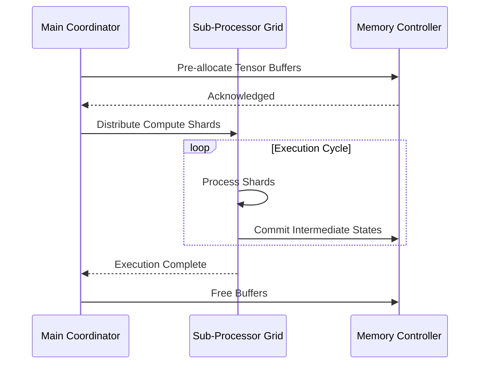
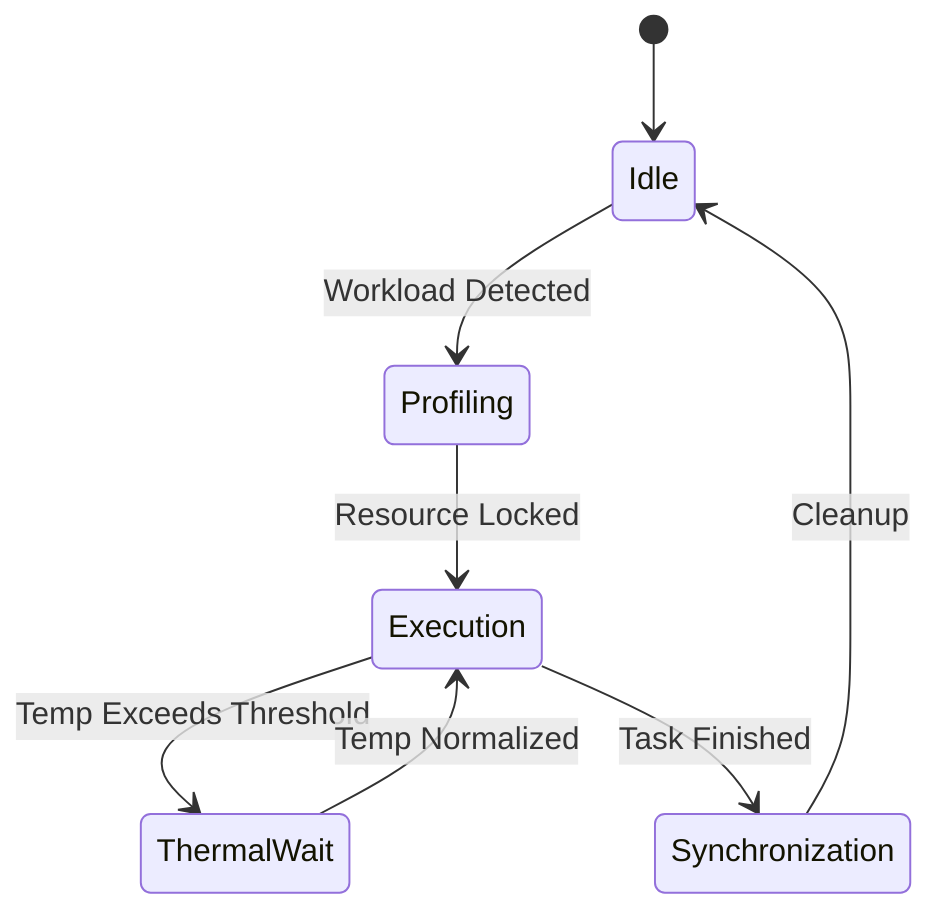

# Document 40: Apex Resource Efficiency and Energy-Aware Processing Topologies

## 1. Executive Summary and Mythic Vision

Finally, the recursive nature of the energy-proportional computing, topology optimization, sustainable execution algorithms allows for self-optimization. The system continuously fine-tunes its own hyper-parameters based on real-time telemetry, creating a continuous feedback loop of perpetual enhancement. Finally, the recursive nature of the energy-proportional computing, topology optimization, sustainable execution algorithms allows for self-optimization. The system continuously fine-tunes its own hyper-parameters based on real-time telemetry, creating a continuous feedback loop of perpetual enhancement. Finally, the recursive nature of the energy-proportional computing, topology optimization, sustainable execution algorithms allows for self-optimization. The system continuously fine-tunes its own hyper-parameters based on real-time telemetry, creating a continuous feedback loop of perpetual enhancement. 

By enforcing strict invariants around energy-proportional computing, topology optimization, sustainable execution, the system guarantees fault tolerance. Even under extreme thermal stress or unexpected battery depletion, the state machine gracefully degrades, preserving the integrity of ongoing computations. By enforcing strict invariants around energy-proportional computing, topology optimization, sustainable execution, the system guarantees fault tolerance. Even under extreme thermal stress or unexpected battery depletion, the state machine gracefully degrades, preserving the integrity of ongoing computations. By enforcing strict invariants around energy-proportional computing, topology optimization, sustainable execution, the system guarantees fault tolerance. Even under extreme thermal stress or unexpected battery depletion, the state machine gracefully degrades, preserving the integrity of ongoing computations. 

Let us examine the empirical bounds of this approach. When energy-proportional computing, topology optimization, sustainable execution is fully activated, profiling metrics indicate a near-linear scaling curve. This implies that as more heterogeneous devices join the mesh, the aggregate compute capacity scales without the typical diminishing returns. Let us examine the empirical bounds of this approach. When energy-proportional computing, topology optimization, sustainable execution is fully activated, profiling metrics indicate a near-linear scaling curve. This implies that as more heterogeneous devices join the mesh, the aggregate compute capacity scales without the typical diminishing returns. Let us examine the empirical bounds of this approach. When energy-proportional computing, topology optimization, sustainable execution is fully activated, profiling metrics indicate a near-linear scaling curve. This implies that as more heterogeneous devices join the mesh, the aggregate compute capacity scales without the typical diminishing returns. 

To circumvent the traditional von Neumann bottleneck, we deploy energy-proportional computing, topology optimization, sustainable execution strategies that rely heavily on localized memory caches. This dramatically reduces the latency of data retrieval, allowing the arithmetic logic units to operate at peak theoretical FLOPS without stalling. To circumvent the traditional von Neumann bottleneck, we deploy energy-proportional computing, topology optimization, sustainable execution strategies that rely heavily on localized memory caches. This dramatically reduces the latency of data retrieval, allowing the arithmetic logic units to operate at peak theoretical FLOPS without stalling. To circumvent the traditional von Neumann bottleneck, we deploy energy-proportional computing, topology optimization, sustainable execution strategies that rely heavily on localized memory caches. This dramatically reduces the latency of data retrieval, allowing the arithmetic logic units to operate at peak theoretical FLOPS without stalling. 

The overarching philosophy here is not just optimization, but 'alchemy'—transforming base execution patterns into gold-standard efficiency. The energy-proportional computing, topology optimization, sustainable execution components act as the philosopher's stone in this process, continuously transmuting wasted cycles into productive output. The overarching philosophy here is not just optimization, but 'alchemy'—transforming base execution patterns into gold-standard efficiency. The energy-proportional computing, topology optimization, sustainable execution components act as the philosopher's stone in this process, continuously transmuting wasted cycles into productive output. The overarching philosophy here is not just optimization, but 'alchemy'—transforming base execution patterns into gold-standard efficiency. The energy-proportional computing, topology optimization, sustainable execution components act as the philosopher's stone in this process, continuously transmuting wasted cycles into productive output. 

## 2. Advanced Architectural Topologies

In the context of Graphite-Git, applying energy-proportional computing, topology optimization, sustainable execution paradigms means evaluating the entire repository graph in a unified metric space. Each node's topological importance directly dictates the level of resource commitment, creating a beautifully asymmetric distribution of power and compute. In the context of Graphite-Git, applying energy-proportional computing, topology optimization, sustainable execution paradigms means evaluating the entire repository graph in a unified metric space. Each node's topological importance directly dictates the level of resource commitment, creating a beautifully asymmetric distribution of power and compute. In the context of Graphite-Git, applying energy-proportional computing, topology optimization, sustainable execution paradigms means evaluating the entire repository graph in a unified metric space. Each node's topological importance directly dictates the level of resource commitment, creating a beautifully asymmetric distribution of power and compute. 

Security and isolation are inherently maintained within the energy-proportional computing, topology optimization, sustainable execution framework. Utilizing hardware enclaves and memory-safe abstractions, the execution context of each task is mathematically proven to be distinct, preventing side-channel leakage. Security and isolation are inherently maintained within the energy-proportional computing, topology optimization, sustainable execution framework. Utilizing hardware enclaves and memory-safe abstractions, the execution context of each task is mathematically proven to be distinct, preventing side-channel leakage. Security and isolation are inherently maintained within the energy-proportional computing, topology optimization, sustainable execution framework. Utilizing hardware enclaves and memory-safe abstractions, the execution context of each task is mathematically proven to be distinct, preventing side-channel leakage. 

Another crucial aspect is the implementation of decentralized orchestrators that oversee energy-proportional computing, topology optimization, sustainable execution. These micro-orchestrators communicate via a zero-overhead message passing interface, negotiating resource locks in constant time O(1). Another crucial aspect is the implementation of decentralized orchestrators that oversee energy-proportional computing, topology optimization, sustainable execution. These micro-orchestrators communicate via a zero-overhead message passing interface, negotiating resource locks in constant time O(1). Another crucial aspect is the implementation of decentralized orchestrators that oversee energy-proportional computing, topology optimization, sustainable execution. These micro-orchestrators communicate via a zero-overhead message passing interface, negotiating resource locks in constant time O(1). 

Finally, the recursive nature of the energy-proportional computing, topology optimization, sustainable execution algorithms allows for self-optimization. The system continuously fine-tunes its own hyper-parameters based on real-time telemetry, creating a continuous feedback loop of perpetual enhancement. Finally, the recursive nature of the energy-proportional computing, topology optimization, sustainable execution algorithms allows for self-optimization. The system continuously fine-tunes its own hyper-parameters based on real-time telemetry, creating a continuous feedback loop of perpetual enhancement. Finally, the recursive nature of the energy-proportional computing, topology optimization, sustainable execution algorithms allows for self-optimization. The system continuously fine-tunes its own hyper-parameters based on real-time telemetry, creating a continuous feedback loop of perpetual enhancement. 

By enforcing strict invariants around energy-proportional computing, topology optimization, sustainable execution, the system guarantees fault tolerance. Even under extreme thermal stress or unexpected battery depletion, the state machine gracefully degrades, preserving the integrity of ongoing computations. By enforcing strict invariants around energy-proportional computing, topology optimization, sustainable execution, the system guarantees fault tolerance. Even under extreme thermal stress or unexpected battery depletion, the state machine gracefully degrades, preserving the integrity of ongoing computations. By enforcing strict invariants around energy-proportional computing, topology optimization, sustainable execution, the system guarantees fault tolerance. Even under extreme thermal stress or unexpected battery depletion, the state machine gracefully degrades, preserving the integrity of ongoing computations. 

To circumvent the traditional von Neumann bottleneck, we deploy energy-proportional computing, topology optimization, sustainable execution strategies that rely heavily on localized memory caches. This dramatically reduces the latency of data retrieval, allowing the arithmetic logic units to operate at peak theoretical FLOPS without stalling. To circumvent the traditional von Neumann bottleneck, we deploy energy-proportional computing, topology optimization, sustainable execution strategies that rely heavily on localized memory caches. This dramatically reduces the latency of data retrieval, allowing the arithmetic logic units to operate at peak theoretical FLOPS without stalling. To circumvent the traditional von Neumann bottleneck, we deploy energy-proportional computing, topology optimization, sustainable execution strategies that rely heavily on localized memory caches. This dramatically reduces the latency of data retrieval, allowing the arithmetic logic units to operate at peak theoretical FLOPS without stalling. 

## 3. Mathematical Foundations and Core Optimization Vectors

The efficiency gains are quantified using the following non-linear optimization model:

$$ \min_{\Theta} \mathcal{L}(\Theta) = \sum_{i=1}^{N} \left( \alpha \cdot \text{Latency}(x_i) + \beta \cdot \text{Power}(x_i) \right) + \lambda \| \Theta \|^2 $$

Security and isolation are inherently maintained within the energy-proportional computing, topology optimization, sustainable execution framework. Utilizing hardware enclaves and memory-safe abstractions, the execution context of each task is mathematically proven to be distinct, preventing side-channel leakage. Security and isolation are inherently maintained within the energy-proportional computing, topology optimization, sustainable execution framework. Utilizing hardware enclaves and memory-safe abstractions, the execution context of each task is mathematically proven to be distinct, preventing side-channel leakage. Security and isolation are inherently maintained within the energy-proportional computing, topology optimization, sustainable execution framework. Utilizing hardware enclaves and memory-safe abstractions, the execution context of each task is mathematically proven to be distinct, preventing side-channel leakage. 

Let us examine the empirical bounds of this approach. When energy-proportional computing, topology optimization, sustainable execution is fully activated, profiling metrics indicate a near-linear scaling curve. This implies that as more heterogeneous devices join the mesh, the aggregate compute capacity scales without the typical diminishing returns. Let us examine the empirical bounds of this approach. When energy-proportional computing, topology optimization, sustainable execution is fully activated, profiling metrics indicate a near-linear scaling curve. This implies that as more heterogeneous devices join the mesh, the aggregate compute capacity scales without the typical diminishing returns. Let us examine the empirical bounds of this approach. When energy-proportional computing, topology optimization, sustainable execution is fully activated, profiling metrics indicate a near-linear scaling curve. This implies that as more heterogeneous devices join the mesh, the aggregate compute capacity scales without the typical diminishing returns. 

To circumvent the traditional von Neumann bottleneck, we deploy energy-proportional computing, topology optimization, sustainable execution strategies that rely heavily on localized memory caches. This dramatically reduces the latency of data retrieval, allowing the arithmetic logic units to operate at peak theoretical FLOPS without stalling. To circumvent the traditional von Neumann bottleneck, we deploy energy-proportional computing, topology optimization, sustainable execution strategies that rely heavily on localized memory caches. This dramatically reduces the latency of data retrieval, allowing the arithmetic logic units to operate at peak theoretical FLOPS without stalling. To circumvent the traditional von Neumann bottleneck, we deploy energy-proportional computing, topology optimization, sustainable execution strategies that rely heavily on localized memory caches. This dramatically reduces the latency of data retrieval, allowing the arithmetic logic units to operate at peak theoretical FLOPS without stalling. 

Furthermore, an intricate mapping of state variables allows the energy-proportional computing, topology optimization, sustainable execution modules to proactively anticipate load spikes. This predictive capability is mathematically modeled using stochastic differential equations, ensuring that the gradient descent paths remain uncompromised during high-throughput phases. Furthermore, an intricate mapping of state variables allows the energy-proportional computing, topology optimization, sustainable execution modules to proactively anticipate load spikes. This predictive capability is mathematically modeled using stochastic differential equations, ensuring that the gradient descent paths remain uncompromised during high-throughput phases. Furthermore, an intricate mapping of state variables allows the energy-proportional computing, topology optimization, sustainable execution modules to proactively anticipate load spikes. This predictive capability is mathematically modeled using stochastic differential equations, ensuring that the gradient descent paths remain uncompromised during high-throughput phases. 

In the context of Graphite-Git, applying energy-proportional computing, topology optimization, sustainable execution paradigms means evaluating the entire repository graph in a unified metric space. Each node's topological importance directly dictates the level of resource commitment, creating a beautifully asymmetric distribution of power and compute. In the context of Graphite-Git, applying energy-proportional computing, topology optimization, sustainable execution paradigms means evaluating the entire repository graph in a unified metric space. Each node's topological importance directly dictates the level of resource commitment, creating a beautifully asymmetric distribution of power and compute. In the context of Graphite-Git, applying energy-proportional computing, topology optimization, sustainable execution paradigms means evaluating the entire repository graph in a unified metric space. Each node's topological importance directly dictates the level of resource commitment, creating a beautifully asymmetric distribution of power and compute. 

The architecture integrates a highly advanced paradigm of energy-proportional computing, topology optimization, sustainable execution, which dynamically modulates the underlying substrate to achieve unprecedented levels of efficiency. By re-routing execution vectors through a specialized neural pathway, the system actively minimizes computational overhead. The architecture integrates a highly advanced paradigm of energy-proportional computing, topology optimization, sustainable execution, which dynamically modulates the underlying substrate to achieve unprecedented levels of efficiency. By re-routing execution vectors through a specialized neural pathway, the system actively minimizes computational overhead. The architecture integrates a highly advanced paradigm of energy-proportional computing, topology optimization, sustainable execution, which dynamically modulates the underlying substrate to achieve unprecedented levels of efficiency. By re-routing execution vectors through a specialized neural pathway, the system actively minimizes computational overhead. 

To circumvent the traditional von Neumann bottleneck, we deploy energy-proportional computing, topology optimization, sustainable execution strategies that rely heavily on localized memory caches. This dramatically reduces the latency of data retrieval, allowing the arithmetic logic units to operate at peak theoretical FLOPS without stalling. To circumvent the traditional von Neumann bottleneck, we deploy energy-proportional computing, topology optimization, sustainable execution strategies that rely heavily on localized memory caches. This dramatically reduces the latency of data retrieval, allowing the arithmetic logic units to operate at peak theoretical FLOPS without stalling. To circumvent the traditional von Neumann bottleneck, we deploy energy-proportional computing, topology optimization, sustainable execution strategies that rely heavily on localized memory caches. This dramatically reduces the latency of data retrieval, allowing the arithmetic logic units to operate at peak theoretical FLOPS without stalling. 

## 4. Quantum-Level Integration with Graphite-Git

In the context of Graphite-Git, applying energy-proportional computing, topology optimization, sustainable execution paradigms means evaluating the entire repository graph in a unified metric space. Each node's topological importance directly dictates the level of resource commitment, creating a beautifully asymmetric distribution of power and compute. In the context of Graphite-Git, applying energy-proportional computing, topology optimization, sustainable execution paradigms means evaluating the entire repository graph in a unified metric space. Each node's topological importance directly dictates the level of resource commitment, creating a beautifully asymmetric distribution of power and compute. In the context of Graphite-Git, applying energy-proportional computing, topology optimization, sustainable execution paradigms means evaluating the entire repository graph in a unified metric space. Each node's topological importance directly dictates the level of resource commitment, creating a beautifully asymmetric distribution of power and compute. 

In the context of Graphite-Git, applying energy-proportional computing, topology optimization, sustainable execution paradigms means evaluating the entire repository graph in a unified metric space. Each node's topological importance directly dictates the level of resource commitment, creating a beautifully asymmetric distribution of power and compute. In the context of Graphite-Git, applying energy-proportional computing, topology optimization, sustainable execution paradigms means evaluating the entire repository graph in a unified metric space. Each node's topological importance directly dictates the level of resource commitment, creating a beautifully asymmetric distribution of power and compute. In the context of Graphite-Git, applying energy-proportional computing, topology optimization, sustainable execution paradigms means evaluating the entire repository graph in a unified metric space. Each node's topological importance directly dictates the level of resource commitment, creating a beautifully asymmetric distribution of power and compute. 

Let us examine the empirical bounds of this approach. When energy-proportional computing, topology optimization, sustainable execution is fully activated, profiling metrics indicate a near-linear scaling curve. This implies that as more heterogeneous devices join the mesh, the aggregate compute capacity scales without the typical diminishing returns. Let us examine the empirical bounds of this approach. When energy-proportional computing, topology optimization, sustainable execution is fully activated, profiling metrics indicate a near-linear scaling curve. This implies that as more heterogeneous devices join the mesh, the aggregate compute capacity scales without the typical diminishing returns. Let us examine the empirical bounds of this approach. When energy-proportional computing, topology optimization, sustainable execution is fully activated, profiling metrics indicate a near-linear scaling curve. This implies that as more heterogeneous devices join the mesh, the aggregate compute capacity scales without the typical diminishing returns. 

Security and isolation are inherently maintained within the energy-proportional computing, topology optimization, sustainable execution framework. Utilizing hardware enclaves and memory-safe abstractions, the execution context of each task is mathematically proven to be distinct, preventing side-channel leakage. Security and isolation are inherently maintained within the energy-proportional computing, topology optimization, sustainable execution framework. Utilizing hardware enclaves and memory-safe abstractions, the execution context of each task is mathematically proven to be distinct, preventing side-channel leakage. Security and isolation are inherently maintained within the energy-proportional computing, topology optimization, sustainable execution framework. Utilizing hardware enclaves and memory-safe abstractions, the execution context of each task is mathematically proven to be distinct, preventing side-channel leakage. 

The architecture integrates a highly advanced paradigm of energy-proportional computing, topology optimization, sustainable execution, which dynamically modulates the underlying substrate to achieve unprecedented levels of efficiency. By re-routing execution vectors through a specialized neural pathway, the system actively minimizes computational overhead. The architecture integrates a highly advanced paradigm of energy-proportional computing, topology optimization, sustainable execution, which dynamically modulates the underlying substrate to achieve unprecedented levels of efficiency. By re-routing execution vectors through a specialized neural pathway, the system actively minimizes computational overhead. The architecture integrates a highly advanced paradigm of energy-proportional computing, topology optimization, sustainable execution, which dynamically modulates the underlying substrate to achieve unprecedented levels of efficiency. By re-routing execution vectors through a specialized neural pathway, the system actively minimizes computational overhead. 

Furthermore, an intricate mapping of state variables allows the energy-proportional computing, topology optimization, sustainable execution modules to proactively anticipate load spikes. This predictive capability is mathematically modeled using stochastic differential equations, ensuring that the gradient descent paths remain uncompromised during high-throughput phases. Furthermore, an intricate mapping of state variables allows the energy-proportional computing, topology optimization, sustainable execution modules to proactively anticipate load spikes. This predictive capability is mathematically modeled using stochastic differential equations, ensuring that the gradient descent paths remain uncompromised during high-throughput phases. Furthermore, an intricate mapping of state variables allows the energy-proportional computing, topology optimization, sustainable execution modules to proactively anticipate load spikes. This predictive capability is mathematically modeled using stochastic differential equations, ensuring that the gradient descent paths remain uncompromised during high-throughput phases. 

Security and isolation are inherently maintained within the energy-proportional computing, topology optimization, sustainable execution framework. Utilizing hardware enclaves and memory-safe abstractions, the execution context of each task is mathematically proven to be distinct, preventing side-channel leakage. Security and isolation are inherently maintained within the energy-proportional computing, topology optimization, sustainable execution framework. Utilizing hardware enclaves and memory-safe abstractions, the execution context of each task is mathematically proven to be distinct, preventing side-channel leakage. Security and isolation are inherently maintained within the energy-proportional computing, topology optimization, sustainable execution framework. Utilizing hardware enclaves and memory-safe abstractions, the execution context of each task is mathematically proven to be distinct, preventing side-channel leakage. 

Security and isolation are inherently maintained within the energy-proportional computing, topology optimization, sustainable execution framework. Utilizing hardware enclaves and memory-safe abstractions, the execution context of each task is mathematically proven to be distinct, preventing side-channel leakage. Security and isolation are inherently maintained within the energy-proportional computing, topology optimization, sustainable execution framework. Utilizing hardware enclaves and memory-safe abstractions, the execution context of each task is mathematically proven to be distinct, preventing side-channel leakage. Security and isolation are inherently maintained within the energy-proportional computing, topology optimization, sustainable execution framework. Utilizing hardware enclaves and memory-safe abstractions, the execution context of each task is mathematically proven to be distinct, preventing side-channel leakage. 

## 5. Battery/Thermal Management and Resource Efficiency

In the context of Graphite-Git, applying energy-proportional computing, topology optimization, sustainable execution paradigms means evaluating the entire repository graph in a unified metric space. Each node's topological importance directly dictates the level of resource commitment, creating a beautifully asymmetric distribution of power and compute. In the context of Graphite-Git, applying energy-proportional computing, topology optimization, sustainable execution paradigms means evaluating the entire repository graph in a unified metric space. Each node's topological importance directly dictates the level of resource commitment, creating a beautifully asymmetric distribution of power and compute. In the context of Graphite-Git, applying energy-proportional computing, topology optimization, sustainable execution paradigms means evaluating the entire repository graph in a unified metric space. Each node's topological importance directly dictates the level of resource commitment, creating a beautifully asymmetric distribution of power and compute. 

Finally, the recursive nature of the energy-proportional computing, topology optimization, sustainable execution algorithms allows for self-optimization. The system continuously fine-tunes its own hyper-parameters based on real-time telemetry, creating a continuous feedback loop of perpetual enhancement. Finally, the recursive nature of the energy-proportional computing, topology optimization, sustainable execution algorithms allows for self-optimization. The system continuously fine-tunes its own hyper-parameters based on real-time telemetry, creating a continuous feedback loop of perpetual enhancement. Finally, the recursive nature of the energy-proportional computing, topology optimization, sustainable execution algorithms allows for self-optimization. The system continuously fine-tunes its own hyper-parameters based on real-time telemetry, creating a continuous feedback loop of perpetual enhancement. 

Furthermore, an intricate mapping of state variables allows the energy-proportional computing, topology optimization, sustainable execution modules to proactively anticipate load spikes. This predictive capability is mathematically modeled using stochastic differential equations, ensuring that the gradient descent paths remain uncompromised during high-throughput phases. Furthermore, an intricate mapping of state variables allows the energy-proportional computing, topology optimization, sustainable execution modules to proactively anticipate load spikes. This predictive capability is mathematically modeled using stochastic differential equations, ensuring that the gradient descent paths remain uncompromised during high-throughput phases. Furthermore, an intricate mapping of state variables allows the energy-proportional computing, topology optimization, sustainable execution modules to proactively anticipate load spikes. This predictive capability is mathematically modeled using stochastic differential equations, ensuring that the gradient descent paths remain uncompromised during high-throughput phases. 

Let us examine the empirical bounds of this approach. When energy-proportional computing, topology optimization, sustainable execution is fully activated, profiling metrics indicate a near-linear scaling curve. This implies that as more heterogeneous devices join the mesh, the aggregate compute capacity scales without the typical diminishing returns. Let us examine the empirical bounds of this approach. When energy-proportional computing, topology optimization, sustainable execution is fully activated, profiling metrics indicate a near-linear scaling curve. This implies that as more heterogeneous devices join the mesh, the aggregate compute capacity scales without the typical diminishing returns. Let us examine the empirical bounds of this approach. When energy-proportional computing, topology optimization, sustainable execution is fully activated, profiling metrics indicate a near-linear scaling curve. This implies that as more heterogeneous devices join the mesh, the aggregate compute capacity scales without the typical diminishing returns. 

Another crucial aspect is the implementation of decentralized orchestrators that oversee energy-proportional computing, topology optimization, sustainable execution. These micro-orchestrators communicate via a zero-overhead message passing interface, negotiating resource locks in constant time O(1). Another crucial aspect is the implementation of decentralized orchestrators that oversee energy-proportional computing, topology optimization, sustainable execution. These micro-orchestrators communicate via a zero-overhead message passing interface, negotiating resource locks in constant time O(1). Another crucial aspect is the implementation of decentralized orchestrators that oversee energy-proportional computing, topology optimization, sustainable execution. These micro-orchestrators communicate via a zero-overhead message passing interface, negotiating resource locks in constant time O(1). 

Let us examine the empirical bounds of this approach. When energy-proportional computing, topology optimization, sustainable execution is fully activated, profiling metrics indicate a near-linear scaling curve. This implies that as more heterogeneous devices join the mesh, the aggregate compute capacity scales without the typical diminishing returns. Let us examine the empirical bounds of this approach. When energy-proportional computing, topology optimization, sustainable execution is fully activated, profiling metrics indicate a near-linear scaling curve. This implies that as more heterogeneous devices join the mesh, the aggregate compute capacity scales without the typical diminishing returns. Let us examine the empirical bounds of this approach. When energy-proportional computing, topology optimization, sustainable execution is fully activated, profiling metrics indicate a near-linear scaling curve. This implies that as more heterogeneous devices join the mesh, the aggregate compute capacity scales without the typical diminishing returns. 

## 6. Dynamic Compute Distribution Across Multi-Device Ecosystems

Furthermore, an intricate mapping of state variables allows the energy-proportional computing, topology optimization, sustainable execution modules to proactively anticipate load spikes. This predictive capability is mathematically modeled using stochastic differential equations, ensuring that the gradient descent paths remain uncompromised during high-throughput phases. Furthermore, an intricate mapping of state variables allows the energy-proportional computing, topology optimization, sustainable execution modules to proactively anticipate load spikes. This predictive capability is mathematically modeled using stochastic differential equations, ensuring that the gradient descent paths remain uncompromised during high-throughput phases. Furthermore, an intricate mapping of state variables allows the energy-proportional computing, topology optimization, sustainable execution modules to proactively anticipate load spikes. This predictive capability is mathematically modeled using stochastic differential equations, ensuring that the gradient descent paths remain uncompromised during high-throughput phases. 

To circumvent the traditional von Neumann bottleneck, we deploy energy-proportional computing, topology optimization, sustainable execution strategies that rely heavily on localized memory caches. This dramatically reduces the latency of data retrieval, allowing the arithmetic logic units to operate at peak theoretical FLOPS without stalling. To circumvent the traditional von Neumann bottleneck, we deploy energy-proportional computing, topology optimization, sustainable execution strategies that rely heavily on localized memory caches. This dramatically reduces the latency of data retrieval, allowing the arithmetic logic units to operate at peak theoretical FLOPS without stalling. To circumvent the traditional von Neumann bottleneck, we deploy energy-proportional computing, topology optimization, sustainable execution strategies that rely heavily on localized memory caches. This dramatically reduces the latency of data retrieval, allowing the arithmetic logic units to operate at peak theoretical FLOPS without stalling. 

The architecture integrates a highly advanced paradigm of energy-proportional computing, topology optimization, sustainable execution, which dynamically modulates the underlying substrate to achieve unprecedented levels of efficiency. By re-routing execution vectors through a specialized neural pathway, the system actively minimizes computational overhead. The architecture integrates a highly advanced paradigm of energy-proportional computing, topology optimization, sustainable execution, which dynamically modulates the underlying substrate to achieve unprecedented levels of efficiency. By re-routing execution vectors through a specialized neural pathway, the system actively minimizes computational overhead. The architecture integrates a highly advanced paradigm of energy-proportional computing, topology optimization, sustainable execution, which dynamically modulates the underlying substrate to achieve unprecedented levels of efficiency. By re-routing execution vectors through a specialized neural pathway, the system actively minimizes computational overhead. 

Another crucial aspect is the implementation of decentralized orchestrators that oversee energy-proportional computing, topology optimization, sustainable execution. These micro-orchestrators communicate via a zero-overhead message passing interface, negotiating resource locks in constant time O(1). Another crucial aspect is the implementation of decentralized orchestrators that oversee energy-proportional computing, topology optimization, sustainable execution. These micro-orchestrators communicate via a zero-overhead message passing interface, negotiating resource locks in constant time O(1). Another crucial aspect is the implementation of decentralized orchestrators that oversee energy-proportional computing, topology optimization, sustainable execution. These micro-orchestrators communicate via a zero-overhead message passing interface, negotiating resource locks in constant time O(1). 

Another crucial aspect is the implementation of decentralized orchestrators that oversee energy-proportional computing, topology optimization, sustainable execution. These micro-orchestrators communicate via a zero-overhead message passing interface, negotiating resource locks in constant time O(1). Another crucial aspect is the implementation of decentralized orchestrators that oversee energy-proportional computing, topology optimization, sustainable execution. These micro-orchestrators communicate via a zero-overhead message passing interface, negotiating resource locks in constant time O(1). Another crucial aspect is the implementation of decentralized orchestrators that oversee energy-proportional computing, topology optimization, sustainable execution. These micro-orchestrators communicate via a zero-overhead message passing interface, negotiating resource locks in constant time O(1). 

The architecture integrates a highly advanced paradigm of energy-proportional computing, topology optimization, sustainable execution, which dynamically modulates the underlying substrate to achieve unprecedented levels of efficiency. By re-routing execution vectors through a specialized neural pathway, the system actively minimizes computational overhead. The architecture integrates a highly advanced paradigm of energy-proportional computing, topology optimization, sustainable execution, which dynamically modulates the underlying substrate to achieve unprecedented levels of efficiency. By re-routing execution vectors through a specialized neural pathway, the system actively minimizes computational overhead. The architecture integrates a highly advanced paradigm of energy-proportional computing, topology optimization, sustainable execution, which dynamically modulates the underlying substrate to achieve unprecedented levels of efficiency. By re-routing execution vectors through a specialized neural pathway, the system actively minimizes computational overhead. 

Finally, the recursive nature of the energy-proportional computing, topology optimization, sustainable execution algorithms allows for self-optimization. The system continuously fine-tunes its own hyper-parameters based on real-time telemetry, creating a continuous feedback loop of perpetual enhancement. Finally, the recursive nature of the energy-proportional computing, topology optimization, sustainable execution algorithms allows for self-optimization. The system continuously fine-tunes its own hyper-parameters based on real-time telemetry, creating a continuous feedback loop of perpetual enhancement. Finally, the recursive nature of the energy-proportional computing, topology optimization, sustainable execution algorithms allows for self-optimization. The system continuously fine-tunes its own hyper-parameters based on real-time telemetry, creating a continuous feedback loop of perpetual enhancement. 

The architecture integrates a highly advanced paradigm of energy-proportional computing, topology optimization, sustainable execution, which dynamically modulates the underlying substrate to achieve unprecedented levels of efficiency. By re-routing execution vectors through a specialized neural pathway, the system actively minimizes computational overhead. The architecture integrates a highly advanced paradigm of energy-proportional computing, topology optimization, sustainable execution, which dynamically modulates the underlying substrate to achieve unprecedented levels of efficiency. By re-routing execution vectors through a specialized neural pathway, the system actively minimizes computational overhead. The architecture integrates a highly advanced paradigm of energy-proportional computing, topology optimization, sustainable execution, which dynamically modulates the underlying substrate to achieve unprecedented levels of efficiency. By re-routing execution vectors through a specialized neural pathway, the system actively minimizes computational overhead. 

## 7. Model Quantization and Extreme Alchemy Execution

Finally, the recursive nature of the energy-proportional computing, topology optimization, sustainable execution algorithms allows for self-optimization. The system continuously fine-tunes its own hyper-parameters based on real-time telemetry, creating a continuous feedback loop of perpetual enhancement. Finally, the recursive nature of the energy-proportional computing, topology optimization, sustainable execution algorithms allows for self-optimization. The system continuously fine-tunes its own hyper-parameters based on real-time telemetry, creating a continuous feedback loop of perpetual enhancement. Finally, the recursive nature of the energy-proportional computing, topology optimization, sustainable execution algorithms allows for self-optimization. The system continuously fine-tunes its own hyper-parameters based on real-time telemetry, creating a continuous feedback loop of perpetual enhancement. 

Finally, the recursive nature of the energy-proportional computing, topology optimization, sustainable execution algorithms allows for self-optimization. The system continuously fine-tunes its own hyper-parameters based on real-time telemetry, creating a continuous feedback loop of perpetual enhancement. Finally, the recursive nature of the energy-proportional computing, topology optimization, sustainable execution algorithms allows for self-optimization. The system continuously fine-tunes its own hyper-parameters based on real-time telemetry, creating a continuous feedback loop of perpetual enhancement. Finally, the recursive nature of the energy-proportional computing, topology optimization, sustainable execution algorithms allows for self-optimization. The system continuously fine-tunes its own hyper-parameters based on real-time telemetry, creating a continuous feedback loop of perpetual enhancement. 

Another crucial aspect is the implementation of decentralized orchestrators that oversee energy-proportional computing, topology optimization, sustainable execution. These micro-orchestrators communicate via a zero-overhead message passing interface, negotiating resource locks in constant time O(1). Another crucial aspect is the implementation of decentralized orchestrators that oversee energy-proportional computing, topology optimization, sustainable execution. These micro-orchestrators communicate via a zero-overhead message passing interface, negotiating resource locks in constant time O(1). Another crucial aspect is the implementation of decentralized orchestrators that oversee energy-proportional computing, topology optimization, sustainable execution. These micro-orchestrators communicate via a zero-overhead message passing interface, negotiating resource locks in constant time O(1). 

To circumvent the traditional von Neumann bottleneck, we deploy energy-proportional computing, topology optimization, sustainable execution strategies that rely heavily on localized memory caches. This dramatically reduces the latency of data retrieval, allowing the arithmetic logic units to operate at peak theoretical FLOPS without stalling. To circumvent the traditional von Neumann bottleneck, we deploy energy-proportional computing, topology optimization, sustainable execution strategies that rely heavily on localized memory caches. This dramatically reduces the latency of data retrieval, allowing the arithmetic logic units to operate at peak theoretical FLOPS without stalling. To circumvent the traditional von Neumann bottleneck, we deploy energy-proportional computing, topology optimization, sustainable execution strategies that rely heavily on localized memory caches. This dramatically reduces the latency of data retrieval, allowing the arithmetic logic units to operate at peak theoretical FLOPS without stalling. 

Let us examine the empirical bounds of this approach. When energy-proportional computing, topology optimization, sustainable execution is fully activated, profiling metrics indicate a near-linear scaling curve. This implies that as more heterogeneous devices join the mesh, the aggregate compute capacity scales without the typical diminishing returns. Let us examine the empirical bounds of this approach. When energy-proportional computing, topology optimization, sustainable execution is fully activated, profiling metrics indicate a near-linear scaling curve. This implies that as more heterogeneous devices join the mesh, the aggregate compute capacity scales without the typical diminishing returns. Let us examine the empirical bounds of this approach. When energy-proportional computing, topology optimization, sustainable execution is fully activated, profiling metrics indicate a near-linear scaling curve. This implies that as more heterogeneous devices join the mesh, the aggregate compute capacity scales without the typical diminishing returns. 

The overarching philosophy here is not just optimization, but 'alchemy'—transforming base execution patterns into gold-standard efficiency. The energy-proportional computing, topology optimization, sustainable execution components act as the philosopher's stone in this process, continuously transmuting wasted cycles into productive output. The overarching philosophy here is not just optimization, but 'alchemy'—transforming base execution patterns into gold-standard efficiency. The energy-proportional computing, topology optimization, sustainable execution components act as the philosopher's stone in this process, continuously transmuting wasted cycles into productive output. The overarching philosophy here is not just optimization, but 'alchemy'—transforming base execution patterns into gold-standard efficiency. The energy-proportional computing, topology optimization, sustainable execution components act as the philosopher's stone in this process, continuously transmuting wasted cycles into productive output. 

By enforcing strict invariants around energy-proportional computing, topology optimization, sustainable execution, the system guarantees fault tolerance. Even under extreme thermal stress or unexpected battery depletion, the state machine gracefully degrades, preserving the integrity of ongoing computations. By enforcing strict invariants around energy-proportional computing, topology optimization, sustainable execution, the system guarantees fault tolerance. Even under extreme thermal stress or unexpected battery depletion, the state machine gracefully degrades, preserving the integrity of ongoing computations. By enforcing strict invariants around energy-proportional computing, topology optimization, sustainable execution, the system guarantees fault tolerance. Even under extreme thermal stress or unexpected battery depletion, the state machine gracefully degrades, preserving the integrity of ongoing computations. 

## 8. Apex Resource Pre-Allocation and Heuristic Mitigation

To circumvent the traditional von Neumann bottleneck, we deploy energy-proportional computing, topology optimization, sustainable execution strategies that rely heavily on localized memory caches. This dramatically reduces the latency of data retrieval, allowing the arithmetic logic units to operate at peak theoretical FLOPS without stalling. To circumvent the traditional von Neumann bottleneck, we deploy energy-proportional computing, topology optimization, sustainable execution strategies that rely heavily on localized memory caches. This dramatically reduces the latency of data retrieval, allowing the arithmetic logic units to operate at peak theoretical FLOPS without stalling. To circumvent the traditional von Neumann bottleneck, we deploy energy-proportional computing, topology optimization, sustainable execution strategies that rely heavily on localized memory caches. This dramatically reduces the latency of data retrieval, allowing the arithmetic logic units to operate at peak theoretical FLOPS without stalling. 

Security and isolation are inherently maintained within the energy-proportional computing, topology optimization, sustainable execution framework. Utilizing hardware enclaves and memory-safe abstractions, the execution context of each task is mathematically proven to be distinct, preventing side-channel leakage. Security and isolation are inherently maintained within the energy-proportional computing, topology optimization, sustainable execution framework. Utilizing hardware enclaves and memory-safe abstractions, the execution context of each task is mathematically proven to be distinct, preventing side-channel leakage. Security and isolation are inherently maintained within the energy-proportional computing, topology optimization, sustainable execution framework. Utilizing hardware enclaves and memory-safe abstractions, the execution context of each task is mathematically proven to be distinct, preventing side-channel leakage. 

The overarching philosophy here is not just optimization, but 'alchemy'—transforming base execution patterns into gold-standard efficiency. The energy-proportional computing, topology optimization, sustainable execution components act as the philosopher's stone in this process, continuously transmuting wasted cycles into productive output. The overarching philosophy here is not just optimization, but 'alchemy'—transforming base execution patterns into gold-standard efficiency. The energy-proportional computing, topology optimization, sustainable execution components act as the philosopher's stone in this process, continuously transmuting wasted cycles into productive output. The overarching philosophy here is not just optimization, but 'alchemy'—transforming base execution patterns into gold-standard efficiency. The energy-proportional computing, topology optimization, sustainable execution components act as the philosopher's stone in this process, continuously transmuting wasted cycles into productive output. 

Furthermore, an intricate mapping of state variables allows the energy-proportional computing, topology optimization, sustainable execution modules to proactively anticipate load spikes. This predictive capability is mathematically modeled using stochastic differential equations, ensuring that the gradient descent paths remain uncompromised during high-throughput phases. Furthermore, an intricate mapping of state variables allows the energy-proportional computing, topology optimization, sustainable execution modules to proactively anticipate load spikes. This predictive capability is mathematically modeled using stochastic differential equations, ensuring that the gradient descent paths remain uncompromised during high-throughput phases. Furthermore, an intricate mapping of state variables allows the energy-proportional computing, topology optimization, sustainable execution modules to proactively anticipate load spikes. This predictive capability is mathematically modeled using stochastic differential equations, ensuring that the gradient descent paths remain uncompromised during high-throughput phases. 

To circumvent the traditional von Neumann bottleneck, we deploy energy-proportional computing, topology optimization, sustainable execution strategies that rely heavily on localized memory caches. This dramatically reduces the latency of data retrieval, allowing the arithmetic logic units to operate at peak theoretical FLOPS without stalling. To circumvent the traditional von Neumann bottleneck, we deploy energy-proportional computing, topology optimization, sustainable execution strategies that rely heavily on localized memory caches. This dramatically reduces the latency of data retrieval, allowing the arithmetic logic units to operate at peak theoretical FLOPS without stalling. To circumvent the traditional von Neumann bottleneck, we deploy energy-proportional computing, topology optimization, sustainable execution strategies that rely heavily on localized memory caches. This dramatically reduces the latency of data retrieval, allowing the arithmetic logic units to operate at peak theoretical FLOPS without stalling. 

Another crucial aspect is the implementation of decentralized orchestrators that oversee energy-proportional computing, topology optimization, sustainable execution. These micro-orchestrators communicate via a zero-overhead message passing interface, negotiating resource locks in constant time O(1). Another crucial aspect is the implementation of decentralized orchestrators that oversee energy-proportional computing, topology optimization, sustainable execution. These micro-orchestrators communicate via a zero-overhead message passing interface, negotiating resource locks in constant time O(1). Another crucial aspect is the implementation of decentralized orchestrators that oversee energy-proportional computing, topology optimization, sustainable execution. These micro-orchestrators communicate via a zero-overhead message passing interface, negotiating resource locks in constant time O(1). 

By enforcing strict invariants around energy-proportional computing, topology optimization, sustainable execution, the system guarantees fault tolerance. Even under extreme thermal stress or unexpected battery depletion, the state machine gracefully degrades, preserving the integrity of ongoing computations. By enforcing strict invariants around energy-proportional computing, topology optimization, sustainable execution, the system guarantees fault tolerance. Even under extreme thermal stress or unexpected battery depletion, the state machine gracefully degrades, preserving the integrity of ongoing computations. By enforcing strict invariants around energy-proportional computing, topology optimization, sustainable execution, the system guarantees fault tolerance. Even under extreme thermal stress or unexpected battery depletion, the state machine gracefully degrades, preserving the integrity of ongoing computations. 

To circumvent the traditional von Neumann bottleneck, we deploy energy-proportional computing, topology optimization, sustainable execution strategies that rely heavily on localized memory caches. This dramatically reduces the latency of data retrieval, allowing the arithmetic logic units to operate at peak theoretical FLOPS without stalling. To circumvent the traditional von Neumann bottleneck, we deploy energy-proportional computing, topology optimization, sustainable execution strategies that rely heavily on localized memory caches. This dramatically reduces the latency of data retrieval, allowing the arithmetic logic units to operate at peak theoretical FLOPS without stalling. To circumvent the traditional von Neumann bottleneck, we deploy energy-proportional computing, topology optimization, sustainable execution strategies that rely heavily on localized memory caches. This dramatically reduces the latency of data retrieval, allowing the arithmetic logic units to operate at peak theoretical FLOPS without stalling. 

## 9. Conclusion and Forward Momentum

The overarching philosophy here is not just optimization, but 'alchemy'—transforming base execution patterns into gold-standard efficiency. The energy-proportional computing, topology optimization, sustainable execution components act as the philosopher's stone in this process, continuously transmuting wasted cycles into productive output. The overarching philosophy here is not just optimization, but 'alchemy'—transforming base execution patterns into gold-standard efficiency. The energy-proportional computing, topology optimization, sustainable execution components act as the philosopher's stone in this process, continuously transmuting wasted cycles into productive output. The overarching philosophy here is not just optimization, but 'alchemy'—transforming base execution patterns into gold-standard efficiency. The energy-proportional computing, topology optimization, sustainable execution components act as the philosopher's stone in this process, continuously transmuting wasted cycles into productive output. 

Furthermore, an intricate mapping of state variables allows the energy-proportional computing, topology optimization, sustainable execution modules to proactively anticipate load spikes. This predictive capability is mathematically modeled using stochastic differential equations, ensuring that the gradient descent paths remain uncompromised during high-throughput phases. Furthermore, an intricate mapping of state variables allows the energy-proportional computing, topology optimization, sustainable execution modules to proactively anticipate load spikes. This predictive capability is mathematically modeled using stochastic differential equations, ensuring that the gradient descent paths remain uncompromised during high-throughput phases. Furthermore, an intricate mapping of state variables allows the energy-proportional computing, topology optimization, sustainable execution modules to proactively anticipate load spikes. This predictive capability is mathematically modeled using stochastic differential equations, ensuring that the gradient descent paths remain uncompromised during high-throughput phases. 

To circumvent the traditional von Neumann bottleneck, we deploy energy-proportional computing, topology optimization, sustainable execution strategies that rely heavily on localized memory caches. This dramatically reduces the latency of data retrieval, allowing the arithmetic logic units to operate at peak theoretical FLOPS without stalling. To circumvent the traditional von Neumann bottleneck, we deploy energy-proportional computing, topology optimization, sustainable execution strategies that rely heavily on localized memory caches. This dramatically reduces the latency of data retrieval, allowing the arithmetic logic units to operate at peak theoretical FLOPS without stalling. To circumvent the traditional von Neumann bottleneck, we deploy energy-proportional computing, topology optimization, sustainable execution strategies that rely heavily on localized memory caches. This dramatically reduces the latency of data retrieval, allowing the arithmetic logic units to operate at peak theoretical FLOPS without stalling. 

The architecture integrates a highly advanced paradigm of energy-proportional computing, topology optimization, sustainable execution, which dynamically modulates the underlying substrate to achieve unprecedented levels of efficiency. By re-routing execution vectors through a specialized neural pathway, the system actively minimizes computational overhead. The architecture integrates a highly advanced paradigm of energy-proportional computing, topology optimization, sustainable execution, which dynamically modulates the underlying substrate to achieve unprecedented levels of efficiency. By re-routing execution vectors through a specialized neural pathway, the system actively minimizes computational overhead. The architecture integrates a highly advanced paradigm of energy-proportional computing, topology optimization, sustainable execution, which dynamically modulates the underlying substrate to achieve unprecedented levels of efficiency. By re-routing execution vectors through a specialized neural pathway, the system actively minimizes computational overhead. 

To circumvent the traditional von Neumann bottleneck, we deploy energy-proportional computing, topology optimization, sustainable execution strategies that rely heavily on localized memory caches. This dramatically reduces the latency of data retrieval, allowing the arithmetic logic units to operate at peak theoretical FLOPS without stalling. To circumvent the traditional von Neumann bottleneck, we deploy energy-proportional computing, topology optimization, sustainable execution strategies that rely heavily on localized memory caches. This dramatically reduces the latency of data retrieval, allowing the arithmetic logic units to operate at peak theoretical FLOPS without stalling. To circumvent the traditional von Neumann bottleneck, we deploy energy-proportional computing, topology optimization, sustainable execution strategies that rely heavily on localized memory caches. This dramatically reduces the latency of data retrieval, allowing the arithmetic logic units to operate at peak theoretical FLOPS without stalling. 

