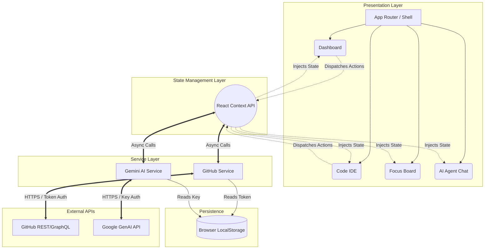
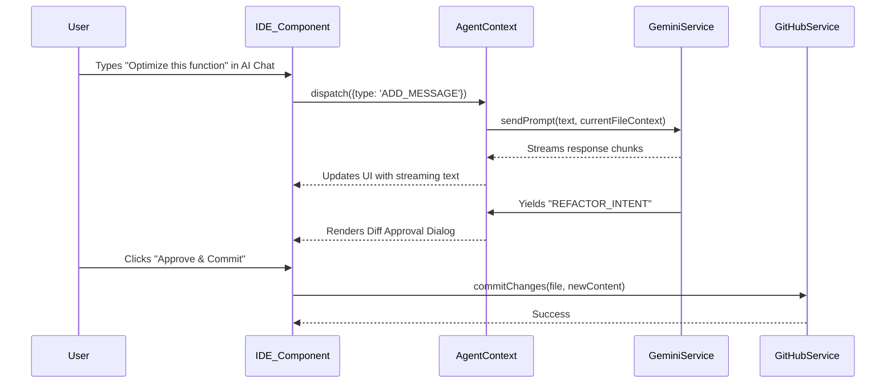

# 41. Graphite-Git System Architecture

## 1. Executive Summary & Architectural Paradigm
The Graphite-Git system architecture is a masterclass in modern, decoupled, frontend-centric design. Leveraging React 18, TypeScript, and Vite, it represents a paradigm shift towards "Zero-Backend" thick clients. The architecture fundamentally relies on pushing all computational logic, state management, and API orchestration directly to the user's browser edge. This document provides an intensely detailed deconstruction of this architecture, mapping the flow of data from the raw GitHub/Gemini APIs through the service layer, into the React Context state management, and finally rendering in the presentation layer.

## 2. Core Technology Stack Analysis

### 2.1 React 18 & Concurrent Rendering
Graphite-Git utilizes React 18 to leverage its concurrent rendering capabilities. This is critical for maintaining a 60fps UI while parsing massive JSON payloads from the GitHub API or streaming large responses from the Gemini AI. `useTransition` and `useDeferredValue` are strategically deployed to ensure that the IDE's text input and the AI Agent's chat interface remain hyper-responsive even during heavy background processing.

### 2.2 TypeScript: The Contractual Foundation
TypeScript is not merely a linter here; it forms the inviolable contractual foundation of the application. The `src/types.ts` file acts as the source of truth, defining exact shapes for GitHub Repositories, Commits, Gists, and Gemini AI messages. This strict typing ensures that the service layer and the component layer communicate without impedance mismatches, virtually eliminating runtime `undefined` errors.

### 2.3 Vite: The Build Engine
Vite provides the ES-module based dev server and the highly optimized Rollup production build. By leveraging Vite, Graphite-Git achieves sub-second Hot Module Replacement (HMR) during development and highly aggressive code-splitting in production, ensuring the initial bundle size remains minimal despite the inclusion of heavy libraries like `react-syntax-highlighter`.

## 3. High-Level Architecture Diagram

## 4. The Service Layer: Abstraction & Orchestration

The service layer is the heart of Graphite-Git's operational logic, completely isolated from the React component lifecycle.

### 4.1 GitHub Service (`githubService.ts`)
This class is a robust wrapper around the GitHub REST (and partially GraphQL) APIs. It handles:
- **Authentication Injection:** Automatically appending the `Bearer <token>` to all outgoing requests.
- **Rate Limit Management:** Intercepting 429 Too Many Requests responses and implementing exponential backoff.
- **Data Normalization:** Transforming the deeply nested, often redundant payloads from GitHub into streamlined TypeScript interfaces optimized for UI consumption.
- **Pagination Handling:** Abstracting away GitHub's Link header pagination, providing the UI with simple `fetchNextPage()` primitives.

### 4.2 Gemini Service (`geminiService.ts`)
This class manages the interaction with Google's generative AI models.
- **Context Window Formatting:** It constructs the system prompts and formats the conversation history (the AST of the current file, recent commits, etc.) to fit optimally within the Gemini context window.
- **Streaming Response Parsing:** It handles Server-Sent Events (SSE) or streaming chunks from the Gemini API, yielding partial strings to the React UI for that "typing" effect.
- **Tool Call Execution:** It maps AI intents (e.g., "Refactor this function") into actionable UI events that prompt the user for approval before modifying local state.

## 5. State Management: The Context API Topography

Graphite-Git eschews heavy external state libraries (like Redux) in favor of strategically partitioned React Contexts.

### 5.1 AuthContext
Manages the lifecycle of the GitHub Token and Gemini API Key. It acts as the gatekeeper; if the tokens are invalid or absent, the `TokenGate` component mounts, and the rest of the application is unmounted.

### 5.2 AgentContext
This is the most complex state container. It holds:
- The current conversation history with the AI.
- The state of the "Working Directory" (the files currently open in the IDE).
- The AST (Abstract Syntax Tree) representation of the currently focused file, to be fed to the AI.
- The queue of pending "Actions" (e.g., refactoring suggestions) awaiting user approval.

## 6. The Virtualized File Tree & IDE Integration

Handling repositories with thousands of files directly in the browser requires extreme optimization.
- **Lazy Loading:** The file tree only fetches directory contents when expanded.
- **Virtualization:** The IDE text editor and the file tree itself use virtualization (rendering only the DOM nodes visible in the viewport) to prevent DOM bloat.
- **Syntax Highlighting:** `react-syntax-highlighter` is dynamically loaded based on the file extension detected, preventing the monolithic loading of all language grammars on initial boot.

## 7. Scalability and Performance Directives

While running purely on the client side, Graphite-Git must scale to handle massive monorepos.
- **Aggressive Memoization:** Extensive use of `React.useMemo` and `React.useCallback` ensures that complex data transformations (like parsing Git commit histories) are not re-calculated on every render.
- **Web Workers (Planned):** For operations like deep semantic search across a downloaded repository, logic is slated to be offloaded to Web Workers, keeping the main UI thread completely unblocked.
- **IndexedDB Caching:** To reduce API calls, immutable data (like past commits or closed issues) are aggressively cached in the browser's IndexedDB, creating a lightning-fast, offline-capable experience for previously viewed data.

## 8. Conclusion

The architecture of Graphite-Git is a testament to the power of the modern browser. By acting as a sophisticated, thick client that talks directly to source control and artificial intelligence, it bypasses traditional backend bottlenecks. It is highly secure, performant, and elegantly structured, providing a robust foundation for the future of decentralized, AI-assisted software engineering.
