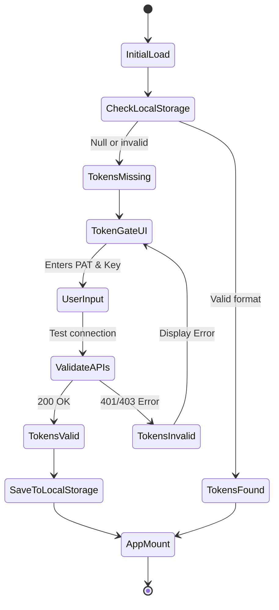
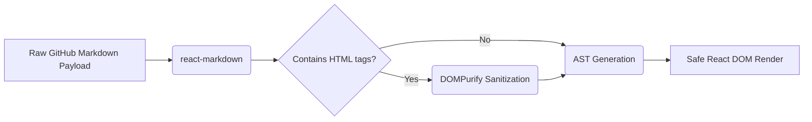

# 42. Local-First Security Paradigm

## 1. Introduction: The Zero-Backend Imperative
In traditional SaaS architecture, user credentials (OAuth tokens, API keys) are transmitted to a central backend server, stored in a database, and used by the server to act on the user's behalf. This creates a massive centralized honeypot and a profound privacy vulnerability. Graphite-Git completely incinerates this paradigm. It operates on a strict "Zero-Backend" philosophy. The application is entirely composed of static files (HTML, CSS, JS) served to the client. Once loaded, the browser becomes the sole compute environment, communicating directly with GitHub and Google. This document details the uncompromising security architecture that makes this possible.

## 2. Threat Modeling in a Local-First Environment

By removing the backend, we eliminate traditional server-side vulnerabilities (SQL injection, server-side request forgery, database breaches). However, the attack surface shifts entirely to the client.
Our primary threat vectors are:
1.  **Cross-Site Scripting (XSS):** Malicious scripts injected into the application to steal tokens from `localStorage`.
2.  **Cross-Site Request Forgery (CSRF):** While less relevant for pure API integrations, it remains a consideration.
3.  **Malicious Extensions:** Browser extensions with broad permissions sniffing local storage or intercepting network requests.
4.  **Supply Chain Attacks:** Compromised NPM packages injecting malicious code during the Vite build process.

## 3. The `localStorage` Bastion & TokenGate

### 3.1 Token Handling
Graphite-Git requires two critical pieces of sensitive data:
- The GitHub Personal Access Token (PAT).
- The Google Gemini API Key.

These tokens are entered via the `TokenGate` component and are stored *exclusively* in the browser's `localStorage`.
**Critical Rule:** Under absolutely no circumstances are these tokens ever serialized into a log, sent to an analytics provider, or transmitted to any server other than `api.github.com` and `generativelanguage.googleapis.com`.

### 3.2 The TokenGate Architecture



## 4. XSS Mitigation Strategies

Because XSS is the single greatest threat to `localStorage` based security, Graphite-Git employs a multi-layered defense-in-depth strategy.

### 4.1 Strict Content Security Policy (CSP)
Graphite-Git must be served with an extremely strict CSP header (or `<meta>` tag for static hosting).
```html
<meta http-equiv="Content-Security-Policy" content="
  default-src 'self';
  connect-src 'self' https://api.github.com https://generativelanguage.googleapis.com;
  img-src 'self' data: https://avatars.githubusercontent.com https://*.githubusercontent.com;
  style-src 'self' 'unsafe-inline';
  script-src 'self';
  object-src 'none';
">
```
*Note: `unsafe-inline` for styles is often required for React/Tailwind, but scripts are strictly locked down. No `unsafe-eval` is permitted.*

### 4.2 React's Inherent XSS Protection
By default, React DOM escapes all values embedded in JSX before rendering them. This provides strong baseline protection against XSS when rendering user-generated content from GitHub (e.g., issue titles, commit messages).

### 4.3 Safe Markdown Rendering
Graphite-Git renders READMEs and issue descriptions. To do this safely, it uses `react-markdown`.
Crucially, all raw HTML within markdown is stripped or aggressively sanitized using DOMPurify before being injected into the DOM.



## 5. Network Security & CORS

All network requests are made via the `fetch` API directly from the browser to the destination APIs.
- **HTTPS Only:** The application enforces HTTPS.
- **CORS (Cross-Origin Resource Sharing):** GitHub and Google APIs are configured to accept CORS requests. Graphite-Git does not use proxies; it relies on the APIs' native CORS headers.

## 6. The Illusion of Serverless and Supply Chain Auditing

While the *runtime* has no backend, the *build pipeline* is a potential vulnerability.
- **Dependency Pinning:** All dependencies in `package.json` must use exact versions to prevent malicious minor updates.
- **Audit Automation:** `npm audit` is integrated into the CI/CD pipeline that builds the static assets.
- **Vite Build Process:** The build process strips all comments, minifies code, and generates source maps that are *not* deployed to production, obscuring the source slightly from casual inspection while keeping the bundle minimal.

## 7. Future-Proofing: Web Crypto API

While currently relying on `localStorage`, the future roadmap of the Graphite-Git security paradigm involves migrating token storage to the browser's IndexedDB, encrypted at rest using the Web Crypto API.
1. User creates a master passphrase.
2. Web Crypto derives a strong AES-GCM key from the passphrase using PBKDF2.
3. The GitHub and Gemini tokens are encrypted with this AES key before storage.
4. The tokens are decrypted only in memory when the application loads.

## 8. Conclusion

The Local-First Security Paradigm of Graphite-Git represents the ultimate form of user sovereignty. By refusing to hold the user's keys, Graphite-Git absolves itself of the central database vulnerability. The user retains absolute control, operating within a highly sanitized, cryptographically secure browser sandbox. This is not just a technical choice; it is a fundamental assertion of privacy and security in the modern web era.
