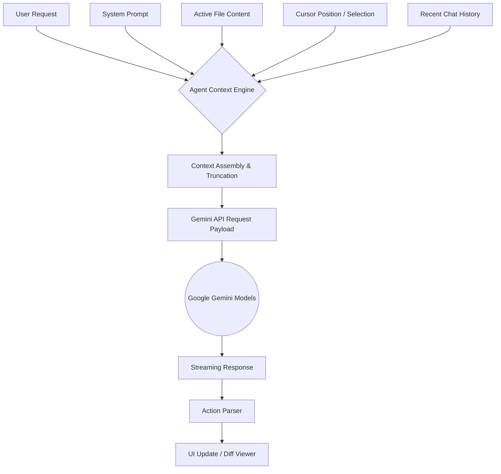

# 43. AI Agent Integration & Orchestration

## 1. Abstract: The Symbiotic Developer
The integration of the Google Gemini AI into Graphite-Git transcends the standard "chatbot" paradigm. Graphite-Git treats the AI as a symbiotic engineering agent, seamlessly woven into the fabric of the IDE. This document explores the intricate orchestration required to give the AI context, agency, and robust guardrails. It details the prompt engineering, context window management, and the crucial explicit user approval flow that governs the agent's interaction with the user's codebase.

## 2. Core Philosophy: Context is King
An AI is only as capable as the context it is provided. Graphite-Git's `geminiService.ts` and `AgentContext` are entirely dedicated to building highly specific, localized context windows. Rather than feeding the entire repository into the model (which is slow, expensive, and dilutes attention), Graphite-Git provides surgically precise context based on the user's current focus.

## 3. The Context Construction Pipeline

When a user initiates an interaction with the AI, the system dynamically constructs a prompt payload consisting of several layers:

### 3.1 System Prompt Initialization
The base system prompt defines the AI's persona, capabilities, and strict formatting rules.
*Example Excerpt:* "You are the Graphite-Git integrated engineering agent. Your purpose is to assist with code analysis, refactoring, and generation. You have read access to the currently focused file. When suggesting code changes, you MUST output them in a specific JSON diff format..."

### 3.2 Environmental Context
The agent is injected with knowledge of its environment:
- Current Repository Name and Branch.
- Currently active file path and extension.
- The language ecosystem (e.g., "This is a React/TypeScript project").

### 3.3 The Focal Payload
This is the payload of the code itself.
- **Full File Content:** If the file is small enough.
- **Highlighted Selection:** If the user has highlighted specific lines, the context heavily prioritizes this snippet, providing surrounding lines for scope.
- **Diagnostic Context:** If there are linter errors or TypeScript compiler errors in the view, these are appended to the payload.



## 4. Action Parsing and the Diff Approval Flow

The AI in Graphite-Git is not just conversational; it is actionable. However, it operates strictly under an "Approval-Required" mandate.

### 4.1 Structured Output
When the AI determines a code change is necessary, it is instructed (via the System Prompt) to output a structured JSON block representing a diff, alongside its natural language explanation.

```json
{
  "action": "replace",
  "targetFile": "src/components/Button.tsx",
  "startLine": 12,
  "endLine": 15,
  "replacementCode": "export const Button = ({ children, variant = 'primary' }) => { ... }"
}
```

### 4.2 The Interception Layer
The `geminiService` intercepts this structured output as the stream arrives. It prevents the raw JSON from being rendered in the chat UI. Instead, it parses the intent and dispatches a `PROPOSE_CHANGE` action to the React state.

### 4.3 The Diff Viewer UI
Upon receiving a `PROPOSE_CHANGE`, the UI summons a highly detailed Diff Viewer component. This component presents a side-by-side or unified diff of the AI's proposed changes against the current local state.
- The user can review the exact lines being added or removed.
- The user must explicitly click "Approve and Apply" or "Reject".
- Only upon approval does the `githubService` or local state manager execute the change.

## 5. Advanced Orchestration Capabilities

### 5.1 Multi-Turn Refactoring
Because the `AgentContext` maintains a sliding window of recent conversation history, the user can iterate on a refactor.
*User:* "Refactor this component to use Tailwind."
*AI:* [Proposes changes]
*User:* "Looks good, but make the padding smaller on mobile."
*AI:* [Understands the context of the previous diff and proposes an updated diff].

### 5.2 Contextual Code Generation
When a user asks to "Create a new file for X," the AI leverages the known patterns of the existing open files (e.g., noticing the project uses styled-components vs Tailwind) to generate architecturally consistent code.

## 6. Error Handling and Hallucination Mitigation

- **Strict Formatting Enforecement:** If the AI hallucinates a malformed diff structure, the parser gracefully falls back to displaying the raw text and asks the user to manually copy-paste, preventing application crashes.
- **Token Limits:** The Context Assembly engine tracks token counts. If a file is too large, it automatically falls back to sending only a window of code around the user's cursor, informing the user of the truncation.

## 7. Future Horizons: Multi-Agent Workflows

The current architecture lays the groundwork for future multi-agent orchestration.
- **The Critic Agent:** A secondary, lighter-weight model running in the background that independently reviews the primary AI's proposed diffs for security flaws or anti-patterns before presenting them to the user.
- **The Architect Agent:** An agent that can be unleashed to analyze the entire repository structure (via search/grep tools) and propose massive, multi-file refactoring plans, managed through a specialized "Plan Review" dashboard.

## 8. Conclusion

The orchestration of the Gemini AI within Graphite-Git is designed to maximize utility while maintaining absolute user sovereignty. The AI is a powerful engine, but the user's hands never leave the steering wheel. Through precise context management and rigid approval flows, Graphite-Git transforms generative AI from a novelty into a rigorous, dependable engineering partner.
