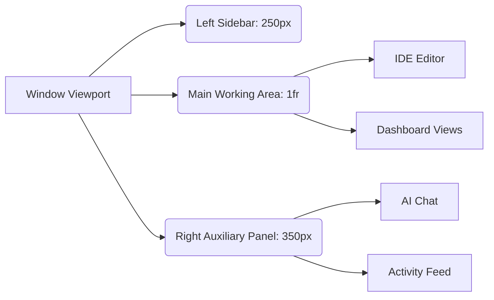

# 44. UX Masterplan & Design System

## 1. Abstract: The Aesthetic Interface
The user experience (UX) of Graphite-Git is engineered to elicit a specific psychological response: the feeling of operating a high-end, futuristic command console. The design system is not merely functional; it is highly aesthetic, prioritizing deep dark modes, crisp typography, and subtle micro-interactions. This document outlines the UX Masterplan, detailing the integration of Tailwind CSS, the tokenized design system, and the overarching principles that guide the application's visual language.

## 2. Foundational Design Principles

### 2.1 Dark Mode First (and Only)
Graphite-Git embraces a strict "Dark Mode First" philosophy. To reduce eye strain during prolonged coding sessions and to emphasize the "command center" aesthetic, the application utilizes deep, rich dark grays (e.g., `#0f172a`, `#1e293b`) rather than absolute black. Light mode is intentionally omitted to maintain aesthetic cohesion and focus development efforts on a singular, perfect visual experience.

### 2.2 Information Density vs. Cognitive Overload
Developer tools must strike a delicate balance. They require high information density (file trees, code, commit logs) without causing cognitive overload. Graphite-Git achieves this through:
- **Spatial Separation:** Clear demarcation between the navigation sidebar, the working area (IDE/Dashboard), and the auxiliary panel (AI Agent/Focus Board).
- **Typographic Hierarchy:** Using varying font weights and subdued colors (like text-gray-400 for metadata) to guide the eye toward primary content.
- **Progressive Disclosure:** Hiding complex features behind contextual menus or collapsible panels until explicitly needed.

## 3. The Tokenized Design System (Tailwind CSS)

Graphite-Git leverages Tailwind CSS extensively, extending the default configuration to create a bespoke design language.

### 3.1 Color Palette Architecture
The custom color palette in `tailwind.config.js` is structured around semantic meaning:
- **Surface Colors:** Deep grays for backgrounds, cards, and panels (e.g., `bg-slate-900`, `bg-slate-800`).
- **Accent Colors:** Vibrant purples and blues (representing AI and technology) used sparingly for active states, primary buttons, and focus rings.
- **Semantic Colors:** Strict adherence to standard semantic meanings: Green for success/additions, Red for errors/deletions, Amber for warnings.

### 3.2 Typography Rules
- **Primary Font:** `Inter` or a similar highly legible sans-serif for UI elements, ensuring clarity at small sizes.
- **Monospace Font:** `JetBrains Mono` or `Fira Code` for all code views, file paths, and terminal outputs, providing excellent readability for structural data.

## 4. Component Library Deep Dive

All UI elements are built as highly reusable, atomized React components.

```mermaid
graph TD
    subgraph Atoms
        A[Button]
        B[Badge]
        C[Avatar]
        D[Icon (Lucide)]
    end
    
    subgraph Molecules
        E[User Profile Card]
        F[Repo List Item]
        G[Commit History Row]
    end
    
    subgraph Organisms
        H[Sidebar Navigation]
        I[Code Editor Window]
        J[AI Chat Interface]
    end
    
    A --> E
    B --> F
    C --> E
    D --> H
    E --> H
    F --> J
```

### 4.1 The "Glassmorphism" Touch
Select components (like modal overlays or sticky headers) utilize CSS backdrop-filters (`backdrop-blur-md`, `bg-opacity-80`) to create a subtle glassmorphism effect. This provides depth and context, allowing the user to maintain spatial awareness of the layer beneath.

### 4.2 State Representation
Every interactive element must visually represent its state: Default, Hover, Focus, Active, and Disabled. Tailwind's pseudo-class variants (e.g., `hover:bg-slate-700`, `focus:ring-2`) are mandated across all interactive molecules.

## 5. Motion and Micro-interactions

Animation in Graphite-Git is purposeful, never gratuitous. It is used to explain state changes, not to dazzle.
- **Framer Motion Integration:** While simple transitions use CSS (`transition-all duration-200`), complex orchestrations (like opening a modal or expanding a large file tree) utilize Framer Motion for spring-physics-based animations, making the UI feel organic and responsive.
- **Loading States:** Skeleton loaders are preferred over spinners to reduce layout shift and provide immediate structural context while data fetches.

## 6. Layout Architecture

The application shell relies on CSS Grid and Flexbox for a perfectly responsive, full-viewport layout.


*Note: The right panel is typically collapsible to maximize the IDE space.*

## 7. Conclusion

The UX Masterplan of Graphite-Git elevates the local-first application from a mere utility to a premium workspace. By rigidly enforcing the dark mode aesthetic, leveraging Tailwind's utility-first paradigm for consistency, and obsessing over typographic hierarchy, the design system ensures that the developer remains focused, efficient, and visually immersed in their workflow.
