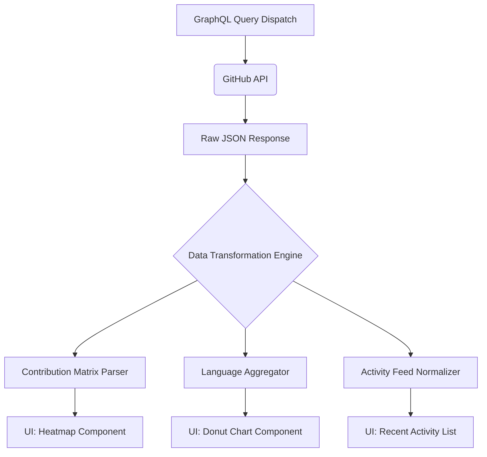

# 45. Operator Dashboard & Metrics Visualization

## 1. Abstract: The Command Center
The Operator Dashboard is the initial landing sequence of the Graphite-Git application. It is designed to act as the developer's command center, aggregating disparate data streams from the GitHub API into cohesive, instantly readable visualizations. This document explores the data fetching strategies, transformation layers, and UI rendering logic required to build the comprehensive metrics dashboard, including the iconic contribution graph and language statistics.

## 2. Core Philosophy: Immediate Actionable Insight
Upon authentication, a developer should instantly understand their current standing: What needs attention? What was accomplished recently? Where is their effort focused? The dashboard answers these questions silently through data visualization, minimizing the need for navigation.

## 3. Data Ingestion and Transformation Layer

The GitHub API provides rich data, but it is deeply nested and often requires multiple distinct queries to build a single dashboard component.

### 3.1 GraphQL vs. REST
While Graphite-Git utilizes the REST API for straightforward CRUD operations, the Dashboard heavily relies on the GitHub GraphQL API.
- **Why GraphQL?** Fetching a user's contribution graph, repository language breakdown, and recent pull request status via REST would require dozens of sequential requests, causing massive UI latency and potentially hitting rate limits. A single, well-crafted GraphQL query retrieves this precise data tree in one round trip.

### 3.2 The Transformation Pipeline



## 4. Component Deep Dive: The Contribution Heatmap

The contribution heatmap is a defining feature of GitHub, and replicating it accurately within Graphite-Git is crucial for user familiarity.

### 4.1 Data Structure
The GraphQL `contributionsCollection` returns a multi-dimensional array representing weeks and days. The transformation engine flattens this into a predictable matrix structure:
```typescript
interface ContributionDay {
  date: string;
  contributionCount: number;
  color: string; // The hex color provided by GitHub based on intensity
}
// Matrix of weeks containing days
```

### 4.2 Rendering the SVG
Instead of relying on heavy charting libraries, the heatmap is rendered using highly optimized, inline SVGs generated by React.
- **Accessibility:** Each `<rect>` in the SVG heatmap is equipped with a `<title>` tag for hover tooltips and screen readers.
- **Dynamic Theming:** While GitHub provides default colors, Graphite-Git allows the user to apply custom color themes (e.g., Cyberpunk Pink, Terminal Green) by mathematically altering the intensity of a base hex code relative to the `contributionCount`.

## 5. Component Deep Dive: Language Distribution Analytics

Understanding where a developer spends their time is visualized through the Language Distribution module.

### 5.1 Aggregation Logic
The GraphQL query retrieves the `languages` edges for every owned repository. The transformation engine iterates through this data, aggregating the `size` (bytes) of code written in each language across the entire portfolio.
It calculates percentages and sorts them in descending order.

### 5.2 Visualization
This data is rendered using a modern, animated Donut Chart or a series of sleek, horizontal progress bars. We utilize a lightweight charting library (or custom CSS-based bars) to ensure the bundle size remains small. Colors are automatically mapped to GitHub's standard language color taxonomy (e.g., Yellow for JavaScript, Blue for TypeScript).

## 6. The "Pulse" Activity Feed

The dashboard features a localized "Pulse" feed—a chronological timeline of the user's most recent interactions (commits, issues opened, PRs merged).
- **Data Source:** This leverages the `/users/{username}/events/public` REST endpoint.
- **Normalization:** GitHub event payloads are highly polymorphic (a `PushEvent` looks very different from an `IssuesEvent`). The normalizer parses these varying payloads into a standardized `TimelineEvent` interface.
- **UI Presentation:** Rendered as a vertical timeline with recognizable Lucide-react icons mapping to the event type.

## 7. Performance Considerations

- **Stale-While-Revalidate:** Dashboard data is cached in memory. When navigating back to the dashboard, the cached data is displayed instantly while a background fetch silently updates the view.
- **Skeleton Screens:** During the initial load, the dashboard layout is rendered with pulsing skeleton screens that perfectly match the dimensions of the charts, preventing jarring layout shifts once the data arrives.

## 8. Conclusion

The Operator Dashboard is the focal point of Graphite-Git's data synthesis capabilities. By masterfully orchestrating complex GraphQL queries and implementing aggressive data transformation on the client side, it provides a fast, beautiful, and deeply insightful snapshot of a developer's digital footprint, completely independent of the GitHub website UI.
