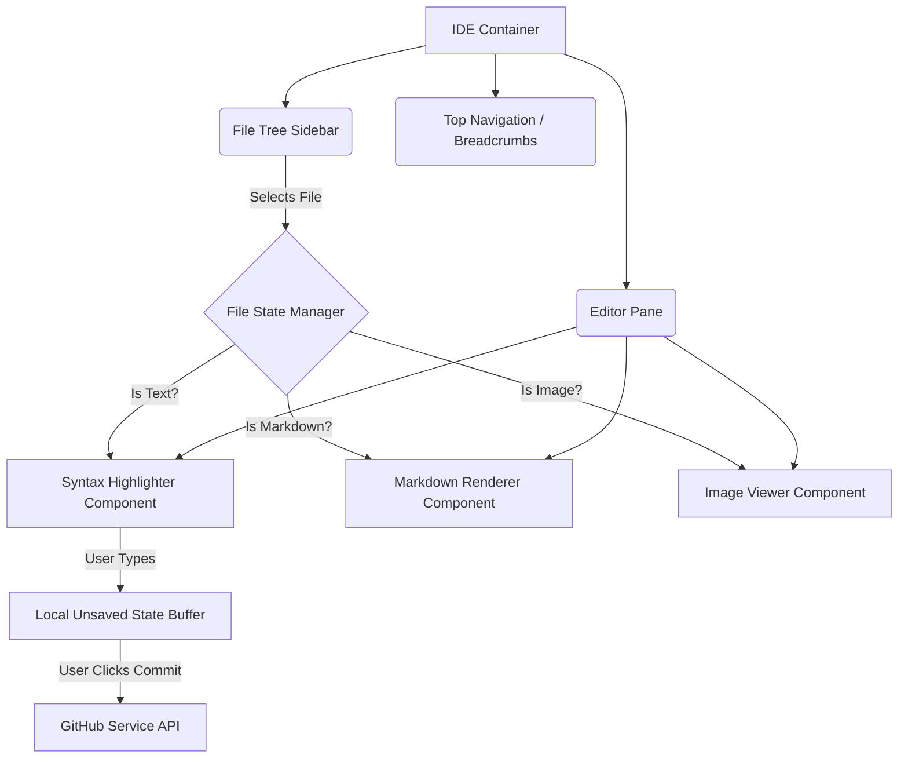

# 46. Repository Management & Code IDE

## 1. Abstract: The Browser-Native Workspace
The core utility of Graphite-Git lies in its ability to manage repositories and interact with code directly within the browser, bypassing the need for local cloning for quick edits or reviews. This document details the engineering behind the Repository Manager and the integrated Code IDE. It covers the implementation of a high-performance virtualized file tree, safe syntax highlighting, and the intricate state management required to track unsaved changes and stage commits directly via the GitHub API.

## 2. The Repository Manager

Before a developer can edit code, they must navigate their portfolio. The Repository Manager is a highly optimized, client-side searchable index of the user's repositories.

### 2.1 Paginating the Portfolio
For users with hundreds of repositories, fetching all data simultaneously is impossible.
- **Implementation:** The `githubService` utilizes cursors or page numbers to fetch repositories in chunks of 100.
- **Client-Side Indexing:** As chunks arrive, they are appended to a local state array. A specialized React hook provides instant, fuzzy-search capabilities across this local array, allowing users to filter their portfolio by name, language, or topic instantly without subsequent network requests.

### 2.2 Metadata Manipulation
The manager allows direct editing of repository metadata (description, topics, visibility) via the `PATCH /repos/{owner}/{repo}` endpoint. Form state is managed locally, with optimistic UI updates reflecting changes immediately while the background API request processes.

## 3. The Code IDE Architecture

The IDE is the most complex UI component in Graphite-Git. It simulates a traditional desktop environment (like VS Code) entirely within the DOM.

## 4. The Virtualized File Tree

Navigating the source tree of a large repository (e.g., the Linux kernel) via the GitHub REST API (`/repos/{owner}/{repo}/git/trees/{sha}?recursive=1`) yields a massive flat array of file paths.

### 4.1 Tree Construction
The client must parse this flat array (e.g., `["src/app.ts", "src/utils/math.ts"]`) and reconstruct a hierarchical, nested JSON object representing folders and files.

### 4.2 Lazy Rendering & Virtualization
Rendering thousands of nested DOM nodes for a file tree will crash the browser.
- **Lazy Rendering:** Folders remain closed by default. Child nodes are only appended to the DOM when a folder is clicked.
- **Virtualization:** For directories with hundreds of files, we employ DOM virtualization (e.g., using a library like `react-window`). Only the ~30 file nodes visible within the scrolling viewport are actually rendered, maintaining near-zero DOM overhead regardless of repository size.

## 5. The Editor Engine

### 5.1 Syntax Highlighting (`react-syntax-highlighter`)
To display code, Graphite-Git utilizes `react-syntax-highlighter`.
- **Dynamic Language Detection:** The file extension is parsed, and the appropriate language grammar is dynamically loaded to prevent massive initial bundle sizes.
- **Read/Write Modes:** By default, files are rendered in read-only mode for speed. Clicking "Edit" swaps the highlighted block for a `<textarea>` layered meticulously under a transparent, highlighted overlay, or initializes a lightweight code editor instance (like Monaco, if integrated) for a true IDE feel.

### 5.2 The Markdown Previewer
`README.md` files are first-class citizens. They are passed through `react-markdown`.
- **Plugin Ecosystem:** Plugins like `remark-gfm` (GitHub Flavored Markdown) are essential to correctly render tables, task lists, and code blocks exactly as they appear on GitHub.

## 6. The Commit Pipeline

Graphite-Git allows users to commit changes directly from the browser. This requires orchestrating several low-level Git operations via the GitHub API.

### 6.1 The "Direct Commit" Flow
When a user edits a file and clicks "Commit":
1.  **Get Current SHA:** The application fetches the SHA of the file currently on the branch to prevent merge conflicts.
2.  **PUT Request:** A `PUT /repos/{owner}/{repo}/contents/{path}` request is dispatched, containing the base64 encoded new content, the commit message, and the original file SHA.
3.  **State Reconciliation:** Upon success, the local unsaved buffer is cleared, and the file tree reflects the updated timestamp.

### 6.2 Advanced: The Multi-File Commit (Future Roadmap)
Currently, basic edits update a single file. A major architectural goal is implementing the complex multi-step Git tree API flow to allow users to stage multiple files in the IDE, create a new tree, and commit them simultaneously, mimicking a true `git commit -a`.

## 7. Edge Cases & Safety

- **Binary Files:** The IDE detects binary files via MIME type or extension and prevents them from loading into the text editor, offering a download link or an image preview instead.
- **Large Files:** Files over 1MB trigger a warning and require explicit confirmation to load, preventing main thread lockups during parsing and highlighting.

## 8. Conclusion

The Repository Manager and Code IDE transform Graphite-Git from a simple dashboard into a powerful, capable workspace. By aggressively optimizing DOM rendering through virtualization and carefully orchestrating state between the UI and the GitHub API, developers are granted the unprecedented freedom to explore, edit, and commit code directly from any browser, securely and efficiently.
