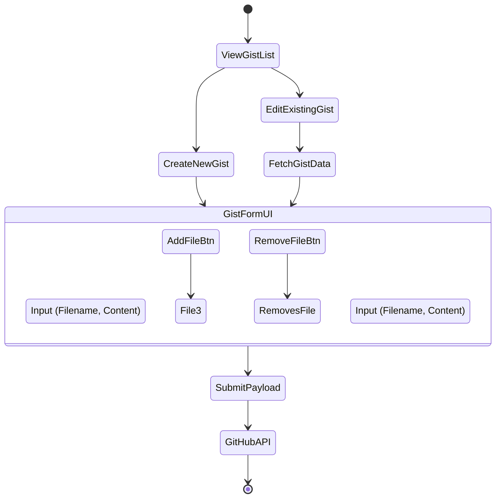
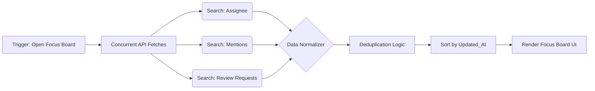

# 47. Gist & Focus Board Workflows

## 1. Abstract: Micro-Tasks and Macro-Focus
While repositories house major projects, a developer's daily life is often dominated by micro-tasks: saving code snippets (Gists) and managing a barrage of notifications (Issues and Pull Requests). Graphite-Git addresses these with two dedicated modules: The Gist Manager and the Focus Board. This document outlines the architectural workflows powering these features, detailing the complexities of multi-file gist handling and the aggregation logic required to build a unified, high-signal inbox.

## 2. The Gist Manager Workflow

GitHub Gists are essentially mini-repositories. The API handles them similarly, but the UI requirements are distinct. Developers need a rapid way to create, edit, and retrieve snippets without the overhead of full repository management.

### 2.1 Multi-File Architecture
A single Gist can contain multiple files. The Graphite-Git Gist Editor UI must accommodate this dynamic array.

### 2.2 Payload Construction
When submitting a Gist creation or update via the `POST /gists` or `PATCH /gists/{gist_id}` endpoints, the payload requires a highly specific object mapping filenames to their content.
The React state (`useState`) must manage an array of file objects, which is then dynamically reduced into the required JSON map format just prior to API dispatch.

### 2.3 Secret vs. Public Synchronization
The UI clearly delineates between public and secret gists using visual indicators (e.g., a lock icon). The toggle for visibility is only available during creation; the API does not allow changing the visibility of an existing gist, a constraint the UI must rigidly enforce to prevent user error and confusion.

## 3. The Focus Board: Taming the Noise

The standard GitHub notification inbox is often a chaotic stream of activity. Graphite-Git introduces the "Focus Board"—a unified, curated task manager designed to extract high-signal actionable items.

### 3.1 Aggregation Strategy
The Focus Board does not just mirror `/notifications`. It specifically targets issues and PRs where the developer is actively required. It aggregates data using complex search queries against the GitHub Search API (`/search/issues`).

**Core Queries:**
- `is:open assignee:USERNAME` (Items assigned to you)
- `is:open mentions:USERNAME` (Items mentioning you)
- `is:open author:USERNAME` (Items you created)
- `is:open review-requested:USERNAME` (PRs needing your review)

### 3.2 The Unified Interface
These disparate data streams are fetched concurrently using `Promise.all()`, normalized into a single `TaskItem` interface, and presented in a kanban-style or heavily filtered list view.

### 3.3 Deduplication & Prioritization
Because a user might be both the assignee and mentioned in the same issue, the fetched data will contain duplicates. The normalizer runs a deduplication pass based on the issue/PR ID.
Furthermore, tasks are prioritized visually. A "Review Requested" PR might be highlighted more aggressively than a standard issue assignment, guiding the developer to blockages in the team's pipeline.

## 4. Cross-Pollination with AI

The Focus Board is deeply integrated with the Gemini AI Agent.
- **Summarization:** A user can click "Summarize" on a complex, 50-comment issue thread. Graphite-Git fetches the issue comments, feeds them to the AI, and generates a concise TL;DR of the technical debate and the current required action.
- **Drafting Responses:** The AI can be prompted to draft a response to an issue or a PR review based on the context of the thread and the user's local code edits, streamlining communication.

## 5. Performance and Rate Limiting

The Search API is heavily rate-limited by GitHub (typically 30 requests per minute).
- **Throttling:** The Focus Board implements aggressive caching and throttling. It does not auto-refresh continuously; instead, it relies on manual user refreshes or broad interval polling (e.g., every 5 minutes) to ensure the application never hits the rate limit wall.

## 6. Conclusion

The Gist Manager and Focus Board are essential tools for maintaining developer velocity. By optimizing the multi-file snippet workflow and transforming a chaotic notification stream into a highly curated, AI-assistable task board, Graphite-Git ensures that developers spend less time managing their tools and more time executing high-value engineering tasks.
