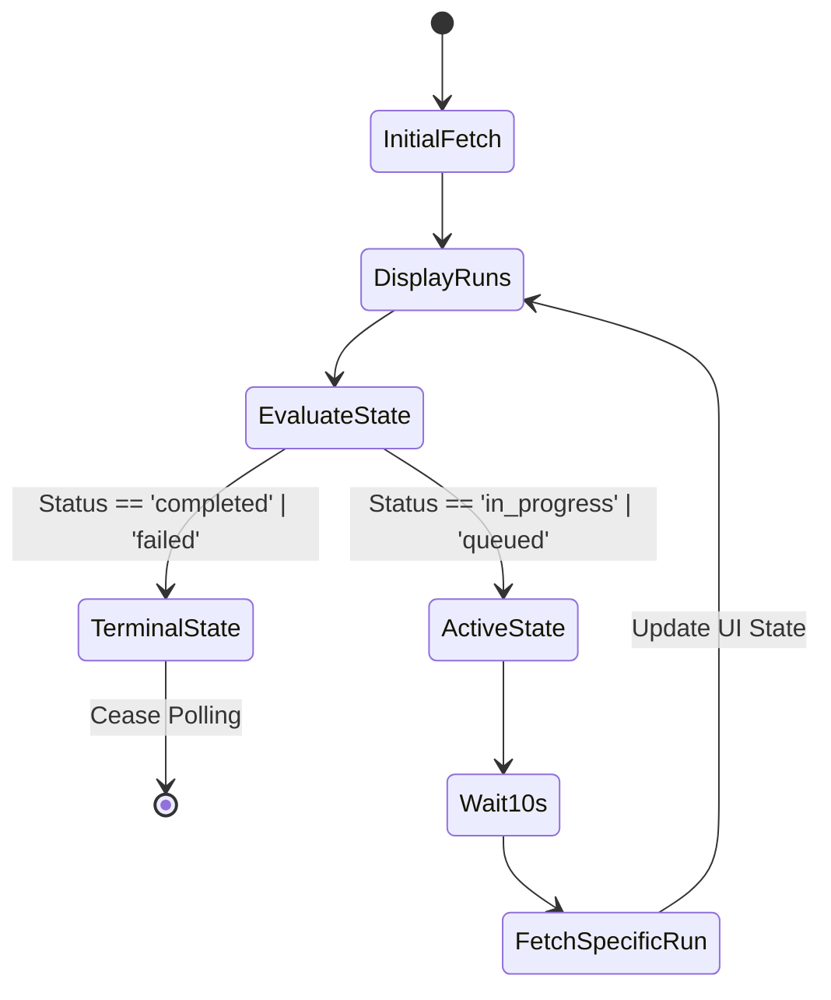

# 48. GitHub Actions & Workflow Monitor

## 1. Abstract: The CI/CD Control Tower
Continuous Integration and Continuous Deployment (CI/CD) are the lifeblood of modern software engineering. The Graphite-Git Workflow Monitor elevates GitHub Actions out of the repository sub-menus and into a unified, high-visibility control tower. This document analyzes the technical implementation of tracking, visualizing, and manually dispatching workflows across the user's entire repository portfolio, detailing the polling mechanisms and real-time state management required.

## 2. The Unified Workflow Philosophy
Traditionally, developers must click into individual repositories to check build statuses. Graphite-Git flips this model. The Workflow Monitor aggregates active and recent workflow runs across *all* repositories into a single, chronological dashboard. This allows a developer to trigger a deployment in Repo A, push code to Repo B, and watch both pipelines execute side-by-side.

## 3. Data Retrieval and Polling Architecture

GitHub Actions state is highly dynamic. To provide a "live" feel without WebSocket access (which is restricted in the public API for this use case), Graphite-Git implements intelligent polling.

### 3.1 The Fetch Strategy
The initial load fetches the most recent workflow runs using the `/repos/{owner}/{repo}/actions/runs` endpoint for the user's most active repositories.

### 3.2 Adaptive Polling
Aggressive polling burns through rate limits. Graphite-Git uses an adaptive polling strategy:
- **Active Runs:** If a workflow is in an `in_progress` or `queued` state, the monitor polls that specific run's endpoint every 10 seconds.
- **Completed Runs:** Once a workflow hits a terminal state (`completed`, `failed`, `cancelled`), polling for that specific run ceases entirely.
- **Backoff:** If the overall application tab loses focus (via the Page Visibility API), polling frequency is drastically reduced to conserve battery and rate limits.

## 4. Visualizing Build Matrices and Logs

Complex workflows utilize matrices (e.g., testing against Node 16, 18, and 20 simultaneously). The Workflow Monitor must parse the `jobs` associated with a run to display this granularity.

### 4.1 Job Breakdown
When a user expands a workflow run, the application fetches the `/repos/{owner}/{repo}/actions/runs/{run_id}/jobs` endpoint. This data is rendered as a nested list or a mini-kanban, showing the individual success/failure of each matrix leg.

### 4.2 Log Streaming (Future Roadmap)
Currently, viewing logs redirects the user to GitHub. The architectural roadmap includes fetching the raw log text via the API and rendering it in a specialized, terminal-styled component within the Graphite-Git IDE, utilizing virtualized lists to handle massive log files without freezing the DOM.

## 5. Workflow Dispatch (Manual Triggers)

The `workflow_dispatch` event allows users to manually trigger Actions. Graphite-Git provides a unified UI for this.

### 5.1 Dynamic Form Generation
When a user clicks "Run Workflow," the application fetches the workflow YAML file from the repository, parses it (using a lightweight YAML parser), and extracts the `inputs` object.
It then dynamically generates a React form with appropriate fields (text, boolean toggles, dropdowns) based on the input types defined in the YAML.

### 5.2 Dispatch Execution
Submitting the form fires a `POST /repos/{owner}/{repo}/actions/workflows/{workflow_id}/dispatches` request, containing the user's branch selection and the dynamically constructed inputs JSON payload. The UI instantly injects a new "queued" run into the local state, providing immediate feedback before the API confirms the start.

## 6. Edge Cases and Rate Limits

- **Massive Portfolios:** For users with hundreds of repositories, querying all recent actions simultaneously is impossible. The monitor prioritizes "Starred" repositories or those with recent push activity.
- **Rate Limit Headers:** Every response header (`x-ratelimit-remaining`) is monitored. If the limit drops dangerously low, polling is aggressively throttled, and a subtle warning badge appears in the UI.

## 7. Conclusion

The Workflow Monitor transforms GitHub Actions from a hidden background process into a tangible, controllable entity. By combining adaptive polling for real-time feedback with dynamic UI generation for workflow dispatch, Graphite-Git ensures the developer maintains absolute control over their CI/CD pipelines directly from their command center.
