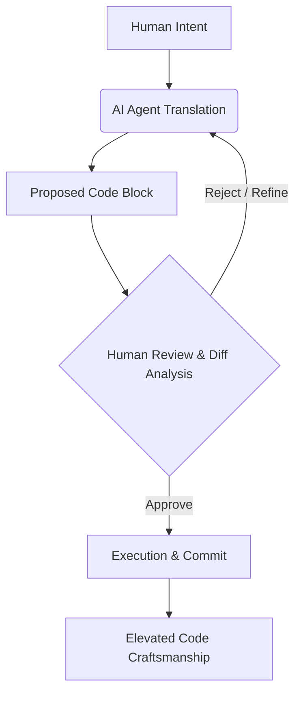

# 50. Philosophical Foundations of Graphite

## 1. Abstract: Beyond the Tool
Software is never strictly neutral; it is an embodiment of the philosophy of its creators. Graphite-Git is not merely an alternative GitHub client; it is a manifesto written in React and TypeScript. This document outlines the core philosophical pillars that dictate every architectural decision within the project: The Sovereign Developer, The Zero-Backend Mandate, and the Symbiosis of Human and Artificial Intelligence.

## 2. Pillar I: The Sovereign Developer
In the era of cloud-first SaaS, the developer has become a tenant. Code, tokens, and telemetry are hoovered into centralized databases controlled by massive corporations. Graphite-Git rejects this tenancy.

### 2.1 The Re-decentralization of Tools
Graphite-Git is a tool, not a service. By pushing the entire application runtime to the client browser, it restores sovereignty to the developer. The application acts as a direct conduit between the user's machine and the necessary APIs (GitHub, Google), with no corporate intermediary skimming data or holding keys. The developer is not a user of Graphite-Git; they are the sole operator of their own instance of it.

## 3. Pillar II: The Zero-Backend Mandate
Security by design means eliminating the attack surface entirely. A database that does not exist cannot be breached.

### 3.1 The Absurdity of the Middleman
To build a traditional backend for Graphite-Git would require taking a user's GitHub OAuth token, storing it on a server, and making API requests on their behalf. This introduces latency, infrastructure costs, and a catastrophic single point of failure. The Zero-Backend Mandate dictates that the browser is the ultimate compute node. `localStorage` is our database; the GitHub API is our backend. This architectural rigidity forces extreme optimization on the frontend, resulting in a cleaner, faster, and infinitely more secure application.

## 4. Pillar III: Human-AI Symbiosis, Not Replacement
The integration of the Gemini AI into Graphite-Git is guided by a philosophy of augmentation, not obsolescence.

### 4.1 The AI as an Engineering Partner
Many AI coding tools attempt to "black box" the development process, promising to write the application while the user watches. Graphite-Git views this as a degradation of craftsmanship. Instead, the AI agent is treated as a highly capable junior pair-programmer. It suggests, it refactors, it analyzes—but it never executes without explicit, line-by-line approval via the Diff Viewer.

### 4.2 Cognitive Scaffolding
The AI exists to remove the cognitive friction of boilerplate, syntax errors, and API lookups, freeing the human developer's mind to focus purely on architecture, logic, and aesthetic design. The AI handles the "how"; the human dictates the "why."

## 5. Pillar IV: Aesthetics as Function
Developer tools are often aggressively utilitarian, sacrificing aesthetics for raw functionality. Graphite-Git posits that beauty and functionality are intertwined.

### 5.1 The Psychology of the Workspace
A cluttered, ugly workspace induces fatigue. A sleek, highly responsive, deeply dark-themed environment induces flow. The meticulous attention to Tailwind styling, typography, and micro-interactions in Graphite-Git is not superficial decoration; it is a functional requirement designed to sustain focus and elevate the developer's mood during grueling debugging sessions.

## 6. Conclusion
Graphite-Git is a defiant piece of software. It proves that complex, AI-integrated workflows can be achieved without compromising user privacy or relying on heavy backend infrastructure. It stands as a testament to the power of the modern browser, the capability of generative AI, and the enduring necessity of human sovereignty in the age of intelligent machines.
