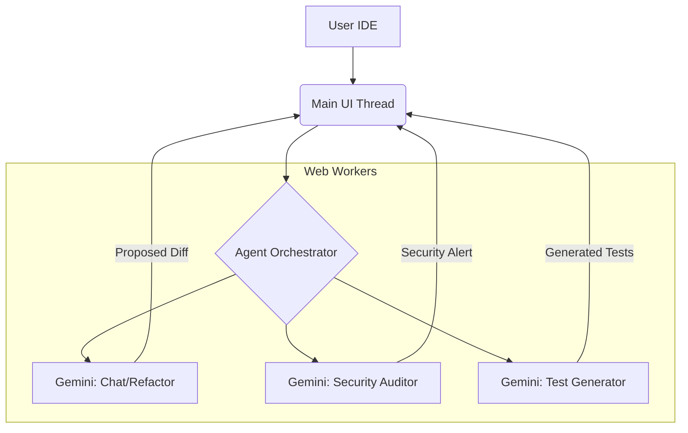

# 51. Mythic Roadmap & Future Evolution

## 1. Abstract: The Horizon of Graphite
Graphite-Git, in its current iteration, is a formidable local-first client and AI engineering partner. However, this is merely Phase I. The architecture was designed specifically to support massive, compounding complexities. This document outlines the "Mythic Roadmap"—the visionary, multi-year plan for the evolution of Graphite-Git, encompassing multi-agent orchestration, WebAssembly integrations, and fully predictive coding environments.

## 2. Phase II: Multi-Agent Orchestration

The single-agent Gemini integration will evolve into a "Swarm" architecture.

### 2.1 The Agent Hierarchy
Instead of a single chat interface, Graphite-Git will spin up specialized sub-agents running in parallel Web Workers.
- **The Auditor Agent:** Continuously scans the open file in the background, specifically looking for security vulnerabilities (e.g., hardcoded secrets, injection flaws) and flagging them in real-time.
- **The Test Engineer:** Automatically generates unit tests in a hidden buffer for any new function written by the user, presenting them for approval when the function is complete.
- **The Architect:** Capable of executing repository-wide semantic searches to propose massive, multi-file refactoring plans (e.g., "Migrate all components from CSS Modules to Tailwind").

## 3. Phase III: WebAssembly (Wasm) and the True Local Environment

Currently, "Local-First" means the UI runs locally, but GitHub acts as the file system. Phase III brings the actual file system and execution environment to the browser.

### 3.1 Browser-Native Git via WebAssembly
By compiling a Git client (like `isomorphic-git` or libgit2 via Wasm) into the browser, Graphite-Git will be able to perform true local clones, branches, and merges entirely within the browser's IndexedDB or the newer File System Access API. This allows for offline work, eliminating the need for an active internet connection to switch branches or view history.

### 3.2 WebContainers
Integrating technologies like WebContainers will allow Graphite-Git to actually *run* Node.js environments directly in the browser tab. Developers will be able to spin up a Next.js dev server or run Jest test suites locally without installing anything on their host machine, viewing the output in an integrated terminal component.

## 4. Phase IV: Fully Predictive Coding

The ultimate evolution of the IDE moves beyond autocomplete into predictive execution.

### 4.1 Intent Prediction
By analyzing the user's past commits, current Focus Board tasks, and real-time keystrokes, the AI agent will predict the *intent* of the entire session. Before the user even begins typing, the IDE might suggest: *"I see you opened issue #42 regarding the routing bug. Should I generate the proposed fix in `router.ts`?"*

### 4.2 Autonomous PR Resolution
For simple bug fixes or dependency updates, the user can assign a task to the agent. The agent will pull the code, write the fix, run the tests (via WebContainers), and submit a Pull Request to the repository, requiring only a single final approval click from the human operator.

## 5. Phase V: Decentralized Peer-to-Peer Repositories

Moving away from total reliance on GitHub.com, Graphite-Git will implement WebRTC to allow peer-to-peer repository sharing.
- **The P2P Workflow:** Developer A can host a local repository in their browser. Developer B connects directly via WebRTC using a secure handshake. Developer B can clone, push, and pull directly from Developer A's browser, creating a fully decentralized, ephemeral collaboration environment without ever touching a centralized git server.

## 6. Conclusion

The Mythic Roadmap of Graphite-Git envisions a future where the browser is the ultimate, self-contained development ecosystem. By combining aggressive client-side technologies (Wasm, WebContainers) with advanced, multi-agent AI orchestration, Graphite-Git will cease to be a mere GitHub client and will become an autonomous, predictive, and entirely sovereign software engineering environment.
