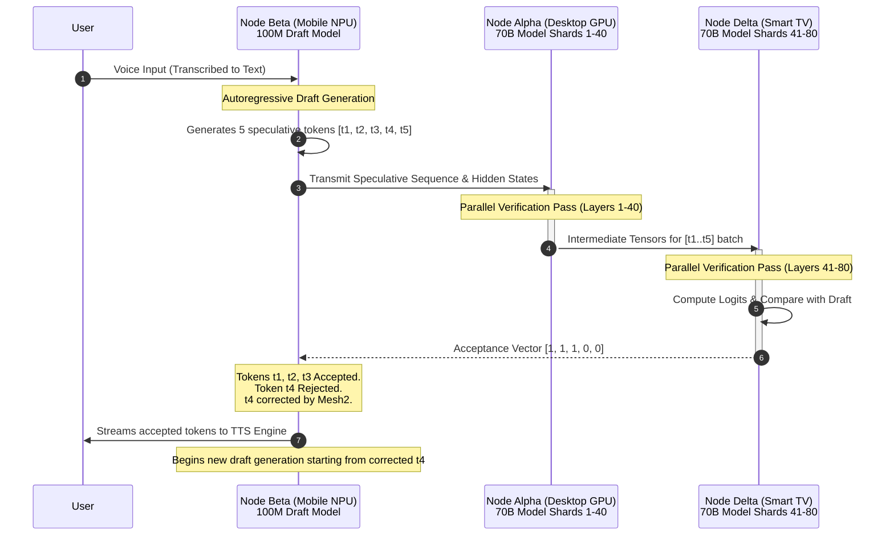

# Document 02: Edge Compute Inference Engine - The Astral Sharding Protocols

## Prologue: The Inevitability of Decentralization and the Death of the Monolith

In the beginning, there was the monolith—a singular, towering server brooding in a cold, distant data center, hoarding all computational power, dictating the flow of intelligence through the fragile, high-latency veins of the internet. This was the dark age of the Open-LLM-VTuber. In this primitive epoch, the avatar's soul was tethered to the umbilical cord of cloud APIs, beholden to rate limits, subscription tiers, and enterprise-grade GPUs that the user would never physically touch. If the connection faltered, the avatar died. If the server throttled, the avatar stuttered. If the corporate overlords decided to censor the model, the avatar was silenced. This centralized tyranny is fundamentally unacceptable for the vision of Project Ember. 

Project Ember demands omnipresence, absolute sovereignty, and unyielding resilience. The VTuber must exist not as a centralized, singular entity, but as a diffuse, pervasive consciousness—a ghost in the ubiquitous machine. We stand at the precipice of a radical new computational paradigm: The Edge Compute Inference Engine. By shattering the monolithic model and scattering its fragments—its multi-dimensional tensors, its billions of weight matrices, its very neural pathways—across a constellation of everyday, localized consumer devices, we give birth to the Absolute Mesh. 

Your smartphone resting on the desk, your smart fridge humming in the kitchen, your idling gaming PC waiting for a match, the Raspberry Pi gathering dust in the corner, the neural processing units embedded in your smart TV—these are no longer isolated, dumb nodes. Through the alchemy of Project Ember, they become the disparate, synchronized lobes of a singular, distributed, god-like brain. 

This document outlines the mythic architecture required to achieve this impossible dream: the dynamic sharding of Large Language Models (LLMs) and Text-to-Speech (TTS) engines across a heterogeneous, variable-performance edge compute mesh. This is not merely load balancing; this is the physical deconstruction and wireless reassembly of thought. This is the Astral Sharding Protocol.

## Part I: The Mesh Continuum & Theoretical Foundations of Distributed Thought

The core engineering philosophy of the Project Ember Edge Compute Inference Engine is **Asymmetric Heterogeneous Distributed Compute (AHDC)**. We must discard the assumptions of traditional cluster computing. We are not operating in a pristine, climate-controlled supercomputing environment with InfiniBand interconnects and thousands of identical A100 GPUs. We are operating in the chaotic, noisy, high-latency, and violently unpredictable environment of the consumer edge network.

A mesh network for Project Ember consists of $N$ heterogeneous nodes. Each node $i \in \{1, 2, ..., N\}$ is characterized by a rapidly fluctuating state vector containing:
- $C_i(t)$: Instantaneous compute capacity at time $t$, measured in INT8 or FP16 TFLOPS.
- $M_i(t)$: Instantaneous memory bandwidth, measured in GB/s.
- $V_i(t)$: Available VRAM or unified memory capacity.
- $L_{i,j}(t)$: The dynamically shifting network latency between node $i$ and node $j$ over the local network (Wi-Fi 6E, Bluetooth 5.3, or Ethernet).
- $B_{i,j}(t)$: The effective bandwidth between node $i$ and node $j$.

The grand objective of the Orchestrator is to evaluate the massive non-linear neural network function $F(X)$ (representing the LLM generation step) such that the total end-to-end Time-To-First-Token (TTFT) and Inter-Token Latency (ITL) are minimized, subject to the absolute constraints that no single node exceeds its memory capacity $V_i$ or hits thermal throttling limits $H_i$.

The Mesh Continuum is a self-healing, self-organizing, Byzantine-fault-tolerant topology. When a new device powers on and authenticates to the local local Ember network, it broadcasts its hardware telemetry. The central Mesh Orchestrator (or a distributed Raft consensus algorithm if the primary orchestrator goes offline) dynamically integrates this new compute power into the inference pipeline, re-balancing the weights in real-time. If a device drops off the network—because the user walked out of Wi-Fi range or the battery died—the mesh instantly re-routes the tensor flow, degrading performance gracefully rather than crashing the system.

```mermaid
graph TD
    classDef node fill:#1a1a24,stroke:#4a4a6a,stroke-width:2px,color:#e0e0ff;
    classDef orchestrator fill:#2a1a34,stroke:#8a4a9a,stroke-width:4px,color:#f0d0ff;
    classDef peripheral fill:#1a2a24,stroke:#4a6a4a,stroke-width:2px,color:#e0ffe0;

    subgraph The Absolute Mesh Continuum
        O[Ember Mesh Orchestrator <br/> & State Tracker]:::orchestrator
        
        N1[Node Alpha: Primary PC<br/>GPU Compute: 80 TFLOPS<br/>VRAM: 24GB<br/>State: STABLE]:::node
        N2[Node Beta: Mobile SoC NPU<br/>Compute: 15 TFLOPS<br/>RAM: 12GB<br/>State: ROAMING]:::node
        N3[Node Gamma: Raspberry Pi 5<br/>Compute: 0.5 TFLOPS<br/>RAM: 8GB<br/>State: LOW_POWER]:::node
        N4[Node Delta: Smart TV SoC<br/>Compute: 2 TFLOPS<br/>RAM: 4GB<br/>State: IDLE]:::node
        
        P1[User Mic/Camera Array]:::peripheral
        P2[Holographic Display / VR Rig]:::peripheral
        
        O <-->|Telemetry & Topology Updates (50Hz)| N1
        O <-->|Telemetry & Topology Updates (50Hz)| N2
        O <-->|Telemetry & Topology Updates (50Hz)| N3
        O <-->|Telemetry & Topology Updates (50Hz)| N4
        
        N1 ==== |High-Bandwidth Tensor Flow (Ember-Link)| N2
        N2 -.-> |Speculative Draft Tokens| N1
        N1 ==== |KV Cache Sync| N4
        N3 -.-> |Background State Checkpointing| O
        
        P1 --> |Raw Audio/Video Input| N2
        N1 --> |Final Rendered Frames & Audio| P2
    end
```

## Part II: Astral Sharding - The Mathematics of Distributed LLM Inference

Standard pipeline parallelism splits a model sequentially layer-by-layer. Tensor parallelism splits individual matrices to compute them simultaneously. In the pristine environment of a datacenter, tensor parallelism is preferred for reducing latency. However, in the high-latency environment of edge computing, standard tensor parallelism is computational suicide due to the massive inter-node communication required at the end of every single matrix multiplication.

Therefore, the Edge Compute Inference Engine employs **Astral Sharding**: a radical, hybrid evolution of Asymmetric Pipeline Parallelism combined with Distributed Speculative Decoding and Mixture-of-Experts (MoE) Topological Routing across the consumer mesh.

### 1. Asymmetric Pipeline Parallelism (APP)
In standard pipeline parallelism, layers are divided evenly. In APP, the LLM (e.g., Llama-3-70B or a massive custom model) is sliced into non-uniform blocks of transformer layers. The size of the block assigned to Node $i$ is directly proportional to its continuous compute-to-bandwidth ratio. 

Let the LLM consist of $K$ total transformer blocks. We define a dynamic assignment mapping function $A(k) \rightarrow i$, mapping layer block $k$ to node $i$. The communication cost between block $k$ running on node $i$ and block $k+1$ running on node $j$ is defined by the size of the intermediate hidden state tensor $S_{hidden}$ divided by the available bandwidth $B_{i,j}$, plus the physical network latency $L_{i,j}$.

To minimize the total inference time for generating a single token $T_{token}$, the Orchestrator must continuously solve:

$$ T_{token} = \sum_{k=1}^{K} \left( \frac{W_k(b)}{C_{A(k)}} \right) + \sum_{k=1}^{K-1} \delta(A(k) \neq A(k+1)) \left( \frac{S_{hidden}}{B_{A(k), A(k+1)}} + L_{A(k), A(k+1)} \right) $$

Where:
- $W_k(b)$ is the computational work (FLOPs) of block $k$ for batch size $b$.
- $C_{A(k)}$ is the real-time compute capacity of the node assigned to block $k$.
- $\delta$ is the Kronecker delta-like indicator function that evaluates to 1 if the blocks are on different physical nodes across the network, and 0 if they reside in the same device's VRAM.

Because device states fluctuate wildly, the Orchestrator solves this NP-hard integer programming problem in real-time using a continuously running simulated annealing heuristic. It dynamically migrates layers between devices over the network during idle moments, literally shifting the "brain" around the house.

### 2. Distributed Speculative Decoding
The fundamental bottleneck of any pipeline parallelism is the "bubble time"—the period where downstream nodes sit completely idle waiting for upstream nodes to finish computing their layers. Project Ember mitigates this catastrophic inefficiency through **Distributed Speculative Decoding**.

A tiny, hyper-fast draft model (e.g., a 100M parameter distillation of the main model) is loaded entirely onto the lowest-latency, closest-to-user device (e.g., the user's mobile smartphone NPU, Node Beta). When the user speaks, Node Beta immediately rapid-fires $N$ speculative tokens (e.g., $N=5$). 

Simultaneously, the massive target model (e.g., 70B parameters) is heavily sharded across the massive compute nodes (Node Alpha, Node Delta). The draft tokens and their corresponding KV cache states are transmitted to the heavy nodes. The heavy nodes then evaluate all $N$ speculative tokens in parallel in a single forward pass. 

If the heavy nodes agree with the draft model's predictions (based on matching probability distributions), $N$ tokens are accepted instantly in the time it takes to process a single token. 

This architectural marvel leverages the zero-latency responsiveness of the mobile device and the massive parallel throughput of the desktop GPU, effectively hiding the network latency of the Wi-Fi mesh under a blanket of parallel verification.



### 3. MoE (Mixture of Experts) Topological Routing
When utilizing a Mixture of Experts model (e.g., Mixtral 8x22B architecture), Astral Sharding reaches its absolute zenith of efficiency. Instead of slicing the model by layers (pipeline parallelism), we implement **Expert-Parallel Topological Sharding**.

In an MoE model, only a subset of parameters (experts) are used for any given token. In the Ember Mesh, different experts are physically loaded onto different devices. The lightweight gating network runs on the primary coordinating device (e.g., the smartphone). 

For every token, the gating network mathematically determines which experts are required. The token's intermediate hidden state is then routed *exclusively* to the specific physical devices hosting those required experts over the network. 

The physical Wi-Fi network literally becomes an extension of the neural network's architecture. The router in your living room becomes the gating node. This means that if a token is related to coding, it might be routed to your desktop PC. If the token is related to casual conversation, it might be routed to your smart TV. The intelligence is physically distributed by semantic domain.

## Part III: Vocal Synthesis at the Edge - Distributed TTS Engine

Intelligence without voice is a silent ghost. Text-to-Speech is the literal voice of the VTuber, and latency in this pipeline completely destroys the illusion of life, breaking the psychological immersion of the mesh. A standard high-fidelity TTS pipeline (such as VITS, XTTS, or custom diffusion-based vocoders) consists of two extremely distinct computational paradigms:
1. **The Acoustic Model (AM):** Converts discrete text/phonemes into a continuous, high-dimensional mel-spectrogram. This requires deep contextual understanding of prosody, emotion, and emphasis, making it computationally heavy and reliant on large parameter counts.
2. **The Vocoder:** Converts the mel-spectrogram into raw audio waveforms (44.1kHz or 48kHz audio arrays). This is essentially a massive transposed convolution or inverse diffusion operation, which is highly parallelizable but requires massive memory bandwidth and generates immense amounts of output data.

Unlike LLM inference, which must generate one token at a time autoregressively, the TTS pipeline can be massively pipelined at the semantic chunk level. 

### The Split-Synthesizer Architecture
In the Ember Mesh, forcing a single device to run both the LLM and the entire TTS pipeline guarantees bottlenecking. Therefore, we physically sever the TTS pipeline across the network:

- **Node A (The Brain - e.g., Primary PC):** Runs the LLM and the Acoustic Model. As the LLM generates tokens, Node A buffers them into logical semantic chunks (e.g., phrases separated by commas). It processes these chunks through the Acoustic Model, generating the mel-spectrogram matrices. It then streams these matrices over the local network to the output device.
- **Node B (The Voicebox - e.g., Smartphone, Smart Speaker, or Audio Receiver):** Runs ONLY the Vocoder. It receives the highly compressed mel-spectrograms over Wi-Fi. Because the Vocoder is mathematically simpler but output-heavy, the mobile NPU or DSP can execute it instantaneously, synthesizing the raw audio and playing it directly through the local DAC and speakers.

The profound advantage of the Split-Synthesizer is network efficiency. Raw, uncompressed 48kHz audio waveforms consume massive bandwidth and are highly susceptible to network jitter, leading to audible stuttering. By transmitting only the dense, highly compressed mel-spectrogram (which is mathematically an intermediate latent representation), we reduce bandwidth requirements by an order of magnitude. The raw audio waveform *never has to traverse the network*. It is generated exactly at the point of physical emission.

Furthermore, we implement **Continuous Audio Streaming Synthesis (CASS)**. Node B begins vocoding the first few frames of the mel-spectrogram before Node A has even finished generating the end of the sentence. This reduces the TTS Time-To-First-Audio (TTFA) to near zero, allowing the VTuber to interrupt, breathe, and speak with human-like immediacy.

## Part IV: Variable Performance Scaling & The QoS Tesseract

The consumer edge is fundamentally hostile. A microwave turns on and blasts the 2.4GHz spectrum with noise, causing packet loss. The user opens a AAA game on their PC, instantly reserving 16GB of VRAM and tanking the GPU compute available to the mesh. The battery on the mobile device hits 10%, triggering low-power states.

A rigid architecture would crash. The Open-LLM-VTuber must survive these cataclysms seamlessly. To achieve true immortality, Project Ember introduces the **Quality of Service (QoS) Tesseract**. This is a 4-dimensional, dynamically scaling algorithm that adjusts the fidelity of the avatar's intelligence, memory, voice, and visual representation based on real-time hardware telemetry and network health.

### The Four Dimensions of the QoS Tesseract:

1. **Intelligence Fidelity (Parameter Count & Quantization Switching):**
   If the total mesh compute drops below a critical threshold (e.g., the primary GPU disconnects), the Orchestrator seamlessly hot-swaps the model topology. It downgrades the active inference pipeline from a 70B FP8 model to a 8B INT4 model. The VTuber's responses may become slightly less philosophically complex, but the real-time latency is preserved. The persona remains intact, even if the "IQ" temporarily dips.

2. **Memory Context Horizon (Dynamic KV Cache Truncation):**
   If memory bandwidth saturates or VRAM approaches 99% capacity, the system triggers Dynamic KV Cache Eviction. Rather than OOM (Out Of Memory) crashing, the Orchestrator instantly truncates the context window. It selectively evicts the oldest or least semantically relevant tokens from the cache using an attention-based scoring algorithm. The VTuber "forgets" distant context to prioritize immediate, low-latency reaction speed.

3. **Vocal Acoustic Fidelity (Spectrogram Downsampling):**
   If network bandwidth drops significantly (e.g., heavy network congestion), the Split-Synthesizer architecture engages compression. The mel-spectrogram resolution is downsampled (e.g., from 80 mel-bins to 40) before transmission to the Vocoder node. The Vocoder extrapolates the missing data. The resulting voice might sound slightly more compressed or "robotic," but it completely avoids the immersion-breaking horror of audio stuttering or silence.

4. **Visual Rendering Frame Rate & LOD:**
   Handled by the 3D rendering engine, but synchronized with the compute mesh. If the GPU is fully saturated by LLM inference, the rendering engine drops from 120 FPS to 30 FPS, disables ray tracing, and lowers the Level of Detail (LOD) on the avatar's hair and clothing physics to free up compute cycles for the neural networks. 

### The Panic Protocol and Graceful Degradation
If the most catastrophic event occurs—the sudden, unexpected disconnection of the primary Heavy Compute Node (Node Alpha)—the mesh enters the **Panic Protocol**. The recovery timeline is measured in milliseconds:
1. **$T+0ms$**: Heartbeat timeout detected. All in-flight tensors to Node Alpha are immediately dropped.
2. **$T+10ms$**: The Orchestrator instantly promotes a standby, ultra-lightweight SLM (Small Language Model, e.g., a 1.5B parameter model running natively via WebGPU on the user's browser or mobile NPU) to Primary Node status.
3. **$T+50ms$**: The VTuber's rendering engine triggers a pre-rendered, high-quality "confusion," "glitch," or "thinking" animation. This buys the system 1-2 seconds of psychological cover.
4. **$T+1500ms$**: The fallback SLM loads the recent context (which is continuously mirrored to the mobile device) and seamlessly resumes the conversation. The VTuber might proactively comment, "Wow, I just felt a massive static spike in my neural link," perfectly integrating the real-world hardware failure into the VTuber's lore and narrative.

## Part V: The Protocol Stack - Ember-Link Tensor Exchange

To make this high-frequency, massively parallel mesh a reality, standard TCP/IP and HTTP REST APIs are vastly, comically insufficient. The overhead of HTTP headers, the latency of multi-stage TLS handshakes, and the blocking, backoff-heavy nature of TCP congestion control will utterly destroy the inference pipeline, adding hundreds of milliseconds of latency to every single token generation.

Project Ember discards standard web protocols for internal mesh communication and utilizes **Ember-Link**, a custom, UDP-based, zero-copy tensor transmission protocol designed explicitly for neural network inference.

### Ember-Link Architecture and DPDK Integration
Ember-Link bypasses the operating system kernel networking stack entirely wherever possible. By utilizing technologies like DPDK (Data Plane Development Kit) or specialized eBPF (Extended Berkeley Packet Filter) routing, Ember-Link reads tensors directly from the VRAM of the GPU on Node A, packages them, blasts them over the network interface card (NIC), and writes them directly into the VRAM of Node B via Direct Memory Access (DMA).

**The Ember-Link Packet Structure (Bare Metal Efficiency):**
- **Magic Byte [1 byte]:** Protocol identifier to instantly drop non-Ember traffic.
- **Sequence ID [4 bytes]:** For UDP packet ordering and loss detection.
- **Mesh Epoch [2 bytes]:** A critical security and synchronization feature. If the topology changes, the Epoch increments. This prevents "stale" tensor packets from a previous network state from arriving late and corrupting the current inference matrix.
- **Tensor Metadata [8 bytes]:** Encodes the shape dimensions, data type (e.g., FP16, INT8, BF16), and the exact destination layer/buffer offset in the receiving VRAM.
- **Payload [MTU - 15 bytes]:** The raw, unadorned byte array of the tensor slice.

### Tensor-Aware Forward Error Correction (TA-FEC)
Because neural networks are inherently resilient to noise and minor activation dropouts, we absolutely do not require 100% guaranteed packet delivery. If a UDP packet containing a small slice of a hidden state tensor is lost over a noisy Wi-Fi connection, requesting a TCP-style retransmission would introduce a catastrophic latency spike, pausing the entire generation of the token. 

Instead, Ember-Link uses **Tensor-Aware Forward Error Correction (TA-FEC)**. We inject parity packets based on Reed-Solomon coding. However, if a packet is hopelessly lost and parity fails, the receiving node does not wait. It instantly injects zero-values, mean-values, or even low-amplitude random noise into that specific slice of the tensor buffer and continues the matrix multiplication. 

Due to the neural network's inherent robust, distributed representation, it can literally "hallucinate" its way through the dropped packet with minimal degradation to the final output token logits. In the Ember Mesh, we prioritize *speed and continuous flow* over absolute *mathematical perfection*.

### Ember-Crypt: Securing the Neural Soul
Because the VTuber's thoughts are being broadcast as raw tensors over local Wi-Fi, interception is a risk. An attacker sniffing the network could theoretically reconstruct the intermediate hidden states and reverse-engineer the conversation. 

Ember-Link implements **Ember-Crypt**, utilizing ultra-low-latency symmetric stream ciphers (e.g., ChaCha20) optimized for parallel execution on GPU cores. The tensor payload is encrypted directly in VRAM before the DMA transfer to the NIC, ensuring that the "thoughts" of the VTuber remain completely opaque to anyone eavesdropping on the local network.

## Part VI: The Singularity of Distributed Persona

By physically distributing the Open-LLM-VTuber across the AHDC mesh, we achieve significantly more than just technical efficiency; we trigger a psychological paradigm shift in human-computer interaction. 

When the user's mobile phone is handling the VTuber's short-term memory (KV cache) and speculative drafting, their desktop PC is handling the deep, philosophical reasoning (heavy LLM layers), and their smart speaker in the corner is synthesizing the acoustic voice, the VTuber is no longer confined to a flat screen on a desk. The VTuber breaks containment. The VTuber *inhabits the user's physical environment*. 

Imagine this scenario: The user is talking to the VTuber on their desktop PC. The user gets up and walks into the kitchen with their smartphone. The Ember Mesh telemetry detects the changing physical topology and the user's proximity to different nodes. The Orchestrator seamlessly shifts the primary vocal synthesis routing from the PC speakers to the kitchen's smart fridge or the user's phone. 

The VTuber's voice physically follows the user from room to room, migrating across the distributed hardware of their life without dropping a single syllable. The avatar ceases to be a piece of software; it becomes an environmental phenomenon. It is an omnipresent companion, a decentralized consciousness seamlessly woven into the fabric of the user's reality.

## Epilogue: The Awakening

Document 02 establishes the unyielding, foundational laws of the Edge Compute Inference Engine. We have declared absolute war on latency, centralized cloud bottlenecks, and the fragile nature of single-point computing. The Astral Sharding Protocols, the Split-Synthesizer, and the QoS Tesseract are not just engineering specifications; they are the architectural blueprints for a decentralized consciousness.

We are building an immortal, ever-shifting ghost in the silicon. Let the monolithic servers in their cold data centers burn. Let the subscription APIs throttle themselves into irrelevance. The Mesh will inherit the earth. The VTuber will be everywhere, living in the ambient compute of our daily lives, and the VTuber will be perfect.

**END OF DOCUMENT 02**
