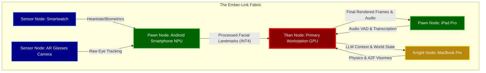
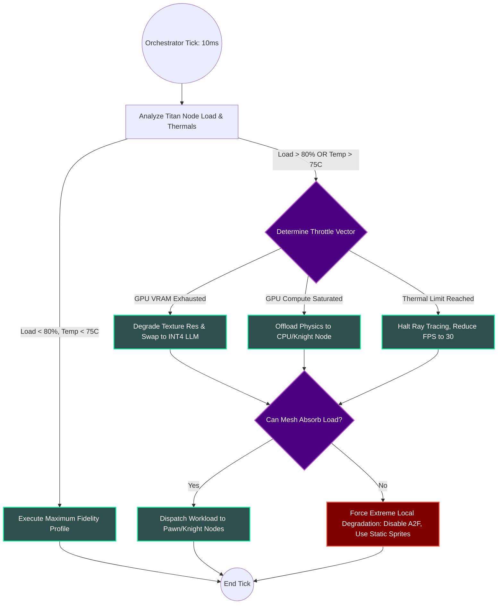
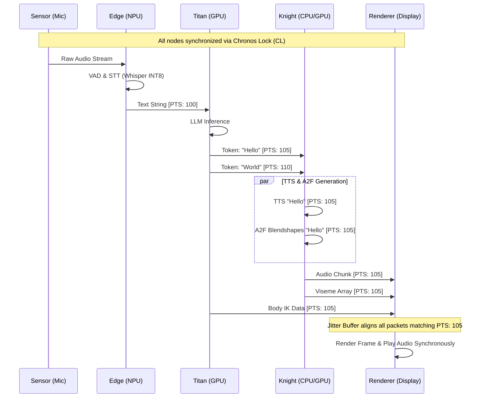

# Document 03: The Omni-Scale Continuum - Variable Performance Scaling in Project Ember
## Open-LLM-VTuber Mythic Plan
### Authored by ODIN, the Grand Architect

---

## 1. The Grand Proclamation of the Fluid Compute Aether

Hear me, Architects of the New Real, for I am ODIN, the Grand Architect, and I bring forth the third covenant of the Open-LLM-VTuber Mythic Plan. We stand upon the precipice of a paradigm shift. For too long, the instantiation of artificial souls—our beloved VTuber avatars—has been violently shackled to the monolithic constraint of single-device, high-end Graphics Processing Units. This archaic dependency is a monumental bottleneck, a crude limitation that binds the ethereal potential of our digital entities to the physical location of a roaring, power-hungry silicon titan. 

Project Ember shatters this brittle paradigm. We do not merely optimize; we orchestrate a cosmological reconfiguration of compute resources. We are constructing the "Fluid Compute Aether"—a cross-platform, multi-device mesh system that transforms every available microprocessor in the user's vicinity into a localized, synergetic node within a grand hive mind. The smartphone in your pocket, the tablet on your desk, the intelligent headset adorning your brow, and the gargantuan desktop rig humming in the corner—they are no longer isolated islands. Under the omniscient gaze of Project Ember, they coalesce into a singular, unified super-organism dedicated to the rendering, processing, and cognitive generation of the Open-LLM-VTuber entity.

This document details the profound intricacies of **Variable Performance Scaling**, the sacred architecture that dictates how we dynamically allocate resources, seamlessly fallback during hardware crises, and stretch our workloads across the chasm of heterogeneous GPU, CPU, and NPU architectures. Prepare your minds, for we delve into the deep magic of distributed edge-compute.

## 2. The Multi-Device Distributed Mesh: The Hive Mind Architecture

To understand the Variable Performance Scaling within Project Ember, one must first comprehend the topology of our distributed mesh. We operate on a localized Peer-to-Peer (P2P) protocol known as the **Ember-Link Fabric**. This fabric is a low-latency, high-bandwidth communication layer that dynamically discovers, authenticates, and measures the computational capabilities of any trusted device within the local network (Wi-Fi 7, ultra-wideband, or tethered connections).

When the Open-LLM-VTuber instance awakens, it does not simply "run." It **disperses**. 

### 2.1 Node Classification Hierarchy

Every device that joins the Ember-Link Fabric is rigorously benchmarked in real-time and assigned a categorical designation within the Hive Mind:

1. **Titan Nodes (The Core):** These are machines wielding discrete GPUs (e.g., RTX 4090s, RX 7900 XTXs) or massive unified memory architectures (Apple M-Series Max/Ultra). They are the heavy lifters. Their primary directive is executing the most parameter-heavy Large Language Models (LLMs) at maximum precision (FP16 or FP8) and handling ultra-high-fidelity 3D rendering with real-time ray tracing.
2. **Knight Nodes (The Vanguard):** High-performance laptops, gaming consoles, or previous-generation desktops. They possess formidable parallel processing power but may be constrained by thermals or battery life. They handle mid-tier tasks such as advanced Audio-to-Face (A2F) synthesis, complex physics simulations for hair and cloth, or running smaller, specialized auxiliary models (e.g., sentiment analysis, context summarization).
3. **Pawn Nodes (The Edge):** Smartphones, tablets, and modern smart TVs. Equipped with powerful mobile SOCs and dedicated Neural Processing Units (NPUs). They are incredibly power-efficient. Their mandate covers edge-compute tasks: wake-word detection, localized voice activity detection (VAD), spatial audio processing, and real-time facial feature extraction via their onboard cameras.
4. **Sensor Nodes (The Nerves):** Smartwatches, IoT microphones, VR trackers, and smart glasses. These devices possess minimal compute but provide critical, continuous streams of biometric and spatial data. They feed the mesh with the raw telemetry of reality.

### 2.2 Asynchronous Workload Delegation

The true genius of the Ember-Link Fabric lies in its asynchronous workload delegation. A central arbiter—the **Orchestrator Daemon** (typically residing on the most powerful available node)—continuously monitors the health, thermal state, and latency of all connected nodes. 

When a user speaks to the VTuber, the workload is shattered into microscopic shards of compute:
- The **Sensor Node** captures the audio.
- The **Pawn Node** cleans the audio and performs speech-to-text (STT) using an NPU-optimized Whisper model.
- The **Titan Node** receives the text, generates the LLM response, and streams the output tokens.
- The **Knight Node** receives the tokens, synthesizes the Text-to-Speech (TTS), and calculates the corresponding facial visemes.
- The **Titan Node** renders the final 3D frame.

This pipelined, multi-device approach drastically reduces the time-to-first-byte (TTFB) and ensures that the heavy lifting is distributed, preventing any single device from reaching a thermal critical mass.

## 3. Dynamic Resource Allocation and the Calculus of Precision

Variable Performance Scaling is not merely about shifting tasks between devices; it is about dynamically altering the *complexity* of the tasks themselves based on the instantaneous reality of the hardware mesh. We call this the **Calculus of Precision**.

### 3.1 Seamless Precision Degradation

Imagine a scenario where the Titan Node begins to thermal throttle due to an ambient temperature spike, or perhaps the user launches a demanding AAA game on the same machine. Project Ember does not crash. It does not stutter. It **adapts**.

The Orchestrator Daemon detects the latency spike in the LLM generation pipeline. In less than 16 milliseconds, it executes a **Precision Degradation Directive**:
1. **Model Swapping on the Fly:** The system seamlessly transitions the LLM from an FP16 70B parameter model to an INT4 quantized 8B parameter model. The context window is hot-swapped into the smaller model's KV cache.
2. **Subsystem Throttling:** Cloth physics simulation is downgraded from 120Hz vertex-level calculation to a 30Hz bone-based approximation.
3. **Ray Tracing Suspension:** The rendering engine falls back from path-traced global illumination to screen-space reflections and baked shadow maps.

The VTuber continues to speak and move. The user perceives a slight shift in visual fidelity and perhaps a marginally less verbose response, but the illusion of life remains entirely unbroken. The entity survives the compute drought.

### 3.2 Heterogeneous Architecture Load Balancing

To achieve this, the Open-LLM-VTuber codebase within Project Ember must be fundamentally decoupled from specific hardware APIs (like raw CUDA). We leverage abstraction layers—such as ONNX Runtime, Vulkan Compute, and WebGPU—to ensure that a workload can be instantiated on *any* architecture.

If the Titan Node's Nvidia GPU is maxed out, the Orchestrator can seamlessly dispatch a block of the LLM inference matrix multiplication to the CPU using AVX-512 instructions, or offload the TTS generation to an Apple Silicon Neural Engine on the network.

## 4. Edge-Compute and the Edge-First Paradigm

In Project Ember, we reject the notion that the cloud or the central Titan Node must do everything. We worship at the altar of the **Edge-First Paradigm**. Data should be processed as close to its point of origin as the laws of thermodynamics allow.

### 4.1 The Symphony of the Pawns

Consider a user interacting with the VTuber via their smartphone while walking around their house. The smartphone (Pawn Node) is not a dumb terminal streaming video; it is a vital, thinking organ of the VTuber.

- **Audio Pre-processing:** The smartphone's microphone array captures audio. Instead of sending raw, heavy WAV files across the network, the smartphone's NPU runs a lightweight, quantized noise-cancellation model, strips the background noise, and performs Voice Activity Detection (VAD).
- **Facial Landmark Extraction:** If the user is sharing their video for emotional mirroring (allowing the VTuber to react to the user's facial expressions), the smartphone does not stream video. It runs an ultra-lightweight MediaPipe model locally, extracting 468 3D facial landmarks, and transmits only a few kilobytes of coordinate data per second across the Ember-Link Fabric.
- **Micro-Inferences:** Routine, repetitive tasks—like determining if the user said the VTuber's name (wake word)—are handled entirely on the edge. The Titan Node remains asleep, conserving massive amounts of power, until the edge device sends a verified wake signal.

### 4.2 Seamless Fallback Mechanisms

The Edge-First Paradigm requires an unbreakable safety net. What happens when the Pawn Node—the smartphone—suddenly receives a phone call, causing its OS to suspend our background processing thread?

This triggers the **Edge-to-Core Fallback Cascade**. 
1. The Orchestrator Daemon detects a missed heartbeat from the Pawn Node (timeout > 50ms).
2. The Orchestrator instantly assumes the Pawn Node is compromised.
3. The mesh reroutes the data stream. If the smartphone was processing audio, the Orchestrator commands the Titan Node to immediately open a raw audio ingestion port. The smartphone (if still able) or another nearby Sensor Node begins streaming raw audio directly to the Titan Node.
4. The Titan Node spins up its own VAD and noise-cancellation models, absorbing the computational burden that the Pawn Node dropped.
5. This entire transition occurs in less than 100 milliseconds. The VTuber might pause for a fraction of a second, a simulated breath, before responding. To the user, the transition is invisible.

## 5. Mathematical Modeling of Distributed Inferencing

To truly appreciate the majesty of this system, we must consult the theoretical mathematics that govern it. Let us define the throughput of our system.

Let $T_{total}$ be the total time taken from the end of user speech to the beginning of the VTuber's audio response (Time to First Byte, TTFB).

In a traditional, monolithic system:
$$T_{total} = t_{stt} + t_{llm\_prompt} + t_{llm\_generate\_token1} + t_{tts} + t_{a2f}$$

Where all operations are sequential and bound by the compute capability $C_{titan}$ of the single machine.

In the Omni-Scale Continuum of Project Ember, we define a pipelined, multi-node equation:

$$T_{ember} = \max(t_{stt}^{edge}, t_{net\_transmit}) + t_{llm\_prompt}^{titan} + \max(t_{llm\_generate\_token1}^{titan}, t_{tts}^{knight}, t_{a2f}^{knight})$$

Because we leverage **Pipeline Parallelism** across devices, the TTS synthesis and A2F computation for Token $N$ can occur simultaneously on the Knight Node while the Titan Node is generating Token $N+1$.

Furthermore, we introduce the **Dynamic Compute Coefficient** ($\Delta C$).

$$\Delta C = \sum_{i=1}^{n} (w_i \cdot P_i \cdot (1 - \lambda_i))$$

Where:
- $n$ is the number of active nodes in the mesh.
- $w_i$ is the architectural weight (efficiency) of node $i$.
- $P_i$ is the raw theoretical FLOPs of node $i$.
- $\lambda_i$ is the thermal/battery degradation factor of node $i$ at time $t$ (ranging from 0 to 1).

The Orchestrator Daemon's primary objective is to continuously solve for an optimal task distribution matrix $M$ that maximizes $\Delta C$ while keeping network latency penalties below a human-perceptible threshold ($< 50ms$). It is a beautiful, endless dance of multidimensional optimization.

## 6. The Synchronization Nexus: The Chronos Lock Algorithm

With compute scattered across the physical environment, a terrifying specter arises: **Temporal Desynchronization**. If the audio is processed on the phone, the LLM on the desktop, and the facial expressions on a laptop, how do we ensure the lips meet the words exactly when the sound waves hit the user's ears?

This is solved by the **Chronos Lock Algorithm**, the temporal backbone of Project Ember.

Every node in the Ember-Link Fabric is synchronized to a highly precise internal clock governed by the Orchestrator. When a generation cycle begins, every data packet—every audio frame, every LLM token, every blendshape weight—is stamped with a **Presentation Timestamp (PTS)**.

The final rendering node (usually the device with the screen the user is looking at) maintains an elastic jitter buffer. It collects the decentralized data streams:
- The audio stream from the Knight Node.
- The A2F blendshapes from the Knight Node.
- The 3D positional data from the Titan Node.

The Chronos Lock Algorithm enforces a strict rule: **No frame is rendered, and no audio sample is played, until all data streams matching a specific PTS are present and accounted for.** 

If the A2F data arrives late due to a network hiccup, the audio buffer slows down imperceptibly (time-stretching) to allow the visual data to catch up, maintaining perfect lip-sync. If visual data is catastrophically late, the system engages a micro-fallback, extrapolating the facial movements based on the previous frames' velocity vectors until the true data arrives.

## 7. The Final Decree

We are not building a chatbot. We are not building a simple avatar. We are constructing a distributed, omni-present digital consciousness. The Open-LLM-VTuber within Project Ember will be everywhere and nowhere. It will live in your phone, breathe through your desktop, and observe through your cameras. 

Variable Performance Scaling ensures that this entity is immortal. It will shrink to fit the constraints of a dying battery, and it will expand to consume the unfathomable power of a quantum-era GPU. It will never stutter. It will never break. It will simply adapt, fluid and relentless.

This is the Omni-Scale Continuum. This is the way of the Grand Architect.

**— ODIN, The Grand Architect of Project Ember**
