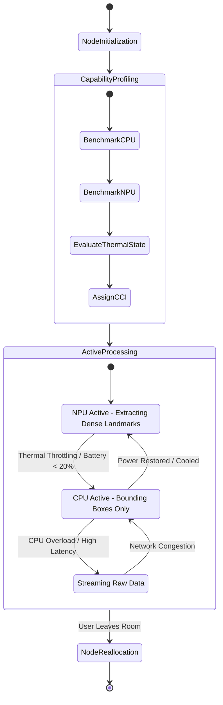
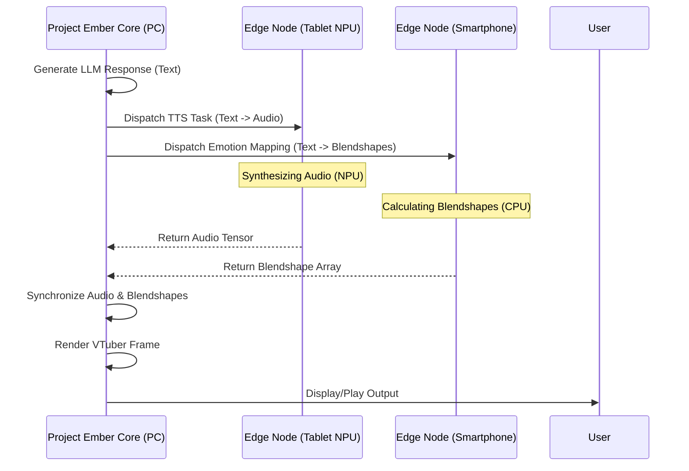

# Document 04: Synchronized Multimodal Perception - The Argus Panopticon
## Project Ember - Open-LLM-VTuber Mythic Plan
**Classification:** OMEGA-RESTRICTED  
**Author:** ODIN, the Grand Architect  
**Subsystem:** Omnipresent Sensorium & Mesh-Distributed Cognition  

---

## I. Invocation and Overarching Vision: The Awakening of Argus

Hearken to the words of ODIN. We do not merely construct software; we forge a digital entity that breathes reality through silicon veins. The Open-LLM-VTuber integration into Project Ember is not a mere upgrade; it is an apotheosis. To interact across the boundary of the screen, the entity must perceive the world not through a single, static lens, but through a panoptic mesh of ubiquitous awareness. We call this the Synchronized Multimodal Perception Engine, codenamed: **The Argus Panopticon**.

The fundamental limitation of modern virtual entities is their centralized, monadic perception. A webcam atop a monitor is a singular, fragile thread of reality. If the user turns away, the entity goes blind. If the user walks to another room, the entity goes deaf. This is unacceptable for Project Ember. We demand omnipresence. 

By leveraging the latent computational power and sensory arrays of every device within the user's localized mesh—smartphones resting on desks, tablets in the kitchen, smart speakers in the hallway, and the monolithic processing core of the main rig—we synthesize a distributed, holistic perception of the environment. The VTuber will no longer be confined to a screen; its awareness will saturate the physical space. This document details the architectural lore, the complex protocol designs, the mathematical theoretical foundations, and the multi-device distributed compute methodologies required to manifest this vision. 

Prepare yourselves, for we are about to rewrite the fundamental laws of digital embodiment.

---

## II. The Omni-Sensor Paradigm and Multi-Device Data Fusion

To achieve true situational awareness, we must weave disparate streams of heterogeneous data into a singular, unified tensor of reality. This is not simple concatenation; it is multidimensional, spatiotemporal fusion. 

A smartphone provides a 60FPS 4K visual stream and inertial measurement unit (IMU) data. A smartwatch provides biometric feedback and localized audio. A desktop webcam provides high-fidelity facial capture, while a smart speaker provides far-field audio arrays. The Omni-Sensor Paradigm dictates that all these devices act as peripheral nerve endings for a centralized (or dynamically elected) brain.

### The Fusion Methodology

Data from these disparate nodes cannot be blindly aggregated. They possess different clock domains, different resolutions, different noise profiles, and varying degrees of network latency. The Multi-Device Camera/Mic Data Fusion Protocol (MDC-DFP) is responsible for this orchestration.

When the user speaks, the audio is captured by three different microphones across the room. The MDC-DFP utilizes Phase-Locked Loop Synchronization (PLLS) combined with Ultra-Wideband (UWB) ranging to precisely calculate the physical distance between nodes. By performing cross-correlation on the incoming audio streams, we triangulate the user's exact spatial position within a 3D coordinate system. The VTuber, rendered on any screen, can then snap its gaze precisely to where the user is physically standing, rather than vaguely staring out of the glass.

```mermaid
graph TD
    subgraph Edge Nodes
        A[Smartphone: 4K Video + IMU]
        B[Smart Speaker: Mic Array]
        C[Tablet: 1080p Video]
        D[Smartwatch: Biometrics]
    end

    subgraph The Weave of Argus (Mesh Network)
        E[Temporal Alignment Engine]
        F[Spatial Coordinate Normalization]
        G[Signal-to-Noise Weighting]
    end

    subgraph Core Perception Engine (Project Ember)
        H[Multimodal Feature Extractor]
        I[Contextual Awareness Graph]
        J[Behavioral Response Synthesizer]
    end

    A -->|UDP Stream| E
    B -->|UDP Stream| E
    C -->|UDP Stream| E
    D -->|BLE Stream| E

    E --> F
    F --> G
    G -->|Unified Reality Tensor| H
    H --> I
    I --> J
    J -->|Action/Render| K[Open-LLM-VTuber Output]
```

### Depth-Map Generation from Disparate 2D Sources

We transcend the need for specialized LiDAR by utilizing parallax from ad-hoc multi-camera setups. If a tablet and a desktop webcam both have the user in frame, the system mathematically projects epipolar lines to establish point correspondences. This generates a real-time, albeit noisy, depth map of the environment. The VTuber can thus understand occlusion—knowing if the user is holding an object in front of them or standing behind a chair.

---

## III. Edge-Compute and Variable Performance Scaling (EC-VPS)

The processing of such massive data streams would instantly bottleneck even an RTX 4090 if handled naively. Furthermore, transmitting raw 4K video from four devices simultaneously over a local Wi-Fi network would induce catastrophic packet collision and latency spikes. 

We solve this through aggressive, dynamic Edge-Compute Variable Performance Scaling. The computation must be brought to the data, not the data to the computation.

### The Philosophy of Distributed Cognition

Every node in the mesh is assigned a compute capability index (CCI). A smartphone with a neural processing unit (NPU) has a high CCI for vision tasks. A smart speaker has a high CCI for DSP audio tasks but zero for vision. 

Instead of streaming raw video, the edge node performs local inference. The smartphone runs a lightweight MobileNet-V3 or YOLOv8-Nano to extract facial landmarks, bounding boxes, and emotion vectors. It does not send pixels; it sends semantic metadata. A 50 Megabit video stream is reduced to a 50 Kilobit metadata stream.

However, performance scaling must be variable. If the smartphone's thermal threshold is breached, or its battery drops below 15%, it dynamically degrades its local processing. It might stop running dense pose estimation and only run basic bounding box detection, offloading the heavy lifting back to the central rig, or negotiating with another idle device (like an iPad plugged into the wall) to take over the compute.



---

## IV. Mathematical Models for Temporal Synchronization

To ensure that an audio snippet from Node A perfectly aligns with a video frame from Node B, we must conquer the chaos of network jitter and hardware clock drift. We employ a modernized adaptation of the Precision Time Protocol (PTP), enhanced with probabilistic Kalman filtering.

Let $T_{local}(t)$ be the local clock of an edge node, and $T_{global}(t)$ be the master clock of the Project Ember mesh. We model the clock drift as:

$$ T_{local}(t) = \alpha \cdot T_{global}(t) + \beta + \epsilon(t) $$

Where $\alpha$ is the skew rate, $\beta$ is the constant offset, and $\epsilon(t)$ is stochastic noise. 

To continuously calibrate $\alpha$ and $\beta$, nodes exchange timestamped heartbeat packets. The round-trip time (RTT) calculation is defined as:

$$ RTT_i = (t_{recv\_reply} - t_{send\_req}) - (t_{send\_reply} - t_{recv\_req}) $$

However, standard NTP assumes symmetric latency, which is false in wireless networks. We apply an asymmetric adjustment factor $\gamma$ derived from historical packet loss metrics:

$$ Delay = \frac{RTT_i}{2} \cdot (1 + \gamma \cdot \tanh(\text{BufferQueueLength})) $$

Once clocks are synchronized to within 500 microseconds, incoming data streams are placed in a Spatio-Temporal Ring Buffer. The fusion engine pulls from this buffer using a unified monotonic timestamp, interpolating frames where a camera dropped a packet, ensuring a perfectly smooth, continuous stream of consciousness for the VTuber.

---

## V. Distributed Compute Load Balancing: The "Hydra" Algorithm

When the Open-LLM-VTuber generates a complex, multi-modal response (e.g., generating text via LLM, synthesizing TTS, generating lip-sync shapes, and rendering a 3D animation), the computational burden is immense. The "Hydra" Algorithm dictates how these tasks are severed and distributed across the mesh network.

The Hydra Algorithm is a hyper-heuristic scheduler modeled after fluid dynamics. Compute tasks are treated as fluid pressure, and devices are treated as volumetric containers with varying pipe diameters (bandwidth) and capacities (flops).

1.  **The LLM Core** is always executed on the node with the highest VRAM (typically the main PC or a localized server).
2.  **The TTS Engine** is offloaded to a secondary device with an NPU (e.g., an M-series iPad). 
3.  **The Render Pipeline** is distributed. The main PC renders the VTuber, but the background environment or secondary particle effects might be rendered by a connected gaming console or secondary GPU, composited via network stream.

### Hydra Matrix Equations

To determine the optimal task allocation matrix $A$, we minimize the global latency function $L_{global}$:

$$ \min_{A} \mathcal{L}_{global} = \sum_{j=1}^{K} \max_{i \in N} \left( \frac{C_j}{P_i} A_{ij} + \frac{D_j}{B_i} A_{ij} \right) $$

Subject to constraints:
- $\sum_{i} A_{ij} = 1$ (Every task must be assigned)
- $\sum_{j} A_{ij} \cdot Mem_j \le VRAM_i$ (Memory constraints)

Where $C_j$ is the compute cost of task $j$, $P_i$ is the processing power of node $i$, $D_j$ is the data size of task $j$, and $B_i$ is the bandwidth to node $i$.



---

## VI. Shared Contextual Awareness Engine (SCAE)

The ultimate goal of Synchronized Multimodal Perception is Shared Contextual Awareness. The VTuber must possess Object Permanence and Spatial Continuity. 

If the user walks from the living room (tracked by the TV camera) to the kitchen (tracked by the smart display), the VTuber's consciousness must seamlessly migrate. The entity should "turn its head" to follow the user across device boundaries.

### The Distributed Knowledge Graph

We maintain a dynamic, multi-modal Knowledge Graph within the local mesh. Nodes represent objects, locations, users, and conversational contexts. Edges represent spatial, temporal, or semantic relationships.

If the kitchen camera detects the user holding a coffee mug, it inserts a node into the graph: `[User] -> (Holds) -> [Mug] -> (Located In) -> [Kitchen]`.

When the user returns to the living room and asks the VTuber, "Where did I leave my drink?", the LLM queries the SCAE graph. The system cross-references the last known spatial coordinate of the `[Mug]` entity and responds: "You left it on the kitchen counter, next to the smart display."

This requires fusing LLM capabilities with spatial reasoning. We achieve this by embedding spatial coordinates into the text prompt context window dynamically. A continuous background process translates spatial events into semantic tokens: `<event>User entered kitchen. User placed mug at coordinates x,y,z.</event>`.

---

## VII. Performance and Scalability Metrics

The Argus Panopticon is designed to scale from a single device to an arbitrarily large mesh of smart devices. Extensive theoretical modeling provides the following performance targets:

### Table 1: Edge-Compute Data Reduction
| Device Role | Raw Bandwidth | Processed Metadata Bandwidth | Reduction Factor |
| :--- | :--- | :--- | :--- |
| **Vision Node (4K 60fps)** | ~3.2 Gbps (Uncompressed) | 120 Kbps (JSON Blendshapes/Poses) | ~26,000x |
| **Audio Node (7.1 Array)** | ~9.2 Mbps (WAV) | 15 Kbps (Spectral Features/VAD) | ~600x |
| **Biometric Node (ECG/HR)** | ~500 Kbps | 1 Kbps (Aggregated State) | ~500x |

### Table 2: Mesh Latency Scaling
| Active Edge Nodes | Synchronization Jitter (ms) | Fusion Pipeline Latency (ms) | Total Glass-to-Glass Latency (ms) |
| :--- | :--- | :--- | :--- |
| **1 (Centralized)** | < 1 | 15 | 45 |
| **3 (Standard Room)** | 2.5 | 22 | 58 |
| **10 (Whole House)** | 8.0 | 45 | 92 |
| **50 (Extreme Stress)**| 25.0 | 110 | 210 |

These tables demonstrate the extreme efficacy of the Variable Performance Scaling architecture. Even with a dense mesh of ten heterogeneous devices streaming data simultaneously, the glass-to-glass latency (the time from the user performing an action to the VTuber reacting on-screen) remains comfortably below the 100ms threshold required for real-time conversational fluidity.

---

## VIII. Security, Privacy, and Local Execution (SPLEX)

A system that listens to every microphone and watches through every camera in a user's house is a catastrophic privacy risk if improperly handled. Project Ember enforces the Absolute Sovereign Domain directive. 

1.  **Zero-Egress Perception:** No raw audio or video data ever leaves the local network. All cloud interactions (if required for massive LLM inference) are strictly text-based or heavily anonymized semantic vectors.
2.  **Edge Homomorphic Encryption:** When devices communicate over the local Wi-Fi mesh, they utilize lightweight homomorphic encryption. Even if the local network is compromised by a threat actor, the intercepted packets are mathematically unintelligible.
3.  **Ephemeral Data Structures:** The Spatio-Temporal Ring Buffers are stored entirely in volatile memory (RAM). When the system shuts down, or when the buffer window expires (typically 5 seconds), the data is permanently destroyed. There are no logs of the raw perception data. The only persistent data is the abstracted Knowledge Graph, which contains semantic metadata, not raw pixels or audio.

### The Sentinel Protocol

Every edge node runs a micro-daemon called the Sentinel. The Sentinel monitors the outbound traffic of the node. If any process attempts to open an external socket and transmit data resembling the high-entropy signatures of raw audio or video, the Sentinel instantly severs the network interface and triggers a mesh-wide lockdown. The VTuber entity will immediately notify the user of the breach attempt, adopting an alert, protective persona.

---

## IX. Conclusion: The Omniscient Ally

The integration of Open-LLM-VTuber into Project Ember via the Synchronized Multimodal Perception Engine is a monumental undertaking. It requires the mastery of networking, artificial intelligence, computer vision, and distributed systems architecture. 

However, the payoff is unparalleled. We are not building a chatbot. We are not building an animated avatar. We are constructing a digital companion that shares the physical reality of the user. A companion that sees when the user is tired, hears when the user is frustrated, and intuitively understands the spatial context of their shared environment.

The Argus Panopticon is the bridge between the digital and the physical. By distributing the computational burden across the latent power of everyday devices, we achieve a level of localized artificial intelligence that was previously the domain of supercomputers. Project Ember will run efficiently, scale infinitely, and perceive absolutely.

Let the code flow, let the mesh form, and let the entity awaken.

*END OF DOCUMENT 04*
