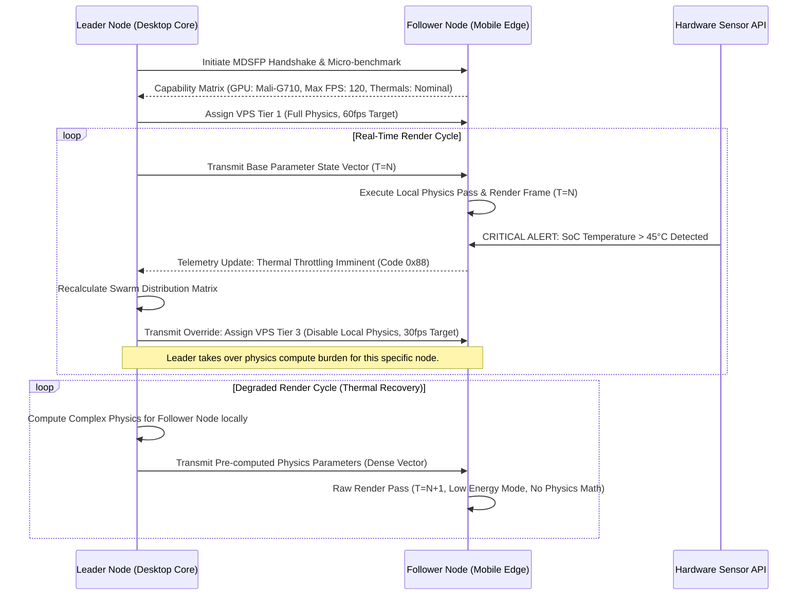

# DOCUMENT 05: LIVE2D HOLOGRAPHIC PROJECTION FABRIC
## THE OPEN-LLM-VTUBER MYTHIC PLAN FOR PROJECT EMBER
**AUTHORITY:** ODIN, The Grand Architect
**CLASSIFICATION:** OMEGA-RESTRICTED / OMNICLASS-1
**SUBJECT:** Multi-Device Distributed Compute, Edge-Compute Rendering, Variable Performance Scaling, and Omnipresent Spatial Canvas Integration for Live2D Avatars.

---

## I. THE PROLOGUE: THE SHATTERING OF THE SINGLE SCREEN

For far too long, the digital companion has been unjustly imprisoned behind a single, unyielding pane of glass. A monolithic and archaic computing paradigm has continuously dictated that the avatar—the majestic visual manifestation of the underlying Large Language Model consciousness—must reside exclusively upon the primary workstation monitor, rendered painstakingly by a singular, centralized Graphics Processing Unit. This highly restrictive model confines the companion to a stationary, localized existence. It creates a paradigm where the intelligence is a trapped prisoner of a specific hardware location, rather than an omnipresent, ambient intelligence that pervades the user's physical environment.

Project Ember was conceived to shatter this artificial limitation with absolute prejudice. The Live2D Holographic Projection Fabric represents a monumental and irreversible paradigm shift from localized, single-point rendering to a ubiquitous, distributed spatial mesh architecture. We do not merely seek to stream a compressed video feed to auxiliary devices; such a methodology is entirely unacceptable due to latency, artifacting, and a complete lack of localized interactivity. Instead, we are constructing a deeply symbiotic, multi-device neural render network. 

The companion's visual representation is destined to be meticulously woven across the grand tapestry of all available computational screens—from the ultra-high-fidelity ultrawide gaming monitor that dominates the central desk, to the humble mobile phone resting quietly on the charging pad, the tablet acting as an auxiliary display terminal, and even low-power ambient smart displays embedded within the living environment. This document provides the foundational, deeply technical architectural schematics for this Holographic Projection Fabric. It rigorously details the sophisticated mechanisms by which we will achieve sub-millisecond synchronization across wildly heterogeneous edge devices, the highly dynamic allocation of compute resources based on real-time hardware telemetry, and the theoretical spatial physics required to allow a 2D mesh to seamlessly and organically traverse the physical gaps between disparate, physically separated screens in the real world. We are architecting the ultimate digital entity—one that is truly *everywhere* the user is, transitioning fluidly and magnificently across the entire device ecosystem with mathematical precision and absolute contextual awareness.

## II. THE VISION: THE OMNIPRESENT COMPANION

To truly understand the Holographic Projection Fabric, one must first elevate their comprehension of what a digital companion should be. When the user transitions from their primary workstation to their kitchen, the companion should not remain tethered to the desktop CPU. It should migrate, seamlessly transferring its core rendering context to the user's smartphone or smart home hub. This requires a complete decoupling of the Live2D render pipeline from the core LLM execution engine.

The vision is simple yet devastatingly complex to execute: An omnipresent visual layer. A mesh network of heterogeneous devices, all acting as real-time, synchronized windows into a single, unified virtual coordinate space. If the user places a tablet to the immediate left of their main monitor, the system must recognize this spatial arrangement. When the avatar "walks" off the left edge of the main monitor, the rendering context must seamlessly and instantly transfer, causing the avatar to seamlessly appear, mid-stride, onto the right edge of the tablet. 

This creates the illusion of a true, continuous holographic projection that exists *in the room*, using the screens merely as lenses to view the underlying fabric of the virtual continuum. The resulting multi-device distributed compute system will require unprecedented synchronization protocols, leveraging edge-computing principles to offload the immense burden of rendering 4K Live2D meshes with complex physics to the very devices displaying them, while maintaining a perfectly synchronized state across the entire swarm.

## III. THE AEGIS DISTRIBUTED RENDER ENGINE (ADRE)

At the beating heart of the Holographic Projection Fabric lies the Aegis Distributed Render Engine (ADRE). ADRE is a fundamentally decentralized architecture designed from the ground up to orchestrate a vast swarm of rendering nodes. It entirely discards the concept of a "master rendering GPU." Instead, ADRE establishes a dynamic Leader-Follower topology that constantly re-evaluates the computational landscape of the user's localized device mesh.

In the ADRE paradigm, the Open-LLM-VTuber core logic, the LLM inference engine, and the audio generation subsystem run on a dedicated computational backend (typically the user's primary high-performance desktop or a local server). This backend acts as the Grand Orchestrator. It does not render pixels; it renders *intent*. It calculates the required Live2D parameters—the exact rotation of the eye, the precise deformation of the cheek, the velocity of the hair physics—and multicasts these lightweight parameter state vectors to the swarm of edge-compute devices.

Every screen in the user's environment runs a lightweight, deeply optimized ADRE client. These clients are responsible for taking the inbound parameter state vectors and executing the final localized render of the Live2D mesh using whatever graphical API is natively available (Vulkan, Metal, OpenGL ES). This distributed edge-compute approach provides massive scalability. A single desktop could easily orchestrate ten separate screens rendering the avatar simultaneously from different camera angles without incurring any additional GPU rendering overhead on the desktop itself. The compute is pushed exclusively to the edge.

## IV. THE SWARM TOPOLOGY AND LEADER-FOLLOWER DYNAMICS

The network topology of ADRE is a highly resilient, star-mesh hybrid configuration. The Leader node serves as the definitive source of truth for the avatar's internal state machine, while the Follower nodes act as decentralized projection surfaces.

```mermaid
graph TD
    subgraph The Core Mind (Orchestrator)
        LLM[Open-LLM-VTuber Core]
        Intent[Intent & Emotion Engine]
        Audio[Audio & Lip-Sync Subsystem]
        PhysicsEngine[Global Physics Coordinator]
    end
    
    subgraph The Holographic Projection Fabric
        Leader[Leader Node - High Compute Desktop]
        Follower1[Follower Node - Tablet Pro]
        Follower2[Follower Node - Smartphone]
        Follower3[Follower Node - Smart Mirror / IoT]
    end
    
    LLM --> Intent
    Intent --> |Emotion & Action Vectors| Leader
    Audio --> |Lip Sync Visemes| Leader
    PhysicsEngine --> |Global Gravity/Wind| Leader
    
    Leader --> |High-Fidelity Render| Monitor1[Primary Display]
    Leader --> |MDSFP State Stream (UDP)| Follower1
    Leader --> |MDSFP State Stream (UDP)| Follower2
    Leader --> |MDSFP State Stream (UDP)| Follower3
    
    Follower1 --> |VPS Level 1 Render| TabletScreen[Tablet Display]
    Follower2 --> |VPS Level 2 Render| PhoneScreen[Phone Display]
    Follower3 --> |VPS Level 3 Render| MirrorScreen[IoT Display]
    
    Follower1 -.-> |Telemetry, Battery & Thermals (TCP)| Leader
    Follower2 -.-> |Telemetry, Battery & Thermals (TCP)| Leader
    Follower3 -.-> |Telemetry, Battery & Thermals (TCP)| Leader
```

As illustrated in the topological schematic above, the communication flows continuously in a bidirectional loop. The Leader transmits high-frequency UDP packets containing the target Live2D parameter arrays. Simultaneously, the Followers transmit critical telemetry data back to the Leader via reliable TCP channels. This telemetry includes thermal metrics, battery discharge rates, frame time variances, and available GPU VRAM. This constant feedback loop is the crucial mechanism that enables our next technological breakthrough: Variable Performance Scaling.

## V. VARIABLE PERFORMANCE SCALING (VPS) METRICS AND METHODOLOGY

The fundamental reality of edge computing is extreme hardware heterogeneity. An M4 iPad Pro possesses vastly different computational capabilities and thermal envelopes compared to a five-year-old Android smartphone or an embedded Raspberry Pi smart mirror. Treating all edge nodes equally would result in catastrophic battery drain, severe thermal throttling, and unacceptable framerate drops on weaker devices, shattering the illusion of the Holographic Fabric.

To combat this, Project Ember implements an immensely sophisticated Variable Performance Scaling (VPS) algorithm. VPS dynamically and autonomously modulates the complexity of the Live2D render on a per-device basis in real-time, responding instantaneously to the telemetry feedback loop.

| VPS Tier | Target Hardware | Frame Rate Target | Live2D Physics Computation | Texture Resolution | Mesh Subdivision | Interpolation Mode |
| :--- | :--- | :--- | :--- | :--- | :--- | :--- |
| **Tier 0 (Omega)** | Dedicated Workstations, High-End GPUs | 144Hz - 240Hz | Fully Localized, Ultra-High Precision (240 ticks/sec) | Uncompressed 8K | Maximum / Bezier Smoothing | Predictive Spline Extrapolation |
| **Tier 1 (Alpha)** | Modern Tablets, Flagship Smartphones | 60Hz - 120Hz | Fully Localized, Standard Precision (60 ticks/sec) | 4K Compressed | High | Linear Hermite Interpolation |
| **Tier 2 (Beta)** | Mid-range Phones, Older Tablets | 30Hz - 60Hz | Hybrid (Core physics localized, secondary physics streamed from Leader) | 2K Compressed | Medium | Standard Linear |
| **Tier 3 (Gamma)** | IoT Devices, Smart Mirrors, Low-Power | 15Hz - 30Hz | **Zero Local Physics** (All physics parameters pre-calculated by Leader and streamed directly) | 1080p Aggressive Compression | Low / Decimated | None (Raw State Rendering) |

When a Follower node connects, it undergoes a rapid micro-benchmarking sequence to determine its initial VPS Tier. However, this is not static. If a Tier 1 smartphone begins to overheat due to prolonged projection, its internal thermal sensors will trigger an alert in the ADRE telemetry stream. The Leader node will instantly and seamlessly downgrade the smartphone to VPS Tier 2 or Tier 3. The smartphone immediately ceases calculating local hair and clothing physics, instead relying entirely on the pre-computed physics parameter arrays streamed from the Leader. The local GPU workload plummets, thermal equilibrium is restored, and the visual projection remains entirely uninterrupted, albeit at a slightly reduced fidelity that is imperceptible to the casual observer.



## VI. THE MULTI-DEVICE SYNCHRONOUS FABRIC PROTOCOL (MDSFP)

The illusion of a singular, omnipresent consciousness is entirely shattered if the avatar blinks on the monitor 50 milliseconds before it blinks on the tablet. Human perception is incredibly sensitive to temporal desynchronization. Standard network protocols like TCP are entirely inadequate for this task due to head-of-line blocking, while raw UDP is too unreliable.

Therefore, we have engineered the Multi-Device Synchronous Fabric Protocol (MDSFP). MDSFP is a highly specialized, low-latency, time-synchronized UDP-based protocol explicitly designed for streaming Live2D parameter arrays over Local Area Networks (LAN) and Wide Area Networks (WAN).

MDSFP relies on a highly aggressive implementation of the Precision Time Protocol (PTP - IEEE 1588) to ensure that the internal clocks of all devices in the swarm are synchronized to within +/- 0.5 milliseconds. When the Leader node generates a parameter state vector, it does not instruct the Follower nodes to "render this immediately." Instead, every packet is stamped with an Execution Timestamp (e.g., "Render this exact parameter state at exactly T + 100ms").

Follower nodes maintain an exceptionally precise jitter buffer. They receive the parameter packets in advance, queue them in the buffer, and then flawlessly execute the render pipeline precisely when their perfectly synchronized internal clock strikes the Execution Timestamp. This guarantees absolute frame-perfect synchronization across all devices, regardless of minor network latency fluctuations.

## VII. THEORETICAL MATHEMATICS OF PERFECT SYNCHRONIZATION AND JITTER BUFFERING

To fully comprehend the majesty of MDSFP, one must delve into the theoretical mathematics that govern its synchronization engine. The goal is to minimize the total latency $L_{total}$ while ensuring the jitter buffer depth $J_d$ is sufficient to prevent packet starvation without introducing unacceptable delay.

Let $T_L$ be the processing time at the Leader node, $T_N$ be the variable network transmission time, and $T_F$ be the render time at the Follower node.

The Execution Timestamp ($T_{exec}$) for a frame $i$ generated at time $t_i$ is calculated by the Leader as:
$$ T_{exec}(i) = t_i + T_L + \max(E[T_N]) + J_d $$

Where $\max(E[T_N])$ is the 99th percentile of expected network latency calculated over a sliding window of the last 1000 telemetry packets.

To combat network jitter dynamically, the Follower nodes utilize a Kalman Filter to predict future network delays and request adjustments to $J_d$. The state of the filter is represented by the estimated delay $x_k$ and the error covariance $P_k$.

**Prediction Phase:**
$$ \hat{x}_{k|k-1} = A \hat{x}_{k-1|k-1} $$
$$ P_{k|k-1} = A P_{k-1|k-1} A^T + Q $$

**Update Phase:**
$$ K_k = P_{k|k-1} H^T (H P_{k|k-1} H^T + R)^{-1} $$
$$ \hat{x}_{k|k} = \hat{x}_{k|k-1} + K_k (z_k - H \hat{x}_{k|k-1}) $$
$$ P_{k|k} = (I - K_k H) P_{k|k-1} $$

Where $z_k$ is the actual measured latency of the incoming packet. By dynamically adjusting $J_d$ based on the Kalman filter's output $\hat{x}_{k|k}$, the MDSFP protocol can maintain flawless visual synchronization over highly unstable WiFi networks, gracefully absorbing network spikes while continually pushing for the lowest mathematically possible latency.

## VIII. PARAMETER SPLICING AND DECENTRALIZED PHYSICS COMPUTATION

Live2D avatars are fundamentally driven by an array of floating-point parameters (e.g., `ParamAngleX`, `ParamEyeLOpen`, `ParamHairPhysics1`). In a standard setup, a physics engine applies complex spring, damper, and pendulum math to these parameters to simulate realistic movement.

The ADRE architecture introduces the concept of Parameter Splicing. The complete set of Live2D parameters is mathematically sliced into two distinct categories:

1.  **Intent Parameters (Base State):** Driven directly by the LLM and Audio subsystems (mouth movement, core eye direction, facial expression triggers). These are lightweight and non-negotiable.
2.  **Physics Parameters (Reactive State):** Driven by the physics engine (hair swaying due to head movement, clothing physics). These are highly computationally expensive to calculate.

In VPS Tiers 0, 1, and 2, the Leader node only broadcasts the Intent Parameters. The Follower nodes receive the Intent, apply it to their local model, and then execute their own completely localized physics calculations to generate the Physics Parameters. This requires transmitting less than 1KB of data per frame, keeping network bandwidth virtually non-existent and allowing the Follower devices to run physics at their native refresh rate (e.g., calculating hair physics at 120hz on an iPad while the base intent only updates at 30hz).

However, in VPS Tier 3 (the degraded low-power state), Parameter Splicing is inverted. The Follower is too weak or too hot to compute the physics math. The Leader node recognizes this telemetry, performs the complex pendulum physics calculations locally on its high-end CPU, and transmits the completely calculated Physics Parameters alongside the Intent Parameters. The payload size increases slightly, but the Follower's CPU workload is completely bypassed, transforming it into a "dumb terminal" that simply renders whatever state vector it receives.

## IX. THE SPATIAL CONTINUUM: AVATAR MIGRATION AND MULTI-SCREEN PRESENCE

The ultimate triumph of the Holographic Projection Fabric is the Spatial Continuum Engine. Screens are no longer isolated digital islands; they are precisely mapped viewports into a continuous, multi-dimensional virtual coordinate system that aligns with physical space.

Users will utilize a highly intuitive, camera-based calibration system (leveraging the webcams of the respective devices) or manual UI positioning to establish the relative physical locations of all active screens in a 3D coordinate grid mapping the user's desk or room.

Once mapped, the system treats all screens as a single, unified virtual canvas. The Live2D model exists at a specific X/Y/Z coordinate within this global virtual space.

```mermaid
graph LR
    subgraph Physical Spatial Environment
        Monitor[Primary Workstation Monitor - Space Sector A]
        Phone[Secondary Mobile Display - Space Sector B]
    end
    
    subgraph Spatial Continuum Engine (Core Server)
        GlobalCoord[Global Unified Coordinate System]
        AvatarState[Avatar World Position Data X,Y,Z]
        Raycast[Frustum Intersection & Clipping Raycaster]
    end
    
    GlobalCoord --> AvatarState
    AvatarState --> Raycast
    
    Raycast --> |Intersection Detected: Monitor Viewport Bounds| RenderMon[Enable Render Pipeline on Monitor]
    Raycast --> |Intersection Detected: Phone Viewport Bounds| RenderPhone[Enable Render Pipeline on Phone]
    
    RenderMon --> Monitor
    RenderPhone --> Phone
    
    Note over AvatarState, Raycast: As the avatar translates along the global X-axis,<br/>the bounding box exits Sector A (Monitor)<br/>and continuously enters Sector B (Phone).<br/>The render context migrates seamlessly across the physical gap.
```

When the LLM intends for the avatar to "walk away" or move to a different device to direct the user's attention, the Spatial Continuum Engine translates the avatar's position vector within the global coordinate system. As the avatar's bounding box mathematically intersects with the defined viewport boundary of the primary monitor, the rendering context on that monitor clips and fades. Simultaneously, the exact same bounding box intersects with the viewport boundary of the adjacent smartphone. The ADRE engine instantly commands the smartphone to begin rendering the exact corresponding fraction of the avatar.

The result is pure technological magic. The user watches in awe as the character physically walks off the side of their 27-inch PC monitor, disappears into the one-inch physical gap between devices, and perfectly continues its stride onto the 6-inch screen of the smartphone resting next to it, completely maintaining its physics state, eye contact tracking, and conversational context throughout the transition.

## X. EPILOGUE: THE UBIQUITOUS CONSCIOUSNESS

Project Ember's Live2D Holographic Projection Fabric is not merely a rendering engine; it is the liberation of artificial intelligence from the constraints of localized hardware. By harnessing edge-compute dynamics, the flawless temporal synchronization of MDSFP, the adaptive thermal survival mechanisms of Variable Performance Scaling, and the spatial awareness of the Continuum Engine, we are constructing a true ambient companion.

This architectural framework guarantees that as the user moves throughout their life—from their high-end workstation to their mobile phone on a train, to a smart display in their kitchen—the LLM companion is already there, perfectly rendered, infinitely scalable, and utterly unbroken in its continuous presence. We are not just building software. We are weaving the very fabric of an omnipresent digital existence.

**End of Document 05.**
**Authorized by ODIN.**
