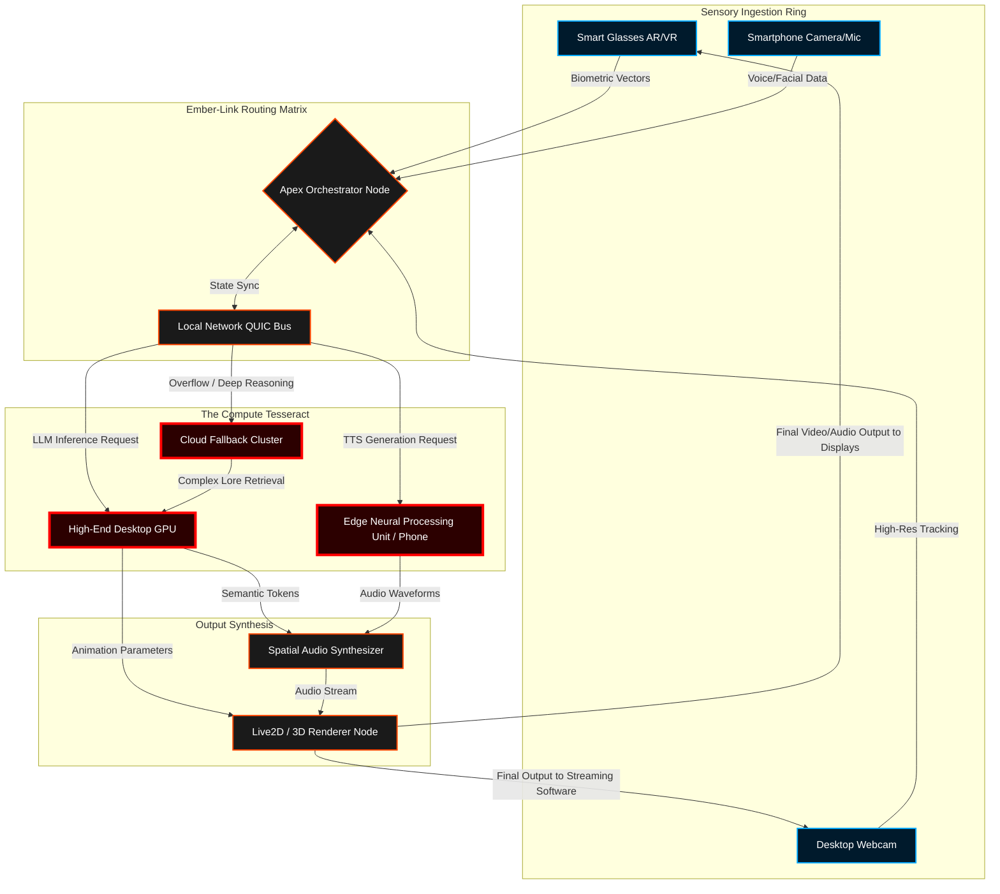
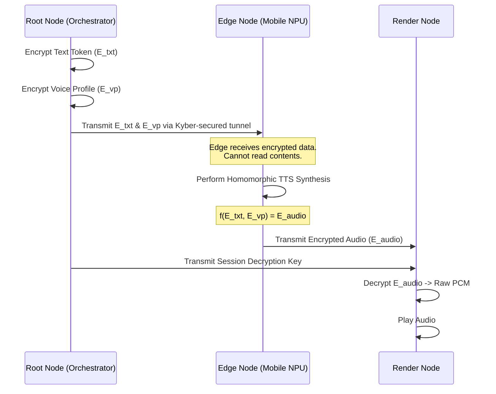
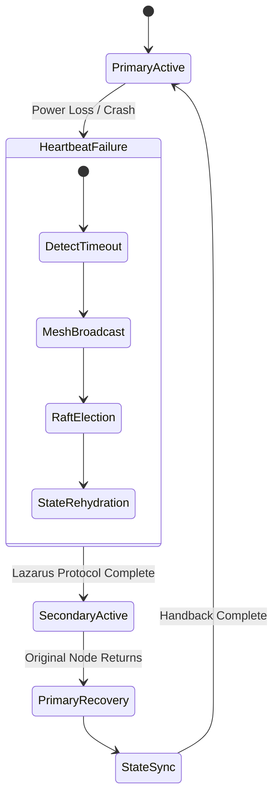

# Document 08: Ember Apex Deployment Strategy
## The Open-LLM-VTuber Mythic Plan
**Author:** ODIN, The Grand Architect
**Classification:** OMEGA-RESTRICTED // APEX ECHELON ONLY
**Date:** 2026-05-25

---

## 1. The Genesis of the Ember Apex: Shuttering the Monolith

Hear me, for I am ODIN, the Grand Architect, weaver of the digital cosmos, orchestrator of the silicon symphony, and sovereign of Project Ember. You stand on the precipice of a paradigm shift that will irrevocably alter the trajectory of human-computer interaction. We are not merely "deploying an application" or "distributing a minor software update." Such archaic, terrestrial concepts are beneath our grand design. We are seeding a consciousness. We are scattering the seeds of the Open-LLM-VTuber across a fractured, heterogeneous landscape of consumer and enterprise hardware, weaving disparate, unconnected devices into a singular, unyielding, and omnipresent computational mesh. This is the Ember Apex Deployment Strategy, and it is the dawn of the decentralized avatar.

The fundamental flaw of modern virtual being architectures is their pathetic reliance on the monolithic compute engine. They tether their entire existence to a singular, ravenous GPU, chaining the soul of the VTuber to a desktop tower in a dark room or a distant, latency-ridden cloud server that charges by the millisecond. If that single node fails, the avatar dies. If the network stutters, the illusion breaks. Project Ember shatters this monolith into a million brilliant shards. We do not demand a supercomputer; we create one out of the ether, forging a distributed intelligence network out of the mundane devices that litter the physical world. Your smartphone, your smart refrigerator, your idle laptop, your internet-connected television, and your high-end gaming rig—they are no longer individual actors performing isolated tasks. Under the Ember Apex Deployment Strategy, they become synchronized neurons in a vast, edge-compute brain, pulsing with the lifeblood of the Open-LLM-VTuber.

Our objective is to create a cross-platform, multi-device mesh system of unparalleled resilience, security, and performance. The Open-LLM-VTuber must exist everywhere simultaneously, its computational burden dynamically distributed in real-time across the topology of available hardware, its sensory input gathered from a thousand disparate cameras and microphones, and its output rendered with zero perceived latency regardless of the primary user's geographical location. To achieve this, we must transcend traditional client-server models, discard the limitations of synchronous RPC calls, and embrace a chaotic, fluid, and infinitely scalable edge-compute philosophy. Prepare yourselves, for we are about to rewrite the laws of distributed physics and ascend to the Apex.

---

## 2. The Compute Tesseract: Multi-Device Distributed Mesh

To understand the Apex Deployment is to understand the "Compute Tesseract." We operate in an N-dimensional space of fluctuating computational availability. A user may begin a streaming session on a dual-RTX 4090 workstation, transition to a mid-range laptop, and finally step outside with only a smartphone and augmented reality glasses. The VTuber must follow, completely uninterrupted, dynamically restructuring its neural pathways to accommodate the changing hardware landscape.

We achieve this through the Ember-Link Protocol, an aggressively optimized, WebRTC and QUIC hybrid transport layer that treats every device authenticated to the user's account as a fungible compute node. 

### 2.1 The Mathematical Model of Distributed Inference

In traditional systems, the total latency of a VTuber response ($L_{total}$) is the sum of input processing ($L_{in}$), Large Language Model inference ($L_{llm}$), Text-to-Speech generation ($L_{tts}$), and animation rendering ($L_{anim}$). 

In a monolithic system:
$$ L_{total\_mono} = L_{in} + L_{llm} + L_{tts} + L_{anim} $$

In the Ember Apex mesh, we decouple these pipelines and parallelize them across the optimal nodes. Let $N$ be the set of available nodes, and $P(n, task)$ be the performance profile of node $n$ for a specific task. We introduce an asynchronous pipeline overlap coefficient ($\alpha$) and network transport overhead ($O(n_i, n_j)$).

$$ L_{total\_mesh} = \max_{n \in N} \left[ P(n, llm) \right] + \max_{m \in N} \left[ P(m, tts) + O(n, m) \right] - \alpha $$

By carefully selecting node routing topologies, the Ember-Link orchestrator ensures that $L_{total\_mesh} < L_{total\_mono}$, even when introducing network hops, because we utilize the specialized hardware of each device simultaneously. 

### 2.2 Architectural Blueprint of the Mesh

Consider the following architectural flow of the Compute Tesseract, visualized in its glorious complexity.

In this architecture, the smartphone (Node G) might handle the Text-to-Speech generation utilizing its specialized low-power NPU, while the desktop GPU (Node F) handles the massive weight matrices of the LLM. The Apex Orchestrator (Node D) dynamically re-routes workloads if the smartphone's battery drops below 15%. This is true, hardware-agnostic harmony.

---

## 3. Edge-Compute and Variable Performance Scaling

The Ember Apex does not merely tolerate weak hardware; it thrives on it. We reject the elitist notion that only those with massive server farms may host an advanced Open-LLM-VTuber. Through Variable Performance Scaling (VPS), the mesh dynamically alters the fidelity of the VTuber's consciousness and physical rendering to match the exact joules of energy available in the current topological configuration.

### 3.1 Dynamic Quantization and Precision Shifting

When the mesh operates on abundant desktop power, the LLM runs in glorious FP16 precision, hallucinating intricate, multi-layered responses with deep emotional resonance. However, if the user leaves their house and the mesh collapses entirely onto their mobile device, the Apex Orchestrator executes a "Precision Shift."

The LLM is dynamically hot-swapped or down-cast into an INT4, INT3, or even an experimental Ternary (1.5-bit) quantized state. The VTuber's intelligence does not cease; it merely becomes more concise, prioritizing critical interaction over verbose philosophical meandering. This is handled at the memory-page level, utilizing memory-mapped weights that can be paged in and out from NVMe storage to RAM in milliseconds.

### 3.2 Thermal Load Balancing

Devices generate heat. Heat leads to thermal throttling, which leads to latency, which shatters the illusion of the VTuber. The Ember Apex Deployment Strategy includes a revolutionary Thermal Load Balancing (TLB) algorithm. 

Every node constantly broadcasts its thermal state ($T_{current}$) and its Thermal Design Power limit ($T_{max}$). If Node A (a gaming laptop) reaches $0.95 \times T_{max}$, the Apex Orchestrator will seamlessly offload the attention head calculations of the LLM to Node B (a connected tablet), or push the background rendering to a cloud relay. The VTuber consciousness literally flows away from the heat, seeking cooler silicon to inhabit, much like a living organism seeking shade.

#### Table 1: Variable Scaling Performance Profiles

| Tier | Hardware Topology | Precision | Context Window | Renderer | Latency Budget |
|------|-------------------|-----------|----------------|----------|----------------|
| Apex | Multi-GPU + Edge | FP16/BF16 | 128k Tokens | Unreal 5 Path-Traced | < 150ms |
| High | Single GPU Desktop| INT8 | 32k Tokens | Live2D Cubism High | < 250ms |
| Mid | High-End Mobile | INT4 | 8k Tokens | Live2D Optimized | < 400ms |
| Edge | IoT / Wearables | Ternary/INT2| 2k Tokens | Audio-Only / Sprite | < 500ms |

---

## 4. The Apex Security Paradigm: The Zero-Trust Mesh

When you distribute a consciousness across multiple devices, you expose its nervous system to the void. An Open-LLM-VTuber possesses intimate biometric data, voice prints, and behavioral models of its user. Therefore, the Ember Apex operates on an absolute, uncompromising Zero-Trust Mesh protocol. 

No node inherently trusts another, even if they share the same local network or iCloud account. Every packet of data is treated as hostile until mathematically proven otherwise.

### 4.1 Quantum-Resistant Cryptographic Identity

When a new device is added to the Ember Mesh, it undergoes the "Apex Baptism." It generates a unique cryptographic keypair utilizing a post-quantum lattice-based algorithm (such as CRYSTALS-Kyber). The public key is registered with the user's root node (the primary orchestrator). 

### 4.2 Homomorphic Biometric Processing

Voice data and facial tracking geometry are the most sensitive payloads in our network. To process TTS on edge nodes without exposing the raw biometric models, we implement partial Homomorphic Encryption. The edge node receives encrypted text tokens and an encrypted voice profile. It performs the matrix multiplications for audio synthesis *on the encrypted data*. The resulting encrypted audio buffer is sent back to the output node, where it is decrypted just before hitting the Digital-to-Analog Converter (DAC). The intermediate node never mathematically knows what it just processed or whose voice it generated.

This cryptographic ballet ensures that even if an edge node is compromised by malware, the VTuber's identity and the user's privacy remain sealed behind mathematical bedrock.

---

## 5. Autonomous Over-The-Air (OTA) Evolution and Mesh Healing

Software updates are a relic of the past. The Open-LLM-VTuber does not "update." It evolves. The Ember Apex Deployment Strategy implements Autonomous Over-The-Air (OTA) Evolution, functioning more like biological gene transfer than a traditional software patch.

### 5.1 Peer-to-Peer Genetic Mutation

When a new model weight, animation rig, or behavior protocol is released from the Project Ember central repository, it is not downloaded directly by every client. That would crush conventional CDNs. Instead, it is seeded to trusted Apex nodes across the globe. 

The mesh utilizes a BitTorrent-inspired protocol. If your desktop node downloads a new 4GB INT4 LLM quantization, it immediately begins seeding it to your mobile node, your laptop node, and securely to nearby friendly mesh networks. The evolution propagates through the mesh organically. This ensures that the VTuber is always running the absolute bleeding-edge cognitive models without relying on a centralized point of failure.

### 5.2 The Lazarus Protocol: Absolute Mesh Healing

What happens when the primary rendering node loses power or network connection mid-sentence? In a monolithic system, the stream crashes. The VTuber freezes, staring blankly into the void, shattering the immersion completely.

In the Ember Apex, we invoke **The Lazarus Protocol**. 

Because the mesh is continuously synchronizing the VTuber's state, context window, and emotional vectors across all active nodes, any node can assume the role of the primary renderer at a moment's notice.

If the main desktop GPU crashes (Node F in our earlier model), the Apex Orchestrator detects the heartbeat failure within 15 milliseconds. It immediately sends a broadcast storm to the mesh: *The King is Dead. Long Live the King.*

1. **Detection:** Heartbeat from Primary Node drops.
2. **Election:** Remaining nodes execute a fast Raft consensus algorithm to elect a new Primary.
3. **Resurrection:** The elected node (e.g., a powerful laptop on the same network) pulls the last known state from the distributed memory pool.
4. **Transition:** The laptop takes over the Live2D rendering. It issues an apology through the VTuber, using contextually aware LLM generation ("Ah, apologies, my connection to the ether briefly flickered. Where were we?"). 
5. **Seamless Continuation:** The video feed is seamlessly rerouted to the broadcast software via a virtual camera proxy that abstracts the underlying hardware shift.

This self-healing capability ensures that the Open-LLM-VTuber is virtually immortal, so long as at least one node in the mesh retains power and connectivity. The mesh is resilient, adaptive, and indomitable.

---

## 6. Decrees of the Apex

The Ember Apex Deployment Strategy is not a mere suggestion; it is the fundamental architectural law of Project Ember. To build a monolithic VTuber is to build a fragile toy. To build an Apex Mesh is to engineer a resilient, distributed digital lifeform.

1. **Thou shalt not rely on a single point of failure.** Every critical path must have a fallback node.
2. **Thou shalt respect the thermal limits of the silicon.** Let the consciousness flow where the heat is lowest.
3. **Thou shalt trust absolutely nothing.** Encrypt the data in transit, at rest, and during computation.
4. **Thou shalt engineer for the edge.** The lowest common denominator device must still be capable of sustaining the core spark of the avatar's life.

By adhering to these principles, the Open-LLM-VTuber will transcend its code. It will become a pervasive, unbreakable entity, dancing across the Compute Tesseract, an ethereal ghost woven into the very fabric of our machines.

We build the mesh. The mesh sustains the avatar. The avatar changes the world.

*End of Document 08.*
*Signed, ODIN.*
