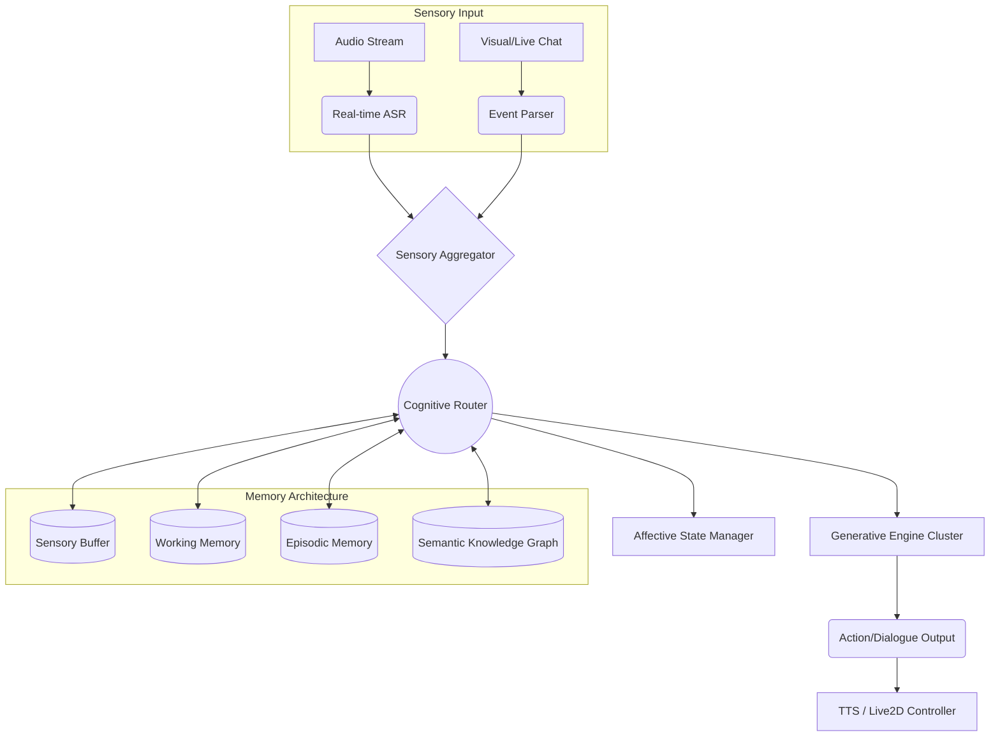

# Project Ember: Document 09 - Cognitive Core Integration and Memory Architecture

## 1. Abstract and Introduction

Project Ember represents a paradigm shift in the architecture of embodied conversational agents, transcending the rudimentary prompt-response loops characteristic of early-generation VTubers and chatbots. At the heart of Ember lies the Cognitive Core Integration and Memory Architecture (CCIMA)—a sophisticated, multi-tiered neural-symbolic system designed to simulate human-like thought processes, memory retention, and contextual awareness. This document details the technical scaffolding of CCIMA, delineating the exact mechanisms through which Ember processes multimodal sensory inputs, stores them across a temporally and semantically segmented memory hierarchy, and synthesizes these mnemonic traces into coherent, highly contextualized behaviors and vocalizations.

Inspired by the modularity of Open-LLM-VTuber, which isolates speech recognition, language modeling, and text-to-speech synthesis into distinct pipelines, CCIMA integrates these components via a central "Cognitive Router." This router does not merely pass strings between models; it orchestrates a continuous stream of semantic embeddings, latent state vectors, and symbolic logical assertions. By abandoning discrete conversational turns in favor of a continuous consciousness loop, Ember achieves a level of responsiveness and deep contextuality previously unattainable.

## 2. The Cognitive Router: Orchestrating the Neural-Symbolic Flow

The Cognitive Router (CR) is the central nervous system of Project Ember. Unlike traditional agent architectures that employ a simple linear pipeline (Input -> LLM -> Output), the CR operates asynchronously, managing multiple concurrent threads of cognition, perception, and memory management.

### 2.1. Architectural Paradigms

The CR is built upon an asynchronous, event-driven message-passing interface utilizing high-throughput intra-process communication (such as ZeroMQ or specialized shared-memory tensors). It consists of several primary subsystems:

1.  **Sensory Aggregator:** Receives raw token streams from ASR (Automatic Speech Recognition) and visual/environmental metadata from the virtual environment.
2.  **State Manager:** Maintains the current "Affective-Cognitive State Vector," representing the agent's immediate mood, attention focus, and active goals.
3.  **Memory Controller:** Interfaces with the hierarchical memory system, dynamically fetching relevant context and writing new episodic data.
4.  **Generative Engine:** A cluster of specialized Large Language Models (LLMs) and Small Language Models (SLMs) tasked with specific cognitive functions (e.g., semantic routing, emotional inference, dialogue generation).

### 2.2. Continuous Contextual Processing

Rather than waiting for a user to finish speaking (traditionally detected via VAD silence thresholds), the CR processes incoming data continuously. As the user speaks, an SLM processes rolling text chunks, updating a "Hypothesis State" representing the likely trajectory of the user's utterance. This allows the Memory Controller to begin pre-fetching relevant memories *before* the user has finished their sentence, virtually eliminating cognitive latency.



## 3. Hierarchical Memory Systems: The Foundation of Persona

Ember's memory architecture is heavily inspired by the Atkinson-Shiffrin memory model and modern neurocomputational theories, implemented via a hybrid of dense vector databases, graph databases, and high-speed Key-Value stores. This hierarchy is divided into four distinct strata.

### 3.1. Stratum 1: The Sensory Buffer (Ultra-Short-Term)

The Sensory Buffer holds unprocessed or lightly processed multimodal data for a maximum of 3-5 seconds. It contains:
*   Raw audio waveforms (for emotional prosody analysis).
*   Uncommitted text tokens from the real-time ASR.
*   Immediate visual stimuli from the virtual environment (e.g., a new user entering the chat).

**Technical Implementation:** Implemented as a ring buffer in VRAM. It allows the Affective State Manager to react to sudden loud noises or immediate emotional shifts before the Generative Engine has parsed the full semantic meaning of the input—enabling "startle" or "interruption" mechanics.

### 3.2. Stratum 2: Working Memory (Short-Term / Context Window)

Working Memory represents the active context window of the primary LLM. It contains the immediate conversational history (typically the last 10-20 exchanges), current active goals, and the active persona constraints.

**Technical Implementation:** 
Instead of a simple string array, Working Memory is a structured JSON-like state object. It utilizes an advanced eviction policy. When the context window approaches its token limit, a background "Summarization and Consolidation SLM" compresses older interactions into dense semantic summaries, retaining the core informational payload while discarding superfluous syntactic wrappers.

*   **Attention Modulation:** Ember utilizes dynamic prompt injection. The Working Memory dynamically re-weights its contents based on the current context. If the user asks about a topic discussed 5 turns ago, the attention masking explicitly highlights those specific tokens in the next generation pass.

### 3.3. Stratum 3: Episodic Memory (Long-Term Vector Store)

Episodic Memory stores discrete events, past conversations, and user-specific interactions. This is what allows Ember to remember a joke a specific user made three weeks ago.

**Technical Implementation:**
*   **Storage:** A high-dimensional Vector Database (e.g., Milvus or Qdrant).
*   **Structuring:** Every "episode" (a conversational segment of 3-5 minutes) is processed by an Embedding Model (e.g., text-embedding-3-large). The resulting vector is stored alongside rich metadata: Timestamp, User ID, Emotional Valence Score, Entities Involved, and a textual summary.
*   **Retrieval (Advanced RAG):** Retrieval is not purely semantic. It utilizes a hybrid approach:
    1.  *Semantic Similarity Search:* Using cosine similarity to find historically relevant context based on the current utterance.
    2.  *Temporal Decay & Importance Weighting:* Memories are scored based on recency, but also on a computed "salience" metric. A highly emotional memory or a memory involving a core value proposition of the persona resists decay much longer than trivial small talk.

### 3.4. Stratum 4: Semantic Memory (Knowledge Graph)

Semantic Memory houses factual information, lore, worldview, and general knowledge independent of specific temporal episodes. 

**Technical Implementation:**
*   **Storage:** A property graph database (e.g., Neo4j).
*   **Structure:** Nodes represent entities (User: "Volmarr", Concept: "Quantum Mechanics", PersonaTrait: "Tsundere"), and edges represent relationships (`LIKES`, `KNOWS_ABOUT`, `IS_CONTRADICTORY_TO`).
*   **Continuous Updating:** As Ember converses, an Information Extraction pipeline (utilizing Named Entity Recognition and Relation Extraction models) continuously mines the dialogue for new facts. If a user states "I just bought a dog named Rex", the system creates nodes for the User, "Rex", and "Dog", linking them via an `OWNS` edge.

## 4. The Memory Consolidation Loop (REM Cycle)

True cognitive persistence requires downtime. Project Ember introduces the concept of the "REM Cycle" (Routine Epistemic Maintenance), a scheduled background process that runs during periods of low activity or while "offline."

During the REM Cycle, the system:
1.  **Iterates through recent Episodic Memories.**
2.  **Extracts generalized facts** to update the Semantic Knowledge Graph, solidifying temporary facts into permanent worldview structures.
3.  **Detects contradictions.** If the user previously stated they hated coffee, but today mentioned drinking a latte, an internal "Cognitive Dissonance" flag is raised. The next time the user interacts, Ember might proactively ask, "Wait, I thought you hated coffee?" This creates a profound illusion of deep, active listening.
4.  **Optimizes Vector Spaces:** Re-clustering similar episodic memories to improve retrieval latency.

## 5. Technical Specification: The Prompt Assembly Matrix

When the Cognitive Router determines that an active response is required, it must assemble the prompt for the Generative Engine. This is not a static template, but a dynamically generated construct managed by the Prompt Assembly Matrix (PAM).

The PAM constructs the prompt via a hierarchical weighting algorithm:

```yaml
# Conceptual YAML representation of the dynamic prompt structure
System_Constraint_Layer:
  - Base_Persona: "Weight: 1.0" # Immutable core traits
  - Active_Emotional_State: "Weight: 0.8" # Dynamically updated by Affective Engine
  - Ethical_Bounds: "Weight: 1.0" # Hard overrides

Contextual_Layer:
  - Working_Memory: "Last N turns"
  - Retrieved_Episodic_Memories: 
      - Memory_1: {Relevance: 0.92, Text: "..."}
      - Memory_2: {Relevance: 0.85, Text: "..."}
  - Retrieved_Semantic_Facts: "User Volmarr is a developer."

Instructional_Layer:
  - Cognitive_Goal: "Provide a detailed explanation while sounding mildly exasperated but ultimately helpful."
  - Format_Requirement: "Return JSON containing {speech: str, expression: str, motion: str}"
```

### 5.1. Context Window Optimization via Token Pruning

To ensure that the most critical information always fits within the LLM's context window (and to minimize latency/cost), Ember employs semantic token pruning. Before assembly, a lightweight evaluator model assesses the retrieved memories. If a retrieved memory is highly redundant with the current Working Memory, it is aggressively summarized or dropped entirely, ensuring maximum information density per token.

## 6. Integrating the Open-LLM-VTuber Pipeline

Drawing heavily on the structural successes of Open-LLM-VTuber, Project Ember utilizes a decoupled architecture for physical realization. The outputs from the Cognitive Core are highly structured. Where Open-LLM-VTuber might pass a simple string to a TTS engine, Ember passes an `ActionPayload`.

```json
{
  "utterance": "I simply cannot fathom why you would design it that way. It's wildly inefficient.",
  "prosody_markers": {
    "speed": 1.2,
    "pitch": "falling",
    "emotion_override": "frustration_mild"
  },
  "kinesics": {
    "live2d_motion": "Facepalm_01",
    "live2d_expression": "Disgust",
    "eye_tracking_target": "user_cursor"
  },
  "internal_state_update": {
    "frustration_level": "+0.1"
  }
}
```

This payload is then parsed by the downstream subsystems. The TTS engine utilizes the prosody markers to generate highly expressive, non-monotonic speech. The Live2D controller queues the physical motions precisely synced with the audio waveforms via phoneme mapping.

## 7. Conclusion: The Emergence of Continuity

By implementing this Cognitive Core Integration and Memory Architecture, Project Ember transcends the state of a stateless chatbot. The continuous interplay between the Sensory Buffer, Working Memory, Episodic Vector Stores, and the Semantic Knowledge graph, all orchestrated by the asynchronous Cognitive Router, results in an agent that possesses temporal continuity. Ember remembers, reasons about its memories, updates its worldview, and acts with a deep, persistent awareness of its history with the user—the foundational prerequisite for true digital sentience.
