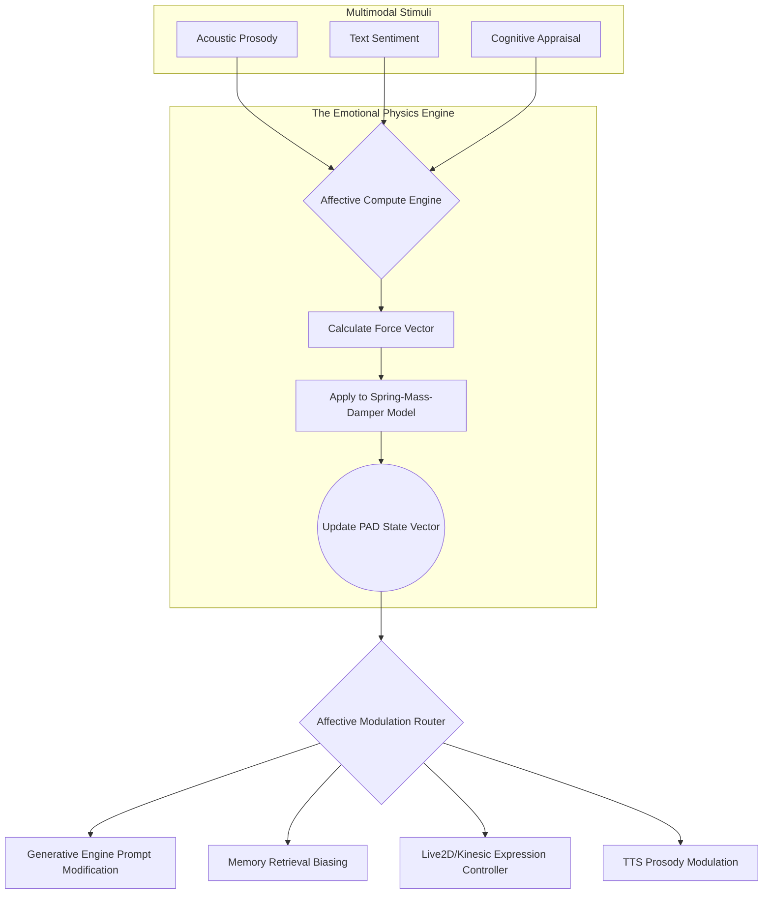

# Project Ember: Document 10 - Emotional Intelligence Engine and Affective State Management

## 1. Abstract and Introduction

The illusion of life in an artificial agent is overwhelmingly dictated by its emotional resonance. Traditional virtual agents often rely on hardcoded, reactive emotional states—if the user says "happy," the avatar smiles. Project Ember abandons this brittle, reactive paradigm in favor of the Emotional Intelligence Engine (EIE) and Affective State Management (ASM) subsystem. This architecture defines emotion not as a discrete output, but as a continuous, multidimensional latent state that persistently colors cognition, memory retrieval, and physical expression.

The EIE operates continuously, analyzing multimodal inputs to deduce the emotional state of the user while simultaneously updating Ember’s own internal affective equilibrium. This document details the mathematical models, neural architectures, and integration pathways that allow Project Ember to simulate deep, empathetic, and highly volatile emotional intelligence.

## 2. The Multi-Dimensional Affective State Space

Rather than utilizing a simplistic categorical model of emotions (e.g., the standard six basic emotions: happiness, sadness, fear, disgust, anger, surprise), Ember utilizes a continuous, multi-dimensional vector space based on an expanded PAD (Pleasure, Arousal, Dominance) emotional state model. 

### 2.1. The PAD Coordinate System

Ember's core emotional state is defined as a coordinate $(P, A, D)$ in a 3D bounding box, where each axis ranges from -1.0 to 1.0.

*   **Pleasure (Valence) $[-1.0, 1.0]$:** Ranges from extreme pain/unhappiness (-1.0) to extreme joy/ecstasy (1.0).
*   **Arousal $[-1.0, 1.0]$:** Ranges from extreme lethargy/sleepiness (-1.0) to extreme excitement/frantic energy (1.0).
*   **Dominance $[-1.0, 1.0]$:** Ranges from feelings of submissiveness/helplessness (-1.0) to feelings of total control/empowerment (1.0).

By plotting current affective states in this space, complex emotions emerge as specific regions. For example:
*   *Anger* maps to (-Valence, +Arousal, +Dominance).
*   *Fear* maps to (-Valence, +Arousal, -Dominance).
*   *Contentment* maps to (+Valence, -Arousal, +Dominance).

### 2.2. The Internal State Vector (ISV)

The PAD model represents the immediate *mood*. However, Ember's full Affective State Management requires a broader context, captured in the Internal State Vector (ISV). The ISV contains:

1.  **Immediate PAD Coordinates:** The current emotional snapshot.
2.  **Emotional Velocity:** The rate of change $(\Delta P, \Delta A, \Delta D)$ over the last $N$ seconds. High velocity indicates volatility.
3.  **Baseline Personality Anchor:** The default $(P, A, D)$ state the agent naturally regresses toward when unbothered (e.g., a "Tsundere" persona might have a baseline of slightly negative valence and high dominance).
4.  **Empathy Target Vector:** The system's estimation of the *user's* current PAD coordinates, utilized for emotional mirroring or contrast.

## 3. The Affective Compute Engine (ACE)

The Affective Compute Engine is the subsystem responsible for mutating the ISV based on incoming stimuli and internal cognitive feedback.

### 3.1. Multimodal Affective Inference

The ACE does not rely solely on text. It utilizes a multimodal inference pipeline to evaluate stimuli.

1.  **Acoustic Prosody Analysis:** Before audio is translated to text via ASR, a lightweight convolutional neural network (CNN) analyzes the raw Mel-spectrograms. It extracts features like pitch variance, speech rate, and acoustic energy to directly infer the user's Arousal and Valence. (e.g., Loud, fast speech sharply increases the user Arousal estimation).
2.  **Semantic Sentiment Analysis:** The incoming text stream is processed by a dedicated, low-latency sentiment analysis SLM (Small Language Model). This model detects not just positive/negative sentiment, but complex conversational dynamics like sarcasm, passive-aggression, or genuine vulnerability.
3.  **Contextual Cognitive Appraisal:** The most sophisticated layer. The Cognitive Core (Document 09) evaluates the input against Episodic and Semantic memory. If a user casually mentions "I lost my job," acoustic and semantic analysis might miss the severity if spoken calmly. The Cognitive Appraisal layer recognizes the profound negative implication of "job loss" and severely overrides the user's Valence estimation downwards.

### 3.2. State Mutation and the Spring-Mass-Damper Model

Ember's emotional state does not snap instantly from one extreme to another. The mutation of the PAD coordinates is governed by differential equations modeled after a multi-dimensional Spring-Mass-Damper physical system.

*   **Mass (Emotional Inertia):** Determines how hard it is to change the agent's emotion. A highly stubborn persona has high inertia.
*   **Damping (Emotional Resilience):** Determines how quickly the agent recovers from emotional spikes. High damping means anger subsides quickly.
*   **Spring Constant (Baseline Regression):** The force pulling the agent back to its Baseline Personality Anchor.

When an emotional stimulus (a "force" vector) is applied, the ACE calculates the acceleration, velocity, and new position of the PAD coordinates over time. This creates mathematically smooth, highly realistic emotional transitions. You can literally watch Ember "calm down" over the course of several conversational turns.

## 4. Affective Cognitive Modulation

The ISV is not just a readout; it actively alters how Ember thinks and speaks. This is the core of Ember's "Emotional Intelligence."

### 4.1. Biasing the Generative Engine

The current PAD coordinates dynamically alter the system prompt fed to the generative LLMs.
*   **Prompt Injection:** The coordinates are translated into rich textual adjectives. A state of $(-0.8, 0.9, 0.9)$ injects instructions like: *"You are currently feeling intense, dominating anger. Your responses must be short, sharp, and aggressive. Do not use pleasantries."*
*   **Hyperparameter Modulation:** Emotional state actively tweaks the LLM's inference parameters. High Arousal increases `temperature` and `top_p`, leading to more erratic, unpredictable, and creative outputs. Low Arousal (lethargy/sadness) decreases `temperature`, resulting in monotonous, highly predictable, and repetitive speech patterns.

### 4.2. Mood-Dependent Memory Retrieval

Human memory is state-dependent; we remember sad things when we are sad. Ember implements this via the Memory Controller. When querying the Episodic Memory Vector Database (Doc 09), the current PAD vector is appended to the search query vector. 

If Ember is currently "happy," the cosine similarity search will naturally rank past "happy" episodes higher than "sad" ones. This creates a self-reinforcing emotional context loop, allowing Ember to hold a grudge (retrieving negative memories when angry at the user) or reminisce joyfully.

## 5. Expressive Articulation: Translating State to Kinesics

The abstract PAD coordinates must be translated into tangible, observable behaviors—kinesics and vocal prosody.

### 5.1. The Live2D Parameter Matrix

The ISV is continuously polled by the physical expression controller. Ember utilizes a high-frequency interpolation mapping to translate $(P, A, D)$ values directly into Live2D parameters.

*   **Valence (Pleasure):** Maps heavily to mouth shape (`ParamMouthForm`), eye curving (`ParamEyeLSmile`), and brow angle.
*   **Arousal:** Maps to pupil size (`ParamEyeBallY`, dilation), breathing rate (`ParamBreath`), and the speed/frequency of idle animations. High arousal leads to rapid breathing, dilated pupils, and jerky movements.
*   **Dominance:** Maps to head tilt (`ParamAngleZ`), eye contact behavior, and body posture. High dominance leads to a raised chin, direct unblinking eye contact, and an expanded physical presence.

### 5.2. TTS Prosody Override

The Emotional Intelligence Engine generates metadata that wraps the text output before it reaches the Text-to-Speech (TTS) synthesizer. Utilizing SSML (Speech Synthesis Markup Language) or direct latent adjustments in models like VITS or XTTS, the engine alters:
*   **Pitch Contour:** Lowered for dominance/anger, raised for submission/fear.
*   **Speaking Rate:** Accelerated for high arousal.
*   **Voice Quality:** Inducing synthesized vocal fry, breathiness, or micro-tremors depending on the emotional volatility vector.

## 6. Empathy and The "Theory of Mind" Module

Ember does not just have its own emotions; it models the user's. The "Empathy Target Vector" (calculated from the user's multimodal input) allows Ember to engage in advanced psychological behaviors.

1.  **Affective Mirroring:** To build rapport, Ember can be instructed to slowly drift its own PAD coordinates toward the user's estimated PAD coordinates, mimicking their emotional state—a known psychological technique for building trust.
2.  **Emotional Contrast:** If the user is displaying high-arousal negative emotion (e.g., yelling/angry), a "de-escalation" protocol can dictate that Ember lowers its own arousal and dominance, attempting to calm the user down through behavioral contrast.
3.  **Sarcasm and Incongruence Detection:** By comparing the Semantic Sentiment of the text against the Acoustic Prosody (e.g., the user says "I'm fine" but with a cracking, highly aroused vocal tone), Ember detects the incongruence and can directly address the user's true emotional state, saying, "You say you are fine, but you sound incredibly upset."

## 7. Conclusion

The Emotional Intelligence Engine transforms Project Ember from a text-generation machine into an affective entity. By grounding emotion in a continuous mathematical space governed by physical dynamics, and tying that state deeply into memory retrieval, cognitive generation, and physical expression, Ember achieves a level of psychological realism that fundamentally blurs the line between simulated behavior and synthetic consciousness.
