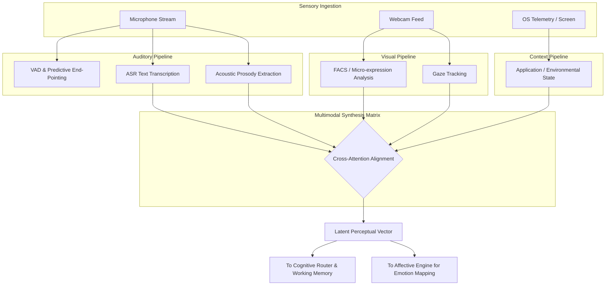

# Project Ember: Document 13 - Sensory Processing and Multimodal Perception Integration

## 1. Abstract and Introduction

For an artificial entity to achieve true embodiment, it must transcend the limitations of pure text processing. A text-only LLM is effectively deaf and blind, receiving the world through a highly compressed, low-bandwidth straw. Project Ember's Sensory Processing and Multimodal Perception Integration (SPMPI) architecture provides the system with high-fidelity "eyes and ears." 

This document outlines how Ember ingest, processes, and synthesizes continuous streams of audio, visual, and environmental data. By moving beyond simple Automatic Speech Recognition (ASR) to deep acoustic prosody analysis, and integrating computer vision for user gaze and facial expression tracking, Ember does not just read what the user says—it *perceives* how they say it, what they look like, and the context of their digital environment.

## 2. The Multimodal Fusion Paradigm

The core philosophy of SPMPI is "Early Fusion, Late Synthesis." Rather than processing audio, text, and video in completely isolated silos and attempting to stitch them together at the very end of the pipeline, Ember utilizes cross-attention mechanisms to allow the sensory streams to inform each other during the processing phase.

### 2.1. The Sensory Ingestion Layer

The system runs multiple high-frequency ingestion nodes that constantly buffer data:
*   **Acoustic Node:** Captures raw microphone audio at 48kHz.
*   **Visual Node:** Captures webcam feeds (typically 30fps) and/or screen-capture data.
*   **System Telemetry Node:** Monitors OS-level data (time of day, active application, CPU load, ambient lighting if sensors are available).

## 3. Advanced Auditory Processing

The auditory pipeline in Ember vastly exceeds the standard Voice Activity Detection (VAD) -> ASR pipeline found in traditional VTuber setups.

### 3.1. Beyond Transcription: Deep Prosody Analysis

While the ASR model (e.g., Whisper) extracts the semantic tokens, a parallel Acoustic Feature Extraction (AFE) model analyzes the raw waveform.
*   **Pitch Contours:** Detects questioning tones, sarcasm (often characterized by specific pitch glides), and emotional arousal.
*   **Spectral Centroid & Energy:** Measures the harshness and volume of the voice, feeding directly into the Affective Engine's (Doc 10) calculation of the user's emotional state.
*   **Micro-timing and Pauses:** A 500ms pause before answering a question is a critical piece of non-verbal data indicating hesitation or cognitive load. Ember logs these micro-pauses as discrete tokens in the Working Memory.

### 3.2. Predictive Interruption Detection

Standard VAD waits for absolute silence to assume the user is finished. Ember uses a predictive neural network that analyzes the grammatical structure of the incoming ASR stream *combined* with the falling pitch contour of the audio. This allows Ember to predict when a user is *about* to stop speaking, initiating the LLM generation milliseconds before the user actually finishes, resulting in ultra-low latency, human-like turn-taking. 

Conversely, a sudden spike in audio energy while Ember is speaking triggers an immediate "Interruption Event," halting Ember's TTS output.

## 4. Visual Perception and Kinesic Reading

If the user grants webcam access, Ember employs sophisticated computer vision models to read the user's physical state.

### 4.1. Facial Action Coding System (FACS)

Ember does not just look for a generic "smile." It utilizes a continuous facial tracking model to extract Action Units (AUs) based on the FACS system. It tracks micro-expressions: the slight tightening of the lips, the furrowing of the brow, the rate of blinking.
*   **Blink Rate:** High blink rates correlate with stress or cognitive load. Ember notices if the user is struggling with a concept based on their blinking, not just their words.
*   **Micro-expressions:** Fleeting expressions of disgust or contempt that the user might try to hide verbally are caught by the Visual Node and heavily weight the Affective Engine's empathy calculations.

### 4.2. Gaze Tracking and Joint Attention

Ember tracks the user's iris movements. This enables "Joint Attention"—a fundamental building block of human social interaction.
*   If the user looks away from the screen, Ember notices they are distracted. Ember might pause its speech, cross its arms (via Live2D), and say, "Are you even listening to me?"
*   If the user is looking at a specific quadrant of their screen, Ember can use the System Telemetry Node to deduce what application they are looking at, integrating that context into the conversation.

## 5. Environmental and Contextual Awareness

Ember exists within the user's digital ecosystem. The System Telemetry Node provides crucial "ambient" awareness.

### 5.1. Digital Context

*   **Time of Day:** Ember inherently knows it is 3:00 AM. It will lower its speaking volume (TTS prosody adjustment) and comment on the user staying up late.
*   **Active Application:** If the user has an IDE (like VS Code) active, Ember primes its Semantic Memory for programming-related queries and adjusts its persona to be more analytical. If a game is launched, the persona shifts to a more casual, entertainment-focused state.

## 6. The Multimodal Synthesis Matrix

All these disparate sensory streams are fed into the Multimodal Synthesis Matrix (MSM), a dense transformer architecture that aligns the data temporally.

### 6.1. Resolving Incongruence

The most powerful feature of the MSM is its ability to detect incongruence between sensory channels. 

*   *Scenario:* User says, "I'm having a great day." (Text Sentiment = Positive).
*   *Sensory Reality:* User's voice pitch is flat, energy is low (Prosody = Negative). User's shoulders are slumped, brow is furrowed (Visual = Negative). 
*   *Synthesis:* The MSM flags a massive incongruence anomaly. The Latent Perceptual Vector heavily weights the non-verbal cues over the semantic text. 
*   *Result:* Ember responds not to the text, but to the reality: "You say you're fine, but you look exhausted. What's actually wrong?"

## 7. Conclusion

By integrating acoustic, visual, and environmental telemetry into a unified latent perceptual space, the SPMPI architecture grants Project Ember a profound level of situational awareness. Ember does not just process strings of text; it observes the user holistically, reacting to micro-expressions, vocal tremors, and environmental context. This multimodal integration is the crucial bridge that allows Ember to step out of the chatbox and become a truly embodied digital presence.
