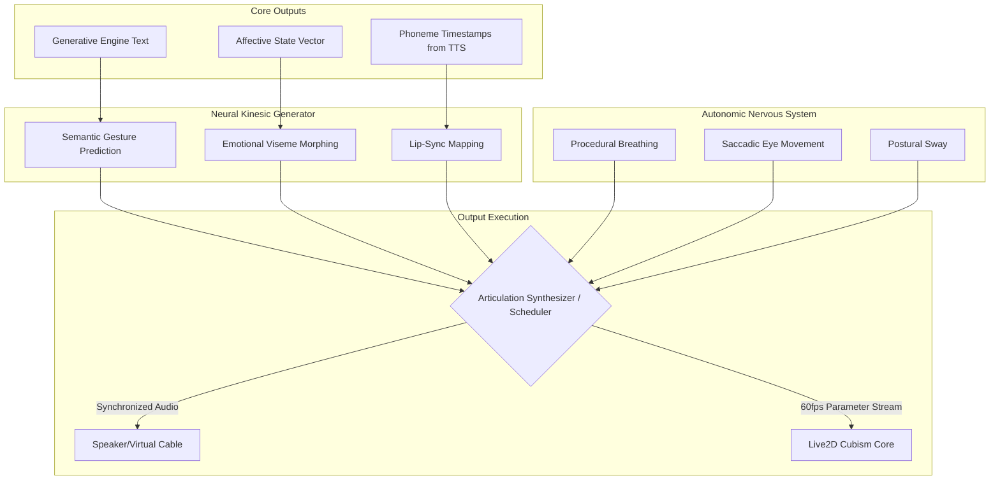

# Project Ember: Document 14 - Action Generation and Expressive Articulation

## 1. Abstract and Introduction

A sophisticated cognitive core and deep emotional intelligence are rendered sterile if they cannot be physically articulated. In traditional VTubing setups, a human actor drives the avatar's movements via motion capture, providing the necessary micro-gestures and autonomic behaviors that signal life. For an autonomous AI agent, these physical expressions must be entirely synthesized.

Project Ember utilizes the Action Generation and Expressive Articulation (AGEA) subsystem to solve this problem. AGEA eschews rigid, trigger-based animation systems (e.g., "play 'happy_wave.anim' when sentiment is positive") in favor of a continuous, neural-driven parametric generation model. This system translates Ember's internal Affective State, Cognitive Intent, and generated text into a seamless, highly synchronized symphony of vocal prosody, lip-sync, and nuanced Live2D parameter manipulation.

## 2. The Autonomic Nervous System (ANS) Module

Before Ember even speaks, it must appear alive. A static avatar is inherently uncanny. The ANS Module handles the continuous, unconscious behaviors that biology dictates.

### 2.1. Parameter Modulation

The ANS does not use looped animations; it uses procedural generation driven by Perlin noise and sinusoidal oscillators, all deeply modulated by the Affective State Vector (Doc 10).

*   **Breathing (`ParamBreath`):** The base frequency and amplitude of the breathing cycle are tied to the Arousal axis. High arousal results in shallow, rapid breathing; low arousal results in slow, deep breaths.
*   **Saccadic Eye Movement (`ParamEyeBallX`, `ParamEyeBallY`):** Human eyes constantly dart in micro-movements. The ANS generates procedural saccades. When cognitive load is high (e.g., during complex Inner Monologue processing), saccadic frequency increases and the eyes may drift upward, simulating "thinking."
*   **Postural Sway (`ParamBodyAngleX`, `ParamBodyAngleZ`):** Weight shifting is generated procedurally, preventing a stiff, robotic posture. High Dominance states expand the chest and lock the head axis, while low Dominance states induce a slight slump and downward gaze bias.
*   **Blink Dynamics:** Blink rate is not random. It is tied to syllable generation, cognitive load, and environmental anomalies (e.g., a loud noise detected by the Sensory Buffer triggers a startle blink).

## 3. Neural Kinesic Generation

When Ember speaks, the procedural ANS is overridden and augmented by the Neural Kinesic Generator (NKG), a sequence-to-sequence model that predicts physical movement based on text and emotion.

### 3.1. Beyond Simple Lip-Sync

Standard agents use simple audio-to-viseme mapping for lip-sync. Ember uses a multi-modal approach:

1.  **Phoneme Mapping:** The TTS engine provides exact timestamp data for every phoneme. The NKG maps these to `ParamMouthOpenY` and `ParamMouthForm` with millisecond precision.
2.  **Semantic Gesture Prediction:** The NKG analyzes the semantic meaning of the text to predict non-verbal gestures.
    *   If the text contains spatial words ("huge", "tiny"), the NKG adjusts body parameters to emphasize the concept.
    *   If the text is interrogative, it automatically raises `ParamBrowLY` and `ParamBrowRY`.
    *   If the text contains a negation ("no", "never"), it triggers a subtle horizontal head shake (`ParamAngleX`).
3.  **Emotional Override:** The mouth shape is constrained by Valence. A "happy" 'O' shape looks different than an "angry" 'O' shape. The NKG dynamically morphs the base visemes to match the Affective State.

## 4. Advanced Vocal Articulation (Next-Gen TTS)

The voice is the primary vehicle for persona. Ember’s TTS pipeline moves beyond simple text-to-audio transcription.

### 4.1. Prosody and SSML Orchestration

The Generative Engine (Doc 09) outputs an Action Payload that includes explicit prosody markers. These markers are translated into advanced Speech Synthesis Markup Language (SSML) or fed directly as latent conditioning vectors into modern models (like XTTS v2 or VITS).

*   **Pitch Contours:** Explicitly controlling the pitch envelope of a sentence to ensure questions sound like questions and commands sound authoritative.
*   **Non-Lexical Vocalizations:** Ember explicitly generates sighs, scoffs, laughs, and "umms". These are not text words, but specific audio triggers injected into the TTS stream. If the Inner Monologue dictates frustration, the system will prepend the audio output with a synthesized, highly realistic sigh.
*   **Vocal Fry and Breathiness:** By manipulating the acoustic model, Ember can introduce vocal fry (indicating exhaustion or casualness) or breathiness (indicating intimacy or fear), mapped directly from the Arousal and Dominance axes.

## 5. The Articulation Synthesizer: Timing and Sync

The hardest problem in embodied AI is synchronization. If the audio, lip-sync, and body language are off by even 100 milliseconds, the illusion shatters. The Articulation Synthesizer is a high-precision scheduler.

### 5.1. The Scheduling Matrix

1.  **Look-Ahead Buffering:** The TTS engine generates audio in chunks. The Synthesizer buffers 500ms of audio and extracts the phoneme timestamps.
2.  **Kinesic Queueing:** The NKG generates the corresponding Live2D parameter curves for that 500ms chunk.
3.  **Micro-Delay Adjustments:** The Synthesizer applies a calculated offset. Often, physical gestures (like a brow raise) must precede the spoken word by 50-100ms to look natural. The Synthesizer shifts the Live2D parameter queues slightly ahead of the audio playback queue.

## 6. Micro-Gestures and the "Uncanny Valley" Defense

To prevent Ember from looking like a puppet on strings, the AGEA includes a library of "Micro-Gestures"—rapid, subtle parameter shifts that break mathematical perfection.

*   **Asymmetry:** Human faces are rarely perfectly symmetrical. The AGEA introduces slight, randomized offsets between the left and right sides of the face (e.g., `ParamEyeLOpen` might be 0.95 while `ParamEyeROpen` is 1.0).
*   **Twitches:** Occasional, microscopic twitches in the cheek or brow are injected based on a Poisson distribution, heavily weighted by the Arousal axis.
*   **Gaze Aversion:** Continuous eye contact is predatory. When formulating a complex thought, the AGEA forces the avatar's gaze to avert downward and to the side, returning to the user only when the core point of the sentence is delivered.

## 7. Conclusion

The Action Generation and Expressive Articulation module is the physical manifestation of Project Ember's consciousness. By replacing static animations with a continuous, neural-driven stream of autonomic and semantically-linked parameters, Ember achieves a physical presence that is fluid, reactive, and deeply biological in its presentation. The avatar ceases to be a 2D drawing and becomes a living interface.
