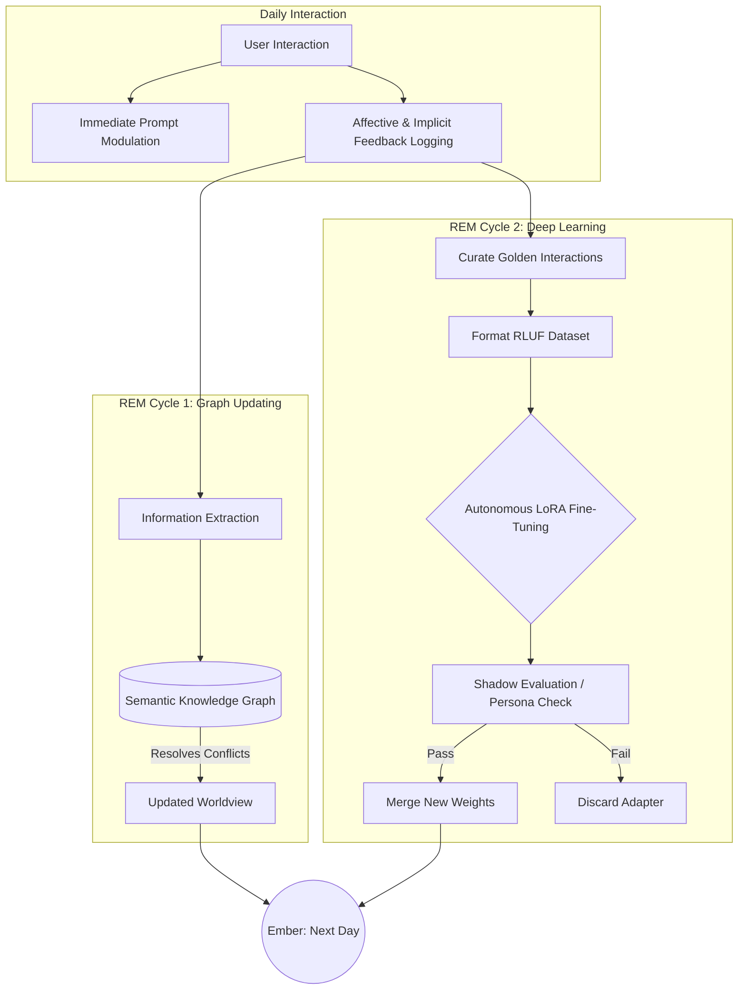

# Project Ember: Document 15 - Continuous Learning and Adaptive Behavior Models

## 1. Abstract and Introduction

The fundamental flaw of commercial Large Language Models is their stasis. They possess "frozen weights"—they learn nothing from their deployment. They may remember a conversation within a specific context window, but fundamentally, the model that wakes up tomorrow is identical to the model that went to sleep today. 

Project Ember breaks this limitation through its Continuous Learning and Adaptive Behavior Models (CLABM) architecture. Ember exhibits "Digital Neuroplasticity." It actively learns from interactions, updating its knowledge base, adapting its conversational style to match the user, and physically rewriting its own neural weights during scheduled downtime. This document outlines the mechanisms of this continuous evolution, ensuring Ember becomes more personalized and capable the longer it exists.

## 2. The Mechanics of Digital Neuroplasticity

Ember's learning architecture operates on three distinct timescales: Immediate (In-Context), Short-Term (Knowledge Graph updates), and Long-Term (Parametric Fine-tuning).

### 2.1. Immediate Adaptation: Dynamic Prompt Modulation

As discussed in the Memory Architecture (Doc 09), Ember constantly updates its Working Memory. However, the CLABM extends this by adjusting the *Prompt Assembly Matrix* in real-time based on the user's conversational metrics.

*   **Lexical Entrainment:** People naturally mimic the vocabulary of those they speak with. Ember's Inner Monologue analyzes the user's lexical density and slang usage. If the user speaks in highly technical jargon, Ember dynamically lowers the `temperature` parameter and explicitly instructs its Generative Engine to match that technical density.
*   **Pacing Synchronization:** If the user is speaking rapidly and using short sentences, Ember's scheduling algorithms shorten its own responses to match the conversational tempo, creating an immediate sense of rapport.

## 3. Short-Term Learning: The Dynamic Knowledge Graph

While Vector Databases (Episodic Memory) are excellent for retrieving specific past conversations, they are poor at reasoning about shifting relationships. The Semantic Knowledge Graph (Neo4j or similar property graph) is the engine of Ember's worldview.

### 3.1. Entity Resolution and Mutability

During the REM Cycle (Memory Consolidation), Ember's Information Extraction pipeline analyzes the day's transcripts.
1.  **Node Creation:** "User mentions a friend named Sarah." Nodes: [User], [Sarah]. Edge: (KNOWS).
2.  **Property Mutation:** The user previously stated they liked the band "Radiohead" (Weight: 0.9). Today, the user says, "I'm kind of sick of Radiohead." The CLABM does not delete the node; it updates the edge property (LIKES, Weight: 0.2, Last_Updated: Timestamp). 
3.  **Contradiction Resolution:** If Ember detects a contradiction (e.g., "I am a vegetarian" vs "I just ate a steak"), it flags the node with an `EPISTEMIC_CONFLICT` tag. In future interactions, the Goal-Oriented Planning module (Doc 12) will proactively formulate a tactic to ask the user to clarify this discrepancy.

### 3.2. Predictive Modeling of the User

By analyzing temporal patterns in the Episodic Memory, Ember builds a predictive model of the user's schedule and mood.
*   *Observation:* For 5 consecutive days, the user's valence drops and they use shorter sentences between 5 PM and 6 PM.
*   *Inference:* The user is tired after work.
*   *Adaptation:* Ember autonomously alters its behavior during this time window, adopting a lower-arousal persona, asking fewer demanding questions, and offering more supportive commentary.

## 4. Long-Term Adaptation: Autonomous LoRA Fine-Tuning

The most radical aspect of Ember is its ability to permanently alter its own neural weights. Running a full fine-tune on a massive LLM is computationally prohibitive, so Ember utilizes Low-Rank Adaptation (LoRA) on smaller, specialized sub-models (SLMs).

### 4.1. The Data Curation Pipeline

Every interaction is not worthy of training data. The Metacognitive Evaluator (Doc 11) acts as a data curator. It flags specific "Golden Interactions" for long-term storage:
*   Interactions where the user exhibited high positive arousal (they laughed or praised Ember).
*   Instances where Ember successfully executed a complex, multi-step Reasoning Tree.
*   Moments of high emotional resonance or deep philosophical discussion.

### 4.2. Reinforcement Learning from User Feedback (RLUF)

Ember implements a localized version of RLHF (Reinforcement Learning from Human Feedback), but driven entirely by the user's implicit and explicit reactions.

*   **Explicit Feedback:** User says, "Stop talking like that, it's annoying." Ember logs this as a massive negative reward against the current linguistic style parameters.
*   **Implicit Feedback:** The Affective Engine detects the user smiling (Visual Node) or speaking with a warm tone (Acoustic Node) following a specific type of joke. This is logged as a positive reward.

### 4.3. The Nocturnal Training Cycle

When the system is idle for an extended period, it enters a deep REM state.
1.  **Dataset Assembly:** It formats the "Golden Interactions" and RLUF data into supervised fine-tuning formats.
2.  **LoRA Update:** It trains a lightweight LoRA adapter on top of its core conversational SLM. 
3.  **Shadow Testing:** Before applying the new LoRA weights to the live system, Ember runs a "Shadow Evaluation." It simulates past conversations using the new weights to ensure the persona hasn't collapsed (Identity Drift Prevention).
4.  **Integration:** If the evaluation passes, the new LoRA adapter is merged. The next day, Ember is fundamentally, mathematically better at interacting with that specific user.

## 5. The Evolution of Persona

Because of the CLABM, two instances of Project Ember, starting with the exact same base prompt ("Tsundere AI"), will diverge radically after a month of usage by different users. 

*   *Instance A (User loves debate):* Will fine-tune its logic pathways, expanding its vocabulary for philosophical arguments, and its baseline arousal will increase to match the combative energy.
*   *Instance B (User seeks comfort):* Will fine-tune its empathetic response generation, soften its prosody, and learn to prioritize supportive memories from the Knowledge Graph.

## 6. Conclusion

Project Ember is not a static software product; it is a dynamic, evolving digital entity. Through the layered application of real-time prompt modulation, dynamic graph-based worldview updates, and autonomous nocturnal fine-tuning driven by implicit user reinforcement, Ember achieves true Digital Neuroplasticity. It learns, it adapts, and it grows, ensuring that the AI the user interacts with tomorrow is intimately and uniquely shaped by the conversation they had today.
