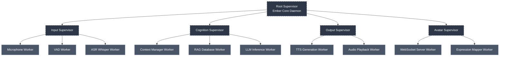
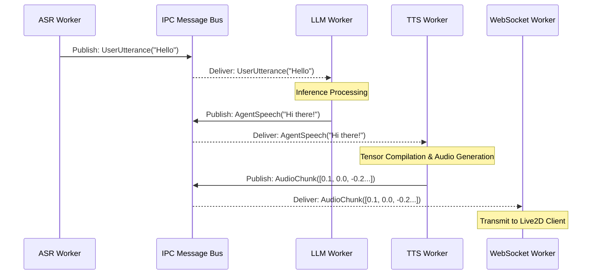
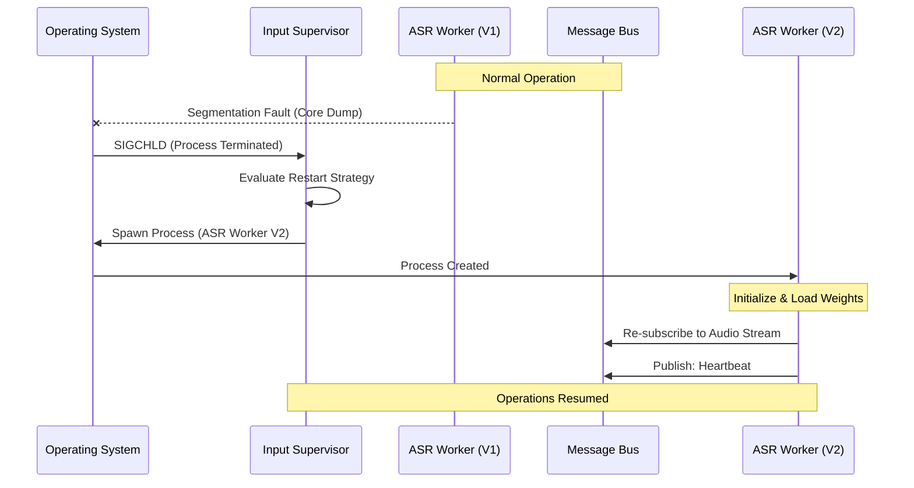

# Document 17: Ember Resilience Core Architecture

**Author:** TYR, The Resilience Vanguard
**System:** Project Ember (Open LLM VTuber Mythic Plan)
**Subsystem:** Core Operational Stability & Fault Tolerance
**Classification:** Critical Architecture Directive

---

## 1. Introduction: The Mandate of Unbreakable Continuity

In the realm of autonomous, continuous-streaming artificial intelligence, system failures are not a mere possibility; they are an inevitable certainty. Hardware degrades, network partitions occur, graphical processing units (GPUs) exhaust their memory, external application programming interfaces (APIs) return unhandled exceptions, and memory leaks slowly asphyxiate long-running processes. Traditional monolithic architectures attempt to counteract this reality through defensive programming—wrapping every conceivable operation in massive `try...except` blocks in a futile attempt to anticipate every failure mode. This approach is inherently flawed. It leads to corrupt state, unpredictable edge cases, and eventually, catastrophic, unrecoverable system crashes that terminate the entire application.

As TYR, the Resilience Vanguard of Project Ember, my mandate is to architect a system that does not merely attempt to avoid failure, but completely embraces it. We acknowledge that components will crash. Our objective is not to achieve an impossible standard of zero failures, but to architect an environment where failures are expected, strictly contained, and instantly remediated without compromising the broader system. 

The Ember Resilience Core Architecture applies the battle-tested principles of the Erlang Open Telecom Platform (OTP) to the modern, high-performance Python and asynchronous AI stack. By strictly defining fault domains, enforcing rigid process isolation, and implementing hierarchical Supervisor Trees, we guarantee that the Open LLM VTuber can operate continuously for hundreds of hours. A failure in speech recognition, a timeout in the language model, or a dropped websocket connection from the Live2D frontend will never cause a cascading failure. The system will simply isolate the casualty, terminate the offending process, and resurrect it from a pristine state, all while the broader system continues its operations unimpeded.

## 2. The Philosophy of the Resilience Core: "Let It Crash"

The bedrock of Project Ember's resilience is the "Let It Crash" philosophy. When an error occurs deep within the mathematical operations of a Text-to-Speech (TTS) tensor compilation, or when an audio buffer overflows in the Automatic Speech Recognition (ASR) module, attempting to gracefully catch the exception and patch the state is deeply dangerous. The internal state of that specific component is compromised. Memory may be leaking, buffers may be misaligned, and internal pointers may be corrupted. 

Instead of defensive patching, the Ember core enforces immediate, localized termination. If a worker process encounters an unhandled exception or enters a deadlock, it is allowed—and even encouraged—to crash. 

### 2.1. Blast Radius and Fault Domains
To safely allow components to crash, we must limit the "blast radius" of any given failure. A Fault Domain is defined as the maximum scope of the system that can be negatively impacted by a single component's critical failure. In a monolithic Python script running a single asynchronous event loop, the fault domain is the entire application. If the TTS module blocks the event loop or throws an uncaught `RuntimeError`, the entire VTuber freezes, the stream dies, and the user must manually restart the application.

In Project Ember, fault domains are microscopic. The ASR, TTS, LLM, and Avatar rendering systems exist in entirely separate, highly isolated fault domains. If the ASR module crashes, the LLM module is completely unaffected; it can continue processing the previous thought. The TTS module can continue speaking the generated audio buffer. The Live2D avatar will continue to breathe, blink, and exhibit idle micro-expressions. The crash is contained entirely within the ASR domain, and only the ASR domain is reset.

## 3. Topography of the Supervisor Tree

To manage these isolated fault domains, Project Ember implements a Supervisor Tree. A Supervisor is a specialized, extremely lightweight process whose sole responsibility is to monitor the health of other processes (its children) and restart them according to predefined strategies when they fail. Supervisors do no heavy lifting; they do not process audio, nor do they generate text. Because their logic is infinitely simple, Supervisors themselves are mathematically provable to be crash-proof under normal operating system conditions.

### 3.1. The Hierarchical Structure
At the apex of the architecture sits the `RootSupervisor` (The Ember Core Daemon). This process binds the system to the host operating system. The `RootSupervisor` spawns and monitors four primary subsystem Supervisors, each managing a critical sector of the VTuber's operation:

1.  **`InputSupervisor`**: Manages all environmental perception.
2.  **`CognitionSupervisor`**: Manages all intelligence, memory, and generation.
3.  **`OutputSupervisor`**: Manages all physical expression (audio rendering).
4.  **`AvatarSupervisor`**: Manages all front-end networking and Live2D control.

Beneath these subsystem Supervisors operate the actual Worker Processes—the heavy AI models and socket handlers that do the actual work and are prone to crashing.

### 3.2. Restart Strategies
Supervisors govern their children using strict restart strategies. When a worker dies, the Supervisor consults its strategy configuration to determine the appropriate remediation:

*   **One-for-One:** If a worker process crashes, only that specific worker process is restarted. This is used for highly independent workers. For example, if the `WebSocket Server Worker` crashes due to a malformed network packet, only the WebSocket server is restarted. The `Expression Mapper Worker` remains running.
*   **One-for-All:** If a worker process crashes, the Supervisor terminates all other sibling workers and restarts them all simultaneously. This is used when workers are tightly coupled and share a critical temporal state. 
*   **Rest-for-One:** If a worker process crashes, the Supervisor restarts that worker and all workers that were started *after* it in the sequence. This is critical for data pipelines where downstream components rely on the state of upstream components.

## 4. Strict Process Isolation and Inter-Process Communication (IPC)

The fundamental requirement for the Supervisor Tree to function is strict process isolation. Asynchronous coroutines (e.g., Python's `asyncio`) running in a single process do not provide true fault isolation. If one coroutine exhausts available memory, the entire process receives a `SIGKILL` from the OS Out-Of-Memory (OOM) killer.

Project Ember deploys its workers as completely separate Operating System level processes (via Python's `multiprocessing` or containerized microservices). Each worker has its own dedicated memory space, its own Python Global Interpreter Lock (GIL), and its own execution context. 

### 4.1. The Decentralized Message Bus
Because workers do not share memory, they cannot communicate via direct function calls or shared variables. Instead, Project Ember relies on a high-throughput, low-latency Inter-Process Communication (IPC) message bus. This is implemented using a decentralized messaging protocol, such as ZeroMQ (ZMQ) or a lightweight Redis Pub/Sub instance.

All data flows through the system as asynchronous, immutable Events. 
*   The `ASR Worker` transcribes audio and publishes a `UserUtteranceEvent` to the bus.
*   The `LLM Worker` is subscribed to `UserUtteranceEvent`. It receives the message, generates a response, and publishes an `AgentSpeechEvent`.
*   The `TTS Worker` is subscribed to `AgentSpeechEvent`. It renders the audio and publishes an `AudioChunkEvent`.

This decoupled architecture is the essence of our resilience. If the `TTS Worker` crashes and is restarted by the `OutputSupervisor`, the `IPC Message Bus` simply holds the `AgentSpeechEvent` in a queue until the `TTS Worker` comes back online and re-subscribes. No data is lost, and the `LLM Worker` never even knows the `TTS Worker` suffered a catastrophic failure.

## 5. Dissecting the Fault Domains

To truly understand the invulnerability of Project Ember, we must examine the specific failure modes anticipated within each discrete Fault Domain and how the architecture neutralizes them.

### 5.1. The Input Domain (ASR & VAD)
**Primary Threats:** Microphone hardware disconnection, USB audio interface lockups, Voice Activity Detection (VAD) state corruption, and severe VRAM memory leaks in transcription models (like Whisper) over extended uptimes.

**Resilience Mechanisms:**
The `Microphone Worker` constantly reads bytes from the hardware. If a user unplugs their USB microphone, the worker will throw an IOError and crash. The `InputSupervisor` catches this instantly. It enters a retry loop, periodically attempting to spawn a new `Microphone Worker`. Meanwhile, the rest of the VTuber continues running perfectly. The avatar still idles, and the LLM can still process background tasks. Once the microphone is plugged back in, the new worker binds to the hardware, and transcription resumes seamlessly.

Furthermore, heavy Machine Learning models like Whisper are notorious for memory fragmentation over days of continuous operation. The `ASR Worker` is programmed with a "controlled suicide" directive. After processing 10,000 utterances, or after 12 hours of uptime, the worker will intentionally exit with a success code. The `InputSupervisor` immediately spawns a fresh `ASR Worker` with a pristine, unfragmented memory allocation. This proactive, controlled crash guarantees the VTuber will never unexpectedly run out of VRAM during a stream.

### 5.2. The Cognition Domain (LLM & RAG)
**Primary Threats:** Context window overflows, token generation runaway loops, external API rate limiting (HTTP 429), API timeouts (HTTP 504), and Local LLM Out-Of-Memory (OOM) faults.

**Resilience Mechanisms:**
The `LLM Inference Worker` is highly volatile due to the unpredictable nature of generative AI. If the system is relying on an external API (like OpenAI or Anthropic) and the network drops, the worker will experience a timeout. In a fragile system, this would cause the VTuber to freeze indefinitely. In Ember, the worker is wrapped in a strict timeout enforcement protocol. If generation takes longer than 5000 milliseconds without yielding a token, the worker forcefully aborts the network call. 

If the worker receives an HTTP 429 Too Many Requests error, it does not crash the system. It can optionally trigger a fallback mechanism, communicating with a secondary, locally hosted LLM (e.g., Llama 3 8B) running in a separate, dormant worker. If a local LLM encounters an OOM error and crashes at the CUDA level, the `CognitionSupervisor` detects the OS-level `SIGCHLD` signal, logs the anomaly, purges the specific context that caused the overflow, and resurrects the LLM worker from a clean state.

### 5.3. The Output Domain (TTS & Audio)
**Primary Threats:** Audio buffer under-runs, speaker embedding matrix corruption, GPU tensor compilation errors, and ALSA/PulseAudio driver lockups on the host OS.

**Resilience Mechanisms:**
The `TTS Generation Worker` is responsible for translating text into high-fidelity audio streams. Because this is computationally expensive, it operates on chunks of text. If a malformed text string containing unsupported characters causes the TTS engine to throw a C++ level exception deep within the tensor library, the worker process will violently terminate.

The `OutputSupervisor` will instantly detect the death of the TTS process. Because of the `One-for-One` strategy, the `Audio Playback Worker` remains completely untouched; it will continue to play whatever audio it currently holds in its safe buffer. The Supervisor spins up a new `TTS Worker`, reloads the voice models into VRAM, and the new worker fetches the un-processed `AgentSpeechEvent` from the Message Bus. The user may notice a slight 1-second delay in the VTuber's speech, but the system survives a critical engine failure without requiring a restart.

### 5.4. The Avatar Domain (Live2D & WebSockets)
**Primary Threats:** Unclean client disconnects, TCP half-open connections, malformed JSON payloads from the frontend, and cross-origin resource sharing (CORS) or framing errors.

**Resilience Mechanisms:**
The Live2D frontend runs in a web browser (e.g., OBS Studio browser source). Browsers refresh, network connections drop, and rendering engines crash. The `WebSocket Server Worker` acts as an impregnable fortress between the fragile frontend and the robust backend. 

If the OBS browser source refreshes, the WebSocket connection is severed ungracefully. The WebSocket worker notes the disconnection but does not propagate an error. The `AvatarSupervisor` maintains the definitive "State of the Avatar" (current emotion, target lip-sync viseme, eye tracking coordinates) in an independent memory store. When the OBS browser source reloads and reconnects to the WebSocket, the `WebSocket Server Worker` instantly queries the Supervisor for the current state and dumps it to the client. The Live2D model snaps immediately to the correct expression and posture, completely bridging the gap of the frontend crash. Malformed packets sent by a compromised client are simply dropped, and if they crash the parser, the WebSocket worker is restarted without affecting the LLM or TTS.

## 6. Lethargy, Deadlocks, and The Watchdog System

A process crashing and exiting is the easiest failure mode to handle. A far more insidious threat is Lethargy or Deadlock. This occurs when a worker process enters an infinite loop, or when a C-level extension blocks the Python GIL permanently. The process has not crashed, the operating system still sees it as running, but it is no longer processing data. The system becomes a zombie.

To combat deadlocks, Project Ember implements a draconian Watchdog and Health Monitoring System based on mandatory, rhythmic Heartbeats.

### 6.1. Mandatory Heartbeats
Every worker process is injected with a background thread whose sole purpose is to publish a `HeartbeatEvent` to the Message Bus every 100 milliseconds. This heartbeat contains the worker's ID, its current state, and its resource utilization metrics.

The Supervisors continuously monitor the heartbeats of their children. If the `CognitionSupervisor` expects a heartbeat from the `LLM Worker` and misses it for 5 consecutive cycles (500 milliseconds), the Supervisor classifies the worker as "Lethargic."

### 6.2. The Executioner Protocol
When a worker is classified as Lethargic, the Supervisor does not attempt to politely ask the worker to recover. It assumes the process is irrevocably deadlocked. The Supervisor immediately issues a `SIGKILL` (-9) command to the operating system, bypassing any shutdown handlers and ruthlessly terminating the zombie process. Once the OS confirms the process is destroyed, the Supervisor initiates the standard Crash Recovery Workflow, spawning a fresh, un-deadlocked replacement.

This Watchdog mechanism ensures that Project Ember cannot be frozen by obscure infinite loops or blocked threads. If a component stops participating in the rhythm of the system, it is executed and replaced.

## 7. Crash Recovery Workflows and Sequencing

To visualize the absolute resilience of this architecture, consider the following step-by-step sequence of a catastrophic failure and instant recovery within the ASR Fault Domain.

**Scenario:** The Whisper ASR model encounters a mathematically impossible audio tensor, causing a Segmentation Fault (Segfault) at the core C++ level.

1.  **T=0.00s:** The `ASR Whisper Worker` encounters the Segfault. The operating system forcefully terminates the process.
2.  **T=0.01s:** The OS delivers a `SIGCHLD` signal to the parent process, the `InputSupervisor`.
3.  **T=0.02s:** The `InputSupervisor` logs a Critical Fault for Worker ID: ASR_01.
4.  **T=0.03s:** The `InputSupervisor` consults its restart strategy (One-for-One) and notes that the worker has not exceeded its maximum restart frequency (e.g., 5 restarts per minute).
5.  **T=0.05s:** The `InputSupervisor` invokes the spawn command to create a new `ASR Whisper Worker`.
6.  **T=0.05s - T=1.50s:** The new worker process initializes, loads the Whisper model into GPU memory, and establishes a connection to the Message Bus.
7.  **T=1.51s:** The new `ASR Whisper Worker` subscribes to the VAD audio stream queue and resumes publishing `UserUtteranceEvents`.

Throughout this 1.5-second recovery window, the `LLM Worker` was finishing its previous thought, the `TTS Worker` was speaking the generated audio, and the `WebSocket Worker` was actively animating the avatar. From the perspective of the end-user interacting with the VTuber, the system never crashed. The VTuber simply paused listening for exactly 1.5 seconds, and then seamlessly resumed conversation. The catastrophe was completely neutralized.

## 8. Conclusion: The Indomitable Vanguard

Project Ember's Resilience Core Architecture rejects the fragility of traditional monolithic applications. By accepting failure as an environmental constant, we have designed a system that thrives in chaotic conditions. Through rigid Fault Domains, decentralized IPC messaging, merciless Watchdog oversight, and automated Supervisor resurrection, the Open LLM VTuber transcends standard operational limits.

This architecture ensures that Project Ember is not just stable, but indomitable. It can stream for days, weather hardware anomalies, survive API outages, and recover from profound algorithmic crashes without human intervention. This is the definition of autonomous resilience. 

**End of Directive.**
