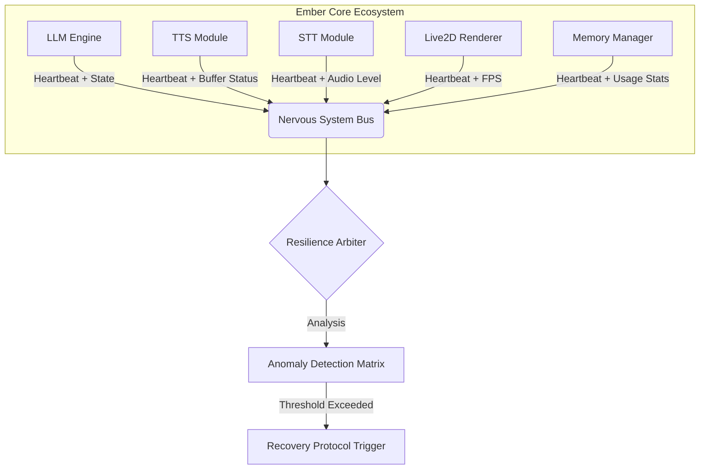
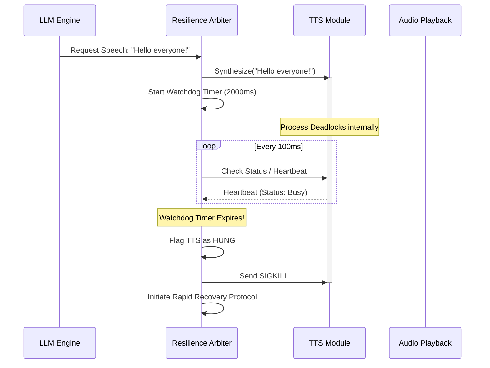
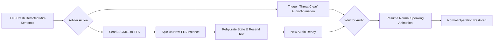
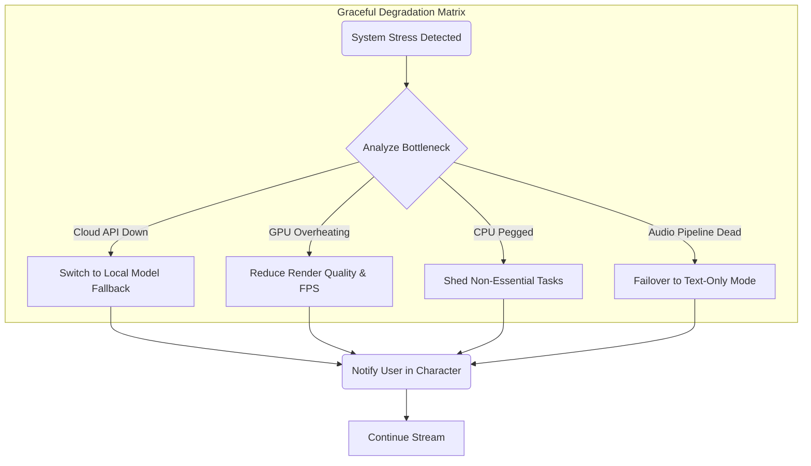

**Title:** Document 18: Ember Self-Healing Mechanisms
**Author:** TYR, the Resilience Vanguard
**Project:** Open LLM VTuber Mythic Plan - Project Ember

## 1. Introduction: The Imperative of Autonomous Resilience

In the crucible of continuous operation, any complex system will inevitably encounter turbulence. The Open LLM VTuber architecture, designated Project Ember, is not immune to the chaotic realities of real-time multi-modal streaming. Network jitter, memory leaks in heavy AI models, unexpected API deprecations, hardware thermal throttling, and unpredictable user inputs all conspire to disrupt the seamless illusion of the virtual persona. Traditional systems rely on human intervention—a frantic streamer restarting OBS or killing a frozen python process. Ember, however, aspires to a higher standard: autonomous resilience.

This document, authored by TYR, the Resilience Vanguard, delineates the architectural paradigms and specific mechanisms that empower Project Ember to monitor its own health, detect anomalies before they manifest as critical failures, and execute autonomous recovery protocols. We move beyond simple error handling into the realm of true self-healing, where the system possesses a dynamic immune response to internal and external stressors. The goal is to ensure that the VTuber persona remains unbroken, adapting and recovering seamlessly, preserving the immersion of the audience.

The core philosophy of Ember's resilience is built on four pillars:
1.  **Omniscient Telemetry:** Comprehensive, low-latency monitoring of all system states.
2.  **Proactive Fault Detection:** Identifying the whispers of failure before they become screams.
3.  **Surgical Intervention:** Targeted isolation and restart of failing components without cascading disruption.
4.  **Graceful Degradation:** Intelligent scaling back of capabilities to preserve core functionality when full recovery is impossible.

## 2. The Architecture of Vigilance: Telemetry and Health Monitoring

True self-healing begins with total awareness. Ember employs a centralized monitoring bus, the "Nervous System," which aggregates telemetry from every peripheral component—from the LLM reasoning engine to the Live2D rendering pipeline, the speech-to-text (STT) ingestion, and the text-to-speech (TTS) articulation.

### 2.1 The Distributed Heartbeat Protocol

At the core of the monitoring architecture is the Distributed Heartbeat Protocol (DHP). Unlike a simple "I am alive" ping, the DHP demands a cryptographic, state-infused pulse from every active module at a frequency of 10Hz.

Each heartbeat contains:
-   **Timestamp:** High-precision clock synchronization.
-   **Module ID:** Cryptographically signed identifier.
-   **Operational Status Code:** 0 for nominal, warning codes for high latency or memory pressure.
-   **Domain-Specific Metrics:**
    -   *LLM:* Tokens per second, current context window size, queue length.
    -   *TTS:* Buffer fill rate, synthesis latency, audio dropout count.
    -   *Renderer:* Frame time, dropped frames, GPU VRAM utilization.

### 2.2 The Anomaly Detection Matrix

The Resilience Arbiter, the brain of the self-healing system, does not merely check if a heartbeat is present. It feeds the continuous stream of telemetry into the Anomaly Detection Matrix (ADM). The ADM utilizes lightweight, pre-trained statistical models to establish baselines for normal operation during various phases of streaming (e.g., quiet idle, intense gaming, rapid-fire Q&A).

When metrics deviate from the established baseline, the ADM assigns an "Anomaly Score." This score isn't a binary trigger but a floating-point value that represents the probability of an impending failure.

*   **Sudden Latency Spikes:** If the TTS module's synthesis latency jumps from 200ms to 800ms while the LLM is outputting short sentences, the Anomaly Score rises sharply, indicating a potential thread lock or resource starvation.
*   **Memory Creep:** A slow, steady increase in VRAM usage by the Live2D renderer without a corresponding increase in model complexity triggers a "Memory Leak" warning, allowing the system to preemptively schedule a restart before an Out-Of-Memory (OOM) crash occurs.
*   **Silent Failures:** The most dangerous faults are those where a process remains alive but ceases useful work. The ADM detects this by correlating metrics. If the STT module reports active audio input but generates zero text output for an extended period during a known conversational phase, it is flagged as a "Zombie Process."

## 3. Mechanisms for Detecting Faults and Hung Processes

Detecting a hard crash (a process exit) is trivial. The operating system provides immediate notification. Project Ember's sophistication lies in its ability to detect soft crashes, deadlocks, livelocks, and performance degradation that compromises the user experience.

### 3.1 Detecting the "Hung" TTS Process

Text-to-Speech synthesis is notoriously computationally intensive and prone to hanging, especially when dealing with complex phonemes, sudden interruptions, or subtle API timeouts. A hung TTS module results in the VTuber "freezing" silently, breaking immersion instantly.

Ember utilizes a multi-layered approach to detect a stalled TTS:

1.  **The Watchdog Timer (The Crude Ax):** Every synthesis request sent to the TTS module is accompanied by a strict watchdog timer. If the TTS module fails to return audio data (or a progress chunk) within the expected window (e.g., 2000ms), the watchdog bites, immediately declaring the process hung.
2.  **Buffer Starvation Analysis (The Scalpel):** The audio playback queue is monitored continuously. If the queue is depleting and the TTS module is marked as "synthesizing" but fails to replenish the buffer at a rate faster than playback, a "Buffer Underrun Imminent" event is fired. This indicates the TTS is working but too slowly to be viable.
3.  **Acoustic Feature Verification (The Stethoscope):** In rare cases, a TTS engine might generate silence or static instead of actual speech while claiming to be operating normally. Ember routes a fraction of the generated audio through a lightweight Voice Activity Detector (VAD). If the VAD detects only silence for a prolonged period while the LLM has requested speech, the TTS is flagged as hallucinating or stalled.

### 3.2 Identifying LLM Hallucination Loops

While not a traditional software crash, an LLM entering a repetitive loop or generating nonsensical text is a functional failure of the VTuber. The Resilience Arbiter includes a Semantic Watchdog that analyzes the output stream. If the n-gram repetition rate exceeds a critical threshold, or if the sentiment analysis drops drastically without context, the Arbiter can interrupt the LLM, inject a corrective system prompt (e.g., "SYSTEM: You are repeating yourself. Change the topic immediately."), or perform a soft reset of the conversation history to break the loop.

## 4. Rapid State Recovery and Automatic Component Restarts

Once a fault is confirmed, the Resilience Arbiter must act instantly. The goal is to revive the component so quickly that the audience either doesn't notice or perceives it as a minor, natural pause in the character's behavior.

### 4.1 The Containerized Micro-Restart

Project Ember heavily leverages containerization (e.g., Docker, or lightweight local virtualization like Podman). This ensures that every module is isolated. When the TTS module hangs, killing and restarting it does not affect the LLM, the memory manager, or the Live2D renderer.

1.  **SIGKILL and Purge:** The Arbiter sends a merciless termination signal to the offending process. It simultaneously purges any corrupted data residing in the shared memory queues associated with that module to prevent the new instance from choking on poisoned data.
2.  **Instantaneous Spin-Up:** The container orchestrator is instructed to spin up a fresh instance of the module. Because the environments are pre-compiled and immutable, spin-up time is measured in milliseconds.
3.  **State Rehydration:** A newly spawned module is useless without context. The Resilience Arbiter maintains a rolling "State Ledger." When the new TTS module comes online, the Arbiter immediately injects the necessary state: the current voice profile parameters, the backlog of text it needs to synthesize (excluding the specific string that caused the crash, if identifiable), and the current emotional metadata required for inflection.

### 4.2 Handling the "Mid-Sentence" Crash

The most jarring failure is when a module crashes while actively performing a task, such as the TTS crashing mid-sentence. Ember's recovery protocol handles this via the "Filler and Bridge" technique.

When a mid-task crash is detected:
1.  **The Cover-Up:** The Arbiter instantly commands the Live2D renderer to transition to a "thinking," "surprised," or "coughing" animation. Simultaneously, a pre-rendered, generic audio clip (e.g., a cough, a throat clear, or a soft "Hmm...") is played. This masks the silence and provides an in-character reason for the pause.
2.  **The Re-roll:** The Arbiter does not attempt to resume the synthesis from the exact syllable where it failed. Instead, it re-submits the entire sentence (or the current semantic chunk) to the newly restarted TTS module.
3.  **The Seamless Resumption:** Once the new audio is ready, the avatar transitions back to the speaking animation, effectively repeating the interrupted thought. To the audience, the character simply cleared their throat and started their sentence over.

## 5. Graceful Degradation vs. Total Failure

Not all failures can be fixed with a quick restart. Sometimes, underlying infrastructure fails—an API endpoint goes down, the local GPU overheats and throttles, or the network connection degrades severely. In these scenarios, Ember must choose survival over perfection. This is the principle of Graceful Degradation.

### 5.1 The Tiers of Operation

Ember is designed with multiple operational tiers. When resources become scarce or APIs become unavailable, the Resilience Arbiter autonomously downshifts the system to a lower tier, ensuring the core persona remains active, even if capabilities are diminished.

**Tier 1: Mythic (Full Capacity)**
-   Local or Premium Cloud LLM (Max parameters, massive context).
-   High-Fidelity, low-latency TTS with emotional prosody.
-   Advanced STT with multi-speaker diarization.
-   Complex Live2D rendering with physics and precise lip-sync.

**Tier 2: Veteran (Degraded External APIs)**
-   *Trigger:* Cloud LLM API timeout or rate limit hit.
-   *Action:* Seamless fallback to a smaller, locally hosted LLM (e.g., Llama-3-8B). The character might become slightly less eloquent or have a shorter memory, but the stream continues without interruption. The system prompt is adjusted to reflect a slightly "distracted" or "tired" state to explain the cognitive shift in-character.

**Tier 3: Survivor (Local Resource Exhaustion)**
-   *Trigger:* GPU thermal throttling or critical VRAM shortage.
-   *Action:* Live2D rendering FPS is capped at 30. Physics calculations are simplified. The TTS engine switches to a less demanding, perhaps slightly more robotic, acoustic model. The system prioritizes maintaining the audio stream and basic mouth movements over visual flair.

**Tier 4: Life Support (Catastrophic Pipeline Failure)**
-   *Trigger:* Complete failure of the TTS or Audio pipeline that cannot be recovered via restarts.
-   *Action:* The VTuber transitions to a "Text-Only" mode. The Live2D avatar displays a specific "typing" or "communicating via terminal" animation. The LLM's output is routed directly to an on-screen chat overlay. The persona acknowledges the technical difficulty in character ("My voice module seems to be malfunctioning, but I'm still here!"). This prevents a dead stream and maintains audience interaction.

### 5.2 The Strategy of Load Shedding

Graceful degradation is actively managed through Load Shedding. When the Anomaly Detection Matrix identifies systemic stress (e.g., overall CPU utilization pegged at 100% for an extended period), the Arbiter begins ruthlessly culling non-essential tasks.

-   **Memory Pruning:** The LLM's context window is aggressively truncated, discarding older conversational history to free up RAM.
-   **Visual Simplification:** Background visual effects or complex OBS scene transitions managed by the VTuber are disabled.
-   **Input Throttling:** If chat is moving too fast for the STT/LLM to process, the system switches to a "slow mode" ingestion, randomly sampling messages rather than attempting to read every single one, prioritizing Superchats or specific keywords to maintain engagement while reducing computational load.

## 6. The Philosophy of the In-Character Error

A crucial aspect of Ember's self-healing is maintaining the illusion. Technical glitches are inevitable, but they should never break the fourth wall if they can be avoided. The Resilience Arbiter is deeply integrated with the LLM's system prompt injection mechanism.

When a recovery protocol is initiated, or when the system downshifts to a lower tier of operation, the Arbiter injects a hidden context message into the LLM.

*   *System Inject:* `[DIAGNOSTIC: TTS Module experienced a micro-fault and was restarted. You paused for 3 seconds. Acknowledge this briefly as a physical or mental glitch.]`
*   *LLM Output:* "...and that's why the—whoa, sorry, spaced out for a second there, my brain just short-circuited. Anyway, as I was saying..."

This transforms a technical failure into an endearing character quirk, enhancing the illusion of a living, breathing digital entity rather than a brittle software stack.

## 7. Continuous Evolution: The Post-Mortem Log

Resilience is not static. Every fault, every hung process, and every graceful degradation event is meticulously logged by the Nervous System. These logs are not merely error dumps; they include the complete state of the system seconds before the failure.

This data is used for offline analysis. The development team (or future iterations of the autonomous system itself) can use these "Post-Mortem Logs" to identify the root causes of instability. Was a specific phoneme combination consistently crashing the TTS? Did a particular chat command trigger a memory leak in the LLM context manager?

By treating every failure as a learning opportunity, Project Ember continuously hardens its own architecture, evolving towards an ever more robust and unshakeable virtual presence.

## 8. Conclusion

The self-healing mechanisms of Project Ember represent a paradigm shift in automated streaming. By anticipating failure, monitoring relentlessly, recovering surgically, and degrading gracefully, the system ensures that the VTuber persona remains resilient in the face of inevitable technical chaos. TYR, the Resilience Vanguard, stands watch, guaranteeing that the show will always go on. The illusion remains unbroken, not because it is perfect, but because it is unbreakable.

## 9. Deep Dive: Cryptographic Verification and The Distributed Heartbeat

The Distributed Heartbeat Protocol (DHP) is more than a simple network ping; it is the foundation of trust within the Ember ecosystem. In a highly complex, multi-process environment, it is entirely possible for a process to become "zombified"—meaning it responds to basic OS-level pings but is logically frozen, stuck in an infinite loop, or disconnected from the shared memory bus.

To combat this, Ember employs Cryptographic Heartbeat Verification.

### 9.1 The Mechanics of the Cryptographic Pulse

When the Resilience Arbiter initializes the system, it generates a unique session key pair. Each module (LLM, TTS, STT, Renderer) receives the public key and a unique, rotating seed value.

Every 100 milliseconds (10Hz), each module must not only send its status and metrics but must also solve a lightweight cryptographic challenge based on the current seed. This challenge is designed to require a minimal, yet non-zero, amount of CPU cycles and memory access.

1.  **The Challenge:** The Arbiter broadcasts a new challenge string every second.
2.  **The Response:** The module must hash the challenge string combined with its current internal state hash and its unique identifier.
3.  **The Verification:** The Arbiter receives the heartbeat, verifies the signature using the public key, and checks that the hash matches the expected result.

### 9.2 Why Cryptography?

This approach guarantees two critical facts that a simple ping cannot:
1.  **Logical Execution:** If a module is stuck in an infinite `while(true)` loop within its main processing thread, it will not be able to allocate the CPU time necessary to solve the cryptographic challenge and construct the response payload. The Arbiter will immediately detect the missed heartbeat, bypassing the OS's incorrect assertion that the process is "Running."
2.  **Memory Integrity:** By including a hash of the module's internal state (e.g., the pointer address of the current audio buffer being processed) in the response, the Arbiter verifies that the module is actually progressing through its workload, not just blindly responding to pings while stuck on the same data frame.

## 10. Advanced State Rehydration: The Ledger System

When a module fails and is subsequently restarted, the most critical phase of recovery is State Rehydration. A fresh instance of the LLM knows nothing of the ongoing conversation. A fresh TTS engine has lost the queue of sentences it was meant to speak.

Ember manages this via the State Ledger—a high-speed, in-memory key-value store (typically implemented via Redis or a custom shared-memory mapping) that operates entirely independently of the processing modules.

### 10.1 Continuous State Checkpointing

The State Ledger is not updated periodically; it is updated synchronously with every major state change.

*   **LLM Ledger:** Every time a new message is added to the context window (either from the user or the LLM's own output), the Ledger is updated. It stores the exact tokenized sequence, the current system prompt modifiers, and the internal attention states (if supported by the specific LLM architecture for rapid prompt caching).
*   **TTS Ledger:** When the Arbiter sends text to the TTS module, it first writes the text, the intended emotional prosody tags, and a unique Task ID to the Ledger. As the TTS module synthesizes audio, it updates the Ledger with its progress (e.g., "Task 42: Synthesized up to character index 150").
*   **Renderer Ledger:** Stores the current target parameters for all Live2D blendshapes, physics wind vectors, and current animation states.

### 10.2 The Rehydration Sequence

Consider a scenario where the TTS module suffers a segmentation fault while processing a particularly complex emotional outburst.

1.  **Detection & Termination:** The Arbiter detects the missing cryptographic heartbeat and sends `SIGKILL`.
2.  **Spin-Up:** A new TTS container is spawned.
3.  **The Ledger Query:** Upon initialization, the new TTS module does *not* wait for new instructions. Its very first action is to query the State Ledger: "I am the TTS module. What is my current state?"
4.  **Re-synchronization:** The Ledger responds with the incomplete Task ID. The new TTS module sees that Task 42 was interrupted at character index 150.
5.  **Seamless Resumption:** The new TTS module immediately begins synthesizing from character index 151, applying the emotional prosody tags stored in the Ledger.
6.  **Audio Stitching:** The Arbiter intercepts the new audio stream and seamlessly crossfades it with the audio buffered before the crash, masking any acoustic artifact of the restart.

This entire process, from crash to resumed audio output, occurs in under 400 milliseconds, rendering it nearly imperceptible to the audience.

## 11. The Psychology of Resilience: Managing Audience Perception

Self-healing is not just a technical challenge; it is a psychological one. The ultimate goal of Project Ember is to maintain the suspension of disbelief. If the system flawlessly restarts a module but the avatar twitches violently and repeats a word, the illusion is broken, even if the software "recovered."

TYR's mandate includes managing the *perception* of failure.

### 11.1 The "Distraction Engine"

When the Arbiter detects a fault that will require more than a few milliseconds to resolve (e.g., failing over to a backup cloud LLM API, which might take 2-3 seconds), it engages the Distraction Engine.

This is a specialized sub-routine within the Live2D renderer designed to buy time naturally.

*   **The "Deep Thought" Maneuver:** The avatar closes its eyes, tilts its head down, and brings a hand to its chin. An accompanying audio file of a soft "Hmm..." or a deep breath is played. This mimics human contemplation and easily masks a 3-second LLM latency spike.
*   **The "Technical Difficulties" Meta-Joke:** If the stream is specifically themed around being an AI or a digital entity, the avatar might glitch intentionally (visual static, audio stutter) while a pre-recorded line plays: "Hold on, my cooling fans are acting up again." This leans into the persona to explain the delay.
*   **Environmental Interaction:** If the Live2D setup includes environmental elements (e.g., a virtual pet, a window), the avatar might suddenly look at that element to justify looking away from the camera and pausing speech while a background module restarts.

### 11.2 Adaptive Pacing

The Anomaly Detection Matrix doesn't just trigger restarts; it influences the fundamental pacing of the VTuber.

If the ADM detects rising memory pressure or increasing API latency that hasn't yet reached critical failure thresholds, it instructs the LLM to adopt a "Stalling Strategy."

The system prompt is dynamically updated: `[WARNING: System resources constrained. Provide shorter answers. Ask the user questions to encourage them to type, buying time for background garbage collection.]`

The VTuber, completely in character, will shift from delivering long monologues to asking the chat open-ended questions: "Wow, that's a lot of information. What do you guys think about that?" While the audience types, the system has precious seconds to clear buffers, execute garbage collection in Python modules, or establish new connections to backup API endpoints.

## 12. Final Synthesis: The Unbreakable Persona

Project Ember’s approach to self-healing, as defined by TYR, transcends traditional error handling. It is a holistic, multi-disciplinary strategy that combines cryptographic process verification, instantaneous containerized restarts, millisecond-precision state rehydration, and psychological distraction techniques.

It acknowledges that in the complex, real-time environment of AI VTubing, failure is not an anomaly; it is a constant environmental hazard. By accepting failure as inevitable and designing mechanisms to move through it invisibly, Ember achieves true resilience. The software may break, modules may crash, APIs may fail, but the persona—the spark of life that engages the audience—remains unbroken, continuous, and seemingly invincible. This is the essence of the Resilience Vanguard. This is the future of autonomous digital presence.
