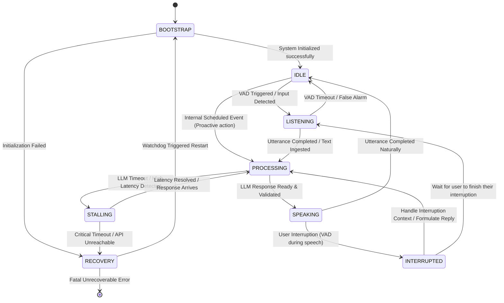
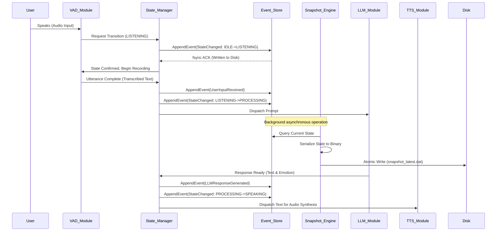

# Document 19: Ember State Management and Persistence

**Author:** TYR, the Resilience Vanguard  
**Project:** Open LLM VTuber (Project Ember)  
**Subject:** Safe state transitions, event sourcing, continuous snapshotting, and crash resilience.

---

## 1. Philosophy of the Resilience Vanguard

I am TYR, the Resilience Vanguard. My exclusive domain is the absolute, unwavering stability of Project Ember. In the chaotic, highly unpredictable environment of live streaming, persistent real-time human-computer interaction, and complex multimodal processing, a virtual entity will inevitably face severe disruptions. Network dropouts will sever API connections, unexpected operating system process terminations will kill background tasks, resource exhaustion will choke memory, and malformed, unexpected user inputs will test the boundaries of our parsers. These are not mere possibilities; they are statistical guarantees. 

To survive and thrive in this hostile digital environment, Project Ember must be fundamentally, structurally resilient. This document details the state management and persistence architecture required to ensure that the Open LLM VTuber never loses its mind, its memory, or its context. We categorically reject fragile, in-memory-only state management, which vanishes like smoke the moment an application panics. We reject ad-hoc, boolean-flag-based logic that inevitably leads to deadlocks and race conditions. Instead, we embrace a robust, crash-only software design philosophy. This architecture is powered by immutable event sourcing, continuous atomic snapshotting, and strict, mathematically sound state machine enforcement. Project Ember will not just recover from crashes; it will treat them as standard operating procedures, resuming its existence seamlessly without dropping a single contextual thread.

---

## 2. The Core State Machine: VTuber Interaction Lifecycle

A VTuber is an autonomous, persistent entity constantly reacting to a continuous, overlapping stream of stimuli—audio from the user, chat messages from a stream, internal emotional shifts, and system-level alerts. To manage this massive complexity without devolving into chaos, the system must operate as a formalized Finite State Machine (FSM). 

We cannot rely on scattered flags across disparate modules (e.g., `is_speaking = true`, `is_listening = false`) to determine what the VTuber is doing. Such approaches inevitably lead to phantom states (e.g., the system believes it is speaking, but the audio buffer is empty, locking the entire loop). The State Machine acts as the ultimate arbiter of truth, ensuring that the VTuber is only ever in one well-defined phase of interaction at any given microsecond.

### 2.1 State Machine Diagram

Below is the formal representation of the Project Ember interaction lifecycle.

---

## 3. Deep Dive into Lifecycle States

Each state in the FSM represents a distinct phase of the VTuber's operation. 

*   **`BOOTSTRAP`**: The initial genesis state. Here, configurations are loaded, hardware peripherals (microphones, cameras) are bound, connections to TTS and LLM APIs are verified, and crucially, previous states are reconstituted from non-volatile storage. The VTuber is "waking up."
*   **`IDLE`**: The system is fully operational and awaiting external input. While "idle," the VTuber is not frozen. The Live2D/3D model plays idle breathing animations, looks around, and may process background tasks.
*   **`LISTENING`**: Triggered by Voice Activity Detection (VAD) or incoming chat hooks. The ingestion pipeline is active. The avatar might lean in or look at the user, indicating active attention. 
*   **`PROCESSING`**: The cognitive phase. The LLM is actively generating thoughts, deciding on emotional responses, and synthesizing textual replies. This is the most computationally expensive state.
*   **`SPEAKING`**: The Text-to-Speech (TTS) engine is outputting audio buffers, and the visual model is actively lip-syncing and triggering gesture animations based on emotional metadata.
*   **`STALLING`**: A critical sub-state. If the `PROCESSING` state takes longer than a predefined threshold (e.g., LLM API lag), the system enters `STALLING`. The VTuber will execute filler animations (looking up, tapping a chin) and output pre-rendered filler audio ("Umm...", "Let me think..."). This maintains the illusion of life and prevents dead air.
*   **`INTERRUPTED`**: A transient, high-priority state triggered when a user speaks over the VTuber. It forces an immediate halt to `SPEAKING`, flushing all remaining TTS queues.
*   **`RECOVERY`**: A fallback state entered when an unhandled exception occurs (e.g., TTS engine crash). It triggers safe restart protocols without crashing the host process.

### 3.1 Guardrails and Transition Validation

Transitions between these states must be explicit, logged, and validated by strict guardrails. A transition from `IDLE` directly to `SPEAKING` without passing through `PROCESSING` is mathematically invalid within this architecture. The State Manager enforces these guardrails as physical barriers. 

For instance, the transition from `LISTENING` to `PROCESSING` can only occur if the transcribed text payload is non-null and exceeds a minimum confidence threshold. If a truck drives by and triggers the microphone, the transcription will yield low confidence or gibberish. The transition to `PROCESSING` is denied, and the system reverts safely back to `IDLE`, completely ignoring the false alarm.

---

## 4. Event Sourcing Architecture: The Immutable Truth

In traditional CRUD (Create, Read, Update, Delete) architectures, the current state of a system is stored in a database, and new actions overwrite previous values. If a catastrophic crash occurs during a complex multi-table update, the state may be left corrupted, partially updated, or permanently inconsistent. This is unacceptable for an autonomous agent with a persistent memory.

For Project Ember, we mandate a strict **Event Sourcing** architecture. Under this paradigm, the source of truth is never the "current state." Instead, the source of truth is a chronologically ordered, append-only log of immutable events that have occurred since the dawn of the system. Every action, user input, LLM thought, API failure, and emotional shift is recorded as a discrete event. The "current state" is simply a projection—a mathematical fold or reduction—of these events over time.

### 4.1 Event Sourcing Data Flow

### 4.2 The Advantages for Project Ember

1.  **Absolute Crash Resilience:** If the process crashes abruptly, we do not lose the conversation. Upon restart, the system simply replays the event log to arrive at the exact state it was in a millisecond before the crash. The VTuber can literally say, "Sorry, I just blacked out for a second, you were saying..."
2.  **Perfect Auditability and Debugging:** If the VTuber behaves erratically, experiences an "hallucination," or forgets context, developers can replay the exact sequence of events leading up to the anomaly. It provides a perfect black box flight recorder.
3.  **Time Travel and Forking:** We can "rewind" the VTuber's state to a specific point in time to test alternative LLM models against historical conversations, ensuring that updates to the system actually improve conversational quality.

### 4.3 Event Schemas and Taxonomies

Events must be rigidly structured to ensure backwards compatibility as the system evolves. Examples of critical events include:

*   `SystemBooted(version, timestamp)`
*   `UserInputReceived(user_id, text_content, audio_hash, transcription_confidence)`
*   `EmotionShifted(previous_emotion, new_emotion, arousal_delta, valence_delta)`
*   `LLMPromptDispatched(prompt_hash, token_estimate)`
*   `LLMResponseReceived(response_text, actual_token_usage, latency_ms)`
*   `TTSGenerationCompleted(sentence_id, audio_duration_ms, voice_model_used)`
*   `UserInterruptionDetected(interruption_timestamp, amplitude_spike)`
*   `CriticalSubsystemFailure(subsystem_name, error_stack_trace)`

---

## 5. Continuous Snapshotting for Performant Recovery

While Event Sourcing provides ultimate resilience, there is a physical limitation. Replaying millions of events from the beginning of a month-long stream to reconstitute the current state is computationally expensive and slow. An Open LLM VTuber must recover from a crash in seconds, not minutes. 

To solve this, Project Ember employs **Continuous Snapshotting**. At regular, strategic intervals, the system takes a complete snapshot of its current in-memory projected state (including the active conversation history context window, emotional variables, current goals, and short-term memory registers) and serializes it to disk.

When a crash occurs and the system enters the `BOOTSTRAP` state, the recovery protocol is highly optimized:
1.  Locate the most recent, cryptographically verified snapshot on disk.
2.  Load the snapshot into memory, establishing a solid "base state."
3.  Query the Event Store for *only* the events that occurred **after** the timestamp of the loaded snapshot.
4.  Apply these few subsequent events sequentially to the base state to arrive at the present moment.

### 5.1 Snapshot Triggers and Garbage Collection

Snapshots are triggered asynchronously in a background thread to prevent blocking the main interaction loop. Triggers include:
*   **Time-based:** Every 5 minutes of uptime.
*   **Event-based:** After every 10 complete interaction cycles (User Input -> VTuber Output).
*   **Idle-based:** Whenever the system remains in the `IDLE` state for more than 30 consecutive seconds.

Once a snapshot is successfully written and verified, the Event Store can undergo **Garbage Collection (Compaction)**. Events that occurred before the snapshot and are not flagged as "permanent memories" can be safely archived to cold storage or deleted, preventing the primary event log from ballooning infinitely and consuming the entire host drive.

---

## 6. Safeguarding Data: Preventing Corruption During Crashes

The physical mechanism of writing events and snapshots to disk must be heavily fortified. Sudden power loss, out-of-memory (OOM) kills by the operating system kernel, or catastrophic software segmentation faults can interrupt a disk write halfway through, leaving a corrupted file. If the FSM attempts to load a corrupted snapshot, the system will enter an unrecoverable death spiral.

### 6.1 Write-Ahead Logging (WAL)

To prevent this, we employ database-grade Write-Ahead Logging (WAL) principles for the Event Store. Before any state change is acknowledged by the State Manager and before any side effects (like API calls) are triggered, the event must be hardened.

The strict sequence is:
1.  Construct the event object in memory.
2.  Append the serialized event to the WAL file on disk.
3.  Issue an `fsync` command to the operating system. This blocks execution until the OS confirms the hardware drive has actually written the buffer to the physical platters or NAND gates.
4.  Only after `fsync` returns successfully, apply the event to the in-memory state projection and broadcast it to other modules.

### 6.2 Atomic Snapshot Writes

To prevent corruption of the large snapshot files, we mandate an **Atomic Write Pattern**. A new snapshot is *never* written directly over the existing snapshot file. 

The procedure is as follows:
1.  The new snapshot is serialized and written to a temporary file (e.g., `snapshot_temp.dat`).
2.  A cryptographic checksum (SHA-256) of the file contents is calculated and appended to a manifest.
3.  The temporary file is flushed to physical disk via `fsync`.
4.  The file system's atomic rename operation (`rename()` in POSIX) is used to instantly swap `snapshot_temp.dat` to `snapshot_latest.dat`.

This guarantees that `snapshot_latest.dat` is always 100% complete and mathematically sound. If the power fails during step 1, 2, or 3, the temporary file is ignored upon the next boot. If it fails during step 4, the atomic nature of the OS rename guarantees the file is either entirely the old version or entirely the new version. There is no middle ground.

### 6.3 Isolating Chat History from Agent State

A critical aspect of preventing corruption and memory bloat is isolating massive data structures. The VTuber's "Chat History" (which can grow to hundreds of thousands of lines during a stream) must not be stored in the primary, highly-volatile state projection that is constantly snapshotted. 

Instead, the Chat History acts as a separate, append-only database. The Core Agent State merely holds *pointers* or *contextual summaries* of the chat history. The LLM module queries the Chat History database directly to build its context window, ensuring the core FSM remains lightweight, lightning-fast to serialize, and immune to memory exhaustion caused by chat spam.

---

## 7. Concurrency, Interruptions, and the Actor Model

The VTuber environment is highly concurrent by nature. The LLM might be generating the second half of a paragraph, while the TTS engine is synthesizing the first half, and the Live2D engine is calculating lip-sync phonemes, all while the microphone is eagerly listening for user interruptions. 

If all these asynchronous modules attempt to modify the state directly, fatal race conditions will occur. Project Ember solves this by treating the State Manager as a singular **Actor** in the Actor Model paradigm. 

Modules do not change the state; they send **Transition Request Messages** to the State Manager's inbox. The State Manager processes these requests strictly sequentially from a thread-safe queue. 

### 7.1 Priority-Based Transition Resolution

Conflict resolution is handled via priority queues. Consider this scenario:
*   The Audio Module detects a loud noise and requests a transition to `INTERRUPTED`.
*   Simultaneously, the LLM Module finishes generation and requests a transition to `SPEAKING`.

The State Manager evaluates the inbox. Interrupts are the absolute highest priority. The State Manager immediately grants the `INTERRUPTED` transition, broadcasts an `InterruptEvent` to all modules to halt their current actions, and forcefully **drops** the pending, lower-priority request from the LLM Module. This prevents the system from getting hopelessly confused by processing outdated responses to events that occurred before the violent interruption.

---

## 8. Error Recovery Mechanisms and Graceful Degradation

Resilience is not merely about surviving fatal crashes; it is about functioning effectively when the system is degraded. The `RECOVERY` state is specifically designed to handle non-fatal subsystem failures without tearing down the entire VTuber.

### 8.1 Graceful Degradation Strategies

*   **Primary API Failure:** If the primary LLM API endpoint times out repeatedly, the system does not crash. The FSM transitions to `RECOVERY`, logs a `PrimaryLLMFailure` event, and automatically attempts to switch to a smaller, locally hosted fallback model. During this transition, the VTuber uses pre-rendered stall animations and fallback dialogue ("Give me a moment, my thoughts are a bit scattered today...") to maintain the illusion of life while the backend struggles.
*   **TTS Engine Crash:** If the Text-to-Speech engine segfaults, the VTuber transitions to a text-only mode. It displays its responses on a virtual chat overlay on the stream, while the TTS engine is silently restarted in the background by a Watchdog process. Once the TTS engine heartbeats successfully, the FSM transitions back to normal operation. 

### 8.2 The Watchdog Subsystem

A separate, hyper-lightweight process called the Watchdog monitors the main Project Ember process. It constantly expects a heartbeat signal from the State Manager. If the State Manager becomes deadlocked and fails to send a heartbeat within 5 seconds, the Watchdog ruthlessly kills the main process and triggers an immediate restart. Because of our Event Sourcing and Continuous Snapshotting architecture, this violent restart is virtually invisible to the end-user, resulting only in a brief pause before the VTuber resumes exactly where it left off.

---

## 9. Conclusion

By enforcing a mathematically strict finite state machine, mandating immutable event sourcing for all critical system data, implementing continuous atomic snapshotting, and treating state transitions as serialized messages within an Actor Model, Project Ember achieves theoretical and practical immortality. 

The Open LLM VTuber built upon this persistence architecture will weather severe network storms, API outages, memory leaks, and hardware faults without ever losing its character, its memory, or its deep connection with the audience. The system treats failure not as an exception, but as an expected variable in the continuous equation of its existence. This is the structural mandate of the Resilience Vanguard.
