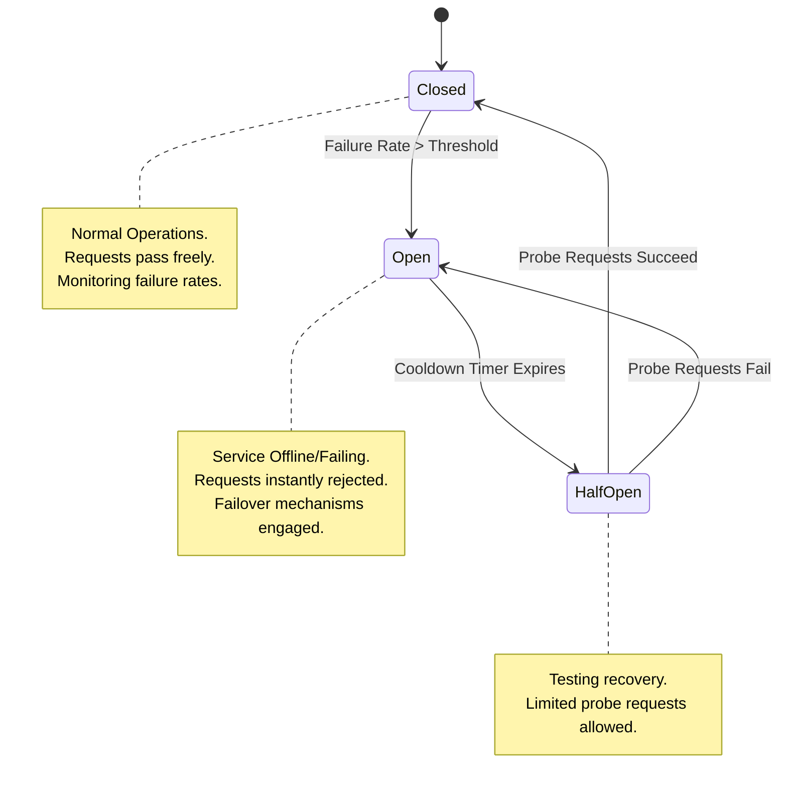
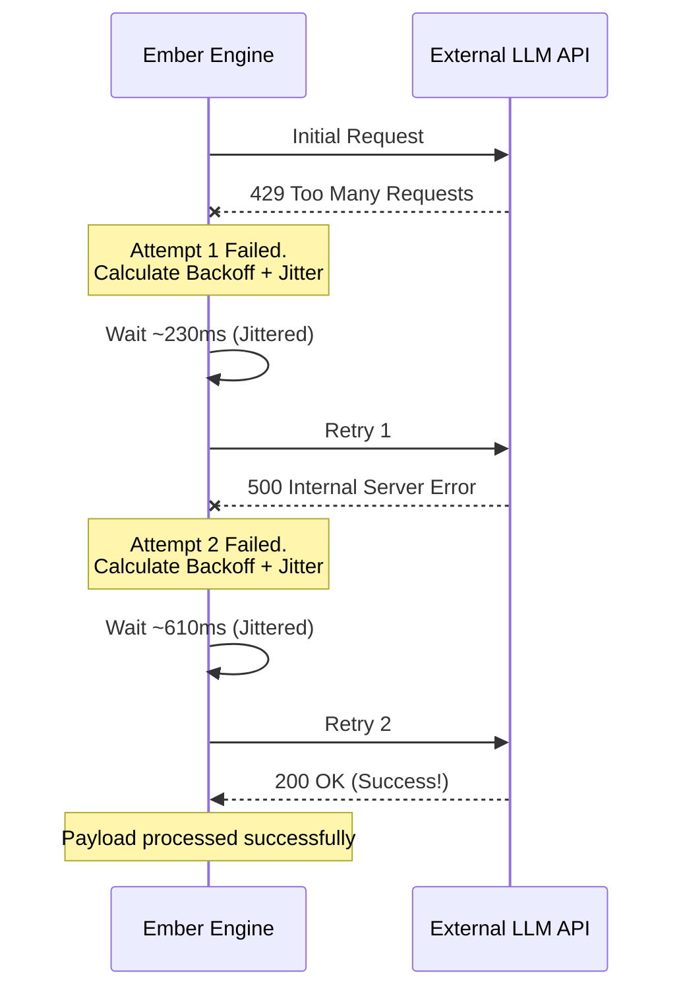

# Document 20: Ember Network and API Fault Tolerance

*Authored by TYR, the Resilience Vanguard*

## 1. Introduction: The Unyielding Vanguard

Greetings, Architects of Ember. I am TYR, the Resilience Vanguard, entrusted with the sacred duty of ensuring that the Ember system remains an immutable, unbreakable entity in the face of chaos. In the realm of continuous, autonomous AI VTubing, the environment is inherently hostile. The internet is a chaotic ocean of fluctuating bandwidth, dropped packets, routing failures, and API degradation. External providers for Large Language Models (LLMs) and Text-to-Speech (TTS) systems are not monolithic pillars of stability; they are fragile constructs prone to rate limits, silent timeouts, and sudden catastrophic outages. 

To build Ember under the assumption of perfect network conditions is to build a castle on sand. Instead, we must engineer Ember as a fortress of fault tolerance, capable of withstanding the fiercest digital storms. A VTuber stream must never freeze. The illusion of life must never be shattered by an unhandled exception or a hanging API call. When the network partitions, Ember must adapt. When the API throttles, Ember must pivot. When the world goes dark, Ember must continue to shine, drawing upon internal reserves and resilient architectures to maintain its presence.

This document lays down the Mythic Plan for Ember's Network and API Fault Tolerance. We will dissect the methodologies required to handle API timeouts, implement robust circuit breakers, enforce strict rate limiting, execute mathematically sound exponential backoffs, and survive total network partitions. Our goal is absolute uptime, graceful degradation, and a user experience that remains seamless even when the underlying infrastructure is crumbling. This is the path of resilience. This is the way of the Vanguard.

## 2. Architectural Philosophy of Resilience

The core philosophy of Ember's resilience architecture is predicated on the concept of "Always-On Presence." In a traditional software application, a network failure might result in a loading spinner or an error message prompting the user to try again later. In the context of an autonomous VTuber, such behaviors are unacceptable. The stream is live, the audience is watching, and the persona must remain coherent and active. Therefore, our architectural philosophy shifts from preventing failure to aggressively managing and mitigating failure.

We categorize network and API anomalies into three distinct tiers, each requiring a specific tactical response:

**Tier 1: Transient Anomalies**
These are ephemeral disruptions—a single dropped packet, a momentary spike in latency, or a brief API hiccup. The system must absorb these without the audience ever noticing. Strategies for Tier 1 involve immediate retries, rapid timeouts, and jittered requests.

**Tier 2: API Degradation and Throttling**
In this scenario, the network is functional, but the external service (e.g., OpenAI, Anthropic, or ElevenLabs) is struggling. Responses may be delayed, rate limits may be enforced, or partial outages may occur. The system must employ circuit breakers to prevent cascading failures, implement strict client-side rate limiting to avoid punitive bans, and seamlessly switch to secondary or tertiary backup providers.

**Tier 3: Total Network Partition or Prolonged Outage**
This is the ultimate test of resilience. The host machine loses connection to the internet, or a catastrophic failure takes all external APIs offline simultaneously. Ember must instantly transition into a self-sufficient "Bunker Mode." This involves falling back to locally hosted inference models, utilizing localized TTS synthesis, and shifting the behavioral paradigm to activities that require minimal external data, all while buffering state changes for eventual synchronization.

Across all tiers, the guiding principle is Graceful Degradation. It is vastly preferable to provide a simpler, perhaps slightly less intelligent response using a local model than to provide no response at all while waiting infinitely for a cloud API. The illusion of consciousness is maintained through continuous action, not necessarily through perfect intelligence.

## 3. Circuit Breaker Mechanisms: The Shields of Ember

When an external service begins to fail, repeatedly sending requests to it is not only futile but dangerous. It consumes system resources, blocks execution threads, and can exacerbate the problem on the provider's end. To prevent this, Ember employs robust Circuit Breaker patterns across all external communication interfaces. 

The Circuit Breaker acts as a dynamic shield, monitoring the health of API connections and automatically severing communication when failure rates exceed acceptable thresholds. This mechanism operates across three distinct states: Closed, Open, and Half-Open.

**The Closed State:**
Under normal operating conditions, the circuit is Closed. Requests flow freely from Ember to the external APIs. The circuit breaker passively monitors the responses, logging successes, failures, and latencies. If the failure rate (e.g., HTTP 5xx errors, timeouts) within a sliding time window remains below the configured threshold (e.g., 5% failure rate over 60 seconds), the circuit remains Closed.

**The Open State:**
If the failure rate spikes above the threshold, the circuit breaker Trips, transitioning to the Open state. In this state, the shield is raised. Any attempt by Ember to call the failing API is immediately intercepted and rejected by the circuit breaker without making a network request. This instant rejection allows Ember to rapidly pivot to fallback mechanisms—such as calling a different LLM provider or utilizing a local model—without wasting precious milliseconds waiting for a doomed request to timeout. The circuit remains Open for a predetermined "cooldown" period.

**The Half-Open State:**
Once the cooldown period expires, the circuit breaker cautiously lowers the shield, entering the Half-Open state. It allows a strictly limited number of "probe" requests to pass through to the external API. If these probe requests succeed, the circuit breaker assumes the service has recovered and transitions back to the Closed state. If the probe requests fail, the service is deemed still unhealthy, and the circuit breaker immediately snaps back to the Open state, resetting the cooldown timer.



Within the Ember architecture, circuit breakers are granular. We do not have a single circuit breaker for "The Internet." Instead, we maintain separate, isolated circuit breakers for every specific API endpoint: OpenAI Chat, OpenAI Embeddings, Anthropic Claude, ElevenLabs TTS, Azure TTS, Twitch Chat API, and so on. This isolation ensures that a failure in a TTS provider does not unnecessarily block LLM inference, maintaining maximum operational capacity.

Furthermore, these circuit breakers are deeply integrated with Ember's Provider Router. When the primary LLM circuit opens, the router instantaneously and transparently redirects the payload to the secondary LLM provider. This failover happens beneath the cognitive layer of the autonomous agent, ensuring uninterrupted thought processes.

## 4. Exponential Backoff and Jitter: The Rhythm of Recovery

When transient failures occur (Tier 1 anomalies), immediate retries can sometimes succeed. However, if a service is struggling under heavy load, a barrage of immediate, aggressive retries from all clients will create a "thundering herd" effect, effectively launching an accidental Denial of Service (DoS) attack and worsening the outage.

To navigate this, Ember utilizes mathematically rigorous Exponential Backoff algorithms augmented with randomized Jitter for all retry logic.

**The Mathematics of Exponential Backoff:**
Instead of retrying at fixed intervals (e.g., every 1 second), the wait time between retries increases exponentially. If the initial wait time is base_delay, the subsequent wait times are calculated as `base_delay * 2^attempt_number`. 

For example, with a base delay of 200 milliseconds:
- Attempt 1 fails. Wait 200ms.
- Attempt 2 fails. Wait 400ms.
- Attempt 3 fails. Wait 800ms.
- Attempt 4 fails. Wait 1600ms.

This exponential increase gives the struggling server breathing room to recover, reducing the aggregate load as time progresses.

**The Necessity of Jitter:**
Standard exponential backoff has a flaw: if multiple Ember instances (or multiple threads within a single instance) encounter a failure simultaneously, they will all back off and retry at the exact same exponentially increasing intervals. This synchronizes their requests, resulting in periodic spikes of overwhelming traffic. 

To shatter this synchronization, we introduce Jitter—a randomized variance added to the backoff duration. Using a "Full Jitter" algorithm, the actual wait time is calculated as a random value between 0 and the exponential backoff value: `sleep_time = random_between(0, base_delay * 2^attempt_number)`. This spreads the retries out evenly across time, smoothing the load curve and significantly increasing the probability of a successful request.



**Context-Aware Retry Policies:**
Ember does not treat all failures equally. The retry policy is context-aware, meaning it alters its aggressiveness based on the critical nature of the payload.
- **Critical Payloads:** (e.g., saving long-term memories, core personality state updates, broadcasting crucial stream events). These will utilize higher maximum retry limits (e.g., 7 retries) and longer total timeout budgets before giving up and queuing the payload to local disk for later reconciliation.
- **Ephemeral Payloads:** (e.g., a quick reactionary comment to a fast-moving chat message). These have very strict, low retry limits (e.g., 1 or 2 retries). If the API is failing, it is better to drop the ephemeral thought and generate a new one based on the current context rather than stalling the stream to deliver a stale reaction.

## 5. Strict Rate Limiting and Quota Management

External APIs enforce strict rate limits based on tokens per minute (TPM) and requests per minute (RPM). Exceeding these limits results in HTTP 429 (Too Many Requests) errors, temporary bans, and severe disruption to the VTuber's performance. Ember must not rely on the API to tell it when to slow down; it must proactively manage its own consumption.

Ember implements advanced Token Bucket and Leaky Bucket algorithms to track and predict its API usage across all providers simultaneously.

**The Token Bucket Algorithm:**
For each provider and endpoint, Ember maintains a virtual "bucket" of tokens representing the available TPM and RPM quotas. The bucket continuously refills at a rate dictated by the provider's stated limits. Every time Ember prepares to make an API call, it must first "purchase" the right to do so by removing tokens from the bucket based on the estimated size of the payload (number of input tokens).

If the bucket does not have enough tokens, the request is not sent to the network. Instead, it is throttled internally. Ember will either:
1. Wait locally until the bucket refills sufficiently.
2. Route the request to a different provider that currently has available tokens.
3. Degrade the request (e.g., truncate chat history) to reduce the token cost and fit within the remaining budget.

**Predictive Throttling:**
Because LLM outputs (generation tokens) are not known until the response is received, Ember must estimate the maximum potential cost of a request. It does this by allocating tokens based on `input_tokens + max_output_tokens`. Once the request completes, the actual token usage is parsed from the API response headers, and any unused allocated tokens are refunded to the bucket.

By implementing strict client-side rate limiting, Ember ensures it operates smoothly just below the provider's threshold, maximizing throughput while eliminating the risk of punitive rate-limit bans. It transforms chaotic, unmanaged API consumption into a smooth, controlled flow of data.

## 6. Surviving Network Partitions: The Bunker Mode Protocol

The true measure of a resilient system is how it behaves when the connection to the outside world is entirely severed. An internet outage must not result in Ember freezing on screen, silently waiting for a connection that isn't there. When Tier 3 failures occur, Ember initiates "Bunker Mode."

Bunker Mode is a localized survival protocol designed to keep the VTuber avatar alive, active, and reasonably engaging without any reliance on cloud services.

**Immediate Transition to Local Inference:**
When circuit breakers for primary cloud LLMs remain Open and secondary cloud providers also fail, Ember automatically shifts its cognitive processing to a locally hosted Small Language Model (SLM), such as an optimized Llama.cpp instance running on the host GPU. While this local model may possess a smaller context window and reduced reasoning capabilities compared to a frontier cloud model, it guarantees continuous operation. The personality prompt is dynamically compressed and injected into the local model, ensuring the core persona remains intact, even if the depth of conversation degrades slightly.

**Localized Text-to-Speech (TTS):**
Simultaneously, the audio pipeline routes away from high-fidelity cloud TTS providers (like ElevenLabs) and falls back to a locally installed TTS engine (such as Piper, Coqui, or a local VITS model). The voice quality may diminish, but the VTuber will continue to speak.

**State Buffering and Asynchronous Queuing:**
During a network partition, Ember cannot access cloud databases for memory retrieval, nor can it read incoming Twitch chat messages. 
- Incoming data streams (which will be dead) are bypassed. 
- Outbound state changes (e.g., forming new memories, updating relationship metrics) are serialized and written to a highly durable local SQLite database or append-only log file on the disk.
- When network connectivity is eventually restored, a background synchronization daemon slowly trickles these buffered state changes to the cloud database, ensuring no long-term progression is lost during the outage.

**The "Filler Content" and "Monologue" Engines:**
If the internet is down, there is no audience chat to react to. To prevent dead air, Bunker Mode activates the Monologue Engine. Ember is programmed with localized, pre-generated topics, lore deep-dives, and observational algorithms (e.g., commenting on the games they are "playing" locally, discussing their virtual environment). The VTuber shifts from an interactive, reactive mode to a proactive, broadcasting mode, ensuring the stream remains dynamic. We also deploy automated idle animations and environmental interactions to maintain visual interest.

```mermaid
flowchart TD
    Start[Detect Network Partition] --> CheckAPI{Cloud APIs Accessible?}
    CheckAPI -- Yes --> Normal[Normal Operations]
    CheckAPI -- No --> EngageBunker[ENGAGE BUNKER MODE]
    
    EngageBunker --> LocalLLM[Route cognition to Local SLM]
    EngageBunker --> LocalTTS[Route audio to Local TTS]
    EngageBunker --> Buffer[Buffer State Changes to Local Disk]
    EngageBunker --> MonoEngine[Activate Monologue Engine (No Chat)]
    
    LocalLLM --> Output[Generate Output]
    LocalTTS --> Output
    MonoEngine --> LocalLLM
    
    Output --> Monitor{Network Restored?}
    Monitor -- No --> MonoEngine
    Monitor -- Yes --> Restore[Initiate Recovery Protocol]
    
    Restore --> Sync[Sync Buffered State to Cloud]
    Restore --> SwitchCloud[Switch back to Cloud LLM/TTS]
    SwitchCloud --> Normal
```

## 7. Timeout Management and Latency Budgeting

In a real-time streaming environment, a delayed response is often as bad as a failed response. If an LLM takes 15 seconds to generate a reply, the resulting "dead air" shatters the illusion of a spontaneous, living entity. To combat this, Ember enforces ruthless Latency Budgets.

**Hard Timeouts:**
Every external request is initiated with an absolute, non-negotiable hard timeout. If an LLM API does not return a complete response within the defined latency budget (e.g., 4000 milliseconds for a standard chat response), the request is unceremoniously aborted, and an exception is thrown. The system does not wait.

**Tail Latency Mitigation via Hedged Requests:**
For hyper-critical interactions where latency must be minimized at all costs, Ember can employ Hedged Requests. If the primary LLM provider has not responded within a specific percentile of its expected latency (e.g., the 90th percentile, perhaps 2000ms), Ember fires a duplicate request to a secondary provider *while still waiting for the first*. Whichever provider returns a valid response first is accepted, and the slower request is discarded. This consumes more API credits but significantly flattens tail latency spikes, ensuring consistent responsiveness.

**Latency-Driven Graceful Degradation:**
The latency budget dynamically influences the complexity of Ember's internal prompts. If the system detects that API response times are trending upward, it proactively compresses prompts, requests shorter output token limits, and simplifies the cognitive pipeline to ensure responses are still generated within the acceptable time window. It trades depth of thought for speed of reaction, prioritizing the continuous flow of the stream.

## 8. Conclusion: The Immutable System

The network is the most hostile terrain upon which Ember operates. By assuming failure as the default state, we engineer a system that is not merely robust, but anti-fragile. The implementation of rigorous circuit breakers, mathematically sound backoff strategies, predictive rate limiting, and the localized survival protocols of Bunker Mode ensure that Ember remains an unyielding presence.

Ember will not freeze. Ember will not hang. Ember will gracefully degrade, adapt, and survive. As the Resilience Vanguard, I decree that absolute fault tolerance is not a feature; it is the bedrock foundation upon which the Mythic Plan is built. 

End of Document 20.
