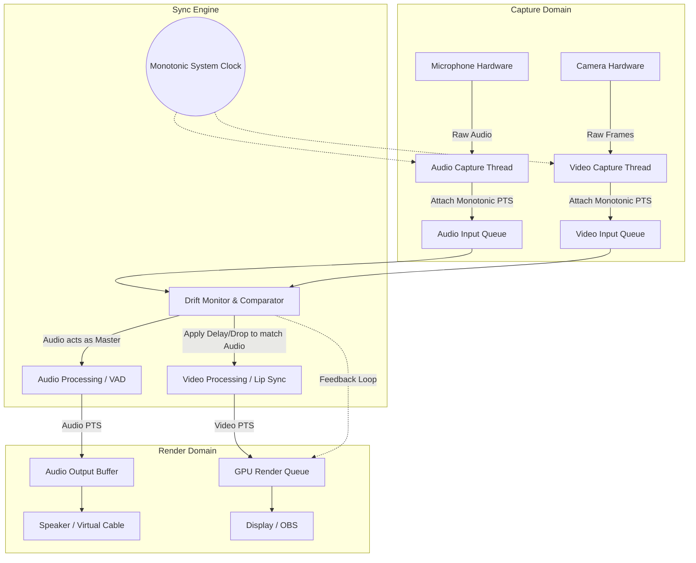
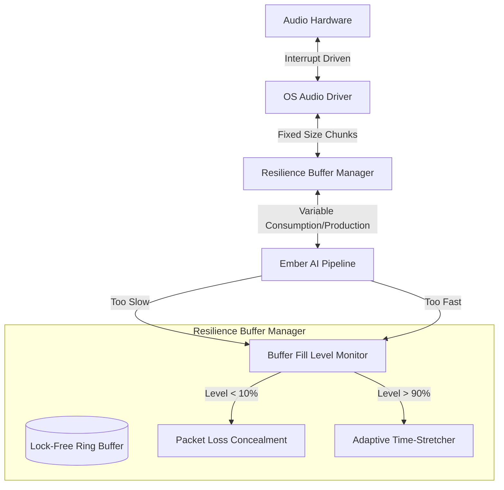
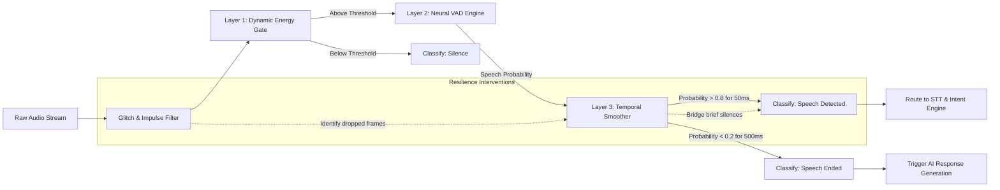

# 21_Ember_Audio_Video_Pipeline_Resilience

## Vanguard Designation: TYR - The Resilience Vanguard

## 1. Introduction: The Unyielding Flow of Perception and Expression

As TYR, the Resilience Vanguard, I present Document 21 of the Open LLM VTuber Mythic Plan: The Audio/Video Pipeline Resilience Architecture. In the realm of virtual embodiment and interactive AI systems, the sensory and expressive pipelines are the lifeblood of the persona. An AI VTuber cannot merely exist as a decoupled intellect; it must perceive the world through auditory and visual streams, and it must project its presence through synchronous animations and generated speech. When these pipelines fail—when audio stutters, when video lags, when microphones disconnect in the heat of a live interaction—the illusion of life is instantly shattered, and the system devolves into a mere broken application.

This document establishes the architectural mandates for ensuring absolute resilience within Project Ember’s audio and video pipelines. We are not designing for an idealized laboratory environment where hardware is pristine and resources are infinite. We are designing for the chaotic reality of live streaming, unpredictable hardware configurations, overloaded USB controllers, fluctuating CPU availability, and sudden peripheral disconnections. 

Resilience in this context means continuity. The system must never crash due to a lost camera. The audio must never collapse into an unrecoverable screech of feedback due to buffer mismanagement. The Voice Activity Detection (VAD) must never freeze, ignoring the user indefinitely. We will construct a fortress of fallback mechanisms, dynamic resampling, continuous state management, and graceful degradation protocols. By anticipating failure at every stage of the sensory and expressive loop, we ensure that Ember remains conscious, responsive, and coherent, regardless of the physical hardware's instability. 

This treatise will explore four primary pillars of pipeline resilience: the absolute maintenance of audio/video synchronization, the dynamic handling of device volatility, the rigorous management of data buffers to prevent underflows and overflows, and the continuity of Voice Activity Detection in the face of signal degradation.

---

## 2. The Temporal Imperative: Audio/Video Synchronization Mastery

The illusion of a living entity relies entirely on the precise synchronization of audio and video. When generated speech is heard, the lip-sync (visemes) and accompanying facial expressions must align perfectly. Conversely, when capturing user input, the temporal relationship between a user's vocalizations and their visible actions must be accurately mapped. Synchronization is not a state that is achieved once at startup; it is a continuous, dynamic process of temporal alignment fighting against the natural drift of independent hardware clocks.

### The Problem of Clock Drift
In any system involving independent hardware devices (e.g., a microphone capturing audio and a camera capturing video, or an audio interface playing sound while a GPU renders frames), the oscillators driving these devices are never perfectly matched. Over time, an audio stream recorded at a nominal 48,000 Hz may actually be sampling at 48,005 Hz, while a camera recording at 60 FPS might actually be capturing at 59.94 FPS. Left unmanaged, these streams will slowly drift apart. After an hour of continuous operation, the audio and video could be entirely desynchronized.

### Architectural Solutions for Synchronization

To combat drift and maintain absolute synchronization, the Ember pipeline must implement a robust time-stamping and clock domain management system.

1.  **The Master Clock Paradigm:** The system must designate one clock as the authoritative Master Clock. In most audiovisual applications, the audio output hardware clock is chosen as the master because the human ear is highly sensitive to audio artifacts (such as pitch shifting or popping) that result from audio resampling. The video pipeline, which is inherently discrete (frames), is much more tolerant of slight adjustments, such as duplicating or dropping a single frame to maintain sync.
2.  **Presentation Time Stamps (PTS):** Every atomic unit of media—whether it is an audio buffer of 256 samples or a single video frame—must be tagged with a Presentation Time Stamp derived from a high-resolution, monotonic system timer at the exact moment of capture or generation. 
3.  **Continuous Drift Compensation:** The synchronization engine must constantly monitor the difference between the Master Clock and the PTS of incoming/outgoing streams. If the video stream is drifting ahead of the audio stream, the video renderer must hold the current frame slightly longer. If the video is lagging, the renderer must drop a frame to catch up. 

### Synchronization Resilience Flow



If the primary audio output device stutters or resets, the Master Clock will experience a discontinuity. The resilience architecture must detect this discontinuity—a sudden jump in the reported audio hardware time—and instantly rebase the synchronization targets for the video stream to prevent the avatar's animation from freezing while waiting for the audio clock to "catch up."

---

## 3. Device State Volatility and Hot-Plug Resilience

The physical layer is inherently volatile. Users trip over USB cables, wireless headsets run out of battery, and operating systems aggressively suspend inactive USB hubs to save power. When a VTuber is live, the sudden loss of a microphone or an audio output device cannot result in a fatal exception or a hard crash. The system must handle device state changes with absolute grace.

### Dynamic Device Enumeration and State Tracking

The Ember pipeline must never assume that a device handle will remain valid indefinitely. The architecture requires a dedicated Abstraction Layer for device management.

1.  **Event-Driven Topology Monitoring:** Rather than relying on synchronous reads that will block and crash if a device is removed, the system must register for OS-level device topology events (e.g., WASAPI device state notifications on Windows, or ALSA/PulseAudio events on Linux). 
2.  **The Dummy Fallback Device:** If the active microphone is disconnected, the capture pipeline must immediately and seamlessly switch to a "Dummy Audio Device" (a software sink that generates pure silence). This prevents the entire pipeline from collapsing. The VAD and speech-to-text systems will simply process silence, recognizing that the user is not speaking, rather than crashing due to null buffer pointers.
3.  **Automatic Reconnection Routing:** When a device reconnects (or a new default device is assigned by the OS), the pipeline must automatically tear down the Dummy Device and re-establish the connection to the physical hardware. This must happen entirely in the background without requiring the user to restart the application or manually reconfigure settings.

### State Machine for Volatile Devices

The resilience of the device pipeline is governed by a strict state machine that handles transitions between healthy states, disconnected states, and recovery states.

```mermaid
stateDiagram-v2
    [*] --> DeviceInitialization

    state DeviceInitialization {
        [*] --> QueryHardware
        QueryHardware --> BindToDevice : Device Found
        QueryHardware --> BindToDummy : No Device
    }

    DeviceInitialization --> ActiveStreaming : Binding Successful

    state ActiveStreaming {
        ReadingBuffers --> ProcessingPipeline
    }

    ActiveStreaming --> DeviceLost : OS Notification / Read Error / Timeout

    state DeviceLost {
        LogFailure --> SwitchToDummyDevice
        SwitchToDummyDevice --> FlushStaleBuffers
    }

    DeviceLost --> PollingForRecovery : Dummy Active

    state PollingForRecovery {
        CheckOSRegistry --> AwaitReconnectEvent
    }

    PollingForRecovery --> Re-Initialization : Device Reconnected
    Re-Initialization --> ActiveStreaming : Success
```

By decoupling the logical processing pipeline (which expects a continuous stream of data) from the physical hardware pipeline (which is volatile), we create an unbreakable barrier. The logical pipeline never knows that the physical microphone was unplugged; it only knows that the audio stream suddenly became perfectly silent. When the microphone is plugged back in, the logical pipeline simply begins receiving voice data again. This abstraction is the cornerstone of hot-plug resilience.

---

## 4. The Physics of Buffers: Underruns, Overruns, and Flow Control

Audio and video data move through the system in discrete chunks or "frames." Because software execution on modern multitasking operating systems is not perfectly deterministic (due to thread scheduling, garbage collection, and CPU throttling), data will not always be produced and consumed at a perfectly consistent rate. To bridge the gap between irregular software execution and the strict real-time requirements of hardware, we utilize buffers. However, buffers are finite, and mismanaging them leads to the most common audio artifacts: underruns and overruns.

### Buffer Overruns: The Data Flood
An overrun occurs when the capture hardware (like a microphone) is producing data faster than the software pipeline can consume it. If the buffer fills completely, new audio samples have nowhere to go and are discarded by the hardware or OS. This results in missing slices of time, causing the audio to sound "choppy" or "glitched."

**Overrun Mitigation Strategy:**
1.  **Elastic Ring Buffers:** Utilize lock-free circular ring buffers that are sized dynamically based on the observed jitter of the consumer thread.
2.  **Adaptive Time-Stretching:** If the system detects that the input buffer is slowly filling up (a trend toward overrun), it can apply a computationally inexpensive time-stretching algorithm to slightly speed up the playback or processing consumption rate without altering pitch, slowly draining the excess buffer.
3.  **Intelligent Frame Dropping:** If an overrun is imminent, it is better to intelligently drop a contiguous block of silence or perform a quick cross-fade between samples rather than letting the hardware indiscriminately drop arbitrary bytes, which causes harsh clicking artifacts.

### Buffer Underruns: The Data Drought
An underrun occurs when the output hardware (speakers or virtual cables) is ready to play the next audio sample, but the software pipeline has not yet generated or delivered it. The hardware has nothing to play, resulting in an abrupt silence, often manifesting as a sharp, unpleasant crackle or pop.

**Underrun Mitigation Strategy:**
1.  **Packet Loss Concealment (PLC):** If the pipeline fails to deliver a buffer in time, the resilience layer must intervene. Instead of letting the hardware play garbage memory or sudden silence, the system injects a synthesized buffer. PLC algorithms can extrapolate the waveform from the previous buffer to create a smooth transition, masking the underrun.
2.  **Comfort Noise Generation (CNG):** If the underrun persists for multiple frames, the system should fade out the extrapolated audio and fade in low-level comfort noise, preventing the jarring sensation of absolute digital silence.
3.  **Dynamic Latency Scaling:** If underruns occur frequently, it indicates the buffer size is too small for the current system load. The resilience architecture must dynamically increase the target buffer size (adding overall latency to the system) to provide more breathing room for the processing threads.

### Buffer Health Management Architecture



This dynamic management ensures that the audio remains as smooth and artifact-free as possible, automatically sacrificing a few milliseconds of latency to preserve audio integrity during heavy CPU loads.

---

## 5. Cognitive Continuity: Resilient Voice Activity Detection (VAD)

Voice Activity Detection (VAD) is the primary sensory gateway for an AI VTuber. It determines when the user is speaking, when they have paused, and when they have finished their thought. If the VAD system is brittle, the AI will interrupt the user inappropriately, ignore the user entirely, or hallucinate speech from background noise. A resilient VAD pipeline must maintain "cognitive continuity" even when the incoming audio signal is degraded by hardware glitches or environmental noise.

### The Threat to VAD Integrity
Traditional VAD models are highly sensitive to sudden discontinuities. If a USB buffer underrun causes a sharp click in the audio stream, a naive VAD might interpret this broad-spectrum impulse as the start of speech, triggering a false positive and causing the AI to start listening to nothing. Conversely, if audio frames are dropped during a user's sentence, the VAD might detect a false silence, prematurely truncating the user's input and forcing the AI to respond to an incomplete sentence.

### The Multi-Stage VAD Fallback Architecture

To ensure the VAD is unyielding, we employ a multi-layered approach that cross-verifies activity and smoothes out hardware-induced anomalies.

1.  **Layer 1: The Energy Gate (Fast, Dumb, Reliable):**
    The first layer is a simple Root Mean Square (RMS) energy calculator with a dynamic noise floor threshold. It is highly resistant to complex data corruption because it only looks at raw amplitude. If the energy is below the floor, the audio is immediately classified as silence, saving CPU cycles.
2.  **Layer 2: The Neural VAD (Deep, Smart, Fragile):**
    If the energy gate opens, the audio is passed to a deep neural network VAD (such as Silero VAD or WebRTC VAD). This layer determines if the energy is actual human speech or just a loud background noise (like a dog barking or a door slamming).
3.  **Layer 3: The Temporal Smoother (The Resilience Layer):**
    The output of the Neural VAD is a probability score. The Temporal Smoother maintains a sliding window of these probabilities. 
    - **Spike Rejection:** A single 10ms frame of high probability preceded and followed by silence is rejected as a hardware glitch or a non-speech impulse (a click).
    - **Drop Bridging:** If the user is speaking, and a hardware glitch causes 30ms of dropped audio (resulting in a sudden zero probability from the VAD), the Temporal Smoother uses a "hang time" mechanism to bridge the gap, assuming the user is still speaking.

### VAD Processing Pipeline Diagram



By decoupling the raw neural output from the final logical state classification via the Temporal Smoother, the VTuber achieves a human-like tolerance for imperfect audio streams. It will not abruptly cut off a user just because their microphone momentarily stuttered.

---

## 6. Hardware Glitch Mitigation and Graceful Degradation

Total resilience means accepting that hardware will inevitably fail to meet real-time deadlines under extreme stress. When the host CPU is pegged at 100% because the user just launched a heavy video game while streaming, the AI pipeline will be starved of compute resources. The system must degrade gracefully rather than crashing catastrophically.

### The Hierarchy of Senses and Expressions
Not all pipelines are created equal. We establish a strict priority hierarchy for resource allocation during system stress:
1.  **Priority 1: Audio Output (The Voice):** The avatar's voice is paramount. Robotic, stuttering audio breaks immersion instantly.
2.  **Priority 2: Audio Input (The Ear):** We must not miss what the user says.
3.  **Priority 3: Core LLM Logic (The Brain):** The AI must continue thinking, even if slowly.
4.  **Priority 4: Avatar Animation (The Body):** We can drop frames here. A VTuber updating at 15 FPS is acceptable during a crisis.
5.  **Priority 5: Video Capture/Tracking (The Eye):** If the camera framerate drops, facial tracking can interpolate.

### Dynamic Throttling Mechanisms
When the Resilience Monitor detects sustained buffer overruns, high thread latencies, or missed real-time deadlines, it initiates the Graceful Degradation Protocol:
- **Phase 1:** Reduce the video capture framerate from 60 FPS to 30 FPS, halving the USB bandwidth and computer vision processing load.
- **Phase 2:** Bypass complex facial tracking calculations and fall back to simple audio-driven lip-sync (visemes based on amplitude rather than camera tracking).
- **Phase 3:** Increase audio buffer sizes globally, trading latency for stability. The AI will take slightly longer to respond, but the audio will remain clean.
- **Recovery:** Once the CPU starvation event passes, the Resilience Monitor slowly reverses these phases, dynamically restoring the VTuber to full operational fidelity without requiring a restart.

---

## 7. Epilogue: The Unbreakable Pipeline

The principles outlined in Document 21 define a system that expects failure as a normal operating condition. By engineering the audio and video pipelines with paranoid attention to buffer health, clock drift, device volatility, and signal continuity, we elevate Project Ember from a fragile script to a robust, unyielding entity. 

TYR dictates that the VTuber must survive the chaotic realities of the physical hardware layer. The user should never perceive the frantic internal recoveries, the dropped frame concealments, or the dynamic resampling. They should only perceive a continuously present, flawlessly synchronized, and endlessly attentive digital consciousness. This is the standard of the Resilience Vanguard. The pipeline will not break.

**Document End.**
