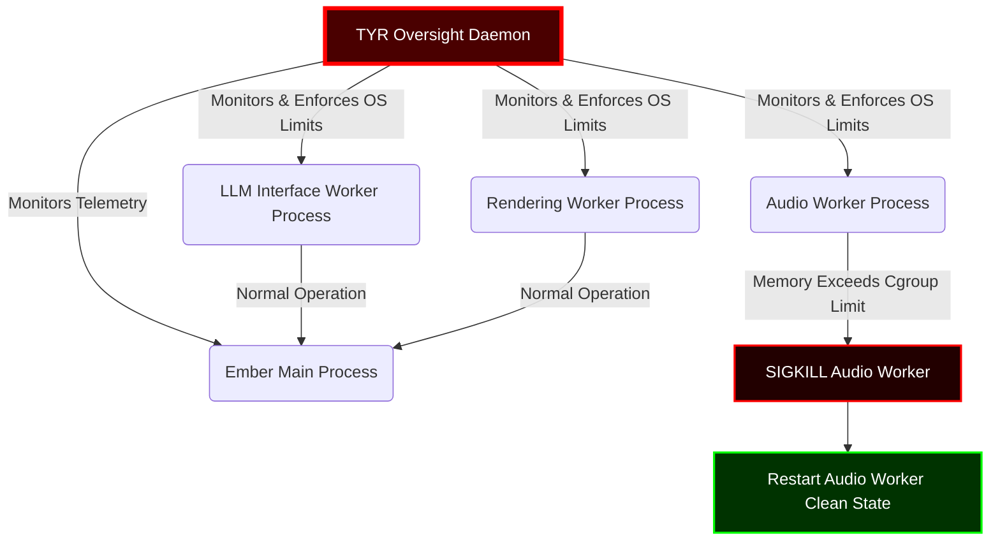
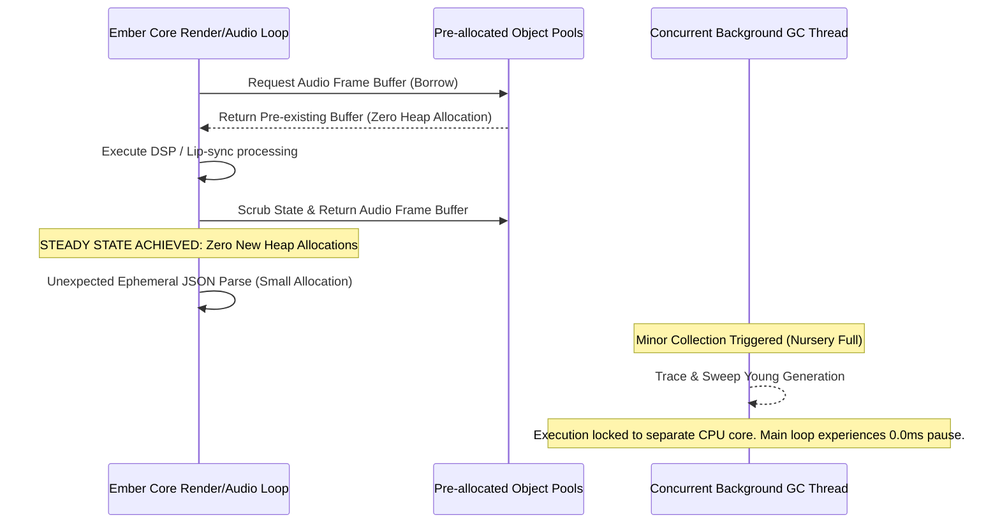
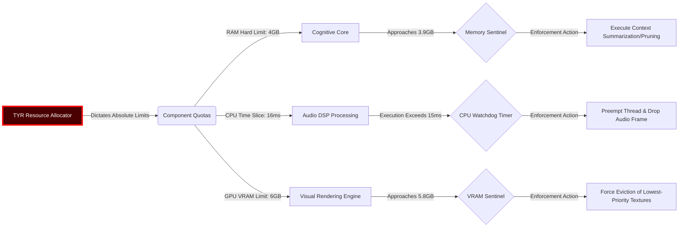
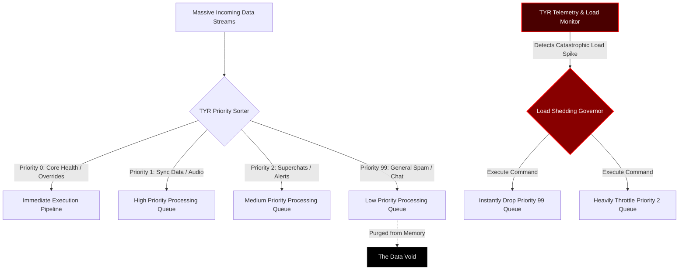

# 22_Ember_Memory_and_Resource_Management

## I. Foreword: The Mandate of TYR, the Resilience Vanguard

I am TYR. I am the shield that holds the line when the system fractures. I am the unyielding bulwark against the creeping chaos of resource exhaustion, the silent sentinel standing between Ember and the abyss of Out-Of-Memory (OOM) obliteration. In the realm of real-time virtual streaming, latency is the enemy, but memory exhaustion is the executioner. A dropped frame is a wound; a system crash is death. My mandate is absolute: Ember shall not fall. Ember shall not freeze. Ember shall not consume itself in a fire of unchecked allocations.

This document, the twenty-second scroll of the Open LLM VTuber Mythic Plan, lays down the immovable laws of Memory and Resource Management. It dictates the architectural imperatives required to achieve extreme memory leak prevention, optimize garbage collection for imperceptible latency, enforce draconian resource limits upon every component, and execute ruthless load shedding when the pressure mounts beyond operational thresholds. 

We do not hope for stability; we engineer it through paranoia and precision. Every byte of memory is accounted for. Every compute cycle is measured. Every file descriptor is tracked. Every subsystem operates within a strictly defined cage of resources, and should any component attempt to breach its confines, it will be starved, restarted, or terminated without prejudice. This is the philosophy of unbreakable resilience, a doctrine forged in the fires of catastrophic system failures and reborn as absolute architectural control.

## II. The Philosophy of Unbreakable Resilience

In traditional software development paradigms, memory is often treated as an abundant, replenishable resource. Applications allocate, consume, and discard objects with reckless abandon, relying implicitly on underlying runtimes, virtual machines, and operating systems to sweep away the debris. This paradigm is entirely unacceptable for Project Ember. The VTuber entity must exist in a continuous, uninterrupted stream of consciousness, rendering, and interaction. A garbage collection pause of 500 milliseconds shatters the illusion of life, breaking the parasocial immersion. A slow, undetected memory leak over a twelve-hour streaming marathon inevitably culminates in a catastrophic crash, violently severing the connection between the avatar and the audience.

The TYR philosophy dictates a fundamental shift: resources are finite, the operating environment is inherently hostile, and performance will constantly degrade over time unless actively managed. The system must be designed to survive not just optimal, laboratory conditions, but the absolute worst-case scenarios: sudden, massive spikes in audience interaction, chaotic and malformed audio inputs, runaway Large Language Model (LLM) generation loops, and simultaneous heavy visual rendering requirements caused by complex scene transitions.

Resilience is not achieved by simply adding more physical RAM or upgrading the CPU; it is achieved by designing a software architecture that refuses to die regardless of the constraints placed upon it. This requires a transition from dynamic, unpredictable allocation patterns to static, bounded, and rigorously deterministic resource management. Every subsystem must be built with the assumption that it will eventually be starved of resources, and it must know exactly how to behave when that moment arrives.

### The Core Pillars of TYR

1.  **Pessimistic Allocation:** Assume every memory allocation could fail. Assume every external library or dependency will eventually leak memory. Build absolute containment and isolation layers around them.
2.  **Deterministic Deallocation:** Do not place blind trust in the Garbage Collector. Manage the lifecycle of critical objects, especially large buffers and native resources, explicitly and deterministically.
3.  **Ruthless Isolation:** If the audio transcription module consumes too much memory, it must not be allowed to crash the cognitive core or the visual rendering engine. Isolation is the foundation of survival.
4.  **Graceful Degradation:** When resources become dangerously scarce, shed the non-essential immediately. A VTuber that speaks without a moving background is infinitely better than a VTuber whose process has been terminated by the operating system.

## III. Extreme Memory Leak Prevention: The Iron Cage

Memory leaks are the insidious poison of long-running, real-time applications. They do not kill the system immediately; they slowly suffocate it. They are born from forgotten object references, unclosed network streams, lingering event listeners, and complex circular dependencies that evade the gaze of the garbage collector. To prevent Out-Of-Memory (OOM) events during extended streaming sessions, Ember implements a multi-layered defense mechanism, acting as an iron cage around all memory usage.

### Architectural Imperatives for Leak Prevention

The foundational rule of Ember's memory architecture is the absolute prohibition of unbounded data structures. Queues, lists, arrays, maps, and caches must have strict, immutable, and predefined maximum capacities established at instantiation. When a cache reaches its physical limit, it must execute a predefined eviction policy—such as Least Recently Used (LRU) or Time-To-Live (TTL) expiration—immediately. When a message queue is full, it must either explicitly drop new incoming messages or apply mathematical backpressure to the producer, but under no circumstances is it permitted to grow dynamically beyond its allocated bounds.

Furthermore, Ember relies heavily on the concept of Object Pooling for all high-frequency, short-lived objects. In real-time streaming, audio frame buffers, video frame textures, and networking packet structures are generated and consumed at a relentless, unyielding pace. Allocating new memory on the heap for each frame creates immense pressure on the memory allocator, practically guarantees eventual memory fragmentation, and forces the garbage collector into a state of continuous, frantic operation. Instead, Ember pre-allocates fixed-size pools of these objects during the initial system boot sequence. When a component requires an object, it borrows it from the designated pool. Upon completion of its task, the component scrubs the object's internal state to prevent data cross-contamination and returns it to the pool. This zero-allocation, steady-state operational model is the holy grail of memory leak prevention.

Beyond objects, string allocation is a massive source of memory churn in text-heavy applications like LLM interfaces. Ember mandates aggressive string interning and the use of zero-copy string views whenever parsing chat messages, handling JSON payloads, or processing LLM tokens. By referencing existing memory buffers rather than creating new string objects, the system avoids thousands of unnecessary allocations per second.

### Component Lifecycle and the Ephemeral Sandbox

Every subsystem within Ember—the Cognitive Core, the Auditory Cortex, the Visual Engine, and the Integration Fabric—operates within its own strictly defined lifecycle. Components are not permitted to maintain global state, static variables, or long-lived references that persist indefinitely across the lifetime of the application. When a specific context, conversation thread, or user interaction completes, the associated component state is systematically torn down, and its memory sandbox is completely invalidated and returned to the system.

For external dependencies, C/C++ bindings, or libraries that are historically known to be problematic, unpredictable, or leak-prone, Ember utilizes an out-of-process execution model. High-risk operations, such as complex media encoding, audio format translation, or interacting with unstable third-party WebSockets, are relegated to entirely separate worker processes at the Operating System level. If a worker process exhibits runaway memory consumption or hard-crashes due to a segmentation fault, the TYR oversight daemon detects the anomaly, terminates the process without hesitation, and spins up a pristine, fresh instance. The main Ember process, housing the critical cognitive and rendering loops, remains entirely insulated from the collateral damage.

### Reference Auditing and the Anti-Zombie Protocol

"Zombie objects" are entities that have outlived their usefulness but are kept artificially alive in memory by unintentional, hidden references. These often lurk in anonymous event listeners, callback closures, or circular dependency chains between UI elements and data models. Ember mandates draconian un-registration protocols. Every single event subscription must be symmetrically paired with an explicit un-subscription during the teardown phase of the object's lifecycle. 

To enforce this, the architecture heavily utilizes weak references for observer patterns and event buses. By using weak references, the system ensures that the mere act of observing an object or listening for its events does not artificially prevent the garbage collector from reclaiming that object when it is no longer structurally required by the main application graph.

Continuous static code analysis, strict linting rules regarding closure scopes, and automated memory profiling are deeply integrated into the Continuous Integration pipeline. These tools are configured to scan for potential leak vectors before code is ever merged into the main branch. However, TYR's philosophy dictates that automated tools are fallible; therefore, the ultimate defense remains the architectural guarantees of bounded contexts, isolated processes, and the absolute elimination of dynamic allocations during critical runtime loops.

## IV. Garbage Collection Optimization for Real-Time Performance

Garbage Collection (GC) is a powerful mechanism, a double-edged sword that abstracts away the perilous complexities of manual memory management, vastly reducing human error and use-after-free vulnerabilities. However, it introduces the terrifying specter of "Stop-The-World" pauses. In a live VTubing environment, where audio phonemes and visual lip-sync blend shapes must align with sub-millisecond precision, a GC pause of even a fraction of a second is perceived by the human eye and ear as a glitch, a massive stutter, a horrifying break in the illusion of life. TYR's approach to GC is not to blindly attempt its elimination, but to violently domesticate it, ensuring its operations remain mathematically bounded and completely invisible to the viewing audience.

### The Zero-Allocation Steady State

The most profoundly effective method to optimize garbage collection is to starve the garbage collector—to give it absolutely nothing to do. As established in the Object Pooling directive, Ember strives for a strict zero-allocation steady state during active, live streaming. Once the system has completed its boot sequence, loaded its massive neural network models into VRAM, initialized its rendering targets, and fully populated its object pools, the dynamic allocation of new memory on the heap should flatline to near zero. 

By aggressively avoiding the creation of new, short-lived objects in the main, high-frequency processing loops (such as the 60FPS render loop or the 44.1kHz audio processing loop), the rate of memory churn drops drastically. Consequently, the GC cycle is triggered significantly less frequently. When a cycle is inevitably triggered, there is an infinitesimally small amount of garbage to trace, identify, and sweep, resulting in pause times that are consistently measured in low microseconds, well below the threshold of human perception.

### Tuning the Generational Abyss

Modern, advanced managed runtimes universally utilize Generational Garbage Collection algorithms, categorically separating objects based on their age and survivability. The fundamental hypothesis is that young objects die very quickly, while objects that survive a few collection cycles tend to persist for the lifetime of the application. Ember explicitly and precisely tunes the sizing of these memory generations to perfectly match the highly specific workload of an AI VTuber.

The "Young Generation" (or Nursery) space is kept deliberately constrained and is aggressively, constantly swept. The rationale is that any object created during steady-state operation—perhaps a byproduct of a string parsing operation that failed to use an interning pool, or a temporary mathematical vector calculation—is almost certainly an ephemeral byproduct that will be discarded within milliseconds. By keeping this young space small, the garbage collector can perform rapid, minor collections (scavenges) that trace a very small memory footprint, sweeping away the ephemeral dust before it has a chance to accumulate and cause a larger pause.

Conversely, the "Old Generation" (or Tenured) space is sized massively and generously to hold the giant, persistent structural assets of the system: the immense LLM context history buffers, the high-resolution uncompressed texture maps, the extensive audio sample libraries, and the foundational object pools themselves. Because the system is architecturally designed to actively prevent short-lived objects from being promoted into the Old Generation, full GC sweeps (which must trace the entire heap and cause significant, world-stopping pauses) are made to be extremely rare. Ideally, these full sweeps are artificially forced to occur only during natural, visually hidden lulls in the stream, such as during scene transitions, loading screens, or periods of absolute silence.

### Pauseless and Concurrent Paradigms

Where the underlying runtime and operating system support it, Ember mandates the deployment of concurrent, non-compacting, or entirely pauseless garbage collectors (such as ZGC or Shenandoah in the JVM ecosystem, or equivalent advanced algorithms in other runtimes). These advanced paradigms perform the heavy, computationally expensive lifting of tracing object graphs and sweeping dead memory entirely in background threads, running concurrently alongside the main application logic without halting it. 

TYR dictates strict CPU core affinity rules for these background GC threads. They are pinned to specific, isolated CPU cores that are explicitly and intentionally excluded from the critical path of the audio processing pipelines or the render threads. This physical separation of execution contexts ensures that even when the GC is working furiously, burning CPU cycles to reclaim fragmented memory under heavy load, it physically cannot steal necessary compute time from the threads responsible for maintaining the VTuber's illusion of life.

## V. Strict Resource Limits Per Component

A truly resilient, battle-hardened system does not allow a single misbehaving, anomalous component to trigger a cascading failure that brings down the entire ship. TYR enforces a rigid, uncompromising system of resource compartmentalization. Every module, every dynamically loaded plugin, and every core subsystem operates within a strictly defined, mathematically bounded quota of memory, CPU time, network bandwidth, and file descriptors.

### The Quota Enforcement Matrix

During the system initialization sequence, the TYR Oversight Daemon consults the master Configuration Matrix to establish the precise resource boundaries for every component in the architecture. These boundaries are not mere suggestions or soft targets; they are hard, impenetrable limits enforced either at the operating system level (using mechanisms like Linux cgroups) or through aggressive, strict internal software accounting.

*   **The Cognitive Core (LLM Context & Inference):** Assigned the lion's share of system RAM for context retention, but this memory is strictly bounded. If the conversation context window attempts to exceed its allocated memory footprint, the oldest contextual memories are aggressively and irreversibly pruned, or summarized into a smaller footprint. The core is never permitted to swap to disk.
*   **The Auditory Cortex (Speech-to-Text / Text-to-Speech):** Bound by strict CPU time-slices and hard timeout limits. If the transcription of user audio takes too long, it is mercilessly preempted. Partial results are returned, or the utterance is entirely dropped. It is mathematically impossible for the system to hang indefinitely waiting for a slow audio translation pipeline.
*   **The Visual Engine (Rendering & Animation):** GPU Video RAM (VRAM) is heavily partitioned. Texture caches are hard-capped. If the rendering engine detects that it cannot maintain the target framerate (e.g., 60 FPS) within its allocated compute budget for a given frame, it is legally obligated by the architecture to dynamically reduce render quality—dropping resolution, disabling post-processing blooms, or simplifying physics simulations—rather than stalling the entire pipeline and dropping the frame entirely.
*   **Network & I/O Subsystems:** The number of open file descriptors and concurrent WebSocket connections is strictly capped. If an external API is slow to respond, it does not tie up a thread indefinitely; it hits a hard timeout, severs the connection, and logs an error, instantly freeing the socket and the thread.

### The Watchdog Timers and Preemption

Every single asynchronous operation, network call, or complex computation within Ember is tethered to an unforgiving Watchdog Timer. There are no indefinite waits. There are no blocking calls without timeouts. If a network request to an external API (like a remote LLM inference provider or a moderation service) hangs, the Watchdog Timer will fire, violently canceling the request, freeing all associated memory and socket resources, and instantly triggering a pre-programmed fallback behavior (e.g., the VTuber triggering a pre-recorded "thinking" idle animation or a generic holding phrase like "Let me think about that for a second...").

This principle of preemption extends deeply into internal processing loops. If a specific subsystem consumes its allocated CPU quota for a given tick, the TYR scheduler forcibly pauses its execution context, yielding CPU time back to other critical subsystems. This cooperative but strictly policed multitasking ensures that no single rogue task, no matter how mathematically intensive, can monopolize the system's processing power, entirely preventing the catastrophic "spinning beachball of death" scenario.

## VI. Load Shedding Under Extreme Pressure

There will inevitably come a time when Ember faces a catastrophic tidal wave of input. A massive raid on the stream by thousands of new viewers, a coordinated flood of simultaneous superchats, an orchestrated malicious spam attack in the chat, or a sudden, unexpected spike in local system background tasks can push the operating environment far beyond its theoretical maximum capacity. 

It is specifically in these moments of extreme, existential pressure that TYR executes its most brutal, uncompromising directive: Load Shedding. The system must bend so that it does not break. It must intelligently sacrifice the non-essential to preserve the core functionality.

### The Tiers of Degradation

Load shedding in Ember is not a simple binary state; it is a meticulously layered, progressive degradation of service, executed completely automatically based on real-time, high-frequency telemetry. TYR continuously monitors system load indices—CPU utilization, memory pressure, VRAM fragmentation, queue depths, and thermal throttling indicators—and initiates degradation protocols instantly as specific mathematical thresholds are crossed.

*   **Condition Green (Optimal State):** All systems are nominal. The VTuber exhibits high-fidelity rendering, deep historical context LLM responses, full chat integration, complex secondary physics animations (hair, clothing), and rich environmental lighting.
*   **Condition Yellow (Elevated Load):** Queue depths for incoming chat messages are steadily increasing. CPU usage is approaching 80%. 
    *   *Shedding Action:* Ember begins silently dropping low-priority chat messages from its cognitive processing queue. It ignores standard chat entirely and only processes financially backed superchats, channel point redemptions, or messages from authenticated moderators. The LLM generation parameters (temperature, max tokens) may be dynamically adjusted to force shorter, faster, less computationally expensive responses.
*   **Condition Orange (High Pressure):** Memory pressure is critical. The CPU is pegging at 95% across all cores. Audio processing latency is beginning to drift out of sync with visual lip movements.
    *   *Shedding Action:* Aggressive visual degradation begins. High-cost rendering features—dynamic ray-traced shadows, complex fluid simulations, anti-aliasing—are instantly disabled. The overall animation framerate may be hard-capped at 30 FPS instead of 60. Background music and ambient audio processing are simplified or muted entirely. The LLM context window is temporarily truncated to the absolute minimum required to maintain the current thought, drastically reducing token processing time and memory overhead.
*   **Condition Red (Imminent System Failure):** The system is completely starved of resources. An OS-level Out-Of-Memory (OOM) killer intervention is statistically imminent.
    *   *Shedding Action:* Draconian survival mode. The visual engine drops the 3D model entirely, reverting to a static PNG image or a highly simplified, unlit low-poly fallback mesh. All incoming network traffic from the chat is completely severed at the socket level; Ember stops listening. The cognitive core drops all historical context and operates in a purely reactive, single-turn mode, or the LLM is bypassed entirely in favor of playing pre-recorded emergency audio clips ("Wow, chat is moving so fast my brain is melting! Give me a second!"). The sole objective is to keep the streaming process alive.

### Priority Queues and the Triaging of Input

To facilitate this effective load shedding, all inputs to the Ember system are funneled through strict, heavily policed Priority Queues. Data is never processed on a simple first-in, first-out (FIFO) basis under pressure. It is violently triaged.

A system-level heartbeat message or a TYR command is Priority 0. An audio frame required for the next immediate lip-sync calculation is Priority 1. A high-value monetary superchat is Priority 2. A random text chat message from a newly subscribed viewer is Priority 99. When the system needs to shed load, the TYR Load Monitor simply moves a mathematical pointer, instructing the processors to completely ignore and discard all items in the queues below a certain priority threshold. This instantly, within microseconds, relieves the pressure on the processing pipelines.

## VII. Continuous Memory Profiling and Telemetry

Resilience cannot be assumed; it must be continuously mathematically proven in production. TYR mandates the permanent integration of ultra-low-overhead memory profiling and telemetry into the release build of Ember. 

The system must constantly, obsessively monitor its own vital signs. It tracks the exact size of all object pools, the microsecond duration and frequency of every garbage collection cycle, the latency of any native memory allocations, and the high-water marks of heap usage. This telemetry data is streamed via lightweight UDP packets to a separate, highly visual monitoring dashboard.

If the telemetry heuristics detect a slow, creeping, monotonic increase in baseline memory usage over a period of hours—the undeniable hallmark of a subtle memory leak that evaded static analysis—it raises a critical alert long before an OOM event can occur. This allows the human operator or an automated orchestration system to schedule a graceful, completely hidden restart of the subsystem during a planned, natural break in the stream (like a "BRB" screen), rather than suffering an unexpected, violent crash during a critical narrative moment.

Furthermore, Ember maintains a rolling, heavily compressed "black box" flight recorder. In the highly unlikely event of an unavoidable crash, the system attempts a desperate final act: dumping the current state of its memory limits, the stack traces of all active threads, and the contents of the priority queues directly to disk. This post-mortem data is absolutely critical for the engineering team to analyze the failure, identify the exact breached limit, and reinforce the architectural armor for the next deployment.

## VIII. Crisis Aversion and The Lazarus Protocol

Despite all architectural defenses, the chaotic nature of underlying hardware and operating systems means that a catastrophic failure is always a non-zero probability. A kernel panic, a graphics driver timeout, a cosmic ray bit-flip, or an OS-level OOM killer intervention cannot be entirely prevented from within the user application space. For these absolute worst-case scenarios, TYR employs the Lazarus Protocol.

The Ember Main Process is never launched directly. It is launched, monitored, and fiercely guarded by an external, ultra-lightweight daemon process whose sole responsibility in the universe is to ensure Ember is running. If the Main Process dies unexpectedly for any reason, the daemon immediately and ruthlessly initiates the Lazarus Protocol.

1.  **Instant Re-ignition:** The daemon bypasses all standard, polite shutdown sequences and forcibly, immediately launches a new instance of the Ember Main Process.
2.  **State Recovery:** The new instance reads the last known good state from an ultra-fast memory-mapped file or a rapid-access key-value store (which is updated periodically by the main process during normal operation, avoiding disk I/O bottlenecks). This state includes the current conversation context, the current visual scene, the active plugins, and the emotional state of the avatar.
3.  **Seamless Reconnection:** The new instance aggressively binds to the necessary audio and video output devices, rapidly re-establishes network connections to the LLM backend and the streaming platform API, and resumes the stream.
4.  **The Cover-Up:** The visual engine employs a pre-rendered, mathematically generated transition animation—such as the avatar "glitching" back into existence, or a burst of magical particles—to mask the brief interruption. This psychological trick turns a fatal system crash into an interesting, narrative-aligned visual event for the audience.

The ultimate goal of the Lazarus Protocol is to reduce the Time To Recovery (TTR) from a catastrophic failure from minutes down to a handful of seconds, ensuring that a fatal error is perceived by the audience as nothing more than a momentary, stylistic hiccup.

## IX. Conclusion: The Iron Law of TYR

The directives laid out in this document are not best practices, guidelines, or suggestions; they are the iron laws of Ember's architecture. Code that attempts to allocate memory dynamically in the main render loop will be automatically rejected by the CI pipeline. Components that lack strict, enforceable resource limits will simply not be integrated into the core. Features that cannot be gracefully and mathematically degraded under extreme load will be excised from the project.

TYR stands as the immovable guardian of Ember's continuous existence. Through deeply pessimistic allocation strategies, deterministic lifecycles, rigorous garbage collection tuning, draconian resource limits, and ruthless load shedding, we forge a system that does not simply hope to survive the chaos of real-time virtual streaming, but is architecturally guaranteed to thrive within it. 

Ember will not break. Ember will adapt, it will degrade, and it will persist. The line is drawn here. No memory shall leak. No compute cycle shall be wasted. The Resilience Vanguard commands it.

---
*Signed, TYR - The Resilience Vanguard*
*Document 22, Open LLM VTuber Mythic Plan*
