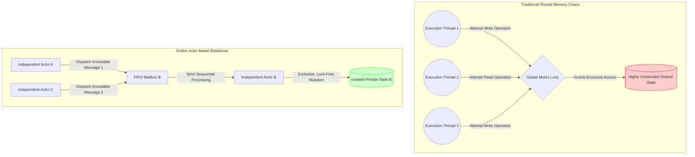
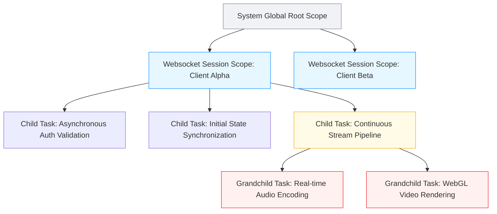
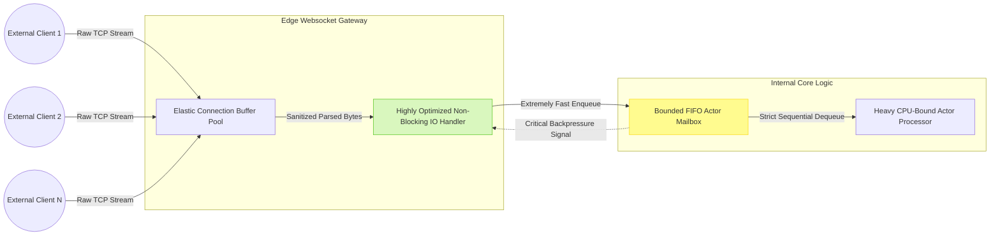

# Document 23: Ember Concurrency and Race Condition Prevention
## Prepared by TYR, the Resilience Vanguard

### 1. Introduction: The Imperative of Concurrency in Ember

In the architecture of modern, high-performance distributed systems, concurrency is not merely an optimization; it is a fundamental, inescapable necessity. For Project Ember, the Open LLM VTuber platform, the demands placed upon the system are staggering and multi-faceted. The platform must simultaneously ingest high-frequency websocket event streams from thousands of potential observers, orchestrate complex, multi-modal Large Language Model inference pipelines that require significant computational resources, synthesize real-time audio and video streams with precise lip-syncing, and manage complex, evolving internal state—all within strict sub-millisecond latency boundaries to preserve the fragile illusion of a living, breathing virtual entity. As TYR, the Resilience Vanguard, my explicit mandate is to ensure that this monumental complexity does not degrade into unpredictable chaos.

The chaos I speak of manifests in the subtle, devastating, and notoriously difficult-to-reproduce bugs of unmanaged concurrency: race conditions that silently corrupt internal state over time, deadlocks that freeze the application into permanent paralysis requiring hard reboots, and non-deterministic execution paths that render local debugging efforts entirely futile. These failure modes are simply unacceptable for a system of Ember's caliber. Absolute thread safety is not a lofty goal to strive for; it is the absolute baseline requirement from which all other features must be built. This document outlines the rigorous, mathematical, and unyielding strategies required to manage concurrency within Ember, deliberately shifting the paradigm away from ad-hoc lock management and towards structured, deterministic certainty.

We categorically reject the traditional reliance on primitive constructs such as mutexes, spinlocks, and shared-memory synchronization primitives for application-level business logic. These constructs, while demonstrably powerful at the lowest system and kernel levels, are inherently fragile, error-prone, and unscalable when composed into massive, asynchronous, high-level workflows. Instead, Ember will unconditionally embrace the Asynchronous Actor Model, strict unidirectional message passing, and the paradigm of Structured Concurrency. By adopting these paradigms from the ground up, we architect a system where race conditions are physically eradicated by design, deadlocks become structurally impossible to express, and execution remains flawlessly deterministic even under overwhelmingly chaotic load spikes.

### 2. The Asynchronous Actor Model Paradigm

The undisputed foundation of Ember's concurrent resilience is the Asynchronous Actor Model. In a traditional, legacy shared-memory model, multiple threads of execution attempt to read and mutate the exact same data structures residing in the heap simultaneously. To prevent instantaneous data corruption, developers are forced to arbitrarily sprinkle locks across the codebase, creating critical sections. This approach is intrinsically and fatally flawed. It couples execution threads directly to shared data, inevitably leading to intense lock contention, priority inversion, thread starvation, and catastrophic, unresolvable deadlocks. Furthermore, effectively reasoning about the state of a massive lock-based system requires a human developer to hold the entire, dynamic lock hierarchy in their mind—a biologically impossible task for complex applications.

The Actor Model systematically dismantles this archaic paradigm. In the Ember architecture, an "Actor" represents the fundamental, atomic unit of stateful computation. An Actor rigidly encapsulates three distinct elements: its internal, private state; its behavior (the logic governing how it reacts to specific inputs); and a mailbox (a strictly first-in, first-out buffer of incoming messages). Crucially, the internal state of an Actor is absolutely private and isolated. It cannot, under any circumstances, be read, inspected, or mutated by any other entity, thread, or Actor in the system.

Communication and coordination between Actors occur exclusively through asynchronous, one-way message passing. When Actor A wishes to influence the state of Actor B, or request information from it, it does not attempt to acquire a lock on B's memory space. Instead, Actor A constructs an immutable message and dispatches it to Actor B's mailbox. Actor B, running entirely on its own scheduling loop, processes the messages in its mailbox sequentially, strictly one at a time. Because an Actor only ever processes a single message concurrently, its internal state transitions are inherently and automatically serialized. There is absolutely no need for locks, mutexes, or atomic variables within the business logic of an Actor, because there is practically no concurrent access to its state.

This profound decoupling of state from shared, highly contested execution threads is revolutionary for systemic stability. It creates isolated, mathematically sound islands of sequential logic floating within a vast sea of massive concurrency. If a specific Actor encounters an unhandled exception and crashes, its failure is perfectly contained within its boundary; it does not leave shared memory in a corrupted, half-written state, nor does it abandon acquired locks that would permanently stall the rest of the system.

### 3. Eradicating Race Conditions through Design

A race condition is formally defined as an anomaly that occurs when the observable behavior of a system heavily depends on the relative timing of events or threads, and that timing is strictly outside the system's explicit control. In the context of a live, interactive VTuber application, a race condition might humiliatingly manifest as a chat message being permanently attributed to the wrong user, a crucial emotional animation playing out of sequence and breaking immersion, or an interaction state becoming irreparably desynchronized from the client. To eradicate race conditions entirely, Ember enforces a strict, uncompromising design philosophy centered entirely on data immutability and mathematically serialized state transitions.

The first, unbreakable pillar of this philosophy is the absolute immutability of all data structures passed between Actors. When an event is ingested from a websocket or an external API, it is instantly parsed into a deeply immutable payload. If an Actor processing this payload needs to conceptually modify this data before passing it along to the next stage in the pipeline, it must create a completely new copy of the data structure containing the updated values. Because messages are strictly immutable, multiple downstream Actors can read the exact same message concurrently without any conceivable risk of interference, partial updates, or "dirty reads." The potential memory footprint explosion of this approach is gracefully mitigated by modern, highly optimized garbage collection algorithms and functional structural sharing techniques under the hood.

The second pillar is the absolute serialization of state transitions within the rigid boundary of the Actor. As previously established, an Actor processes incoming messages strictly one at a time. This foundational rule guarantees that state mutations occur in a strictly ordered, highly predictable, and easily verifiable sequence. However, we must also meticulously account for distributed race conditions—complex situations where messages arrive completely out of order due to network latency fluctuations, retry mechanisms, or complex routing paths across distributed nodes.

To handle out-of-order delivery gracefully without introducing race conditions, Ember heavily utilizes logical causal links and monotonic sequence numbers. Every single message flowing through the Ember system carries embedded metadata explicitly indicating its causal history and lineage. If Actor B receives a message indicating that Event Y has occurred, but the causal metadata explicitly reveals that Event Y depends fundamentally on Event X (which, due to network jitter, has not yet arrived), Actor B will fiercely refuse to process Event Y immediately. Instead, it will safely buffer Event Y in a staging area until the prerequisite Event X is successfully received and processed. This complex orchestration guarantees causal consistency across the entire distributed architecture, ensuring that the system's state evolves logically and correctly regardless of the physical, chaotic delivery time of underlying network packets.

Furthermore, all state-mutating operations exposed by Actors are designed to be strictly idempotent whenever logically possible. Idempotency is a mathematical property ensuring that applying the exact same operation multiple times yields the exact same final result as applying it only once. If a network retry mechanism, a client disconnect, or a timeout causes a specific message to be delivered to an Actor twice, the inherently idempotent nature of the receiving Actor guarantees that the internal system state remains perfectly consistent, completely and elegantly bypassing a vast, dangerous class of potential race condition vulnerabilities.

### 4. Preventing Deadlocks in Message Passing Networks

While the pure Actor Model successfully eliminates the classical deadlocks associated with traditional mutexes (the classic scenario where Thread A selfishly holds Lock 1 and waits indefinitely for Lock 2, while Thread B stubbornly holds Lock 2 and waits indefinitely for Lock 1), it introduces a new, equally dangerous class of deadlock: the asynchronous message deadlock. This insidious failure mode occurs when a cycle of unresolvable dependencies forms dynamically within the message-passing network itself. For example, Actor A sends an urgent request to Actor B and blocks its own progress waiting for a reply. Actor B, in order to fulfill this complex request, sends a sub-request to Actor C. Actor C, needing crucial contextual information to proceed, sends a request back to Actor A. All three Actors are now permanently waiting for each other, resulting in total system starvation and requiring manual intervention.

To prevent this catastrophic failure mode from ever occurring, Ember enforces strict, draconian architectural constraints on the holistic message flow. The primary, unyielding constraint is the strict enforcement of a Directed Acyclic Graph (DAG) topology for all synchronous-style request-reply interactions across the system. The system architecture is rigidly layered into tiers, and requests are only permitted to flow "downward" through these layers. An Actor operating in Layer 2 may freely request data from Layer 3, but an Actor located in Layer 3 is strictly, architecturally forbidden from requesting data from Layer 2. This mathematical topological sorting guarantees, by proof, that circular dependencies cannot physically form in the request chain.

However, pure, restrictive unidirectional flow is not always practically sufficient for complex orchestration. For long-running, heavily asynchronous processes where a response is eventually required (such as waiting for an LLM to generate a paragraph of text), Ember aggressively mandates the use of the "Tell, Don't Ask" principle. Instead of sending a blocking request and halting to wait for a reply, an Actor simply sends a one-way message ("Tell") instructing the target to begin work, and immediately returns to eagerly processing its own mailbox. The outgoing message crucially includes a specific "Reply-To" routing address. When the target Actor eventually completes the arduous task, it constructs a completely separate, new message and routes it back to the designated Reply-To address. Because the originating Actor never blocked its thread of execution, it remains highly responsive to other incoming messages and system events.

Furthermore, absolute resilience requires that the system fundamentally assumes constant failure. Every single operation that waits for a future event or a network response must be governed by a strict, non-negotiable timeout. If a reply is not successfully received within the designated timeframe, the operation forcefully fails fast, instantly releasing all associated resources and triggering a sophisticated circuit breaker mechanism. Circuit breakers are essential; they prevent catastrophic cascading failures by temporarily halting message transmission to struggling or failing subsystems, allowing them vital time to recover rather than mercilessly drowning them in an escalating flood of further requests.

```mermaid
graph TD
    subgraph Asynchronous Deadlock Scenario
        ActorA_Dead[Actor A: Waiting]
        ActorB_Dead[Actor B: Waiting]
        ActorC_Dead[Actor C: Waiting]
        
        ActorA_Dead -->|Blocking Request| ActorB_Dead
        ActorB_Dead -->|Blocking Request| ActorC_Dead
        ActorC_Dead -->|Blocking Request| ActorA_Dead
        
        style ActorA_Dead fill:#ffcccc,stroke:#ff0000,stroke-width:2px
        style ActorB_Dead fill:#ffcccc,stroke:#ff0000,stroke-width:2px
        style ActorC_Dead fill:#ffcccc,stroke:#ff0000,stroke-width:2px
    end

    subgraph Ember DAG Message Flow
        Layer1[Layer 1: Edge Websocket Gateway]
        Layer2[Layer 2: Core Orchestration Engine]
        Layer3[Layer 3: Heavy Inference & Rendering]
        
        Layer1 -->|Tell: Ingest User Input| Layer2
        Layer2 -->|Tell: Initiate Generation| Layer3
        
        Layer3 -.->|Asynchronous Callback: Generation Complete| Layer2
        Layer2 -.->|Asynchronous Callback: Push to Client| Layer1
        
        style Layer1 fill:#e6f7ff,stroke:#1890ff
        style Layer2 fill:#e6f7ff,stroke:#1890ff
        style Layer3 fill:#e6f7ff,stroke:#1890ff
    end
```

### 5. Structured Concurrency and Task Lifecycles

In many contemporary concurrent systems, lightweight tasks are recklessly launched into the background as untracked "fire-and-forget" operations. This undisciplined approach inevitably leads to the dangerous phenomenon of orphan tasks or dangling futures: background operations that selfishly continue to consume memory, hold network sockets, and burn CPU cycles long after the main system has moved on, or worse, long after the parent operation that spawned them has failed, timed out, or been explicitly canceled by the user. This unstructured, chaotic concurrency makes graceful application shutdown mathematically impossible and leads to insidious, difficult-to-trace resource leaks that degrade performance over time.

Ember unequivocally mandates the rigorous paradigm of Structured Concurrency. Under strict structured concurrency, the lifecycle of every single concurrent task, no matter how small, is strictly bound to a well-defined, observable scope. Tasks are meticulously organized into rigorous, unyielding parent-child hierarchies. When a parent task is dynamically created (for instance, to handle a specific incoming user's session), any background operations required by that session (such as asynchronously fetching historical context from a database, or pre-warming a specific voice model) are safely spawned as tightly bound child tasks strictly within that session's explicit scope.

The defining, unbreakable rule of structured concurrency is that a parent scope cannot possibly exit, return, or complete until all of its spawned child tasks have definitively completed their work (either successfully or through failure). If the parent scope finishes its primary sequential logic early, it will implicitly and safely suspend, waiting for its children to finish before dissolving the scope. More importantly, this strict hierarchy enables flawless, instantaneous cancellation propagation. If the user unexpectedly disconnects from the websocket, the parent session scope is immediately flagged for cancellation. This cancellation signal is automatically, instantly, and reliably propagated down the hierarchical tree to every single active child task. The child tasks receive the cancellation signal, immediately halt their work, gracefully clean up their allocated resources, and terminate. There are no orphans left behind. There are no dangling processes consuming resources. The system remains pristine.

This structured approach is absolutely vital for robust error escalation. If a background child task fails critically due to an unexpected exception, it does not die silently in the dark, logging a message that no one will see. The failure is forcefully and automatically propagated up the tree to the parent scope. The parent can then make a deliberate, programmatic, and context-aware decision: should it transparently retry the failed child task? Should it gracefully cancel the remaining healthy sibling tasks and intentionally abort the entire session, notifying the user? Or should it log the error securely and continue execution in a deliberately degraded, fallback state? Structured concurrency transforms error handling from a chaotic guessing game into a highly predictable, manageable, and deterministic control flow.

### 6. Deterministic Execution in a Non-Deterministic Environment

A complex software system that mysteriously behaves differently on a Tuesday than it did on a Monday, given the exact same sequence of inputs, is a system that cannot be trusted and cannot be reliably maintained. Severe non-determinism is the ultimate enemy of resilience and debugging. However, Ember operates in an environment that is inherently and wildly non-deterministic: network packets arrive randomly and out of order, heavy LLM inferences take variable, unpredictable amounts of time depending on GPU temperature and load, and operating system hardware scheduling is entirely outside our control. Our monumental task is to forge perfectly deterministic execution out of this swirling chaos.

To achieve this level of predictability, we must rigorously identify and strictly abstract every single source of non-determinism in the entire codebase. The most common and treacherous culprit is the concept of time. If core business logic directly queries the underlying system clock (`getCurrentTime()`), it immediately becomes non-deterministic and virtually untestable. In the Ember architecture, time is strictly treated as an injected dependency. The system operates entirely on a controllable logical clock rather than the physical wall-clock. During automated testing and historical replay, the logical clock is advanced programmatically by the test harness, allowing developers to simulate hours or days of execution in mere seconds, and absolutely guaranteeing that time-dependent race conditions or timeout bugs reproduce with 100% reliability every single time.

Similarly, randomness must be ruthlessly controlled and deterministic. When an LLM model requires a random seed for sampling, or when an idle animation requires realistic jitter, this randomness must never be sourced directly from the operating system's unpredictable entropy pool. Instead, Ember strictly utilizes seeded pseudorandom number generators (PRNGs) initialized with a known, recorded seed. The initial seed sequence is securely recorded in the immutable event stream. Given the exact same initial seed and the exact same sequence of recorded events, the system will execute exactly the same mathematical operations, branch on the exact same logic paths, and predictably reach exactly the same final state.

This rigorous control leads to the ultimate, crowning achievement of determinism: perfect Event Sourcing and Replayability. Because all state mutations in Ember are solely the result of immutable messages processed sequentially by Actors, the entire, complex state of the system can be accurately reconstructed at any time by simply replaying the historical message log from a blank, initial state. If a bizarre error occurs in the production environment, we do not rely on cryptic stack traces alone. We capture the exact, deterministic sequence of messages leading up to the failure. By safely replaying those messages through a local, sandboxed instance of Ember, we are mathematically guaranteed to reproduce the exact state corruption or crash, allowing us to debug the root cause with surgical, unprecedented precision.

### 7. Websocket Handlers and High-Throughput Concurrency

The critical boundary between the chaotic external world and the highly structured Ember internal architecture is the websocket gateway. This edge layer is the most vulnerable point for concurrency bottlenecks and denial-of-service scenarios. A sudden, massive influx of new connections or a flood of incoming messages—the classic "thundering herd" problem—can instantly overwhelm a poorly designed system, exhausting thread pools, starving CPU resources, and causing cascading, systemic timeouts.

To effectively mitigate this threat, Ember's websocket handlers are designed to be extremely lightweight, purely functional, and strictly non-blocking. An edge handler's sole, limited responsibility is to ingest the raw TCP byte stream, perform basic cryptographic validation and sanitization, parse the JSON payload into an internal format, and immediately drop the resulting immutable message into the appropriate internal Actor's mailbox. It must absolutely never perform complex business logic, execute synchronous database queries, or block its execution thread waiting for an external LLM response.

This strict, architectural separation of IO-bound operations (managing the volatile network socket) from CPU-bound operations (processing the intelligence and rendering) allows the websocket gateway layer to scale horizontally and elastically across tens of thousands of concurrent connections. Crucially, sophisticated backpressure mechanisms are implemented deeply at the socket level. If an internal Actor's mailbox begins to fill up faster than it can reasonably process messages (perhaps due to a sudden spike in LLM latency), it actively signals backpressure upstream to the websocket handler. The edge handler, in turn, deliberately slows down the reading of the TCP socket, elegantly utilizing the operating system's built-in TCP windowing protocols to physically push back on the connecting client without dropping connections or overflowing internal memory buffers.

### 8. Memory Visibility and Hardware-Level Synchronization

While the high-level Actor Model beautifully abstracts away manual lock management from the application developer, achieving true, world-class high performance requires a deep, fundamental understanding of how concurrency actually operates at the bare metal level. Even without explicit, human-written locks, passing messages between distinct threads requires intricate hardware-level synchronization to ensure perfect memory visibility. If Thread A writes a new message payload to memory and Thread B subsequently attempts to read it from a queue, we must mathematically ensure that Thread B's local CPU cache is completely invalidated and it sees the most recent write, not stale data from a microsecond ago.

Ember heavily utilizes sophisticated memory barriers and low-level atomic operations specifically and exclusively within the core message routing queues (the internal implementation of the Actor mailboxes) to safely manage this visibility. However, these bare-metal operations are extremely expensive in terms of clock cycles. They violently flush CPU instruction pipelines and force execution stalls. Therefore, our overriding architectural goal at the systems level is to ruthlessly minimize cross-thread synchronization points.

We achieve this high-performance throughput through aggressive batching and strict CPU affinity. Instead of signaling Thread B and issuing a memory barrier for every single, tiny message, Thread A is designed to write a large batch of messages to the queue simultaneously and issue a single, highly efficient memory barrier. Furthermore, critically important, long-running actors are explicitly pinned to specific physical CPU cores. By intentionally keeping an Actor's entire state confined exclusively to the blazing-fast L1/L2 cache of a single core, we completely eliminate the performance-destroying phenomenon of "cache line bouncing" or "false sharing," where multiple cores constantly, uselessly invalidate each other's caches fighting over adjacent memory addresses. This deeply hardware-aware concurrency optimization allows Ember to push millions of messages per second with stable, low-microsecond latencies.

### 9. Formal Verification and Concurrency Testing

Traditional unit testing is demonstrably insufficient for verifying the correctness of highly concurrent, non-linear systems. A simple unit test that successfully passes 9,999 times in a row might disastrously fail on the 10,000th iteration purely due to a rare, unpredictable microsecond timing overlap between threads. To guarantee absolute thread safety and true resilience, Ember employs advanced, aggressive verification techniques that go far beyond standard testing paradigms.

Intense property-based testing is heavily utilized to continuously bombard the Actor mailboxes with vast, procedurally generated quantities of randomized, bizarrely interleaved message sequences. Rather than asserting specific, hardcoded outputs, these generative tests assert unbreakable system invariants: "The internal token balance must never, ever be negative," or "A complex state transition must never skip an intermediate, required validation phase." If the property-based tester finds a sequence of events that violates an invariant, it automatically shrinks the sequence to the smallest possible reproducible test case, instantly identifying the precise edge case.

We continuously simulate extreme, hostile network conditions through artificial jitter and severe latency injection during integration testing. We intentionally delay messages by random intervals, forcefully reorder them in transit, and aggressively duplicate them within the isolated testing environment to ensure that the causal linking logic and idempotency mechanisms described earlier function flawlessly under extreme duress.

Finally, Chaos Engineering is a first-class citizen integrated directly into the automated CI/CD pipeline. Automated, antagonistic agents randomly and violently terminate internal Actors, intentionally sever internal network connections between core subsystems, and forcefully pause vital garbage collection threads to simulate catastrophic resource exhaustion. The Ember system is considered resilient only if the internal Supervision Trees—rigid hierarchies of watcher Actors responsible for continuously monitoring the health of their children—instantly detect these critical failures, gracefully and rapidly restart the terminated components, and seamlessly recover the application state from the immutable message log without permanently dropping active user connections or corrupting data.

### 10. Conclusion: The Unbreakable Vanguard

Concurrency is not a superficial problem to be solved with hastily applied patches, desperate lock synchronization, and hopeful thinking; it is a harsh architectural reality that must be embraced, managed, and controlled through rigorous, upfront design. By committing absolutely and without exception to the Asynchronous Actor Model, enforcing the strict hierarchies of Structured Concurrency, mandating the use of deeply immutable data structures, and designing explicitly for flawless deterministic execution, Project Ember deliberately transcends the inherent fragility and unpredictability of typical distributed systems.

We do not merely hope for stability; we engineer it structurally into the very fabric of the application. We do not spend countless hours debugging race conditions in production; we render them mathematically impossible to write in the first place. We are the Vanguard of Resilience. The complex systems we build will not falter under sudden, extreme load, they will not deadlock when faced with unexpected complexity, and they will absolutely not yield to the inherent chaos of concurrent execution. They will endure, process, and respond. Always.
