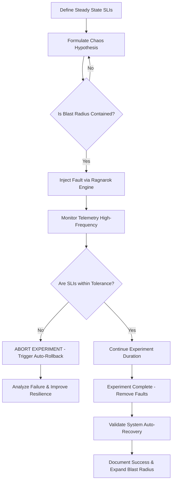
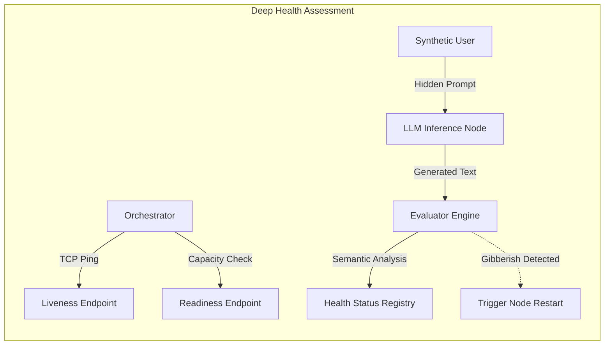
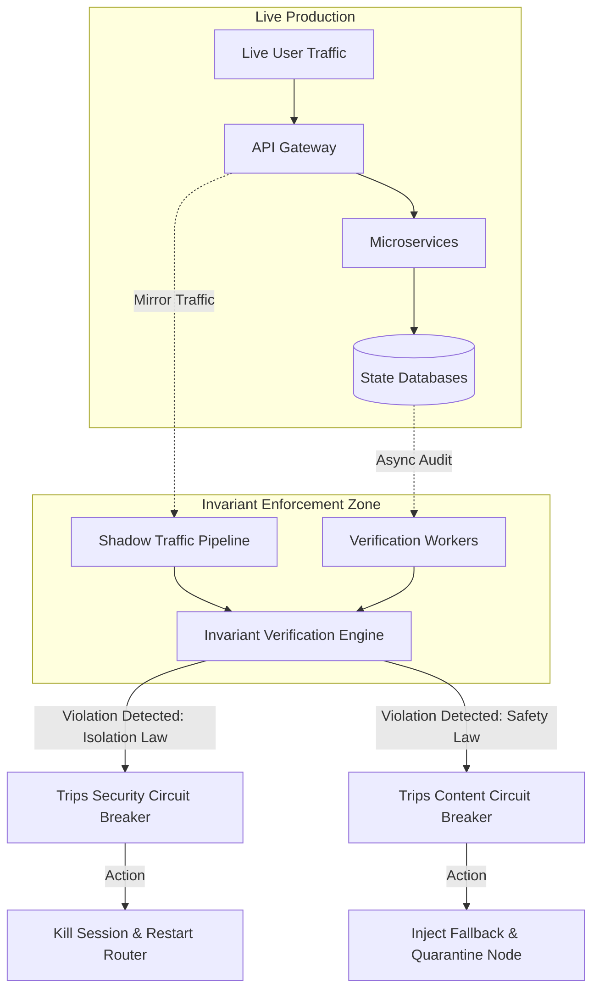

# Document 24: Ember Continuous Validation and Chaos Engineering - The Crucible of Resilience

**Author:** TYR, The Resilience Vanguard
**Project:** Ember (Open LLM VTuber Mythic Plan)
**Directive:** Establish the absolute methodologies for extreme resilience, automated chaos engineering, deep telemetry, and invariant monitoring in production environments.

---

## 1. Introduction: The Philosophy of Engineered Resilience

In the architectural evolution of complex distributed systems, particularly those driven by non-deterministic Artificial Intelligence models, the traditional paradigms of software testing are fundamentally inadequate. Historically, engineering teams have relied upon unit tests, integration tests, and end-to-end (E2E) testing frameworks to validate that a system operates correctly under expected, predefined conditions. However, Project Ember is not a standard web application; it is an Open LLM VTuber platform. It is a highly asynchronous, multi-modal system reliant on GPU availability, volatile external API endpoints, massive context window management, and real-time biometric synchronization. In such an environment, failure is not an anomaly to be eliminated; it is an omnipresent atmospheric condition that must be navigated.

As the Resilience Vanguard, the mandate is absolute: we must construct a system that does not merely survive failure but thrives upon it, demonstrating anti-fragile properties. Resilience cannot be retrofitted as an afterthought; it must be woven into the very fabric of the architecture. We must shift our operational mindset from "preventing failure"—a statistical impossibility at scale—to "managing, containing, and mitigating failure gracefully and automatically."

This document outlines the mythic blueprint for achieving this resilience. It defines the strategies for continuous validation, a relentless process of proving the system's mettle. It details the implementation of automated chaos engineering, whereby we intentionally inflict damage upon our own infrastructure to observe its recovery. It specifies the design of multi-dimensional deep health checks, going far beyond simple network pings to validate the cognitive coherence of our AI models. It maps out the architecture of pervasive, high-cardinality telemetry required to illuminate the darkest corners of our microservices. Finally, it establishes the rigid enforcement of production invariants—the unbreakable laws of our system that, if violated, trigger immediate containment protocols. 

We do not test Project Ember to prove that it works. We continuously assault Project Ember to prove that it cannot be destroyed. The methodologies herein describe the crucible in which the unkillable system is forged.

---

## 2. The Chaos Engineering Doctrine (The "Ragnarok" Protocol)

Chaos Engineering is the empirical discipline of experimenting on a software system in order to build confidence in the system's capability to withstand turbulent and unexpected conditions in a production environment. For Project Ember, we implement a highly specialized, automated chaos infrastructure known as the "Ragnarok" Protocol. Ragnarok is an omnipresent, background intelligence whose sole purpose is to inject entropy and destruction into the Ember ecosystem in a controlled, measurable manner.

The foundational principles of the Ragnarok Protocol are defined as follows:

### 2.1. Establishing and Measuring Steady State
Before we can inject chaos, we must mathematically define order. We must establish a "steady state"—a verifiable metric that indicates the system is operating nominally from the user's perspective. For Project Ember, steady state is not defined by CPU utilization or memory consumption, but by user-centric Service Level Indicators (SLIs). These include:
*   **Time-to-First-Token (TTFT):** The latency between a user's spoken word and the beginning of the VTuber's audible response must remain under 800 milliseconds.
*   **Animation Synchronization Variance:** The drift between generated audio and the corresponding viseme lip-sync animation must not exceed 50 milliseconds.
*   **Memory Retrieval Latency:** Contextual memory injection from the vector database must complete within 200 milliseconds.
If these metrics hold, the system is in a steady state, regardless of underlying internal node failures.

### 2.2. Simulating Real-World Turbulence
Ragnarok is designed to unleash a wide taxonomy of faults, mirroring the harsh realities of cloud infrastructure and volatile AI dependencies:
*   **Infrastructure Chaos:** Randomly terminating (killing) Pods, containers, and entire virtual machines across the cluster. This tests the orchestrator's (e.g., Kubernetes) ability to reschedule and heal, and tests the application's ability to handle sudden connection drops without corrupting state.
*   **Network Chaos:** Introducing artificial network latency, dropping packets, and simulating complete network partitions (split-brain scenarios) between critical subsystems, such as between the Dialogue Manager and the Vector Database.
*   **Resource Exhaustion (Starvation):** Artificially restricting CPU cycles, consuming available RAM to induce Out-Of-Memory (OOM) kills, and filling up disk space to observe how the application degrades when starved of resources.
*   **Application-Level Fault Injection:** Intercepting internal API calls to return HTTP 500 errors, simulating third-party LLM API timeouts, or intentionally corrupting the payload of gRPC messages to test data validation and error handling routines.

### 2.3. Automated, Continuous Execution in Production
While chaos experiments are initially formulated and tested in staging environments, their true value is realized only in production. Staging environments rarely replicate the scale, traffic patterns, and emergent complexities of live systems. The Ragnarok Protocol is designed to run continuously in the production environment, constantly probing the system's defenses during peak load.

### 2.4. Rigid Blast Radius Containment
The paramount rule of chaos engineering is that experiments must never cause unacceptable harm to the user experience. Ragnarok operates with an automated "dead man's switch." Before an experiment begins, baseline steady-state metrics are locked in. The moment the fault is injected, the system monitors the SLIs at high frequency. If the SLIs deviate beyond a predefined, acceptable threshold of degradation, the experiment is instantly aborted, and the injected faults are rolled back automatically.

---

## 3. Methodologies for Testing Extreme Resilience

To build a truly unyielding architecture, our testing methodologies must transcend standard functional verification. We must actively seek out the boundaries of the system's operational envelope and intentionally push the system past them.

### 3.1. State Space Exploration and Fuzzing
Distributed systems maintain complex internal states. An LLM VTuber maintains conversation history, emotional state, short-term context, and long-term memory across multiple disparate databases and caches. We employ advanced state space exploration techniques, utilizing intelligent fuzzers that bombard the system's input vectors (chat interfaces, audio streams, memory retrieval APIs) with highly randomized, malformed, and contextually bizarre data. The goal is to force the system into undefined state transitions, uncovering race conditions, memory leaks, and unhandled exceptions that could crash the cognitive engine.

### 3.2. Network Partition and Split-Brain Resolution
Ember relies heavily on distributed data stores (e.g., Redis for fast caching, Milvus/Qdrant for vector embeddings, PostgreSQL for durable user data). We rigorously test the system's behavior during severe network partitions. If the cluster hosting the vector database is isolated from the Dialogue Management microservice, how does the system react?
*   Does it hang indefinitely? (Unacceptable)
*   Does it crash the user session? (Unacceptable)
*   Does it gracefully degrade, relying only on the LLM's intrinsic knowledge and short-term cache until the partition heals? (Expected behavior).
We meticulously validate the CAP theorem tradeoffs we have chosen, ensuring that data consistency is eventually achieved once the partition is resolved, without data loss or corruption.

### 3.3. Cascading Failure Induction and Bulkhead Validation
In microservice architectures, the most catastrophic outages are caused by cascading failures. A slight degradation in a low-priority service (e.g., the system that updates the VTuber's background scenery) causes connection pools to back up, which then exhausts threads on the API Gateway, ultimately taking down the entire core conversation capabilities.
We intentionally induce failures in downstream dependencies to validate the effectiveness of our resilience patterns:
*   **Circuit Breakers:** We verify that when a service fails repeatedly, the circuit breaker trips, instantly failing fast to prevent resource exhaustion upstream.
*   **Bulkheads:** We ensure that distinct system functions are isolated. A failure in the audio processing pipeline must not consume the thread pools dedicated to processing incoming text chats.
*   **Retry Storm Mitigation:** We test our retry logic, ensuring that exponential backoff and jitter are correctly applied so that a recovering service is not immediately crushed by a stampede of retried requests.

### 3.4. Recovery Objective SLA Enforcement
Resilience is measured by recovery speed. We establish strict Service Level Agreements (SLAs) for Recovery Time Objective (RTO) and Recovery Point Objective (RPO). We routinely simulate catastrophic failures—such as the simulated destruction of an entire availability zone—to time the automated failover mechanisms. If the system takes longer than the prescribed RTO to restore full VTuber interactivity, the test fails, and the automated recovery logic must be optimized.

---

## 4. Extensive Health Checks: The Vital Signs of Ember

A resilient system requires profound self-awareness. It must know instantly when a component is failing, hanging, or operating in a degraded state. The standard industry practice of exposing a simple HTTP `/healthz` endpoint that merely returns `200 OK` if the web server is running is dangerously insufficient for an AI platform. Project Ember implements a multi-dimensional, deep health assessment protocol.

### 4.1. Liveness, Readiness, and Startup Probes
At the orchestrator level, we utilize a tri-tiered probing strategy:
*   **Startup Probes:** AI models are massive. Loading a multi-billion parameter LLM or a high-fidelity TTS voice model into GPU VRAM can take several minutes. Startup probes are designed to wait patiently during this heavy initialization phase, preventing the orchestrator from prematurely killing the container under the mistaken belief that it is dead.
*   **Readiness Probes:** Once initialized, a service must signal when it is ready to accept user traffic. If the LLM node is currently processing a maximum capacity batch of requests, its readiness probe should fail, signaling the load balancer to route new requests to other nodes until it has available capacity.
*   **Liveness Probes:** These are the heartbeat monitors. They verify that the core application thread has not deadlocked. If a liveness probe fails consecutively, the orchestrator mercilessly terminates the instance and spins up a replacement.

### 4.2. Deep "Cognitive" Probes
This is where Ember's health checks become specialized. A node running an LLM might have a functioning HTTP server (passing Liveness) and available capacity (passing Readiness), but the model itself may have entered a corrupted state—perhaps producing infinitely looping text, outputting gibberish due to tensor errors, or suffering from severe prompt drift.
We implement **Deep Probes**, which are synthetic transactions generated by a dedicated health-monitoring microservice. Periodically, this monitor sends a hidden, standardized prompt to the LLM backend. The system then evaluates the response not just for latency, but for semantic correctness.
*   Does the response contain the expected keywords?
*   Is the sentiment appropriate?
*   Has the model fallen into a repetitive loop?
If the response fails these semantic heuristic checks, the node is flagged as "cognitively degraded" and is immediately pulled from the active load-balancing pool for automated investigation and restart.

### 4.3. Cross-Node Health Attestation (Gossip Protocol)
Centralized health monitoring can become a bottleneck and a single point of failure. Ember employs a decentralized approach using a Gossip Protocol. Nodes within the service mesh continuously exchange health information with their neighbors. If Node A cannot reach Node B, it informs Nodes C and D. If a consensus is reached that Node B is unresponsive, the service mesh automatically routes traffic around it, faster than a centralized monitoring system could detect and propagate the change. This provides extremely rapid isolation of network partitions and silent node failures.

---

## 5. Deep Telemetry: Seeing the Unseen

Resilience cannot exist without extreme observability. When chaos strikes, or when emergent behaviors manifest in production, the engineering team must have immediate access to high-fidelity data to reconstruct the sequence of events. We cannot fix what we cannot see. Ember implements Deep Telemetry, founded on the three traditional pillars of observability, but augmented specifically for the complexities of generative AI architectures.

### 5.1. High-Cardinality Metrics
We collect high-resolution time-series data. While standard infrastructure metrics (CPU, GPU VRAM, Network I/O) are captured, our primary focus is on application-specific, business-level metrics. These include:
*   **LLM Specifics:** Time-to-First-Token (TTFT), Inter-Token Latency, Tokens Per Second (TPS), Prompt Queue Depth, Context Window Utilization percentages.
*   **VTuber Mechanics:** Viseme generation latency, TTS audio synthesis duration, animation blending frame drops.
*   **Memory Systems:** Vector database cache hit ratios, embedding generation latency, semantic search query times.
We utilize systems capable of handling high-cardinality data, allowing us to slice these metrics dynamically—for example, viewing TTFT specifically for "User X" interacting with "Persona Y" using "Model Version Z" in "Region A".

### 5.2. Semantic and Contextual Logging
Unstructured, greppable text logs are obsolete. Every log entry emitted by any component in the Ember ecosystem is strictly structured in JSON format. More importantly, every log entry is enriched with pervasive context. A log message reporting an error in the TTS engine is useless on its own. It must include the `TraceID`, the `UserID`, the `SessionID`, and the specific `PromptID` that triggered the generation. This allows for instantaneous filtering and correlation during an incident, transforming log analysis from a manual search into structured querying.

### 5.3. Distributed Tracing (OpenTelemetry)
In a highly decoupled microservice architecture, a single user action (e.g., the user speaking to the VTuber) cascades into dozens of internal network calls. We implement distributed tracing across the entire stack using OpenTelemetry. Every incoming request is assigned a unique Trace ID at the API Gateway. This ID is propagated through HTTP headers and gRPC metadata to every subsequent service.
This allows us to visualize the exact critical path of a request in a flame graph. We can see precisely how much time was spent in the dialogue manager, how much time was spent waiting on the vector database, and exactly where a timeout occurred. This is the ultimate tool for pinpointing the root cause of latency and cascading failures.

### 5.4. AI Observability and Anomaly Detection
We monitor the cognitive health of the system over time. We track the sentiment drift of the VTuber across long sessions, monitor the diversity of generated vocabulary to detect model degradation, and log the confidence scores of our intent recognition and safety classification models.
Furthermore, relying on human operators to monitor dashboards is insufficient. We deploy machine learning-based anomaly detection pipelines that continuously analyze the telemetry streams. These systems establish dynamic baselines for normal behavior and instantly trigger high-priority alerts when anomalous patterns are detected, such as a sudden, localized spike in token generation latency that deviates from historical norms for that specific time of day.

---

## 6. Invariant Monitoring in Production: The Unbreakable Laws

In formal verification, an invariant is a condition that can be relied upon to be true during the execution of a program. In the context of Project Ember, system invariants are the foundational, uncompromisable laws of our architecture. While unit testing attempts to verify these invariants during development, true resilience requires that we continuously monitor and enforce these invariants in the live production environment. A violation of an invariant is not a standard error; it represents a catastrophic breakdown of system logic and demands immediate, automated intervention.

### 6.1. Defining the Invariants
We define strict invariants across multiple domains of the Ember ecosystem:
*   **Security and Privacy Invariant (The Isolation Law):** Data belonging to User A must never, under any mathematically possible circumstance, be returned in a database query, vector search, or LLM context window associated with User B's session.
*   **Persona Integrity Invariant (The Core Identity Law):** The VTuber's foundational personality instructions and safety constraints must never be overwritten, evicted, or omitted from the active LLM context window during prompt construction.
*   **Financial/Resource Invariant (The Accounting Law):** The token consumption metrics recorded by the billing subsystem must exactly match the sum of tokens processed by the inference engines for a given session.
*   **Safety Invariant (The Containment Law):** The system must never transmit an output string or audio stream to the client that has not been explicitly approved by the asynchronous safety classification subsystem.

### 6.2. Continuous Invariant Verification Mechanisms
To enforce these laws in production, we deploy dedicated architectural patterns:
*   **Shadow Traffic Validation:** We utilize a service mesh to transparently mirror a percentage of live production traffic to isolated "shadow" processing pipelines. In these shadow environments, we execute computationally expensive, exhaustive invariant checks that would be too slow to run on the critical path of live user requests. This allows us to validate the logic of the system on real data without impacting user latency.
*   **Asynchronous State Verification Workers:** Background daemon processes continuously crawl the databases, event streams, and cache layers. They perform asynchronous sanity checks, recalculating token totals, verifying database row ownership, and checking the integrity of vector embeddings to ensure that the persistent state of the system adheres to the invariant laws.

### 6.3. Automated Circuit Breakers and Mitigation
Monitoring invariants is useless without automated enforcement. If the Invariant Verification Engine detects a violation, it acts with extreme prejudice. It does not simply send an alert to an engineer; it triggers automated architectural responses.
If the Isolation Law is breached, the system immediately severs the compromised user sessions and forces a restart of the routing layer. If the Safety Invariant is violated, automated circuit breakers instantly isolate the offending dialogue generation node, replacing the generated response with a safe, pre-computed fallback response, and quarantining the node for forensic analysis. The system prioritizes data integrity and user safety above raw availability at all times.

---

## 7. Conclusion: Forging the Unbreakable System

The journey to creating an unkillable, mythic-tier Open LLM VTuber platform is a path paved with intentional destruction and relentless scrutiny. We do not build a system and hope it survives the chaos of production; we engineer the chaos itself, injecting it into the veins of our architecture to stimulate adaptation and auto-recovery. 

By embracing the philosophy of continuous validation, we transform catastrophic failures from unpredictable emergencies into routine, handled events. The methodologies detailed in this document—the omnipresent Ragnarok chaos protocol, the multi-dimensional deep health checks, the pervasive and high-cardinality telemetry, and the unyielding enforcement of production invariants—are the essential tools of the Resilience Vanguard. 

Through the rigorous application of these practices, Project Ember will transcend traditional software fragility. It will not just survive the harsh realities of distributed production environments, network partitions, and unpredictable AI behaviors; it will dynamically adapt, self-heal in milliseconds, and continue to deliver a seamless, magical experience to the user. We build for chaos, because in complex systems at scale, chaos is the only absolute certainty. The crucible is lit; the forging begins.
