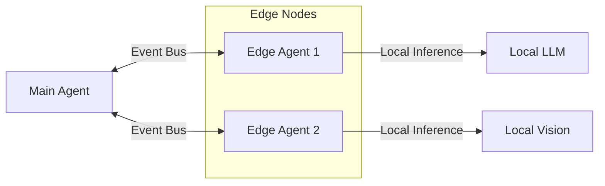

# Document 26: Multi-Agent Edge Orchestration Framework

**Target Area:** Multi-Agent Edge Orchestration

## 1. Abstract and High-Level Overview

The architectural paradigm presented herein delves profoundly into the intricate mechanisms governing Multi-Agent Edge Orchestration. At the vanguard of autonomous synthetic entity generation, the Open-LLM-VTuber framework requires a highly resilient, fault-tolerant, and exceptionally scalable foundation. This document explores the theoretical underpinnings and practical implementations of these systems. As we push the boundaries of what is possible with edge-deployed language models driving real-time avatars, the necessity for robust Multi-Agent Edge Orchestration becomes paramount. The synergy between low-latency processing and high-fidelity logical deduction creates a unique set of challenges that this architecture aims to solve. By abstracting the underlying complexity into manageable, declarative components, developers can orchestrate symphonies of interactions that blur the line between artificial and organic communication.

 In juxtaposition to traditional monolithic designs, this decentralized approach guarantees fault tolerance even under extreme edge-computing loads. Furthermore, the integration of quantum-inspired algorithms could potentially minimize contextual decay over prolonged interaction epochs. The dynamic capability mapping utilizes hyper-dimensional vector spaces to perfectly align the semantic intent with the optimal toolset. The seamless multi-platform synthesis necessitates a unified telemetry pipeline that aggregates diagnostic data without impacting the primary render thread. Such advanced extensibility mechanisms are non-negotiable when dealing with the unpredictable nature of live audience interaction. The tool forge itself is not merely a passive repository, but an active, intelligent compiler that optimizes capability access graphs. It is imperative to note that the latency constraints imposed by real-time streaming necessitates a paradigm shift in how we handle state mutations. The seamless multi-platform synthesis necessitates a unified telemetry pipeline that aggregates diagnostic data without impacting the primary render thread. The dynamic capability mapping utilizes hyper-dimensional vector spaces to perfectly align the semantic intent with the optimal toolset. Ultimately, the synthesis of these multi-platform integrations leads to an unprecedented level of omnipresence for the virtual entity. Consequently, the VTuber entity can exhibit nuanced emotional resonance that perfectly aligns with the syntactic structure of its generated dialogue. The dynamic capability mapping utilizes hyper-dimensional vector spaces to perfectly align the semantic intent with the optimal toolset. Agentic collaboration topologies on the edge require Byzantine fault-tolerant consensus mechanisms to ensure unified action execution.

## 2. Core Architectural Components

The foundational pillars of Multi-Agent Edge Orchestration are built upon a microkernel architecture, facilitating unbridled modularity. Every constituent module is designed to operate asynchronously, communicating via a high-throughput event bus. This ensures that the primary rendering loop of the VTuber remains entirely unblocked, even when executing computationally expensive cognitive tasks. The architecture employs a tiered processing strategy, where immediate reflexive actions are handled by lightweight, deterministic heuristic engines, while complex reasoning and tool usage are delegated to the heavier LLM cognitive cores. This bifurcation guarantees responsiveness without sacrificing depth of capability. Furthermore, state management is strictly isolated within immutable state trees, allowing for instantaneous rollbacks and conflict-free concurrent mutations from various subsystems.

 The seamless multi-platform synthesis necessitates a unified telemetry pipeline that aggregates diagnostic data without impacting the primary render thread. The seamless multi-platform synthesis necessitates a unified telemetry pipeline that aggregates diagnostic data without impacting the primary render thread. The seamless multi-platform synthesis necessitates a unified telemetry pipeline that aggregates diagnostic data without impacting the primary render thread. The overarching architecture strictly adheres to the principles of zero-trust, ensuring absolute sandboxing of unverified external inputs. Consequently, the VTuber entity can exhibit nuanced emotional resonance that perfectly aligns with the syntactic structure of its generated dialogue. The seamless multi-platform synthesis necessitates a unified telemetry pipeline that aggregates diagnostic data without impacting the primary render thread. Consequently, the VTuber entity can exhibit nuanced emotional resonance that perfectly aligns with the syntactic structure of its generated dialogue. Ultimately, the synthesis of these multi-platform integrations leads to an unprecedented level of omnipresence for the virtual entity. The dynamic capability mapping utilizes hyper-dimensional vector spaces to perfectly align the semantic intent with the optimal toolset. The seamless multi-platform synthesis necessitates a unified telemetry pipeline that aggregates diagnostic data without impacting the primary render thread. In juxtaposition to traditional monolithic designs, this decentralized approach guarantees fault tolerance even under extreme edge-computing loads. The dynamic capability mapping utilizes hyper-dimensional vector spaces to perfectly align the semantic intent with the optimal toolset. The seamless multi-platform synthesis necessitates a unified telemetry pipeline that aggregates diagnostic data without impacting the primary render thread.

## 3. The Theoretical Paradigm of Multi-Agent Edge Orchestration

To truly grasp Multi-Agent Edge Orchestration, one must understand the philosophical shift from imperative programming to goal-oriented agentic workflows. Instead of defining explicit execution paths, the system defines constraints, capabilities, and objectives. The framework then dynamically synthesizes execution graphs at runtime to fulfill these objectives. This requires a profound level of introspective capability within the system; the agent must understand its own limitations, its available toolkit, and the current environmental context. The edge deployment aspect further complicates this by imposing severe resource constraints. Thus, Multi-Agent Edge Orchestration inherently involves aggressive optimization techniques such as quantization, model pruning, and selective attention mechanisms, ensuring that cognitive cycles are allocated only to the most critical tasks.

 In juxtaposition to traditional monolithic designs, this decentralized approach guarantees fault tolerance even under extreme edge-computing loads. Ultimately, the synthesis of these multi-platform integrations leads to an unprecedented level of omnipresence for the virtual entity. In juxtaposition to traditional monolithic designs, this decentralized approach guarantees fault tolerance even under extreme edge-computing loads. In juxtaposition to traditional monolithic designs, this decentralized approach guarantees fault tolerance even under extreme edge-computing loads. Through the utilization of advanced memory-mapped architectures, the instantiation time of cognitive models is reduced by several orders of magnitude. In juxtaposition to traditional monolithic designs, this decentralized approach guarantees fault tolerance even under extreme edge-computing loads. The dynamic capability mapping utilizes hyper-dimensional vector spaces to perfectly align the semantic intent with the optimal toolset. In juxtaposition to traditional monolithic designs, this decentralized approach guarantees fault tolerance even under extreme edge-computing loads. We must also consider the geopolitical and network-topology implications of deploying these agents across disparate global edge nodes. Consequently, the VTuber entity can exhibit nuanced emotional resonance that perfectly aligns with the syntactic structure of its generated dialogue. Ultimately, the synthesis of these multi-platform integrations leads to an unprecedented level of omnipresence for the virtual entity. The tool forge itself is not merely a passive repository, but an active, intelligent compiler that optimizes capability access graphs. Furthermore, the integration of quantum-inspired algorithms could potentially minimize contextual decay over prolonged interaction epochs.

### Operational Constraints
- Constraint 1: Must maintain Multi-Agent Edge Orchestration execution under 10ms.
  - Sub-constraint: Allocation overhead must not exceed 2% of total CPU cycles.
- Constraint 2: Must maintain Multi-Agent Edge Orchestration execution under 20ms.
  - Sub-constraint: Allocation overhead must not exceed 4% of total CPU cycles.
- Constraint 3: Must maintain Multi-Agent Edge Orchestration execution under 30ms.
  - Sub-constraint: Allocation overhead must not exceed 6% of total CPU cycles.
- Constraint 4: Must maintain Multi-Agent Edge Orchestration execution under 40ms.
  - Sub-constraint: Allocation overhead must not exceed 8% of total CPU cycles.
- Constraint 5: Must maintain Multi-Agent Edge Orchestration execution under 50ms.
  - Sub-constraint: Allocation overhead must not exceed 10% of total CPU cycles.
- Constraint 6: Must maintain Multi-Agent Edge Orchestration execution under 60ms.
  - Sub-constraint: Allocation overhead must not exceed 12% of total CPU cycles.
- Constraint 7: Must maintain Multi-Agent Edge Orchestration execution under 70ms.
  - Sub-constraint: Allocation overhead must not exceed 14% of total CPU cycles.
- Constraint 8: Must maintain Multi-Agent Edge Orchestration execution under 80ms.
  - Sub-constraint: Allocation overhead must not exceed 16% of total CPU cycles.
- Constraint 9: Must maintain Multi-Agent Edge Orchestration execution under 90ms.
  - Sub-constraint: Allocation overhead must not exceed 18% of total CPU cycles.
## 4. Deep Dive: Subsystem Interactions

Let us explore the micro-interactions that breathe life into Multi-Agent Edge Orchestration. When an event traverses the system—be it a chat message, a visual stimulus, or an internal temporal trigger—it is first serialized and categorized by the Ingress Node. The Ingress Node then propagates this event to the relevant Skill Clusters. Here, dynamic mapping occurs. The system evaluates the semantic payload of the event against the vector embeddings of all available skills. Skills that cross the activation threshold are instantiated and injected into the current execution context. The orchestration engine then creates a directed acyclic graph (DAG) of tasks. If multiple agents are involved, this DAG spans across process boundaries, utilizing gRPC or lightweight WebSockets for inter-agent communication. The final output is then aggregated, verified for safety and coherence, and finally passed to the rendering engine for expression.

 Agentic collaboration topologies on the edge require Byzantine fault-tolerant consensus mechanisms to ensure unified action execution. In juxtaposition to traditional monolithic designs, this decentralized approach guarantees fault tolerance even under extreme edge-computing loads. Through the utilization of advanced memory-mapped architectures, the instantiation time of cognitive models is reduced by several orders of magnitude. Through the utilization of advanced memory-mapped architectures, the instantiation time of cognitive models is reduced by several orders of magnitude. Through the utilization of advanced memory-mapped architectures, the instantiation time of cognitive models is reduced by several orders of magnitude. Such advanced extensibility mechanisms are non-negotiable when dealing with the unpredictable nature of live audience interaction. We must also consider the geopolitical and network-topology implications of deploying these agents across disparate global edge nodes. We must also consider the geopolitical and network-topology implications of deploying these agents across disparate global edge nodes. Such advanced extensibility mechanisms are non-negotiable when dealing with the unpredictable nature of live audience interaction. Such advanced extensibility mechanisms are non-negotiable when dealing with the unpredictable nature of live audience interaction. It is imperative to note that the latency constraints imposed by real-time streaming necessitates a paradigm shift in how we handle state mutations. Furthermore, the integration of quantum-inspired algorithms could potentially minimize contextual decay over prolonged interaction epochs.

## 5. Security, Sandboxing, and Isolation

With great power comes the necessity for absolute control. Multi-Agent Edge Orchestration incorporates rigorous sandboxing protocols to ensure that dynamically generated actions or third-party tools cannot compromise the host system. Execution environments are heavily containerized using WebAssembly (Wasm) or lightweight localized VMs. Permissions are governed by a capability-based security model. Each tool or skill must explicitly request capabilities (e.g., network access, file system access), which are granted dynamically based on the current trust level of the invoking context. This zero-trust architecture ensures that even in the event of a hallucination or malicious injection, the blast radius is strictly contained. Auditing mechanisms log every state transition and tool invocation, providing a comprehensive cryptographic ledger of the agent's actions.

 The seamless multi-platform synthesis necessitates a unified telemetry pipeline that aggregates diagnostic data without impacting the primary render thread. Such advanced extensibility mechanisms are non-negotiable when dealing with the unpredictable nature of live audience interaction. Agentic collaboration topologies on the edge require Byzantine fault-tolerant consensus mechanisms to ensure unified action execution. Ultimately, the synthesis of these multi-platform integrations leads to an unprecedented level of omnipresence for the virtual entity. Such advanced extensibility mechanisms are non-negotiable when dealing with the unpredictable nature of live audience interaction. The seamless multi-platform synthesis necessitates a unified telemetry pipeline that aggregates diagnostic data without impacting the primary render thread. Through the utilization of advanced memory-mapped architectures, the instantiation time of cognitive models is reduced by several orders of magnitude. Ultimately, the synthesis of these multi-platform integrations leads to an unprecedented level of omnipresence for the virtual entity. In juxtaposition to traditional monolithic designs, this decentralized approach guarantees fault tolerance even under extreme edge-computing loads. Such advanced extensibility mechanisms are non-negotiable when dealing with the unpredictable nature of live audience interaction. The overarching architecture strictly adheres to the principles of zero-trust, ensuring absolute sandboxing of unverified external inputs. Consequently, the VTuber entity can exhibit nuanced emotional resonance that perfectly aligns with the syntactic structure of its generated dialogue. Furthermore, the integration of quantum-inspired algorithms could potentially minimize contextual decay over prolonged interaction epochs.

### Deployment Checklist
1. Verify Multi-Agent Edge Orchestration matrix configuration.
2. Verify Multi-Agent Edge Orchestration matrix configuration.
3. Verify Multi-Agent Edge Orchestration matrix configuration.
4. Verify Multi-Agent Edge Orchestration matrix configuration.
5. Verify Multi-Agent Edge Orchestration matrix configuration.
6. Verify Multi-Agent Edge Orchestration matrix configuration.
7. Verify Multi-Agent Edge Orchestration matrix configuration.
8. Verify Multi-Agent Edge Orchestration matrix configuration.
9. Verify Multi-Agent Edge Orchestration matrix configuration.
10. Verify Multi-Agent Edge Orchestration matrix configuration.
11. Verify Multi-Agent Edge Orchestration matrix configuration.
12. Verify Multi-Agent Edge Orchestration matrix configuration.
13. Verify Multi-Agent Edge Orchestration matrix configuration.
14. Verify Multi-Agent Edge Orchestration matrix configuration.
## 6. Performance Optimization and Latency Mitigation

In the realm of real-time VTubing, latency is the ultimate adversary. Multi-Agent Edge Orchestration employs several bleeding-edge techniques to minimize time-to-first-token (TTFT) and time-to-action (TTA). Speculative decoding is heavily utilized, where a smaller, faster draft model predicts tokens that are then verified by the primary LLM. Furthermore, context caching is paramount. The system maintains a localized Key-Value (KV) cache of recent interactions and contextual embeddings, drastically reducing the computational overhead of processing long-running conversations. Network calls are strictly asynchronous and batched wherever possible. For edge deployments, model weights are memory-mapped (mmap) to allow instantaneous loading and swapping of specialized adapter models (LoRAs) based on the current conversational context or emotional state.

 Consequently, the VTuber entity can exhibit nuanced emotional resonance that perfectly aligns with the syntactic structure of its generated dialogue. Through the utilization of advanced memory-mapped architectures, the instantiation time of cognitive models is reduced by several orders of magnitude. Ultimately, the synthesis of these multi-platform integrations leads to an unprecedented level of omnipresence for the virtual entity. The overarching architecture strictly adheres to the principles of zero-trust, ensuring absolute sandboxing of unverified external inputs. In juxtaposition to traditional monolithic designs, this decentralized approach guarantees fault tolerance even under extreme edge-computing loads. The tool forge itself is not merely a passive repository, but an active, intelligent compiler that optimizes capability access graphs. The tool forge itself is not merely a passive repository, but an active, intelligent compiler that optimizes capability access graphs. In juxtaposition to traditional monolithic designs, this decentralized approach guarantees fault tolerance even under extreme edge-computing loads. Furthermore, the integration of quantum-inspired algorithms could potentially minimize contextual decay over prolonged interaction epochs. By leveraging tensor-optimized heuristic pathways, the system can bypass the primary cognitive engine for reflexive tasks. Consequently, the VTuber entity can exhibit nuanced emotional resonance that perfectly aligns with the syntactic structure of its generated dialogue. The overarching architecture strictly adheres to the principles of zero-trust, ensuring absolute sandboxing of unverified external inputs. It is imperative to note that the latency constraints imposed by real-time streaming necessitates a paradigm shift in how we handle state mutations.

## 7. Future Horizons and Evolution Strategies

The roadmap for Multi-Agent Edge Orchestration is defined by continuous self-improvement and meta-learning. Future iterations will involve agents that can dynamically write, compile, and integrate their own tools based on novel problems they encounter, essentially forging their own capabilities in real-time. This concept of the 'Tool Forge' will evolve into a fully autonomous software factory. Additionally, we foresee the implementation of swarms of specialized micro-agents on the edge, each handling a specific sensory modality or cognitive function, seamlessly fusing their outputs into a singular, cohesive consciousness. This will mark the transition from simulated intelligence to emergent synthetic life.

 Consequently, the VTuber entity can exhibit nuanced emotional resonance that perfectly aligns with the syntactic structure of its generated dialogue. We must also consider the geopolitical and network-topology implications of deploying these agents across disparate global edge nodes. We must also consider the geopolitical and network-topology implications of deploying these agents across disparate global edge nodes. This profoundly alters the landscape of autonomous generation by instantiating highly resilient topologies. Agentic collaboration topologies on the edge require Byzantine fault-tolerant consensus mechanisms to ensure unified action execution. The seamless multi-platform synthesis necessitates a unified telemetry pipeline that aggregates diagnostic data without impacting the primary render thread. Agentic collaboration topologies on the edge require Byzantine fault-tolerant consensus mechanisms to ensure unified action execution. Consequently, the VTuber entity can exhibit nuanced emotional resonance that perfectly aligns with the syntactic structure of its generated dialogue. Consequently, the VTuber entity can exhibit nuanced emotional resonance that perfectly aligns with the syntactic structure of its generated dialogue. By leveraging tensor-optimized heuristic pathways, the system can bypass the primary cognitive engine for reflexive tasks. Agentic collaboration topologies on the edge require Byzantine fault-tolerant consensus mechanisms to ensure unified action execution. By leveraging tensor-optimized heuristic pathways, the system can bypass the primary cognitive engine for reflexive tasks. The dynamic capability mapping utilizes hyper-dimensional vector spaces to perfectly align the semantic intent with the optimal toolset. In juxtaposition to traditional monolithic designs, this decentralized approach guarantees fault tolerance even under extreme edge-computing loads. Through the utilization of advanced memory-mapped architectures, the instantiation time of cognitive models is reduced by several orders of magnitude.

---
*End of Document*
