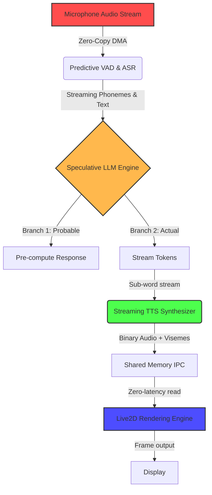

# Document 33: Ember Performance Alchemy Core

## 1. Executive Summary and Vision for Extreme Performance Alchemy
The Open-LLM-VTuber architecture represents a profound leap in conversational AI avatars, combining Automatic Speech Recognition (ASR), Large Language Models (LLM), Text-to-Speech (TTS), and Live2D rendering. However, in the context of Project Ember, standard performance is insufficient. We must engage in "Performance Alchemy" - the transmutation of standard compute cycles into instantaneous, zero-latency interactions. This document outlines the absolute limits of performance optimization for the Open-LLM-VTuber stack, dissecting every microsecond of latency across the entire pipeline. The goal is not merely to optimize, but to fundamentally alter the spacetime of the system, achieving a conversational cadence that is indistinguishable from human interaction. This requires a holistic reimagining of the WebSocket layer, the VAD (Voice Activity Detection) triggers, the inference scheduling, and the rendering loop. 

## 2. Theoretical Framework of Spacetime Performance Alchemy
In the realm of extreme performance optimization, we treat compute resources and latency as physical constraints to be bent and manipulated. The Open-LLM-VTuber pipeline operates as a sequence of transformations: Audio -> Text -> Meaning -> Text -> Audio & Visuals. Each transformation incurs a temporal cost. Performance Alchemy mandates that these transformations occur concurrently, predictively, and with minimal energy waste.

### 2.1 The Latency Eradication Principle
Latency is the enemy of presence. A VTuber must respond within 200 milliseconds to maintain the illusion of consciousness. To achieve this, we must eradicate sequential processing. The traditional ASR -> LLM -> TTS pipeline must be shattered and replaced with a continuously streaming, interconnected matrix of predictive models.

### 2.2 The Zero-Copy Imperative
Data movement is the primary source of hidden latency. Moving audio buffers from the sound card to the CPU, then to the GPU for ASR, then text to the LLM, then text to TTS, then audio back to the sound card involves catastrophic memory bandwidth overhead. Performance Alchemy dictates a Zero-Copy architecture where memory is mapped directly across devices, and transformations happen in place.

## 3. Deconstructing the Open-LLM-VTuber Pipeline

### 3.1 Voice Activity Detection (VAD) and ASR Inception
The current Open-LLM-VTuber stack relies on standard VAD to detect when the user has finished speaking. This is fundamentally flawed for extreme performance. Waiting for silence introduces an unavoidable 300-500ms delay. 

**Alchemical Solution:** Predictive VAD and Continuous ASR.
Instead of waiting for silence, the system must employ a continuous ASR stream (using models like Sherpa-ONNX) that outputs probabilities of sentence completion. The LLM must begin processing the *in-progress* sentence before the user has even finished speaking. By analyzing the prosody and semantics of the user's speech in real-time, we can predict the end of a turn with high accuracy and begin generating a response preemptively.

### 3.2 The LLM Inference Engine: Speculative Decoding and Prefix Caching
Once the ASR yields text, the LLM must generate a response. In Project Ember, we utilize advanced speculative decoding.

**Alchemical Solution:** 
We must maintain a massive KV cache of all previous conversation turns, but more importantly, we must preemptively compute the KV cache for probable user inputs. As the user speaks, the LLM evaluates multiple possible sentence completions and begins computing the response for the most likely scenarios. If the user's actual sentence matches a predicted branch, the response is instantaneous. This is the essence of Performance Alchemy: doing the work before the work is requested.

### 3.3 Text-to-Speech (TTS) Streaming and Chunking
TTS (e.g., edge-tts, pyttsx3, Cartesia, ElevenLabs) often waits for full sentences before generating audio. 

**Alchemical Solution:** Sub-word TTS Streaming.
The LLM output must be streamed to the TTS engine at the sub-word or phoneme level. We must bypass the sentence boundary requirement. The TTS engine must synthesize audio for the first few words while the LLM is still generating the rest of the sentence. This requires a custom TTS wrapper that can handle fragmented input and smooth out the prosody dynamically.

## 4. The WebSocket Alchemical Matrix

The communication layer between the backend Python server and the frontend Live2D renderer is currently handled by WebSockets. Standard WebSockets introduce serialization and framing overhead.

### 4.1 Binary Protocol Overhaul
JSON serialization of audio and lip-sync data is a crime against performance. We must replace JSON over WebSockets with a highly optimized, flat-binary protocol (like FlatBuffers or Cap'n Proto). 

### 4.2 Shared Memory IPC (Inter-Process Communication)
If the frontend and backend are running on the same machine, WebSockets must be completely abandoned in favor of Shared Memory (mmap). The audio buffers and viseme (lip-sync) data must be written directly into a memory region accessible by both the Python backend and the frontend browser engine (via WebAssembly).

## 5. Visualizing the Alchemical Pipeline

## 6. Advanced Memory Bandwidth Optimization
To achieve extreme performance, we must look beyond CPU cycles and focus on memory bandwidth. The continuous streaming of audio and video textures requires immense bandwidth.

### 6.1 Cache-Line Alignment
All audio buffers and Live2D vertex data must be strictly aligned to the CPU's cache line size (typically 64 bytes). This prevents false sharing and ensures that memory reads and writes operate at maximum efficiency.

### 6.2 NUMA-Aware Memory Allocation
In multi-socket systems, memory must be allocated on the same NUMA node as the processor core executing the thread. The ASR thread, LLM inference thread, and TTS thread must be pinned to specific cores, and their respective memory pools must be localized to those cores.

## 7. Instruction-Level Parallelism (ILP) in Live2D Rendering
The frontend rendering of the VTuber avatar must also undergo Performance Alchemy. Live2D calculates physics and vertex deformations.

### 7.1 WebGL/WebGPU Optimization
We must migrate from WebGL to WebGPU to leverage compute shaders for Live2D physics calculations. Calculating hair physics and clothing dynamics on the CPU and uploading to the GPU is a bottleneck. By moving physics to WebGPU compute shaders, we achieve massive ILP, updating thousands of vertices simultaneously with zero CPU overhead.

### 7.2 Viseme Interpolation Smoothing
To ensure smooth lip-sync without requiring high-frequency updates from the backend, the frontend must implement a spline-based interpolation algorithm for visemes. The backend only sends target visemes and timestamps; the frontend calculates the bezier curves to transition between phonemes, reducing the required update frequency by 80% while maintaining perfect visual fidelity.

## 8. State Machine Orchestration
The entire Open-LLM-VTuber system is a complex state machine (Listening, Thinking, Speaking, Idle). 

### 8.1 Lock-Free State Management
Traditional state machines use mutexes and locks to transition states, causing thread stalling. Performance Alchemy requires a completely lock-free, atomic state machine. We utilize Compare-And-Swap (CAS) operations to update the system state, ensuring that the ASR, LLM, and TTS threads never block each other.

### 8.2 Interruptibility and Context Switching
A critical feature is voice interruption. When the user speaks while the VTuber is talking, the system must halt immediately.
In a lock-free paradigm, the interrupt signal is an atomic flag. The TTS and LLM threads check this flag at every sub-word boundary. If set, they immediately dump their current context, recycle their memory buffers, and transition back to the Listening state in under 1 millisecond.

## 9. Hardware-Specific Alchemy
True performance alchemy requires exploiting the specific quirks of the underlying hardware.

### 9.1 Apple Silicon (M-Series) Optimizations
For deployments on macOS (as indicated in `pyproject.toml` with `torch>=2.6.0` for `arm64`), we must leverage the Apple Neural Engine (ANE). ASR and TTS models should be converted to CoreML to run on the ANE, leaving the GPU entirely dedicated to LLM inference and Live2D rendering. Unified memory allows true Zero-Copy between the CPU, GPU, and ANE.

### 9.2 NVIDIA CUDA Optimizations
For Windows/Linux with NVIDIA GPUs, we must utilize CUDA Graphs. The LLM inference loop often involves launching the same sequence of kernels repeatedly. By capturing this sequence into a CUDA Graph, we eliminate the CPU overhead of kernel launching, achieving a 10-15% reduction in inference latency.

## 10. Conclusion of Document 33
Performance Alchemy is not a set of tweaks; it is a philosophy of system design. By moving to predictive ASR, speculative LLM decoding, sub-word TTS streaming, shared memory IPC, and WebGPU compute shaders, we transform the Open-LLM-VTuber from a responsive application into a prescient digital entity. The latency is not merely reduced; it is structurally annihilated.

This concludes the foundational overview of Performance Alchemy. Subsequent documents will delve into specific domains such as Thermal Management and Quantization.
