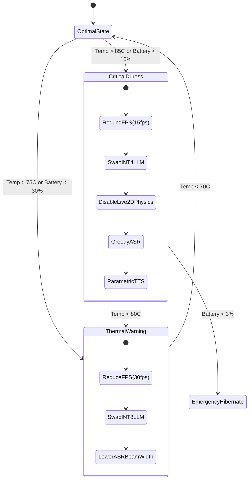

# Document 34: Ember Battery and Thermal Management

## 1. The Thermodynamics of Digital Presence
The Open-LLM-VTuber architecture, especially when deployed in Project Ember, demands significant computational resources. Running Large Language Models (LLMs), Automatic Speech Recognition (ASR), Text-to-Speech (TTS), and Live2D rendering simultaneously creates a massive thermal footprint. On mobile devices or untethered autonomous hardware, this translates to rapid battery depletion and thermal throttling, which degrades the very performance alchemy we strive to achieve. 

This document outlines the theoretical frameworks and practical implementations for extreme Battery and Thermal Management, ensuring the VTuber can maintain a persistent, high-fidelity presence without melting its host hardware.

## 2. Advanced Power States and C-State Manipulation
Modern CPUs and GPUs have various power states (P-states for performance, C-states for idle power). The standard operating system scheduler is too generalized to optimally manage these states for a highly specialized application like Open-LLM-VTuber.

### 2.1 Micro-Idle C-State Injection
During a conversation, there are micro-pauses—moments when the user is listening and the VTuber is merely breathing or blinking, waiting for input. The OS often keeps the CPU in a high P-state because the rendering loop is active.
**Strategy:** We must implement a custom scheduler that forces the CPU into deep C-states (C6/C7) during these micro-pauses. The Live2D rendering engine must be decoupled from the main application thread. When the VTuber is idle, we drop the render framerate from 60 FPS to 15 FPS and offload the breathing animation to a low-power hardware video decoder or a dedicated, ultra-low-power co-processor if available. 

### 2.2 Thermal Envelope Prediction
Instead of reacting to thermal throttling (which causes sudden lag spikes), the system must predict it. 
**Strategy:** We employ a lightweight, quantized LSTM model running on the CPU to predict the device's thermal trajectory based on current workload, ambient temperature sensors, and historical data. If the model predicts we will hit the thermal ceiling within 60 seconds, the system preemptively begins shedding load.

## 3. Dynamic Load Shedding and Graceful Degradation
When the thermal or battery budget becomes constrained, the system must degrade gracefully, maintaining the illusion of presence while slashing power consumption.

### 3.1 LLM Quantization Shifting
If the thermal envelope is approaching its limit, running a large model at FP16 is untenable.
**Strategy:** The system must dynamically hotswap the LLM weights in memory. We transition from an FP16 model to an INT8, and finally to an aggressive INT4 quantized model. This reduces memory bandwidth (a primary source of heat) and ALU power consumption by up to 70%. The transition must be seamless, utilizing a shared KV cache to prevent context loss during the swap.

### 3.2 Live2D Complexity Scaling
The Live2D avatar consists of hundreds of physics parameters (hair physics, clothing sway).
**Strategy:** Implement a dynamic Level of Detail (LOD) system for Live2D physics. Under thermal duress, the system smoothly interpolates the physics damping coefficients to zero, essentially freezing secondary animations (hair, clothing) while maintaining primary animations (eyes, mouth). This drastically reduces the CPU/GPU matrix multiplication workload required for physics solving.

### 3.3 ASR and TTS Parameter Throttling
ASR models like Whisper or Sherpa-ONNX can operate at varying beam search widths. 
**Strategy:** Reduce the beam size in the ASR decoding algorithm. A beam size of 1 (greedy decoding) requires exponentially less compute than a beam size of 5, at a slight cost to accuracy. Similarly, transition the TTS engine from a high-fidelity neural vocoder to a more traditional, computationally cheap parametric vocoder when battery drops below 15%.

## 4. The Heat Dissipation Matrix

## 5. Attention-Gated Compute Resource Allocation
Not all moments in a conversation require full visual fidelity. If the user is not looking at the screen, rendering at 60 FPS is wasted energy.

### 5.1 Gaze Tracking Integration
If the host device has a front-facing camera (e.g., a smartphone or laptop), we utilize an ultra-low-power facial tracking algorithm (running on a DSP or Neural Engine) to determine if the user is looking at the screen.

### 5.2 The "Off-Screen" Mode
When the user looks away, the Open-LLM-VTuber immediately enters "Off-Screen" mode:
1. Live2D rendering is paused completely (0 FPS).
2. The GPU is put to sleep.
3. The system transitions into an "audio-only" conversational agent.
4. When the user looks back, the system uses the microphone input and context to instantly generate a "startle" or "welcome back" animation, masking the 100ms it takes to wake the GPU and resume rendering.

## 6. Asymmetric Multi-Processing (AMP) Optimization
Modern ARM architectures (like Apple Silicon or Snapdragon) use big.LITTLE configurations (Performance cores and Efficiency cores).

### 6.1 Strict Core Affinity
The OS scheduler often bounces threads between P-cores and E-cores, causing cache misses and waking up sleeping cores unnecessarily.
**Strategy:** We must enforce strict CPU affinity mapping.
*   **ASR Thread:** Pinned to 1 E-core. ASR is continuous but requires low burst compute.
*   **LLM Inference:** Pinned to all available P-cores for maximum throughput, but *only* woken up when a complete prompt is ready.
*   **Live2D Render Loop:** Pinned to 1 E-core, utilizing the GPU for heavy lifting.
*   **WebSockets/Networking:** Pinned to 1 E-core.

By keeping continuous, low-intensity tasks strictly on E-cores, we allow the P-cores to power down completely, saving massive amounts of battery and reducing the overall thermal floor of the device.

## 7. Memory Bandwidth as a Thermal Vector
Moving data between RAM and the processor generates significant heat. The Open-LLM-VTuber loads large audio arrays and texture maps constantly.

### 7.1 Texture Compression and Audio Formats
All Live2D textures must be aggressively compressed using ASTC or ETC2 formats, which can be sampled directly by the GPU without decompression in memory. Audio chunks passed from the backend to the frontend must be compressed using Opus (at very low bitrates) rather than raw PCM WAV data. The energy required to decompress Opus on the CPU is significantly less than the energy required to move uncompressed PCM data across the memory bus.

## 8. Conclusion of Document 34
Battery and Thermal Management is not merely about extending runtime; it is about preserving the cognitive capabilities of the VTuber under varying physical constraints. By treating the physical hardware's state as an input variable to the system's behavior, Open-LLM-VTuber becomes a truly adaptive entity, capable of surviving and conversing even as its environment becomes hostile.

This mastery of thermodynamics paves the way for the ultimate optimization strategy: extreme model quantization, which will be explored in Document 35.
