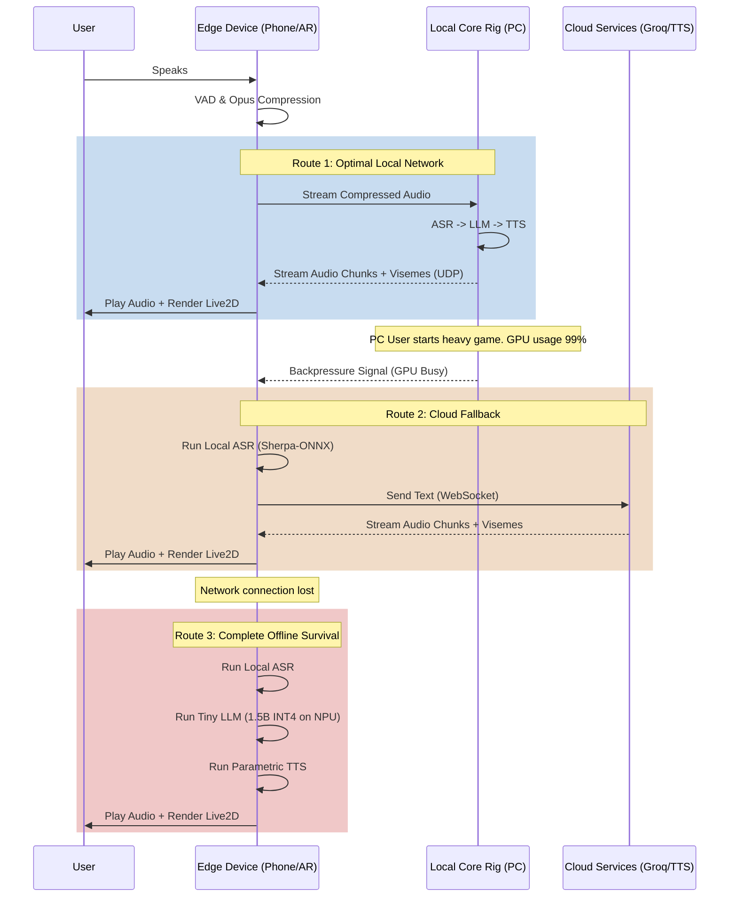

# Document 36: Ember Dynamic Compute Distribution

## 1. The Necessity of Distributed Presence
The ultimate vision for Project Ember's Open-LLM-VTuber is ubiquity. The VTuber should be present on a mobile phone, a smart display, a high-end gaming PC, or an AR headset. However, the compute requirements of a high-fidelity LLM, real-time TTS, ASR, and Live2D rendering exceed the capabilities of most edge devices. 

To resolve this, we must implement Dynamic Compute Distribution: a fluid, latency-aware network architecture that shatters the monolithic pipeline and distributes the workload across multiple heterogeneous devices simultaneously. The VTuber's consciousness is no longer localized; it becomes a distributed swarm.

## 2. Asymmetric Pipeline Splitting
The Open-LLM-VTuber pipeline (Audio In -> ASR -> LLM -> TTS -> Audio/Video Out) can be bisected at any point. 

### 2.1 The "Thin Client" Edge Architecture
In this configuration, the mobile device (e.g., a smartphone) acts purely as an I/O and rendering node.
*   **Edge Device:** Captures microphone audio, compresses it (Opus), sends it over Wi-Fi/5G, and receives audio and Live2D viseme parameters to render the visual avatar.
*   **Core Rig (Local Network PC):** Receives audio, runs ASR, runs the heavy LLM, runs the TTS engine, and streams the synthesized audio and lip-sync data back to the edge device.

### 2.2 The "Thick Client" Hybrid Architecture
If network latency spikes, the "Thin Client" model fails, introducing conversational lag. The system must dynamically adapt.
*   **Edge Device:** Runs lightweight ASR (e.g., highly quantized Sherpa-ONNX) and local Live2D rendering. It sends *text* to the Core Rig instead of audio, saving massive network bandwidth.
*   **Core Rig:** Receives text, runs the LLM, and runs TTS.

## 3. Dynamic Latency Probing and Route Shifting
The distribution of compute must not be static. It must be governed by a real-time Latency Probing Algorithm.

### 3.1 Micro-Ping Telemetry
Every 500ms, the Edge Device sends a micro-ping to the Core Rig and the Cloud (if external API services like OpenAI or ElevenLabs are configured). The ping measures network latency, packet loss, and remote GPU queue depth.

### 3.2 Instantaneous Workload Migration
If the local Core Rig's GPU becomes occupied (e.g., the user starts playing a heavy PC game), the Core Rig signals backpressure. The orchestration layer immediately shifts the pipeline:
1.  **Phase 1 (Optimal):** LLM runs on local PC GPU.
2.  **Phase 2 (PC Loaded):** LLM shifts to external Cloud API (e.g., Groq for ultra-low latency).
3.  **Phase 3 (Network Dropped):** The Edge Device falls back to an ultra-tiny local LLM (e.g., 1.5B parameter quantized model) running on the mobile NPU. The conversation quality degrades slightly, but presence is maintained without interruption.

## 4. Pipeline Parallelism and Pipelining Tokens
When utilizing a local Core Rig over Wi-Fi, we cannot wait for the entire LLM response to generate before sending it to the TTS engine, and we cannot wait for the TTS audio to complete before sending it to the Edge Device.

### 4.1 Token-Level Network Streaming
As the LLM on the Core Rig generates tokens, they are immediately streamed to the local TTS engine. The TTS engine synthesizes audio in 20ms chunks. These chunks are packed with their corresponding Live2D visemes into a custom UDP packet and blasted to the Edge Device.

### 4.2 Jitter Buffering and Time-Warping
UDP networking introduces packet jitter. The Edge Device maintains a small, dynamic jitter buffer (30-50ms). If a packet is delayed, the local audio playback engine utilizes time-stretching (phase vocoding) to imperceptibly slow down the current audio chunk, buying time for the next packet to arrive without causing audio dropouts or desynchronizing the Live2D lip-sync.

## 5. Visualizing the Distributed Matrix

## 6. Distributed KV Cache Synchronization
A critical challenge in dynamic route shifting is maintaining conversational context. If the LLM shifts from the Local PC to the Cloud or to the Edge Device, the KV cache (the memory of the current conversation) must move with it.

### 6.1 State-Vector Broadcasting
Moving a massive KV cache tensor over a network is impossible due to bandwidth limits. Instead, we use State-Vector Broadcasting. The active LLM node periodically broadcasts a highly compressed summary vector of the conversation (or just the raw text context window) to all potential backup nodes. If a failover occurs, the backup node quickly pre-fills its own KV cache using this context window while the user is still speaking or pausing, ensuring seamless context continuity.

## 7. Multi-Device Spatial Presence
Dynamic compute distribution allows for multi-device presence. 
*   The VTuber can exist on the user's desktop monitor.
*   When the user stands up and walks away with their phone, the desktop PC detects the absence of attention (via webcam) and the phone's proximity sensors detect movement.
*   The orchestration layer seamlessly transfers the rendering and audio output from the desktop to the phone mid-sentence. The compute may remain on the desktop PC, but the I/O interface teleports to the mobile device.

## 8. Conclusion of Document 36
Dynamic Compute Distribution destroys the boundary between the hardware and the VTuber entity. By creating a fluid, latency-aware network mesh that can instantly shift workloads across edge NPUs, local GPUs, and cloud APIs, we guarantee an unbroken, immortal conversational presence regardless of localized hardware constraints or network volatility. The system becomes anti-fragile.
