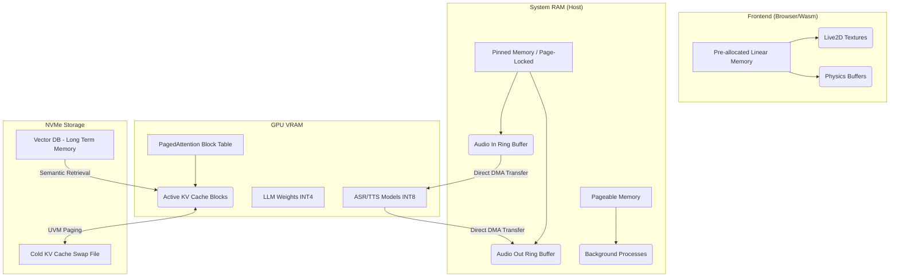

# Document 38: Ember Advanced Memory Management

## 1. The Spatial Dimension of Compute
If compute cycles are the engine of the Open-LLM-VTuber, memory is the highway. Bottlenecks on this highway result in catastrophic latency, irrespective of how fast the GPU is. Project Ember requires a fundamental redesign of how memory is allocated, pinned, and paged across the entire hardware stack. This document details the absolute bleeding edge of Memory Management, focusing on PCIe transit optimization, KV cache summarization, and VRAM defragmentation.

## 2. PCIe Transit and Pinned Memory
In a standard Python architecture, sending audio data to an ASR model or retrieving generated audio from a TTS model involves copying data from standard system RAM into GPU VRAM. Standard system RAM is "pageable," meaning the OS can swap it to disk at any time. The GPU cannot read pageable memory directly via DMA (Direct Memory Access); the CPU must first copy it to a temporary "pinned" buffer, then send it across the PCIe bus. This double-copy destroys latency.

### 2.1 The Pinned Memory Pipeline
**Strategy:** We must implement a strict Pinned Memory (Page-Locked Memory) architecture.
All input buffers holding microphone audio and all output buffers holding synthesized TTS audio must be allocated using `cudaHostAlloc` (or its equivalent in Metal/ROCm). This locks the memory pages in RAM.
The GPU can then use its DMA controllers to pull the audio data directly from system RAM across the PCIe bus with zero CPU involvement. This bypassing of the CPU reduces transfer latency by up to 60%.

## 3. VRAM Defragmentation and Memory Paging
Running a continuous LLM session causes VRAM fragmentation. The KV cache allocates memory for new tokens dynamically. Over a long conversation, memory becomes heavily fragmented, leading to failed allocations even when total free memory appears sufficient.

### 3.1 PagedAttention and Block-Level Allocation
We must abandon contiguous memory allocation for the KV cache.
**Strategy:** Implement a PagedAttention architecture (similar to vLLM). The KV cache is divided into fixed-size blocks (e.g., 16 or 32 tokens per block). These blocks are allocated non-contiguously in VRAM. A block table maintains the mapping between logical token sequences and physical VRAM blocks.
This virtually eliminates VRAM fragmentation (external fragmentation becomes 0%), allowing the VTuber to utilize 99% of available VRAM without encountering OOM crashes.

### 3.2 NVMe Offloading (Unified Virtual Memory)
When the conversation exceeds the physical limits of VRAM, the system must not crash.
**Strategy:** We utilize Unified Virtual Memory (UVM) to seamlessly page cold KV cache blocks (older parts of the conversation that haven't been referenced recently) out to system RAM, and eventually to an ultra-fast PCIe Gen 4/5 NVMe SSD. When the user references an old topic, the specific blocks are paged back into VRAM on demand. By leveraging the immense speeds of modern SSDs (7000+ MB/s), the VTuber can effectively have a 100-million token context window.

## 4. Context Window Sliding and Deep Summarization
Even with UVM, processing a massive context window requires significant compute (Attention mechanism scales quadratically: $O(N^2)$). We must prevent the active context from growing infinitely.

### 4.1 Hierarchical Memory Consolidation
Instead of a simple sliding window that forgets the past, we implement a multi-tiered memory architecture modeled on human cognition:
1.  **Working Memory (Raw Context):** The most recent 2000 tokens are kept raw in the KV cache for perfect recall and conversational flow.
2.  **Short-Term Memory (Summarized):** As tokens fall out of the Working Memory, an asynchronous, highly quantized background LLM (e.g., a 1.5B model) summarizes the conversation chunks into dense semantic bullet points. These bullet points are injected back into the system prompt.
3.  **Long-Term Memory (Vector Database):** The summaries are also embedded and stored in a lightweight local vector database (e.g., Faiss or ChromaDB). If the user brings up a topic from days ago, the system performs a semantic search, retrieves the relevant summaries, and injects them into the Working Memory.

This guarantees infinite conversational persistence with a strictly bounded computational and memory footprint.

## 5. WebAssembly Frontend Memory Optimization
The Live2D rendering engine runs in the browser via WebAssembly (Wasm). Wasm operates within a strict, linear memory model.

### 5.1 Wasm Memory Pre-allocation
Dynamically growing Wasm memory is an expensive operation that pauses the browser thread, causing visual stuttering in the VTuber avatar.
**Strategy:** The frontend must be compiled with a strictly defined, large initial memory block (`-s INITIAL_MEMORY=512MB`), and dynamic growth must be disabled (`-s ALLOW_MEMORY_GROWTH=0`). All Live2D models, textures, and physics buffers must fit within this pre-allocated sandbox. We implement a custom memory allocator (like `dlmalloc` or `wee_alloc`) inside Wasm to manage this space with extreme precision, preventing fragmentation on the frontend.

## 6. Visualizing the Memory Hierarchy

## 7. Zero-Copy WebSocket Payloads
When the backend sends Live2D viseme data to the frontend, standard WebSockets force a copy from the Python string/bytes object into the OS network buffer, and then into the browser's memory, and finally into the Wasm memory space.
**Strategy:** By utilizing SharedArrayBuffer (if running on a local loopback environment) or flat binary protocols (like FlatBuffers), we can deserialize the network payload directly *into* the Wasm memory space without intermediate JavaScript garbage-collected arrays. This zero-copy path is essential for maintaining 60 FPS lip-sync synchronization.

## 8. Conclusion of Document 38
Advanced Memory Management is the invisible scaffolding that supports the illusion of a living digital entity. By mastering PCIe DMA transfers, implementing PagedAttention, orchestrating a hierarchical memory consolidation system, and locking down the WebAssembly linear memory, we ensure that the Open-LLM-VTuber never hesitates, never crashes, and never forgets. This robust memory foundation enables the highly complex, asynchronous architectures that will be explored in Document 39.
