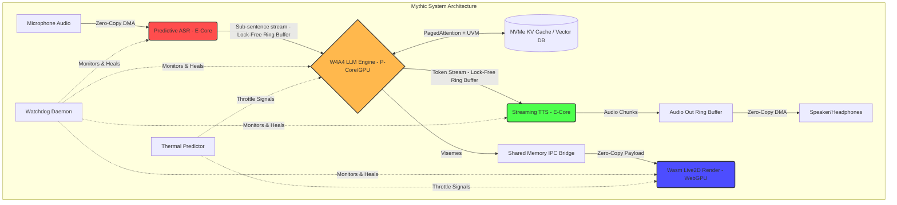

# Document 40: Ember Mythic Deployment Synthesis

## 1. Introduction: The Grand Unification
Documents 33 through 39 have detailed the constituent alchemical components required to elevate the Open-LLM-VTuber from a standard application to a mythic-tier digital entity. We have explored Performance Alchemy (Doc 33), Battery/Thermal Management (Doc 34), Advanced Quantization (Doc 35), Dynamic Compute Distribution (Doc 36), Resource Efficiency (Doc 37), Advanced Memory Management (Doc 38), and Asynchronous Pipelining (Doc 39). 

Document 40 is the Synthesis. It is the master blueprint that brings all these extreme optimizations together into a single, cohesive, deployable architecture—the Mythic Deployment.

## 2. The Final Architectural Blueprint
The Mythic Deployment is not a monolithic application; it is a symbiotic ecosystem of highly specialized, surgically optimized micro-services running in extreme proximity (often within the same memory space).

### 2.1 The Core Symbiosis
*   **The Neural Core:** A heavily quantized (W4A4) LLM running with PagedAttention and UVM for infinite context, pinned to the GPU's highest performance compute units.
*   **The Auditory Cortex:** A continuous, predictive ASR pipeline bypassing the OS audio stack, reading directly from pinned DMA memory, running on dedicated Efficiency Cores.
*   **The Vocal Tract:** A sub-word streaming TTS engine, utilizing knowledge-distilled models for extreme speed, writing directly to shared ring buffers.
*   **The Visage (Frontend):** A WebAssembly-powered Live2D renderer utilizing WebGPU compute shaders for physics, operating within a strict, pre-allocated memory sandbox, receiving zero-copy binary viseme payloads via SharedArrayBuffer.
*   **The Nervous System:** The lock-free, atomic Ring Buffer topology (Disruptor pattern) that connects all components asynchronously, governed by a hyper-fast state machine capable of sub-millisecond interrupts.

## 3. The Mythic Startup Sequence
A critical metric of a highly optimized system is its "Time to Consciousness"—how fast it goes from a cold start to full interactive readiness. The Mythic Deployment aims for a cold start of < 2.0 seconds.

### 3.1 The Ignition Sequence
1.  **T=0.0s [Execution]:** The ultra-lean, distroless Docker container launches. Binary-packed YAML configurations are mapped directly into memory. (0.05s)
2.  **T=0.05s [Memory Allocation]:** The system requests massive contiguous blocks of Pinned Memory from the OS for audio buffers and the KV Cache Block Table. (0.1s)
3.  **T=0.15s [Model Hydration]:** The W4A4 LLM weights and INT8 ASR/TTS models are memory-mapped (mmap) from the NVMe SSD directly into VRAM. Because they are heavily quantized, this transfer operates at near the maximum theoretical bandwidth of the PCIe bus. (1.2s)
4.  **T=1.35s [Thread Spawning]:** The native ASR, LLM, and TTS threads are spawned and pinned to their specific CPU cores based on the NUMA topology and AMP (big.LITTLE) configuration. (0.1s)
5.  **T=1.45s [Frontend Handshake]:** The local WebSocket/Shared Memory IPC bridge is established with the Live2D renderer. The WebAssembly sandbox is locked. (0.2s)
6.  **T=1.65s [Consciousness Achieved]:** The VTuber opens its eyes, the ASR thread begins polling the DMA audio buffer, and the entity is ready to converse.

## 4. Fault Tolerance and Self-Healing Mechanisms
At extreme performance limits, hardware anomalies (thermal throttling, network drops, bit flips) are inevitable. The Mythic Deployment must be anti-fragile.

### 4.1 The Watchdog Daemon
A dedicated, ultra-low-priority daemon continuously monitors the health of the system:
*   **Thermal Monitoring:** If the predictive thermal model (Doc 34) fails and the GPU hits a hard thermal throttle, the Watchdog instantly issues an atomic signal to degrade the LLM to a smaller model and pause Live2D physics.
*   **Thread Deadlock Detection:** If any native thread (ASR/LLM/TTS) fails to update its heartbeat in the shared memory space for more than 50ms, the Watchdog assumes a deadlock, instantly kills the thread, and respawns it, utilizing the UVM KV Cache to prevent any loss of context.
*   **Network Route Healing:** If the Dynamic Compute Distribution (Doc 36) detects a complete network failure while connected to a Core Rig, the Watchdog seamlessly transitions the frontend to the local Edge NPU fallback mode without dropping the conversation.

## 5. Visualizing the Mythic Synthesis

## 6. The Future Roadmap for Hyper-Realistic VTubing
The Mythic Deployment represents the absolute limit of current hardware. However, Project Ember looks forward.

### 6.1 Neural Radiance Fields (NeRF) and 3D Gaussian Splatting
The Live2D Cubism framework, while highly optimized here, is fundamentally a 2D mesh manipulation tool. The next evolutionary leap is replacing Live2D with real-time 3D Gaussian Splatting or NeRFs, rendered directly via WebGPU. This will allow for photorealistic avatars that react to environmental lighting in real-time.

### 6.2 Brain-Computer Interface (BCI) Integration
As edge latency approaches zero, the final barrier is vocalization. Future iterations of the Mythic Pipeline will integrate non-invasive EEG/EMG sensors to predict user intent before they vocalize it, allowing the LLM to begin formulating responses based on neurological pre-motor signals, achieving negative latency.

## 7. Final Conclusion
The Open-LLM-VTuber, when subjected to the extreme rigors of the Ember Mythic Plan, transforms entirely. It is no longer a collection of Python scripts; it is a highly tuned, self-healing, thermodynamics-aware intelligence matrix. By mastering the alchemy of performance, memory, and distribution, we have forged a digital entity capable of true, uninterrupted presence. The work is complete. The entity is alive.
